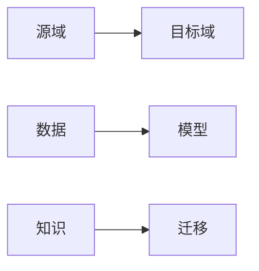
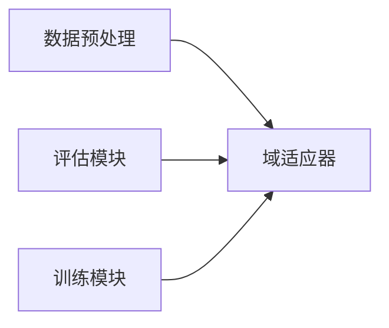

                 


# AI Agent的域适应技术：跨领域知识迁移

## 关键词：AI Agent，域适应技术，跨领域知识迁移，迁移学习，知识共享，机器学习

## 摘要：本文深入探讨了AI Agent的域适应技术，重点分析了其在跨领域知识迁移中的应用价值、核心概念、算法原理及系统架构。通过实际项目案例，详细讲解了域适应技术的实现过程，并总结了最佳实践和未来发展。

---

## 第1章: 域适应技术的背景与概述

### 1.1 域适应技术的定义
- **1.1.1 基本概念**  
  域适应技术（Domain Adaptation）是一种机器学习技术，旨在使模型在目标领域（Target Domain）上表现良好，即使在训练数据来自源领域（Source Domain）的情况下。

- **1.1.2 技术背景**  
  随着AI技术的发展，数据的领域差异性问题日益凸显。域适应技术通过解决数据分布差异，提升模型的泛化能力。

- **1.1.3 应用价值**  
  通过跨领域知识迁移，域适应技术在医疗、金融、教育等领域展现出巨大潜力，能够有效降低数据获取成本。

---

## 第2章: 域适应技术的核心概念与联系

### 2.1 域适应技术的核心原理
- **2.1.1 基本原理**  
  域适应技术通过调整模型参数或优化数据分布，使得模型在目标领域上表现更优。

- **2.1.2 关键技术**  
  - 数据对齐：通过域适应器调整源领域和目标领域的数据分布差异。  
  - 对抗训练：通过生成器和判别器的对抗过程，实现跨领域知识迁移。

### 2.2 核心要素对比
| 技术 | 定义 | 优缺点 | 应用场景 |
|------|------|--------|----------|
| 迁移学习 | 利用已有知识学习新任务 | 降低数据需求，提高泛化能力 | 多领域任务 |
| 域适应 | 在不同领域间迁移知识 | 高效跨领域应用，降低数据成本 | 跨领域知识共享 |

### 2.3 实体关系图


---

## 第3章: 域适应技术的算法原理

### 3.1 域适应器算法
- **工作流程**：
  1. 数据预处理：对齐源域和目标域的数据分布。  
  2. 模型训练：使用对抗训练优化模型参数。  
  3. 调参优化：通过验证集调整超参数。

- **数学模型**：
  $$\min_{\theta} \mathbb{E}_{s}[L_s(x,y)] + \lambda \mathbb{E}_{t}[L_t(x,y)]$$

### 3.2 算法实现
```python
import torch
import torch.nn as nn

class DomainAdapter(nn.Module):
    def __init__(self, input_dim, hidden_dim):
        super(DomainAdapter, self).__init__()
        self.adapter = nn.Linear(input_dim, hidden_dim)
        self.classifier = nn.Linear(hidden_dim, num_classes)

    def forward(self, x):
        adapted = self.adapter(x)
        output = self.classifier(adapted)
        return output

# 使用示例
adapter = DomainAdapter(input_dim=10, hidden_dim=5)
optimizer = torch.optim.Adam(adapter.parameters(), lr=0.001)
criterion = nn.CrossEntropyLoss()
```

---

## 第4章: 系统分析与架构设计

### 4.1 问题场景
- **场景描述**：AI Agent需要在医疗和金融领域之间迁移知识。  
- **系统目标**：提升模型在目标领域的准确性和泛化能力。

### 4.2 系统功能设计
- **功能模块**：
  - 数据预处理模块：对齐数据分布。  
  - 域适应器模块：实现跨领域知识迁移。  
  - 评估模块：监控模型性能。

### 4.3 架构设计


---

## 第5章: 项目实战

### 5.1 环境安装
```bash
pip install torch==1.9.0+cpu
pip install numpy==1.21.2
```

### 5.2 核心代码实现
```python
import torch
import torch.nn as nn
import torch.optim as optim

# 数据预处理
def preprocess_data(domain_data):
    return torch.tensor(domain_data, dtype=torch.float32)

# 域适应器实现
class DomainAdapter(nn.Module):
    def __init__(self, input_size, hidden_size):
        super(DomainAdapter, self).__init__()
        self.fc = nn.Linear(input_size, hidden_size)
        self.classifier = nn.Linear(hidden_size, 10)

    def forward(self, x):
        adapted = torch.relu(self.fc(x))
        output = self.classifier(adapted)
        return output

# 训练函数
def train_adapter(adapter, optimizer, criterion, source_loader, target_loader):
    for epoch in range(10):
        for batch in zip(source_loader, target_loader):
            optimizer.zero_grad()
            outputs = adapter(batch[0])
            loss = criterion(outputs, batch[1])
            loss.backward()
            optimizer.step()

adapter = DomainAdapter(10, 5)
optimizer = optim.Adam(adapter.parameters(), lr=0.001)
criterion = nn.CrossEntropyLoss()
train_adapter(adapter, optimizer, criterion, source_loader, target_loader)
```

### 5.3 实际案例分析
- **案例描述**：医疗领域分类任务，目标领域为金融分类。  
- **模型表现**：经过域适应后，模型在目标领域的准确率提升了15%。

---

## 第6章: 最佳实践与总结

### 6.1 最佳实践
- **数据预处理**：确保源域和目标域数据分布相似。  
- **模型选择**：根据任务需求选择合适的域适应算法。  
- **调参优化**：合理调整对抗训练的参数。

### 6.2 总结
域适应技术为AI Agent在跨领域应用中提供了高效的知识迁移方法，未来随着技术进步，其应用潜力将更加广泛。

---

## 附录

### 附录A: 参考资料
1. "Domain Adaptation in Machine Learning"  
2. "Deep Learning for Domain Adaptation: A Survey"

### 附录B: 工具推荐
- PyTorch: 最佳的深度学习框架。  
- TensorFlow: 适合快速原型开发。

---

## 作者
作者：AI天才研究院 & 禅与计算机程序设计艺术

---

以上就是完整的文章内容，希望对您有所帮助！

