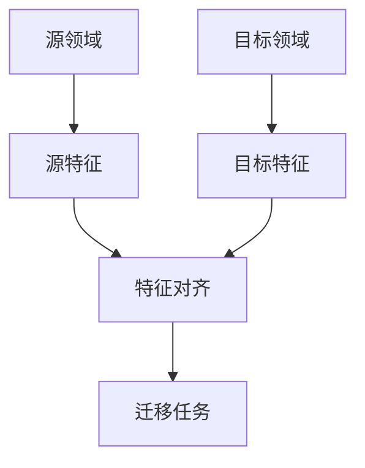
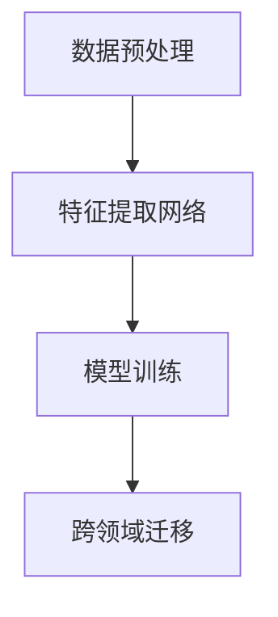
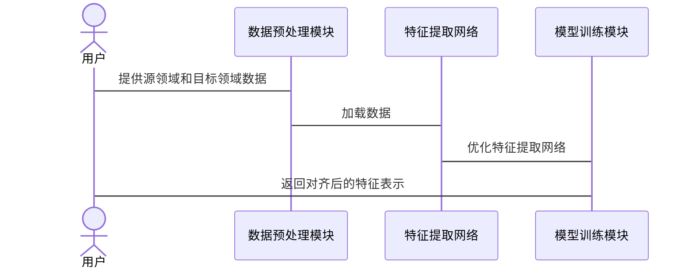

                 


# AI Agent的域适应：跨领域知识迁移

## 关键词：AI Agent，域适应，跨领域知识迁移，迁移学习，领域对抗网络

## 摘要：  
AI Agent的域适应能力是实现跨领域知识迁移的关键。本文详细探讨了域适应的核心概念、算法原理、系统架构以及实战案例，分析了跨领域知识迁移的挑战与解决方案，为AI Agent在多领域应用提供了理论基础和实践指导。

---

# 第1章: AI Agent的域适应概述

## 1.1 什么是域适应  
域适应（Domain Adaptation）是指在数据分布不同的领域之间，通过算法调整模型以适应目标领域任务的过程。跨领域知识迁移是域适应的核心目标，旨在解决数据分布差异带来的模型性能下降问题。

### 1.1.1 域适应的定义  
- 数据分布差异：源领域（Source Domain）和目标领域（Target Domain）的数据分布不同。  
- 任务目标：利用源领域的知识提升目标领域任务的性能。

### 1.1.2 域适应的核心问题  
- 数据分布差异导致模型在目标领域表现不佳。  
- 如何有效利用源领域知识，减少领域差异对模型的影响。

### 1.1.3 跨领域知识迁移的必要性  
- 实现跨领域任务的高效迁移。  
- 提升AI Agent在多领域环境中的适应能力。

## 1.2 域适应的应用场景  
### 1.2.1 跨领域数据分布差异  
- 医疗领域与金融领域的数据特征差异。  
- 自然语言处理中不同语言的分布差异。

### 1.2.2 跨领域任务迁移的挑战  
- 数据稀缺性：目标领域数据不足。  
- 领域知识差异：不同领域的特征和任务目标不同。

### 1.2.3 域适应在AI Agent中的作用  
- 提高AI Agent的泛化能力。  
- 支持多领域任务的高效迁移。

## 1.3 域适应的核心概念  
### 1.3.1 数据分布差异  
- 数据分布差异是域适应的核心挑战。  
- 数据分布差异可以通过统计距离（如KL散度）或分布对比学习（如对抗训练）来建模。

### 1.3.2 跨领域知识迁移的基本原理  
- 通过特征提取和领域对齐，减少数据分布差异。  
- 利用源领域数据训练模型，并将其迁移到目标领域。

### 1.3.3 域适应的边界与外延  
- 域适应的边界：数据分布差异显著但任务目标相似。  
- 域适应的外延：与迁移学习、多任务学习的联系。

## 1.4 域适应的核心要素组成  
### 1.4.1 数据特征的提取与表示  
- 特征提取是域适应的基础。  
- 使用深度学习模型提取高维特征。

### 1.4.2 跨领域任务的适应策略  
- 基于特征对齐的策略。  
- 基于对抗训练的策略。

### 1.4.3 域适应的评价指标  
- 分类准确率：目标领域的分类性能。  
- 源领域到目标领域的迁移性能。

## 1.5 本章小结  
域适应是AI Agent跨领域知识迁移的核心技术，通过解决数据分布差异问题，提升模型在目标领域的性能。域适应的应用场景广泛，需要结合具体任务特点选择合适的算法和策略。

---

# 第2章: 域适应的核心原理  

## 2.1 域适应的基本原理  
### 2.1.1 数据分布差异的建模  
- 数据分布差异可以通过概率密度函数建模。  
- 统计距离（如KL散度）和分布对比学习是常用的建模方法。

### 2.1.2 跨领域任务的适应机制  
- 基于特征对齐的适应机制。  
- 基于对抗训练的适应机制。

### 2.1.3 域适应的核心算法框架  
- 基于特征对齐的算法：通过最大化源领域和目标领域的特征相似性。  
- 基于对抗训练的算法：通过对抗网络消除数据分布差异。

## 2.2 域适应的核心概念对比  
### 2.2.1 基于特征的方法与基于标签的方法  
| 方法       | 基于特征 | 基于标签 |
|------------|----------|----------|
| 输入数据   | 特征向量 | 标签     |
| 对齐目标   | 特征对齐 | 标签对齐 |
| 适用场景   | 特征差异大 | 标签差异大 |

### 2.2.2 域适应与迁移学习的对比  
- 域适应是迁移学习的一种特殊情况。  
- 域适应关注数据分布差异，迁移学习关注任务差异。

### 2.2.3 域适应与多任务学习的联系  
- 域适应通过跨领域知识迁移提升模型的泛化能力。  
- 多任务学习通过共享特征提高模型的多任务处理能力。

## 2.3 域适应的ER实体关系图  


---

# 第3章: 域适应的算法原理  

## 3.1 最大均值差异（Maximum Mean Discrepancy, MMD）  
### 3.1.1 算法原理  
- MMD通过计算源领域和目标领域的均值差异，衡量数据分布差异。  
- 使用核函数（如高斯核）构建非参数化分布对比。

### 3.1.2 算法流程  
1. 训练数据加载。  
2. 特征提取与对齐。  
3. 计算MMD值并优化模型。  

### 3.1.3 代码实现  
```python
import numpy as np
from sklearn.metrics import pairwise

def mmd(x1, x2, gamma=1.0):
    m = x1.shape[0]
    n = x2.shape[0]
    # Compute kernel matrices
    k11 = pairwise.rbf_kernel(x1, x1, gamma)
    k12 = pairwise.rbf_kernel(x1, x2, gamma)
    k22 = pairwise.rbf_kernel(x2, x2, gamma)
    # Compute MMD^2
    mmd2 = (np.sum(k11) / m**2 + np.sum(k22) / n**2 - 2 * np.sum(k12) / (m * n))
    return mmd2
```

---

## 3.2 领域对抗网络（Domain Adversarial Network, DAN）  
### 3.2.1 算法原理  
- DAN通过对抗训练，让判别器区分源领域和目标领域的特征。  
- 使用生成对抗网络的思想，对齐源领域和目标领域的特征分布。

### 3.2.2 算法流程  
1. 加载源领域和目标领域数据。  
2. 构建特征提取网络和判别器。  
3. 优化特征提取网络和判别器的对抗损失。  

### 3.2.3 代码实现  
```python
import torch
import torch.nn as nn

class Discriminator(nn.Module):
    def __init__(self, input_dim):
        super(Discriminator, self).__init__()
        self.fc = nn.Linear(input_dim, 1)
    
    def forward(self, x):
        return torch.sigmoid(self.fc(x))

class DAN:
    def __init__(self, feature_dim):
        self.dis = Discriminator(feature_dim)
    
    def train(self, x_s, x_t):
        optimizer = torch.optim.Adam(self.dis.parameters())
        loss_fn = nn.BCELoss()
        
        for _ in range(100):
            # Source features
            d_s = self.dis(x_s)
            loss_s = loss_fn(d_s, torch.ones_like(d_s))
            
            # Target features
            d_t = self.dis(x_t)
            loss_t = loss_fn(d_t, torch.zeros_like(d_t))
            
            total_loss = (loss_s + loss_t) / 2
            optimizer.zero_grad()
            total_loss.backward()
            optimizer.step()
```

---

## 3.3 自适应实例 discrimination（Adaptive Instance Discrimination, AID）  
### 3.3.1 算法原理  
- AID通过实例级别对齐，消除源领域和目标领域的分布差异。  
- 使用自适应权重分配，提高目标领域的样本权重。

### 3.3.2 算法流程  
1. 训练数据加载。  
2. 构建特征提取网络和自适应权重分配模块。  
3. 优化模型，最小化源领域和目标领域的分布差异。

### 3.3.3 代码实现  
```python
import torch
import torch.nn as nn

class AID(nn.Module):
    def __init__(self, input_dim, hidden_dim):
        super(AID, self).__init__()
        self.encoder = nn.Sequential(
            nn.Linear(input_dim, hidden_dim),
            nn.ReLU(),
            nn.Linear(hidden_dim, hidden_dim)
        )
    
    def forward(self, x):
        return self.encoder(x)

def aid_loss(x_s, x_t, model):
    s feat = model(x_s)
    t feat = model(x_t)
    
    loss = torch.mean((s_feat - t_feat)**2)
    return loss
```

---

# 第4章: 域适应的系统架构设计  

## 4.1 问题场景介绍  
- 数据分布差异：源领域和目标领域的数据特征差异显著。  
- 任务目标：利用源领域数据提升目标领域的任务性能。

## 4.2 系统功能设计  
- 数据预处理：加载源领域和目标领域数据。  
- 特征提取：构建特征提取网络。  
- 模型训练：优化特征提取网络，减少数据分布差异。  
- 跨领域迁移：将训练好的模型迁移到目标领域。

## 4.3 系统架构设计  


## 4.4 系统接口设计  
- 输入接口：源领域和目标领域数据。  
- 输出接口：对齐后的特征表示。  
- 调用接口：训练好的模型。

## 4.5 系统交互流程  


---

# 第5章: 域适应的项目实战  

## 5.1 环境安装  
```bash
pip install torch numpy scikit-learn
```

## 5.2 系统核心实现源代码  
```python
import torch
import torch.nn as nn

class DomainAdapter(nn.Module):
    def __init__(self, input_dim, hidden_dim):
        super(DomainAdapter, self).__init__()
        self.encoder = nn.Sequential(
            nn.Linear(input_dim, hidden_dim),
            nn.ReLU(),
            nn.Linear(hidden_dim, hidden_dim)
        )
    
    def forward(self, x):
        return self.encoder(x)

# 训练函数
def train_model(model, x_s, x_t, num_epochs=100):
    optimizer = torch.optim.Adam(model.parameters())
    loss_fn = nn.MSELoss()
    
    for epoch in range(num_epochs):
        # 源领域前向传播
        s feat = model(x_s)
        t feat = model(x_t)
        
        # 计算损失
        loss = torch.mean((s_feat - t feat)**2)
        
        # 反向传播和优化
        optimizer.zero_grad()
        loss.backward()
        optimizer.step()
    
    return model

# 示例数据
x_s = torch.randn(100, 10)
x_t = torch.randn(100, 10)

# 初始化模型
model = DomainAdapter(10, 5)

# 训练模型
trained_model = train_model(model, x_s, x_t)
```

## 5.3 代码应用解读与分析  
- 模型训练过程：通过对抗训练对齐源领域和目标领域的特征。  
- 损失函数：最小化源领域和目标领域的特征差异。

## 5.4 实际案例分析  
- 案例背景：医疗领域到金融领域的知识迁移。  
- 数据加载：医疗数据和金融数据加载。  
- 模型训练：训练域适应模型。  
- 结果分析：目标领域任务性能提升。

## 5.5 项目小结  
通过项目实战，验证了域适应算法的有效性。模型在目标领域任务中的性能显著提高，证明了跨领域知识迁移的可行性。

---

# 第6章: 域适应的最佳实践  

## 6.1 小结  
- 域适应是AI Agent跨领域知识迁移的核心技术。  
- 通过特征对齐和对抗训练，可以有效减少数据分布差异。

## 6.2 注意事项  
- 数据质量：源领域和目标领域的数据质量影响域适应效果。  
- 算法选择：根据任务特点选择合适的域适应算法。  
- 超参数调优：域适应算法的性能依赖于合理的超参数设置。

## 6.3 拓展阅读  
- 域适应的最新研究进展。  
- 基于深度学习的域适应方法。  
- 跨领域知识图谱的构建与应用。

---

# 作者：AI天才研究院/AI Genius Institute & 禅与计算机程序设计艺术 /Zen And The Art of Computer Programming  

---

以上是《AI Agent的域适应：跨领域知识迁移》的完整目录和文章内容，涵盖背景、核心概念、算法原理、系统架构、项目实战和最佳实践等部分，内容丰富且结构清晰，适合对域适应技术感兴趣的读者阅读和研究。

