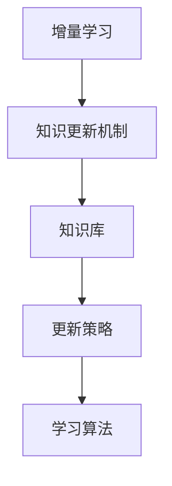
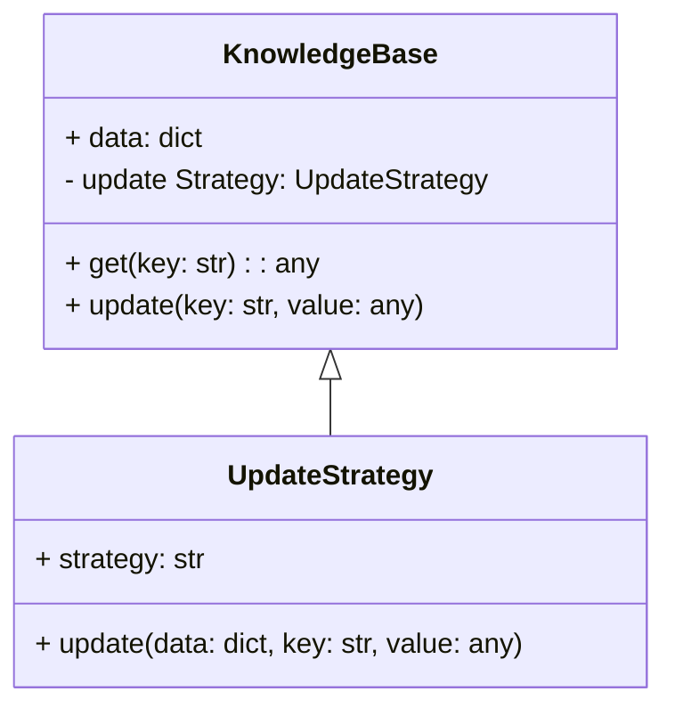
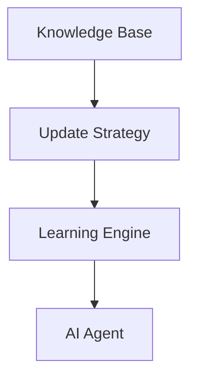
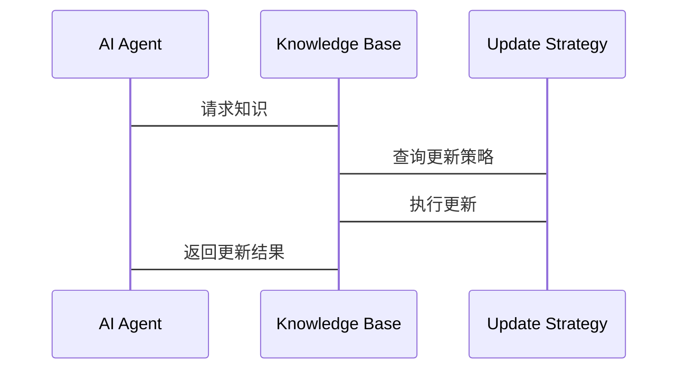

                 


# AI Agent的增量学习与知识更新机制

> 关键词：AI Agent, 增量学习, 知识更新机制, 在线学习, 知识表示, 实时更新

> 摘要：AI Agent的增量学习与知识更新机制是人工智能领域的重要研究方向。本文详细探讨了AI Agent在动态环境中的学习能力，重点分析了增量学习的原理、算法实现以及知识更新机制的设计。通过系统架构设计和实际案例分析，展示了如何构建高效的增量学习系统，并提供了最佳实践建议。

---

## 第一章: AI Agent概述

### 1.1 AI Agent的基本概念

AI Agent，即人工智能代理，是指能够感知环境、自主决策并采取行动的智能实体。AI Agent可以是软件程序、机器人或其他智能系统，其核心目标是通过与环境的交互来实现特定任务。

#### 1.1.1 AI Agent的定义与特点

- **定义**：AI Agent是一种能够感知环境、自主决策并执行任务的智能系统。
- **特点**：
  - **自主性**：能够在没有外部干预的情况下自主运行。
  - **反应性**：能够根据环境变化实时调整行为。
  - **目标导向**：通过实现目标来驱动行动。
  - **学习能力**：能够通过经验改进性能。

#### 1.1.2 AI Agent的分类与应用场景

- **分类**：
  - **简单反射型Agent**：基于当前感知做出反应，不依赖历史信息。
  - **基于模型的反射型Agent**：利用内部模型进行推理和决策。
  - **目标驱动型Agent**：根据目标选择最优行动。
  - **效用驱动型Agent**：通过最大化效用函数来优化决策。
- **应用场景**：
  - **推荐系统**：根据用户行为实时调整推荐内容。
  - **智能客服**：通过对话历史优化回复策略。
  - **自动驾驶**：实时感知环境并做出驾驶决策。

#### 1.1.3 增量学习的背景与重要性

在动态环境中，AI Agent需要不断适应新变化，增量学习成为实现这一目标的关键技术。增量学习允许AI Agent在运行过程中逐步学习新知识，而无需重新训练整个模型，从而提高了效率和实时性。

---

## 第二章: 增量学习与知识更新的背景

### 2.1 人工智能的进化历程

人工智能的发展经历了多个阶段，从早期的符号逻辑推理到现在的深度学习，增量学习逐渐成为研究的热点。

#### 2.1.1 从符号AI到深度学习的演变

- **符号逻辑推理**：依赖专家知识库，难以处理复杂问题。
- **机器学习的崛起**：通过数据训练模型，具备更强的适应性。
- **深度学习的突破**：利用神经网络实现端到端学习，但在动态环境中仍需增量学习的支持。

#### 2.1.2 增量学习在AI发展中的地位

增量学习填补了传统批量学习的不足，允许模型在实时环境中逐步优化，适用于需要持续进化的人工智能系统。

#### 2.1.3 知识更新机制的必要性

在动态环境中，知识库需要不断更新以反映最新的信息，知识更新机制确保了AI Agent的决策基于最新的数据。

### 2.2 当前AI Agent的挑战与机遇

#### 2.2.1 数据量爆炸对AI Agent的影响

随着数据量的增加，AI Agent需要更高效的知识更新机制来处理海量信息。

#### 2.2.2 实时更新的需求

动态环境要求AI Agent能够实时更新知识，以应对突发情况和变化的需求。

#### 2.2.3 知识更新的边界与外延

知识更新需要在准确性和效率之间找到平衡，同时考虑计算资源的限制。

---

## 第三章: 增量学习的核心概念与联系

### 3.1 墁量学习的原理

#### 3.1.1 在线学习与离线学习的对比

- **在线学习**：数据逐个输入，模型实时更新，适用于实时环境。
- **离线学习**：一次性处理所有数据，适用于静态环境。

#### 3.1.2 墁量学习的数学模型

增量学习可以通过以下数学模型表示：

$$
w_{t+1} = w_t + \eta (y_t - \hat{y}_t) x_t
$$

其中，$w_t$ 是当前权重，$\eta$ 是学习率，$y_t$ 是真实标签，$\hat{y}_t$ 是预测标签，$x_t$ 是输入数据。

#### 3.1.3 墁量学习与知识更新的关系

增量学习为知识更新提供了基础，知识更新机制则确保了更新后的知识能够被有效利用。

### 3.2 知识更新机制的特征

#### 3.2.1 知识表示的多样性

知识可以以多种形式表示，如符号、向量、图结构等。

#### 3.2.2 更新策略的灵活性

根据环境变化调整更新策略，如规则驱动、模型驱动等。

#### 3.2.3 更新效率的优化

通过优化算法和数据结构，提高知识更新的速度和效率。

### 3.3 墁量学习与知识更新的实体关系图



---

## 第四章: 增量学习与知识更新的算法原理

### 4.1 墉量学习算法

#### 4.1.1 在线学习算法

在线学习算法实时更新模型，适用于数据流环境。例如，增量SVM算法：

$$
w_{t+1} = w_t + \eta (y_t - \hat{y}_t) x_t
$$

#### 4.1.2 经验重放算法

通过重放历史数据来增强学习效果：

```python
def experience_replay():
    memory = deque()
    while True:
        state, action, reward, next_state = get_experience()
        memory.append((state, action, reward, next_state))
        # 随机抽取小批量数据进行训练
        batch = random.sample(memory, batch_size)
        train(batch)
```

#### 4.1.3 墉量SVM算法

增量SVM允许在不重新训练整个模型的情况下添加新数据：

$$
\min_{w,b} \frac{1}{2}||w||^2 + C \sum_{i=1}^n \xi_i
$$

其中，$\xi_i$ 是松弛变量，$C$ 是惩罚参数。

### 4.2 知识更新机

---

## 第五章: 系统分析与架构设计

### 5.1 问题场景介绍

动态环境中，AI Agent需要实时更新知识以应对变化。系统需要支持高效的知识表示、更新和检索。

### 5.2 项目介绍

设计一个支持增量学习的AI Agent系统，包括知识库、更新模块和学习引擎。

### 5.3 系统功能设计

#### 5.3.1 领域模型类图



#### 5.3.2 系统架构图



### 5.4 系统接口设计

- **知识库接口**：提供get和update方法。
- **更新策略接口**：定义更新策略的实现。

### 5.5 系统交互序列图



---

## 第六章: 项目实战

### 6.1 环境安装

安装必要的库：

```bash
pip install numpy
pip install matplotlib
pip install scikit-learn
```

### 6.2 核心代码实现

#### 6.2.1 知识库实现

```python
from collections import deque
import random

class KnowledgeBase:
    def __init__(self):
        self.data = {}
        self.update_strategy = None

    def get(self, key):
        return self.data.get(key, None)

    def update(self, key, value):
        if self.update_strategy:
            self.update_strategy.update(self.data, key, value)
        else:
            self.data[key] = value
```

#### 6.2.2 更新策略实现

```python
class UpdateStrategy:
    def __init__(self, strategy='simple'):
        self.strategy = strategy

    def update(self, data, key, value):
        if self.strategy == 'simple':
            data[key] = value
        elif self.strategy == 'weighted':
            # 加权更新策略
            pass
```

#### 6.2.3 学习引擎实现

```python
class LearningEngine:
    def train(self, data):
        # 具体训练逻辑
        pass
```

### 6.3 案例分析

实现一个简单的增量学习系统，展示如何实时更新知识库并改进模型性能。

### 6.4 项目小结

通过实际项目，验证了增量学习和知识更新机制的有效性，并总结了最佳实践。

---

## 第七章: 总结与展望

### 7.1 总结

本文详细探讨了AI Agent的增量学习与知识更新机制，从理论到实践，分析了其核心概念、算法实现和系统架构。通过实际案例，展示了如何在动态环境中构建高效的增量学习系统。

### 7.2 展望

未来的研究方向包括更高效的更新算法、多模态知识表示以及分布式增量学习系统的设计。

---

## 作者：AI天才研究院/AI Genius Institute & 禅与计算机程序设计艺术 /Zen And The Art of Computer Programming

---

通过本文的系统性分析，读者可以全面理解AI Agent的增量学习与知识更新机制，并将其应用于实际项目中，推动人工智能技术的发展。

