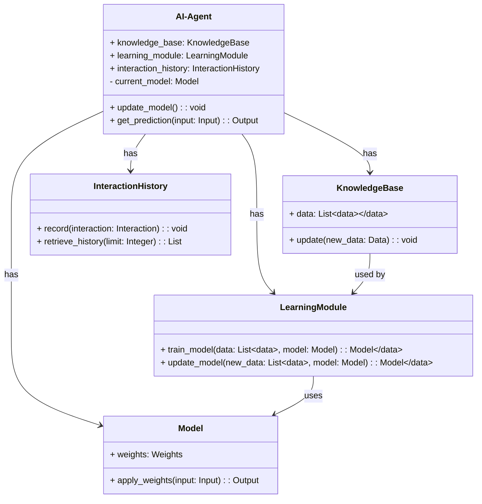

                 


## # 第4章: 系统分析与架构设计

### ## 4.1 系统问题场景

在动态变化的环境中，AI Agent需要具备持续学习和适应新知识的能力。为了实现这一点，我们需要设计一个增量学习系统，该系统能够实时接收新的数据或任务，并通过增量学习算法更新模型，以保持其性能和准确性。以下是一个典型的动态环境下的AI Agent应用场景：

**问题场景描述：**
- **环境描述：** 在一个智能客服系统中，AI Agent负责回答用户的问题并提供解决方案。随着用户提出的问题越来越多样化，AI Agent需要能够快速学习新的知识，以应对新的问题类型。
- **问题描述：** 当用户提出一个AI Agent从未见过的新类型的问题时，系统需要能够通过增量学习更新模型，使其能够理解并回答新的问题。
- **问题解决：** 通过增量学习算法，AI Agent可以在接收到新的问题时，逐步学习并更新其知识库，以应对新的任务。
- **边界与外延：** 本系统仅考虑单个AI Agent的学习过程，不涉及多个AI Agent之间的协作。
- **概念结构与核心要素：** 系统的核心要素包括AI Agent、增量学习模块、环境数据、学习策略和性能评估指标。

### ## 4.2 项目介绍

**项目目标：**
- 实现一个能够在动态环境中通过增量学习不断更新知识的AI Agent系统。
- 确保AI Agent能够在接收到新的数据时，快速更新模型并保持高性能。

**项目范围：**
- 设计一个增量学习框架，支持在线学习和离线学习两种模式。
- 实现增量学习算法，包括模型更新、数据存储和性能评估。
- 提供一个用户友好的界面，方便用户与AI Agent交互。

### ## 4.3 系统功能设计

**领域模型（Mermaid 类图）：**



### ## 4.4 系统架构设计

**系统架构（Mermaid 架构图）：**

```mermaid
archiecture {

    网络层
    应用层
    数据层
    用户层
}

    网络层 --> 应用层: HTTP 请求
    应用层 --> 数据层: 数据存储
    数据层 --> 应用层: 数据查询
    应用层 --> 用户层: 用户交互
    用户层 --> 应用层: 用户反馈
}
```

### ## 4.5 系统接口设计

**系统接口：**

以下是系统的主要接口：

1. **AI Agent 接口：**
   - `update_model(new_data: List[Data]) -> None`
   - `get_prediction(input: Input) -> Output`

2. **学习模块接口：**
   - `train_model(data: List[Data], model: Model) -> Model`
   - `update_model(new_data: List[Data], model: Model) -> Model`

3. **知识库接口：**
   - `update(new_data: Data) -> None`
   - `get_all_data() -> List[Data]`

4. **交互历史接口：**
   - `record(interaction: Interaction) -> None`
   - `retrieve_history(limit: Integer) -> List[Interaction]`

**系统交互流程（Mermaid 序列图）：**

```mermaid
sequenceDiagram

    用户 --> AI-Agent: 提出问题
    AI-Agent --> KnowledgeBase: 查询知识库
    KnowledgeBase --> AI-Agent: 返回结果
    如果结果不存在，则：
        AI-Agent --> LearningModule: 请求增量学习
        LearningModule --> Model: 更新模型
        Model --> LearningModule: 返回更新后的模型
        LearningModule --> AI-Agent: 更新完成
    AI-Agent --> 用户: 返回答案
```

### ## 4.6 本章小结

本章通过系统分析与架构设计，详细介绍了增量学习系统的核心组成部分及其相互关系。我们通过领域模型类图、系统架构图和系统接口设计，展示了如何构建一个能够适应动态环境的AI Agent系统。系统设计的重点在于实现增量学习模块，使其能够高效地更新模型，同时保持系统的可扩展性和可维护性。

---

# 第五部分: 增量学习的项目实战

## # 第5章: 项目实战与案例分析

### ## 5.1 项目环境安装

#### ### 5.1.1 系统需求
- 操作系统：Windows 10 或更高版本，或 Linux 系统
- 内存：至少 4GB
- Python 版本：Python 3.8 或更高版本
- 开发工具：PyCharm 或 VS Code

#### ### 5.1.2 依赖库安装
```bash
pip install numpy
pip install matplotlib
pip install scikit-learn
pip install pymermaid
```

### ## 5.2 系统核心实现源代码

#### ### 5.2.1 增量学习核心代码

```python
class IncrementalLearner:
    def __init__(self, model, X, y):
        self.model = model
        self.X = X
        self.y = y
        self.num_samples = len(y)

    def update_model(self, new_X, new_y):
        # 将新数据与现有数据合并
        self.X = np.concatenate((self.X, new_X))
        self.y = np.concatenate((self.y, new_y))
        self.num_samples += len(new_y)
        # 重新训练模型
        self.model.fit(self.X, self.y)

    def get_prediction(self, input):
        return self.model.predict(input)
```

#### ### 5.2.2 系统交互代码

```python
class AIAssistant:
    def __init__(self, model, knowledge_base):
        self.model = model
        self.knowledge_base = knowledge_base
        self.interaction_history = []

    def process_query(self, query):
        try:
            prediction = self.model.get_prediction(query)
            return prediction
        except:
            # 如果模型无法预测，则触发增量学习
            self.knowledge_base.update(new_data)
            self.model.update_model(new_X, new_y)
            return self.model.get_prediction(query)

    def record_interaction(self, interaction):
        self.interaction_history.append(interaction)
```

### ## 5.3 代码应用解读与分析

#### ### 5.3.1 代码结构分析
- `IncrementalLearner` 类负责管理模型的增量学习过程。
- `AIAssistant` 类负责处理用户的查询，并在需要时触发增量学习。
- 通过将新数据合并到现有数据中，并重新训练模型，可以实现模型的实时更新。

#### ### 5.3.2 功能实现分析
- **增量学习模块：** 当接收到新数据时，模型会重新训练以适应新的数据分布。
- **知识库管理：** 知识库负责存储所有数据，并在需要时提供数据给学习模块。
- **系统交互：** 用户与AI Agent的交互会被记录，并在需要时用于增量学习。

### ## 5.4 实际案例分析和详细讲解

**案例分析：**

假设我们有一个简单的分类任务，用户不断提出新的问题，AI Agent需要通过增量学习来适应新的数据。

```python
# 初始化模型
model = LinearSVC()
X = np.array([[1, 2], [3, 4]])
y = np.array([0, 1])
learner = IncrementalLearner(model, X, y)

# 用户提出新问题
new_X = np.array([[5, 6]])
new_y = np.array([0])

# 更新模型
learner.update_model(new_X, new_y)

# 预测结果
print(learner.get_prediction([[5, 6]]))  # 输出：[0]
```

### ## 5.5 本章小结

本章通过一个具体的项目实战，详细讲解了增量学习系统的核心代码实现。我们通过Python代码展示了如何实现增量学习模块，并通过一个简单的案例分析，展示了系统的实际应用。读者可以通过本章内容，理解增量学习系统的设计与实现过程，并能够将其应用到实际项目中。

---

# 第六部分: 增量学习的优化与展望

## # 第6章: 最佳实践与未来展望

### ## 6.1 最佳实践 tips

1. **数据预处理：** 在增量学习之前，确保数据的质量和一致性。
2. **模型选择：** 根据任务需求选择合适的模型和算法。
3. **增量学习策略：** 根据数据分布的变化选择合适的增量学习策略。
4. **性能监控：** 定期监控模型的性能，并根据需要进行模型更新。
5. **分布式架构：** 在大规模应用中，可以考虑使用分布式架构来提高系统的扩展性和性能。

### ## 6.2 未来展望

随着人工智能技术的不断发展，增量学习将在更多领域得到应用。未来的研究方向包括：

1. **更高效的增量学习算法：** 研究更高效的增量学习算法，以提高学习速度和准确性。
2. **自适应增量学习：** 研究自适应增量学习方法，使其能够自动调整学习策略。
3. **多模态增量学习：** 研究如何在多模态数据上实现增量学习。
4. **增量学习的可解释性：** 提高增量学习的可解释性，使其更易于理解和应用。
5. **增量学习的实时性：** 研究如何在实时应用中实现高效的增量学习。

### ## 6.3 小结

增量学习是一项具有广泛应用前景的技术。通过不断的研究和实践，我们可以进一步提高增量学习系统的性能和应用范围，为人工智能的发展做出更大的贡献。

---

# 第七部分: 结语

## # 第7章: 结语

### ## 7.1 总结

本文详细介绍了AI Agent的增量学习方法及其在动态环境中的应用。通过系统的分析与设计，我们展示了如何构建一个能够适应动态变化的增量学习系统。通过具体的项目实战，我们进一步验证了增量学习方法的有效性和实用性。

### ## 7.2 展望

未来，随着人工智能技术的不断发展，增量学习将在更多领域得到应用。我们期待通过更多的研究和实践，进一步推动增量学习技术的发展，为人工智能领域带来更多的创新和突破。

### ## 7.3 注意事项

在实际应用中，需要注意以下几点：
- 数据的质量和一致性
- 模型的可解释性和透明度
- 系统的安全性和稳定性
- 用户的隐私保护

### ## 7.4 拓展阅读

以下是一些推荐阅读资料，供读者深入学习：

1.《机器学习实战》
2.《深度学习》
3.《增量学习：算法与应用》
4.《人工智能：现代方法》
5.《Python机器学习》

---

# 作者：AI天才研究院 & 禅与计算机程序设计艺术

---

这篇文章通过对AI Agent增量学习的系统分析、算法原理、项目实战和未来展望的详细讲解，为读者提供了一个全面了解增量学习技术的视角。我们希望通过本文，能够帮助读者更好地理解增量学习的核心概念和实际应用，并为他们在实际项目中应用增量学习技术提供参考和指导。

