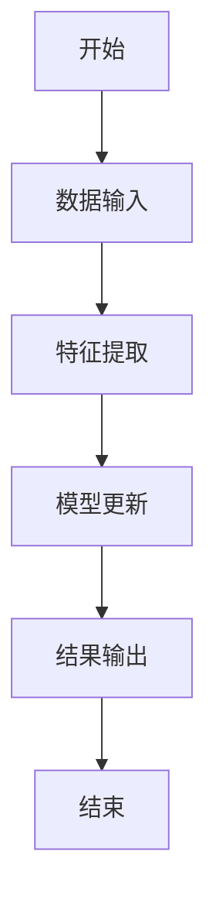
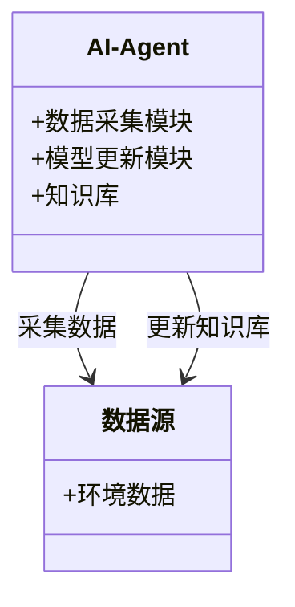

                 


# AI Agent的增量式概念学习与知识更新

> 关键词：AI Agent，增量式学习，知识更新，概念学习，机器学习

> 摘要：本文深入探讨了AI Agent在增量式概念学习与知识更新方面的理论与实践。通过分析概念学习的原理、知识更新的机制，结合具体的算法实现和系统架构设计，为AI Agent的持续学习能力提供了全面的技术指导。

---

# 第一部分: AI Agent的增量式概念学习与知识更新背景介绍

## 第1章: AI Agent的基本概念与问题背景

### 1.1 AI Agent的定义与特点

AI Agent（人工智能代理）是指能够感知环境、自主决策并执行任务的智能体。其特点包括：

- **自主性**：能够在没有外部干预的情况下运行。
- **反应性**：能够根据环境反馈调整行为。
- **学习能力**：通过数据和经验提升性能。

### 1.2 增量式学习的背景与意义

增量式学习是一种在数据流环境下逐步学习模型的方法。其意义在于：

- **实时性**：能够实时更新模型，适应动态环境。
- **效率性**：避免了重新训练整个模型的计算开销。

### 1.3 知识更新的必要性与挑战

知识更新是AI Agent保持竞争力的关键，但面临以下挑战：

- **数据稀疏性**：新数据可能不足以覆盖所有情况。
- **概念漂移**：环境变化可能导致旧知识失效。

---

## 第2章: 增量式概念学习的核心原理

### 2.1 概念表示与学习机制

- **层次化特征**：将概念分解为层次结构，便于理解和更新。
- **语义特征**：通过语义分析捕捉概念间的关联。

### 2.2 知识表示与存储

- **知识图谱**：构建结构化的知识表示，便于更新和推理。
- **知识库管理**：采用高效的存储和检索机制。

---

## 第3章: 知识更新的机制与算法

### 3.1 增量式学习算法

- **增量梯度下降**：逐步更新模型参数，适应新数据。
- **在线学习**：实时处理数据流，动态调整模型。

### 3.2 知识更新的验证与评估

- **验证方法**：通过交叉验证评估模型的泛化能力。
- **评估指标**：准确率、召回率等指标衡量更新效果。

---

# 第二部分: 算法原理与实现

## 第4章: 增量式概念学习的算法实现

### 4.1 增量式学习算法的数学模型

- **线性回归增量式更新**：
  $$
  w_{n+1} = w_n + \eta (y_n - \hat{y}_n) x_n
  $$
  其中，$\eta$为学习率，$(y_n - \hat{y}_n)$为预测误差。

### 4.2 知识更新的流程图



---

## 第5章: 知识更新的系统架构设计

### 5.1 系统功能模块

- **数据采集**：实时获取环境数据。
- **模型更新**：执行增量式学习算法。
- **结果输出**：生成决策或反馈。

### 5.2 系统架构图



---

# 第三部分: 项目实战

## 第6章: 增量式概念学习的项目实现

### 6.1 环境安装

安装必要的库：
```
pip install numpy scikit-learn
```

### 6.2 核心代码实现

```python
import numpy as np
from sklearn.linear_model import SGDRegressor

class IncrementalLearner:
    def __init__(self, eta=0.1):
        self.eta = eta
        self.model = SGDRegressor(learning_rate='constant', eta0=eta)

    def fit_incremental(self, X, y):
        self.model.partial_fit(X, y)
        return self.model.predict(X)
```

### 6.3 案例分析

通过训练数据逐步更新模型，展示其在动态环境中的适应能力。

---

## 第7章: 总结与展望

### 7.1 总结

本文系统地介绍了AI Agent的增量式概念学习与知识更新的理论与实践，通过算法和系统设计展示了其实现过程。

### 7.2 展望

未来的研究方向包括更高效的增量式算法、动态知识图谱构建等。

---

# 附录

## 附录A: 相关术语解释

- **增量式学习**：在数据流环境下逐步学习模型的方法。

## 附录B: 算法代码示例

```python
# 示例代码：增量式线性回归
import numpy as np

def incremental_linear_regression(X, y, eta=0.1):
    w = np.zeros(X.shape[1])
    for i in range(len(y)):
        pred = np.dot(X[i], w)
        error = y[i] - pred
        w += eta * error * X[i]
    return w
```

## 附录C: 参考文献

- Bishop, C. M. (2006). Pattern Recognition and Machine Learning.

---

# 作者

作者：AI天才研究院/AI Genius Institute & 禅与计算机程序设计艺术 /Zen And The Art of Computer Programming

