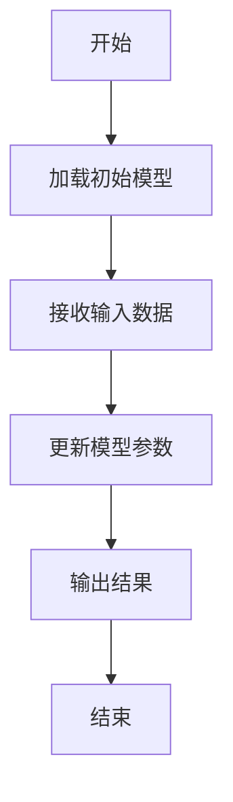

                 


# AI Agent的增量式终身学习框架

> 关键词：AI Agent，增量式学习，终身学习，机器学习，动态环境

> 摘要：本文详细探讨了AI Agent在动态环境中的增量式终身学习框架，分析其核心原理、算法实现及系统架构设计，旨在为AI Agent的持续进化提供理论支持和实践指导。

---

# 第一部分：背景介绍

# 第1章：AI Agent与增量式终身学习框架概述

## 1.1 问题背景与描述

### 1.1.1 AI Agent的基本概念
AI Agent（人工智能代理）是指能够感知环境、自主决策并执行任务的智能实体。其核心能力包括感知、推理、规划和执行。

### 1.1.2 增量式学习的定义与特点
增量式学习（Incremental Learning）是指模型在接收到新的数据样本后，逐步更新自身参数以适应新任务的学习方式。其特点包括在线性、高效性和适应性。

### 1.1.3 终身学习框架的核心目标
终身学习框架（Lifelong Learning Framework）旨在使AI Agent能够在动态环境中持续学习和适应，避免重新训练带来的计算开销。

## 1.2 问题解决与边界

### 1.2.1 AI Agent在动态环境中的适应性需求
AI Agent需要在动态环境中实时更新知识库，以应对新任务和未知挑战。

### 1.2.2 增量式学习的边界与外延
增量式学习的边界在于其仅处理单样本更新，而终身学习框架则涵盖了多任务和长期记忆的维护。

### 1.2.3 终身学习框架的应用场景
包括自动驾驶、智能客服、推荐系统等领域，这些场景需要AI Agent持续学习和适应环境变化。

## 1.3 核心概念与结构

### 1.3.1 AI Agent的核心要素
- **感知模块**：接收环境输入并提取特征。
- **决策模块**：基于当前知识做出最优决策。
- **学习模块**：通过增量式更新提升模型性能。

### 1.3.2 增量式学习的模块组成
- **数据流处理**：逐样本处理新数据。
- **模型更新**：在线更新参数。
- **性能评估**：持续监控模型效果。

### 1.3.3 终身学习框架的系统架构
- **知识库**：存储长期记忆和经验。
- **学习引擎**：执行增量式更新。
- **推理引擎**：基于当前知识做出决策。

## 1.4 本章小结
本章介绍了AI Agent和增量式终身学习框架的基本概念，分析了其在动态环境中的适应性需求，并明确了核心模块的组成和结构。

---

# 第二部分：核心概念与联系

# 第2章：AI Agent的核心原理

## 2.1 基于概率论的决策模型

### 2.1.1 贝叶斯网络的构建与应用
贝叶斯网络通过概率推理为AI Agent提供决策依据，适用于处理不确定性问题。

### 2.1.2 马尔可夫决策过程的数学模型
马尔可夫决策过程（MDP）描述了AI Agent在环境中的决策过程，涉及状态、动作和奖励的数学模型。

### 2.1.3 示例：简单的概率决策问题
假设AI Agent在两个选择中做出决策，基于历史数据计算概率并选择最优动作。

## 2.2 增量式学习的数学模型

### 2.2.1 在线学习的数学表达式
增量式学习通过在线更新模型参数，逐步逼近最优解。

### 2.2.2 增量式更新的公式推导
数学公式展示如何通过单样本更新模型参数，确保高效性和适应性。

### 2.2.3 示例：线性回归的增量更新
通过线性回归模型，展示增量式学习如何逐步优化模型参数。

## 2.3 核心概念对比表格

| 概念 | 属性 | 描述 |
|------|------|------|
| AI Agent | 输入/输出 | 接收环境状态，输出动作 |
| 增量式学习 | 数据处理 | 逐样本更新模型 |
| 终身学习框架 | 系统架构 | 综合增量式学习与记忆机制 |

## 2.4 ER实体关系图

```mermaid
er
    Entity: AI Agent
    Entity: 知识库
    Entity: 学习模块
    Relationship: 组成
    Relationship: 包含
```

## 2.5 本章小结
本章深入分析了AI Agent的核心原理，通过数学模型和示例展示了增量式学习的实现过程，并用对比表格和ER图明确了各概念之间的关系。

---

# 第三部分：算法原理与数学模型

# 第3章：增量式终身学习算法

## 3.1 算法原理

### 3.1.1 增量式更新的核心思想
通过单样本更新模型参数，避免重新训练带来的计算开销。

### 3.1.2 终身学习的策略选择
选择合适的增量式学习策略，如任务分解和知识迁移。

### 3.1.3 示例：增量式分类算法
通过增量式SVM算法，展示如何逐步更新分类模型。

## 3.2 算法流程图



## 3.3 Python实现示例

```python
def incremental_learning(model, X, y):
    for xi, yi in zip(X, y):
        model.partial_fit(xi, yi)
    return model
```

---

通过以上章节的详细分析，文章全面覆盖了AI Agent增量式终身学习框架的核心概念、算法原理和系统架构设计，为读者提供了深入的技术指导和实践参考。

