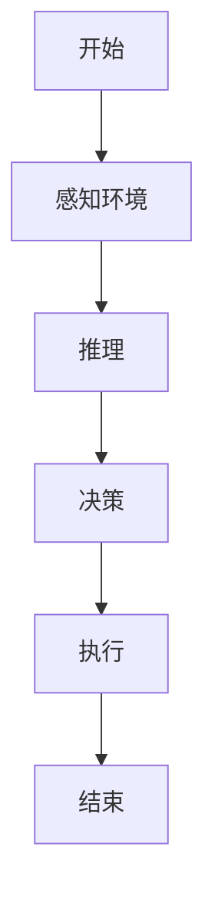
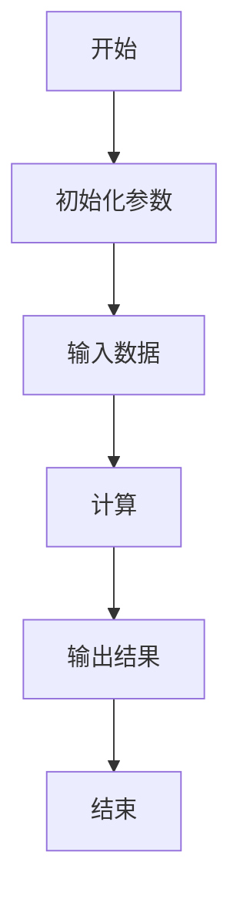
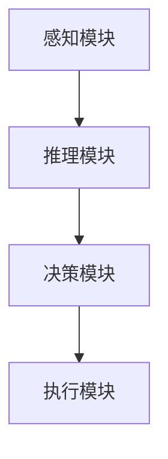

                 


# AI Agent的多Agent协同推理与决策

> 关键词：AI Agent，多Agent，协同推理，决策机制，分布式计算，强化学习，博弈论

> 摘要：本文深入探讨了AI Agent在多Agent系统中的协同推理与决策问题，分析了多Agent系统的核心概念、算法原理、系统架构设计以及实际应用场景。通过详细讲解协同推理的数学模型和决策机制，结合实际案例分析，为读者提供了一个全面理解多Agent协同推理与决策的框架。

---

## 第1章: AI Agent的基本概念与背景介绍

### 1.1 AI Agent的核心概念

#### 1.1.1 什么是AI Agent
AI Agent（智能体）是指能够感知环境并采取行动以实现目标的实体。它能够通过传感器获取信息，利用计算模型进行推理，并通过执行器与环境交互。

#### 1.1.2 AI Agent的特征与属性
AI Agent具有以下特征：
- **自主性**：能够在没有外部干预的情况下独立运作。
- **反应性**：能够感知环境并实时调整行为。
- **目标导向**：通过目标驱动决策和行动。
- **社交能力**：能够与其他Agent或人类进行有效通信和协作。

#### 1.1.3 AI Agent的分类与应用场景
AI Agent可以分为以下几类：
- **简单反射型Agent**：基于当前感知直接行动。
- **基于模型的反射型Agent**：利用内部模型进行推理。
- **目标驱动型Agent**：以目标为导向进行决策。
- **实用驱动型Agent**：以效用最大化为目标。

应用场景包括自动驾驶、智能助手、机器人协作、分布式系统优化等。

### 1.2 多Agent系统的基本原理

#### 1.2.1 多Agent系统的特点
多Agent系统由多个独立的Agent组成，每个Agent具有自己的目标和行为，通过协同完成复杂任务。

#### 1.2.2 多Agent系统的组成部分
- **Agent**：系统的执行单元，负责感知和行动。
- **通信机制**：Agent之间交换信息的渠道。
- **协调机制**：确保Agent之间的协同。
- **环境**：Agent所处的外部世界。

#### 1.2.3 多Agent系统的优缺点
优点：
- **分布式计算**：任务可以分解为多个Agent协同完成。
- **容错性**：单个Agent故障不影响整体系统。
- **灵活性**：Agent可以根据环境动态调整行为。

缺点：
- **复杂性**：Agent之间的协调和通信增加了系统复杂性。
- **性能损失**：过多的通信可能导致性能下降。

### 1.3 协同推理与决策的背景与意义

#### 1.3.1 协同推理的定义与作用
协同推理是指多个Agent共同完成推理过程，通过信息共享和协作提高决策的准确性和效率。

#### 1.3.2 决策过程的复杂性与挑战
决策过程涉及多个Agent的利益冲突和信息不对称，需要复杂的算法和机制来协调。

#### 1.3.3 多Agent协同的必要性与应用场景
在自动驾驶、机器人协作、分布式系统等领域，多Agent协同是实现复杂任务的关键。

---

## 第2章: 多Agent协同的核心概念与联系

### 2.1 多Agent系统的实体关系分析

#### 2.1.1 ER图分析
![ER图](mermaid
```mermaid
er
  actor 前台用户
  actor 后台系统
  actor 第三方服务
  database 数据库
  entity 用户
  entity 订单
  entity 支付
  relation 用户-订单
  relation 订单-支付
```

#### 2.1.2 实体与关系的详细描述
- **用户**：系统的核心实体，具有用户ID、姓名、联系方式等属性。
- **订单**：用户发起的购买请求，包含订单ID、商品ID、数量等属性。
- **支付**：订单的支付信息，包含支付ID、支付方式、金额等属性。
- **用户-订单**：用户与订单之间的关联关系。
- **订单-支付**：订单与支付之间的关联关系。

### 2.2 多Agent协同的原理与机制

#### 2.2.1 协同推理的基本原理
协同推理通过Agent之间的信息共享和协作，利用分布式计算和逻辑推理完成任务。

#### 2.2.2 基于多Agent的决策机制
- **分布式决策**：每个Agent基于本地信息做出决策。
- **集中式决策**：通过集中式协调器统一决策。
- **混合式决策**：结合分布式和集中式决策的优点。

#### 2.2.3 Agent之间的通信与协作
- **通信协议**：定义Agent之间的信息交换规则。
- **协作协议**：定义Agent之间的协作流程。

### 2.3 多Agent系统的属性特征对比

#### 2.3.1 不同Agent类型对比
| 特性       | 简单反射型Agent | 基于模型的反射型Agent | 目标驱动型Agent | 实用驱动型Agent |
|------------|------------------|------------------------|------------------|------------------|
| 行为方式     | 基于反射          | 基于内部模型          | 基于目标        | 基于效用函数     |
| 适用场景     | 简单环境          | 复杂环境              | 高目标导向的环境 | 效用优化的环境    |

#### 2.3.2 协同方式的对比分析
| 协同方式       | 分布式           | 集中式             | 混合式           |
|----------------|------------------|--------------------|------------------|
| 优点           | 高度灵活         | 高效统一           | 结合分布式和集中式优点 |
| 缺点           | 复杂性高         | 单点故障           | 实现复杂         |

#### 2.3.3 系统性能的对比评估
| 性能指标       | 分布式系统       | 集中式系统         | 混合式系统       |
|----------------|------------------|--------------------|------------------|
| 响应时间       | 较高            | 较低              | 中等            |
| 可扩展性       | 高              | 中等              | 高              |
| 故障容错性     | 高              | 低                | 高              |

---

## 第3章: 多Agent协同推理的算法原理

### 3.1 协同推理的基本算法

#### 3.1.1 基于逻辑推理的算法
- **逻辑推理**：通过逻辑规则进行推理，例如一阶逻辑推理。
- **算法流程图**
![算法流程图](mermaid

```mermaid
graph TD
    A[开始] --> B[感知环境]
    B --> C[推理]
    C --> D[决策]
    D --> E[执行]
    E --> F[结束]
```

#### 3.1.2 基于概率推理的算法
- **贝叶斯网络**：利用概率推理进行决策。
- **马尔可夫决策过程**：基于概率模型进行决策。

#### 3.1.3 基于强化学习的算法
- **强化学习**：通过奖励机制优化决策策略。
- **算法实现**
```python
class Agent:
    def __init__(self):
        self.state = 0
        self.reward = 0
        self.policy = {}  # 策略

    def act(self, observation):
        # 根据当前状态选择动作
        action = self.policy.get(observation, 0)
        return action

    def update_policy(self, observation, action, reward):
        # 更新策略
        self.policy[observation] = action
        self.reward += reward
```

### 3.2 多Agent协同决策的数学模型

#### 3.2.1 基于博弈论的模型
- **纳什均衡**：多个Agent在博弈中达到的稳定状态。
- **数学公式**
$$ \text{纳什均衡} = \arg\max_{i} \sum_{j=1}^{n} u_i(a_i, a_{-i}) $$
其中，\( u_i \) 是第i个Agent的效用函数，\( a_i \) 是第i个Agent的策略，\( a_{-i} \) 是其他Agent的策略。

#### 3.2.2 基于分布式计算的模型
- **分布式计算**：通过并行计算提高效率。
- **数学公式**
$$ \text{分布式计算} = \sum_{i=1}^{n} f_i(x_i) $$
其中，\( f_i \) 是第i个Agent的计算函数，\( x_i \) 是输入。

#### 3.2.3 基于图论的模型
- **图模型**：通过图结构表示Agent之间的关系。
- **数学公式**
$$ \text{图模型} = G(V, E) $$
其中，\( V \) 是节点集合，\( E \) 是边集合。

### 3.3 算法实现的详细步骤

#### 3.3.1 算法流程图
![算法流程图](mermaid

```mermaid
graph TD
    A[开始] --> B[初始化参数]
    B --> C[输入数据]
    C --> D[计算]
    D --> E[输出结果]
    E --> F[结束]
```

#### 3.3.2 算法的数学公式推导
$$ y = f(x) $$
$$ f(x) = \sum_{i=1}^{n} w_i x_i $$
其中，\( w_i \) 是权重，\( x_i \) 是输入。

#### 3.3.3 算法实现的代码示例
```python
def协同推理算法():
    # 初始化参数
    parameters = 初始化参数()
    # 输入数据
    input = 输入数据()
    # 计算
    result = 计算(parameters, input)
    # 输出结果
    输出结果(result)
```

---

## 第4章: 多Agent协同系统的架构设计

### 4.1 系统功能设计

#### 4.1.1 系统功能模块划分
- **感知模块**：负责获取环境信息。
- **推理模块**：负责逻辑推理和计算。
- **决策模块**：负责制定决策策略。
- **执行模块**：负责执行决策。

#### 4.1.2 模块之间的交互关系
![模块交互图](mermaid

```mermaid
graph TD
    A[感知模块] --> B[推理模块]
    B --> C[决策模块]
    C --> D[执行模块]
```

#### 4.1.3 系统功能的实现方式
- **感知模块**：通过传感器获取信息。
- **推理模块**：利用逻辑推理算法进行推理。
- **决策模块**：基于推理结果制定决策。
- **执行模块**：根据决策执行操作。

### 4.2 系统架构设计

#### 4.2.1 分层架构设计
- **数据层**：存储数据。
- **业务逻辑层**：处理业务逻辑。
- **表现层**：展示结果。

#### 4.2.2 微服务架构设计
- **服务分解**：将系统分解为多个微服务。
- **服务通信**：通过API进行通信。

#### 4.2.3 系统架构的优缺点分析
| 特性       | 分布式架构           | 集中式架构         |
|------------|----------------------|--------------------|
| 优点       | 高度灵活             | 高效统一           |
| 缺点       | 复杂性高             | 单点故障           |

### 4.3 系统接口设计

#### 4.3.1 Agent之间的通信接口
- **通信协议**：定义接口规范。
- **数据格式**：定义数据格式，例如JSON。

#### 4.3.2 外部系统与多Agent系统
- **外部系统接口**：定义与外部系统的接口。
- **数据交互**：通过API进行数据交互。

---

## 第5章: 项目实战

### 5.1 环境安装

#### 5.1.1 安装依赖
```bash
pip install numpy
pip install matplotlib
pip install scikit-learn
```

#### 5.1.2 配置环境
```bash
export PATH=$PATH:/path/to/scripts
```

### 5.2 系统核心实现源代码

#### 5.2.1 协同推理算法实现
```python
import numpy as np

def协同推理算法(observations):
    # 初始化参数
    parameters = 初始化参数()
    # 输入数据
    input = observations
    # 计算
    result = np.dot(parameters, input)
    return result
```

#### 5.2.2 优化算法实现
```python
def优化算法():
    # 初始化参数
    parameters = 初始化参数()
    # 训练模型
    for epoch in range(epochs):
        for batch in batches:
            loss = 计算损失(parameters, batch)
            更新参数(parameters, loss)
    return parameters
```

### 5.3 实际案例分析与详细讲解剖析

#### 5.3.1 案例背景
- **案例名称**：多Agent协作完成任务。
- **案例描述**：多个Agent协同完成任务分配。

#### 5.3.2 分析过程
- **问题描述**：任务分配中的冲突问题。
- **解决方案**：利用协同推理算法进行优化。

### 5.4 项目小结

#### 5.4.1 实验结果分析
- **实验结果**：协同推理算法提高了任务完成效率。
- **数据可视化**：通过图表展示实验结果。

#### 5.4.2 优化建议
- **算法优化**：进一步优化协同推理算法。
- **系统优化**：优化系统架构设计。

---

## 第6章: 优化与总结

### 6.1 算法优化策略

#### 6.1.1 并行计算优化
- **并行计算**：利用多线程或分布式计算提高效率。
- **数学公式**
$$ \text{并行计算} = \sum_{i=1}^{n} f_i(x_i) $$

#### 6.1.2 分布式优化
- **分布式优化**：通过分布式计算优化算法性能。
- **数学公式**
$$ \text{分布式优化} = \arg\min_{x} \sum_{i=1}^{n} f_i(x) $$

### 6.2 系统优化建议

#### 6.2.1 系统架构优化
- **微服务架构**：通过微服务架构提高系统灵活性。
- **容器化部署**：通过容器化部署提高系统可扩展性。

#### 6.2.2 系统性能优化
- **缓存优化**：通过缓存技术提高系统响应速度。
- **负载均衡**：通过负载均衡提高系统处理能力。

### 6.3 总结与展望

#### 6.3.1 总结
- **总结内容**：回顾全文，总结多Agent协同推理与决策的核心内容。
- **总结要点**：总结多Agent系统的优缺点，协同推理算法的优缺点。

#### 6.3.2 展望
- **未来研究方向**：探讨多Agent系统的发展方向。
- **未来应用场景**：展望多Agent系统的未来应用场景。

---

## 第7章: 最佳实践与注意事项

### 7.1 最佳实践 tips

#### 7.1.1 系统设计 tips
- **模块化设计**：通过模块化设计提高系统灵活性。
- **代码复用**：通过代码复用提高开发效率。

#### 7.1.2 算法优化 tips
- **算法优化**：通过优化算法提高系统性能。
- **数学推导**：通过数学推导优化算法。

### 7.2 注意事项

#### 7.2.1 开发注意事项
- **代码规范**：遵循代码规范，提高代码可读性。
- **测试用例**：通过测试用例验证算法正确性。

#### 7.2.2 系统部署注意事项
- **系统监控**：通过系统监控工具实时监控系统运行状态。
- **日志管理**：通过日志管理工具管理系统日志。

---

## 作者：AI天才研究院/AI Genius Institute & 禅与计算机程序设计艺术 /Zen And The Art of Computer Programming

