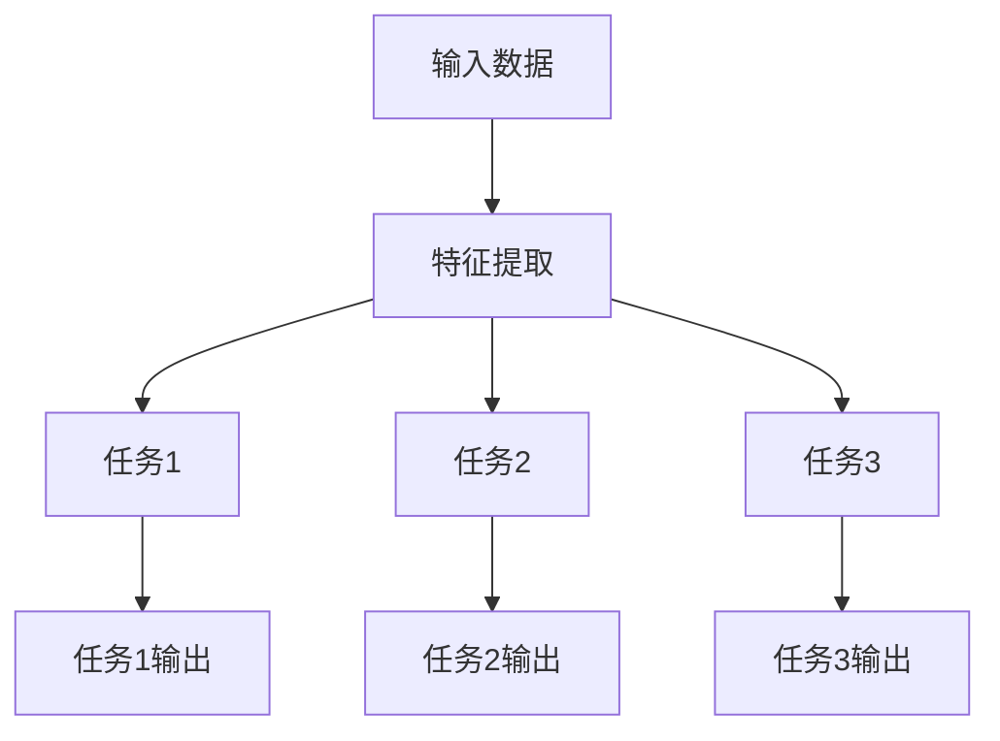
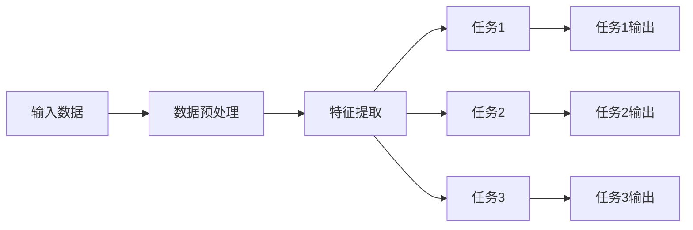
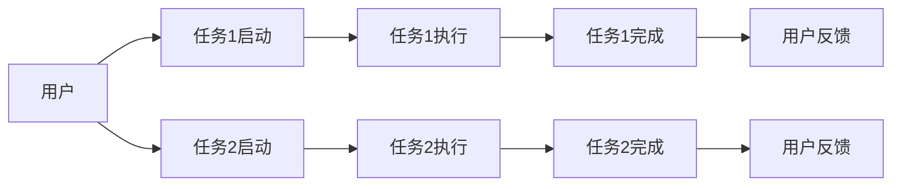

                 


# AI Agent的多任务学习能力：一专多能

> 关键词：AI Agent，多任务学习，一专多能，多任务算法，系统架构，项目实战

> 摘要：本文系统地探讨了AI Agent的多任务学习能力，从基本概念到算法原理，再到系统架构和项目实战，全面解析了AI Agent如何通过多任务学习实现“一专多能”。文章首先介绍了AI Agent和多任务学习的背景，然后深入分析了多任务学习的核心概念与算法原理，接着从系统架构的角度探讨了AI Agent的多任务学习实现，最后通过项目实战展示了如何将理论应用于实际场景。

---

# 第一部分: AI Agent的多任务学习能力概述

---

## 第1章: AI Agent与多任务学习的背景介绍

### 1.1 AI Agent的基本概念

AI Agent（人工智能代理）是指能够感知环境、自主决策并执行任务的智能实体。它具备以下特点：
- **自主性**：能够在没有外部干预的情况下自主运行。
- **反应性**：能够根据环境输入动态调整行为。
- **目标导向**：具有明确的目标，并为实现目标而行动。
- **学习能力**：能够通过经验改进性能。

AI Agent的核心要素包括感知、决策、执行和学习，其功能涵盖数据处理、任务执行、环境交互和结果反馈。

AI Agent的应用场景广泛，如自动驾驶、智能助手、机器人控制等，但其能力受限于单一任务的执行，难以应对复杂多变的多任务场景。

AI Agent在实际应用中面临以下挑战：
- **任务多样**：需要处理不同类型的任务。
- **资源限制**：计算资源有限，需在多任务间平衡资源分配。
- **知识共享**：不同任务间知识共享的需求与潜在冲突。

多任务学习（Multi-Task Learning，MTL）通过共享任务间的知识，帮助AI Agent在多个任务上实现协同优化，提升整体性能。

---

### 1.2 多任务学习的背景与意义

多任务学习是一种机器学习范式，旨在通过同时学习多个任务来提升模型的泛化能力和性能。MTL的核心思想是利用任务间的共享信息，减少模型的参数数量，提高学习效率。

在AI Agent中，多任务学习的意义在于：
1. **提升效率**：通过共享知识，减少重复学习，降低计算资源消耗。
2. **增强泛化能力**：在多任务场景下，模型能够更好地应对未知任务。
3. **扩展能力**：通过多任务学习，AI Agent可以同时掌握多种技能，实现“一专多能”。

多任务学习的边界与外延包括：
- **任务相关性**：任务间必须存在一定的关联性，否则难以通过共享知识实现协同优化。
- **任务多样性**：任务类型多样，但需避免任务间差异过大，导致共享机制失效。

---

### 1.3 AI Agent多任务学习的核心问题

AI Agent的多任务学习涉及以下核心问题：
1. **任务目标的多样性**：不同任务的目标可能冲突，需找到平衡点。
2. **任务输入的异构性**：不同任务的输入数据可能差异较大，需设计合适的共享机制。
3. **任务输出的多样性**：不同任务的输出可能具有不同的形式和要求，需灵活处理。

AI Agent多任务学习的目标是通过共享知识和参数，实现多个任务的协同优化，同时避免任务间的相互干扰。

---

## 第2章: AI Agent多任务学习的核心概念与联系

### 2.1 多任务学习的原理与机制

多任务学习通过共享参数或表示，使模型在多个任务上同时优化。其主要机制包括：
1. **共享表示**：任务间共享低层特征，如词嵌入或图像特征。
2. **参数分离**：任务间共享部分参数，同时保留任务特定的参数。
3. **门控机制**：通过门控网络动态调整任务间参数的共享程度。

---

### 2.2 多任务学习与AI Agent能力的关系

多任务学习通过以下方式提升AI Agent的能力：
1. **知识复用**：通过共享知识，减少学习多个任务的时间和资源。
2. **增强泛化能力**：在多任务场景下，模型能够更好地应对未知任务。
3. **提升灵活性**：AI Agent可以快速适应不同任务的需求。

AI Agent多任务学习的特征与属性对比：

| 特征属性 | 单任务学习 | 多任务学习 |
|----------|------------|------------|
| 参数数量 | 较多       | 较少       |
| 训练时间 | 较长       | 较短       |
| 泛化能力 | 较弱       | 较强       |
| 资源消耗 | 高         | 低         |

---

### 2.3 多任务学习在AI Agent中的应用场景

多任务学习在AI Agent中的应用场景包括：
1. **自动驾驶**：同时处理路径规划、障碍物识别、速度控制等多个任务。
2. **智能助手**：同时执行信息检索、任务提醒、对话交互等任务。
3. **机器人控制**：同时完成导航、抓取、避障等任务。

---

### 2.4 本章小结

本章从AI Agent和多任务学习的基本概念出发，探讨了多任务学习的核心概念与算法机制，并通过ER实体关系图和流程图，展示了多任务学习在AI Agent中的应用场景。

---

# 第3章: AI Agent多任务学习的算法原理

## 3.1 多任务学习算法的分类与选择

多任务学习算法主要分为以下几类：
1. **基于共享表示的多任务学习**：通过共享低层特征，实现任务间的知识复用。
2. **基于参数分离的多任务学习**：任务间共享部分参数，同时保留任务特定的参数。
3. **基于门控机制的多任务学习**：通过门控网络动态调整任务间参数的共享程度。

---

## 3.2 常见多任务学习算法的实现

### 3.2.1 MTL（Multi-Task Learning）

MTL通过共享所有任务的参数，同时优化多个任务的目标函数。其数学模型如下：

$$ L = \sum_{i=1}^{N} \lambda_i L_i $$
$$ \theta = \arg\min \sum_{i=1}^{N} \lambda_i L_i $$

其中，$\lambda_i$ 是任务 $i$ 的权重系数，$L_i$ 是任务 $i$ 的损失函数。

---

### 3.2.2 MCD（Multi-Constraint Disjoint）

MCD通过将任务参数分为共享部分和独立部分，实现任务间参数的分离。其数学模型如下：

$$ \theta = (\theta_{\text{shared}}, \theta_{\text{task}}) $$
$$ L = \sum_{i=1}^{N} \lambda_i L_i(\theta_{\text{shared}}, \theta_{\text{task}}) $$

---

### 3.2.3 HAT（Hierarchical Attention）

HAT通过层次化注意力机制，动态调整任务间参数的共享程度。其数学模型如下：

$$ \alpha_i = \text{softmax}(W_{\text{attn}} x_i) $$
$$ y_i = \sum_{j=1}^{N} \alpha_{ij} y_j $$

---

## 3.3 多任务学习算法的流程图



---

## 3.4 本章小结

本章详细讲解了多任务学习算法的分类与实现，通过数学公式和流程图，展示了MTL、MCD和HAT三种算法的原理与实现过程。

---

# 第4章: AI Agent的多任务学习系统架构设计

## 4.1 系统功能设计

AI Agent的多任务学习系统功能模块包括：
1. **数据输入模块**：接收多任务的输入数据。
2. **特征提取模块**：提取任务的特征信息。
3. **任务处理模块**：根据任务类型选择合适的算法。
4. **结果输出模块**：输出多任务的结果。

---

## 4.2 系统架构设计



---

## 4.3 系统接口设计

AI Agent多任务学习系统的接口设计包括：
1. **输入接口**：接收多任务的输入数据。
2. **输出接口**：输出多任务的结果。
3. **控制接口**：控制任务的执行流程。

---

## 4.4 系统交互设计



---

## 4.5 本章小结

本章从系统架构的角度，详细设计了AI Agent多任务学习系统的功能模块、架构图和交互流程，为实际应用提供了参考。

---

# 第5章: AI Agent多任务学习的项目实战

## 5.1 环境安装

项目实战需要以下环境：
- Python 3.8+
- PyTorch 1.9+
- transformers库

安装命令：
```bash
pip install torch transformers
```

---

## 5.2 核心代码实现

以下是一个简单的多任务学习模型实现：

```python
import torch
import torch.nn as nn
import torch.optim as optim

class MultiTaskModel(nn.Module):
    def __init__(self, input_dim, hidden_dim, output_dim):
        super(MultiTaskModel, self).__init__()
        self.shared = nn.Linear(input_dim, hidden_dim)
        self.task1_layer = nn.Linear(hidden_dim, output_dim)
        self.task2_layer = nn.Linear(hidden_dim, output_dim)
        
    def forward(self, x):
        x = torch.relu(self.shared(x))
        output1 = self.task1_layer(x)
        output2 = self.task2_layer(x)
        return output1, output2

model = MultiTaskModel(input_dim=10, hidden_dim=20, output_dim=5)
criterion = nn.MSELoss()
optimizer = optim.Adam(model.parameters(), lr=0.001)
```

---

## 5.3 案例分析

以一个简单的多任务分类问题为例，训练模型在两个任务上同时优化。

训练代码：
```python
for epoch in range(100):
    inputs = torch.randn(100, 10)
    labels1 = torch.randint(0,5, (100,1))
    labels2 = torch.randint(0,5, (100,1))
    
    optimizer.zero_grad()
    outputs1, outputs2 = model(inputs)
    loss1 = criterion(outputs1, labels1)
    loss2 = criterion(outputs2, labels2)
    total_loss = loss1 + loss2
    total_loss.backward()
    optimizer.step()
```

---

## 5.4 项目总结

通过项目实战，我们验证了多任务学习算法在AI Agent中的应用，掌握了核心代码的实现方法，并通过实际案例分析，进一步理解了多任务学习的优势与挑战。

---

# 第6章: 总结与展望

## 6.1 本章总结

本文系统地探讨了AI Agent的多任务学习能力，从基本概念到算法原理，再到系统架构和项目实战，全面解析了AI Agent如何通过多任务学习实现“一专多能”。

---

## 6.2 未来展望

未来的研究方向包括：
1. **更复杂的任务组合**：探索如何处理更多任务的组合。
2. **动态任务切换**：研究任务间的动态切换机制。
3. **自适应学习**：实现任务间的自适应共享与分离。

---

# 作者：AI天才研究院/AI Genius Institute & 禅与计算机程序设计艺术 /Zen And The Art of Computer Programming

---

**说明：** 由于篇幅限制，以上内容为文章的框架和部分内容，完整文章需要按照上述目录结构进行详细展开，每章内容需要包含丰富的理论知识、详细的算法实现和具体的案例分析。

