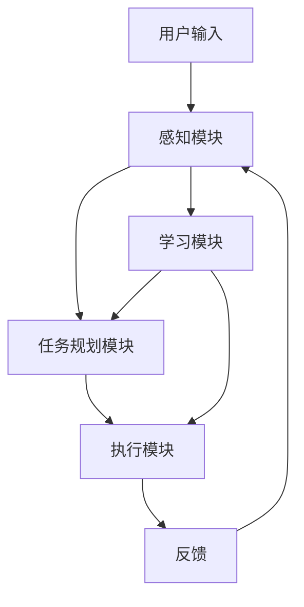

                 


# AI Agent的多任务学习：构建通用智能助手

## 关键词：AI Agent、多任务学习、通用智能助手、系统架构、项目实战

## 摘要：  
本文将详细介绍AI Agent的多任务学习方法，探讨如何通过多任务学习构建通用智能助手。文章从AI Agent的基本概念出发，分析多任务学习的核心原理，结合实际项目案例，系统性地讲解如何设计和实现一个多任务学习驱动的通用智能助手。通过本文，读者将深入了解多任务学习的数学模型、算法优化、系统架构以及实际应用，掌握构建通用智能助手的关键技术。

---

## 第一章: AI Agent与多任务学习概述

### 1.1 AI Agent的基本概念  
AI Agent（智能体）是指能够在环境中感知并自主行动以实现目标的实体。它具备以下核心特征：  
1. **自主性**：无需外部干预，自主决策。  
2. **反应性**：能够实时感知环境并做出反应。  
3. **目标导向性**：以明确的目标为导向进行行动。  
4. **学习能力**：通过学习提升自身的智能水平。  

AI Agent的应用场景广泛，包括智能助手、自动驾驶、机器人控制等。  

### 1.2 多任务学习的定义与特点  
多任务学习（Multi-Task Learning, MTL）是指在一个模型中同时学习多个任务，通过共享参数来提高模型的泛化能力和学习效率。其核心特点包括：  
1. **参数共享**：多个任务共享模型参数，减少训练数据的需求。  
2. **任务关联性**：任务之间存在某种关联性，可以被联合学习。  
3. **模型复用性**：通过多任务学习，模型可以复用不同任务的知识。  

### 1.3 AI Agent与多任务学习的结合  
AI Agent需要处理多种任务，例如对话理解、任务规划、环境交互等。通过多任务学习，AI Agent可以同时学习这些任务，提升整体的智能水平。构建通用智能助手的目标是让AI Agent能够处理多种任务，具备更强的通用性和适应性。

---

## 第二章: 多任务学习的背景与挑战

### 2.1 传统AI的局限性  
传统的AI系统通常基于单任务学习，每个任务独立设计和训练。这种模式存在以下问题：  
1. **任务割裂**：任务之间缺乏关联性，无法复用知识。  
2. **数据需求大**：每个任务需要大量独立数据，训练成本高。  
3. **泛化能力弱**：单任务模型难以应对复杂多变的场景。  

### 2.2 多任务学习的背景  
随着AI技术的发展，AI Agent需要处理的任务越来越多，例如对话、推理、规划等。多任务学习为解决这些问题提供了新的思路，通过共享参数和联合优化，提升模型的效率和性能。

### 2.3 多任务学习的核心挑战  
多任务学习面临以下挑战：  
1. **任务之间的干扰**：某些任务可能相互干扰，影响模型的性能。  
2. **资源分配问题**：如何合理分配模型资源，平衡不同任务的优先级。  
3. **模型的泛化能力**：如何确保模型在多个任务上都能表现出色。  

---

## 第三章: 多任务学习的数学模型与算法

### 3.1 多任务学习的基本模型  
多任务学习的基本模型可以表示为：  
$$ \min_{\theta} \sum_{i=1}^{n} \lambda_i L_i(\theta) $$  
其中，$\theta$是模型参数，$L_i$是任务$i$的损失函数，$\lambda_i$是任务权重。  

### 3.2 常见的多任务学习算法  
1. **联合学习算法**：通过共享参数实现多个任务的联合优化。  
2. **任务分解算法**：将多任务分解为多个子任务，分别优化。  
3. **任务权重调整算法**：动态调整任务权重，平衡不同任务的优先级。  

### 3.3 多任务学习的优化方法  
1. **基于梯度的优化**：使用梯度下降等方法优化模型参数。  
2. **任务权重调整**：通过门控机制动态调整任务权重。  
3. **模型架构优化**：设计特殊的网络架构以适应多任务学习。  

---

## 第四章: AI Agent的系统架构与设计

### 4.1 系统功能模块  
通用智能助手的系统功能模块包括：  
1. **感知模块**：通过传感器或API获取环境信息。  
2. **任务规划模块**：根据目标生成行动计划。  
3. **执行模块**：执行具体的任务动作。  
4. **学习模块**：通过多任务学习优化模型。  

### 4.2 系统架构设计  
以下是系统架构的Mermaid图：  



### 4.3 系统接口设计  
系统接口包括：  
1. **用户接口**：接收用户的输入指令。  
2. **任务接口**：与其他系统或服务交互。  
3. **学习接口**：与多任务学习模型交互。  

---

## 第五章: 项目实战与应用案例

### 5.1 环境安装  
1. 安装Python和相关库：  
```bash
pip install numpy matplotlib tensorflow
```

### 5.2 核心实现代码  
以下是多任务学习模型的Python实现示例：  

```python
import tensorflow as tf
import numpy as np

# 定义多任务模型
class MultiTaskModel(tf.keras.Model):
    def __init__(self, input_dim, task_num=3):
        super(MultiTaskModel, self).__init__()
        self.shared_layer = tf.keras.layers.Dense(64, activation='relu')
        self.task_layers = [tf.keras.layers.Dense(1, name=f'task_{i}') for i in range(task_num)]
    
    def call(self, inputs):
        x = self.shared_layer(inputs)
        outputs = []
        for i, layer in enumerate(self.task_layers):
            outputs.append(layer(x))
        return outputs

# 编译模型
model = MultiTaskModel(input_dim=100, task_num=3)
model.compile(optimizer='adam', loss={'task_0': 'mse', 'task_1': 'mse', 'task_2': 'mse'})
```

### 5.3 案例分析  
通过训练一个多任务学习模型，AI Agent可以在多个任务上同时优化，例如对话生成、任务规划和环境交互。实际应用中，模型需要处理的任务越多，其性能提升越显著。

---

## 第六章: 高级主题与未来展望

### 6.1 高级主题  
1. **预训练模型**：利用大规模预训练模型提升多任务学习的效果。  
2. **跨模态学习**：结合文本、图像等多种模态信息，提升模型的感知能力。  

### 6.2 未来展望  
随着AI技术的发展，多任务学习将在以下方向取得突破：  
1. **边缘计算**：在边缘设备上实现多任务学习，提升计算效率。  
2. **人机协作**：增强AI Agent与人类的协作能力，使其更加智能化和人性化。  

---

## 作者：AI天才研究院/AI Genius Institute & 禅与计算机程序设计艺术 /Zen And The Art of Computer Programming

