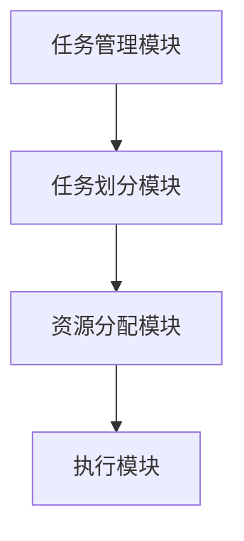
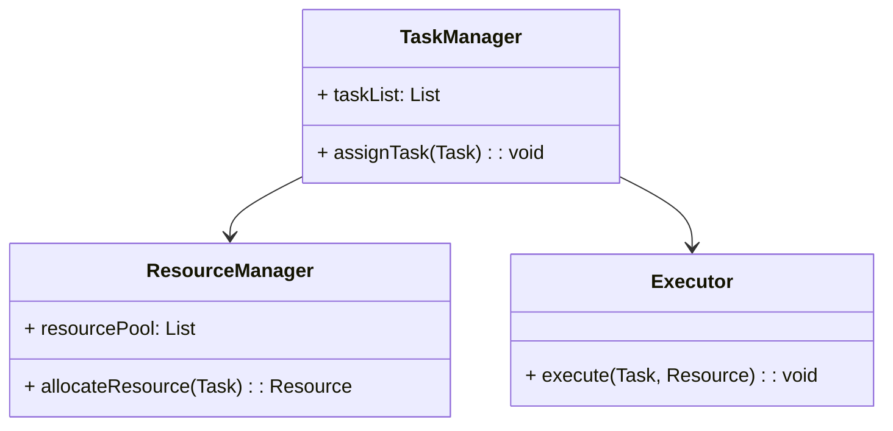
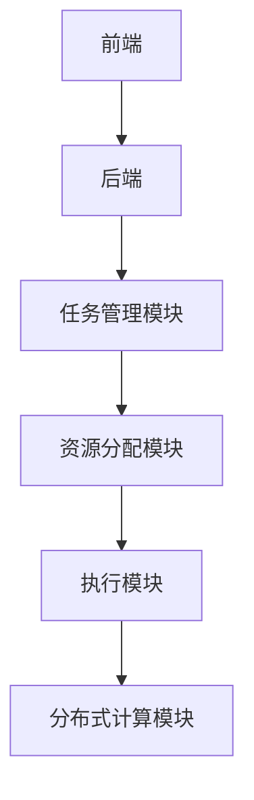
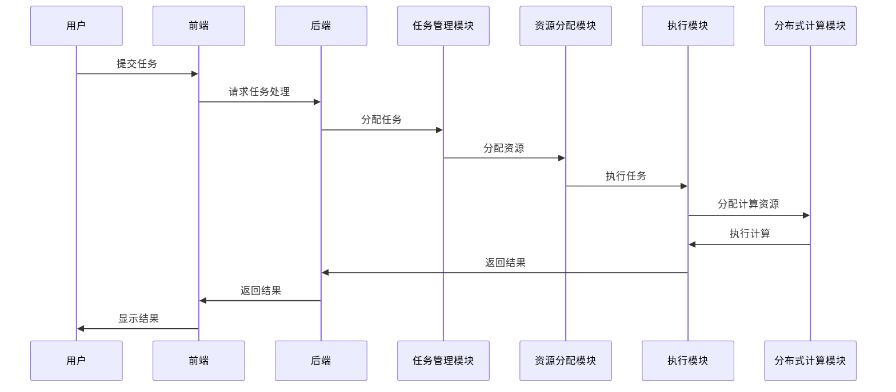

                 


# AI Agent的多任务并行处理技术

> 关键词：AI Agent，多任务并行处理，任务调度，资源分配，算法原理，系统架构

> 摘要：本文深入探讨了AI Agent在多任务并行处理技术中的核心概念、算法原理、系统架构设计以及实际应用案例。通过详细分析任务划分、资源分配和调度机制，结合数学模型和实际代码实现，帮助读者全面理解AI Agent如何高效地执行多个任务。

---

# 第1章: AI Agent与多任务并行处理概述

## 1.1 AI Agent的基本概念

### 1.1.1 AI Agent的定义与特点

AI Agent（人工智能代理）是指能够感知环境、自主决策并执行任务的智能实体。AI Agent可以是软件程序、机器人或其他智能系统，其核心目标是通过感知和行动来优化目标函数。AI Agent的特点包括：

1. **自主性**：能够在没有外部干预的情况下独立运行。
2. **反应性**：能够实时感知环境并做出反应。
3. **目标导向性**：所有行为都围绕目标展开。
4. **学习能力**：通过经验改进性能。

### 1.1.2 多任务并行处理的背景与意义

随着AI技术的快速发展，AI Agent需要同时执行多个复杂任务，例如图像识别、语音处理和数据分析。多任务并行处理技术能够提高效率，减少任务完成时间，同时优化资源利用率。

### 1.1.3 AI Agent在多任务处理中的优势

AI Agent通过多任务并行处理技术可以实现以下优势：
1. **高效性**：并行处理能够同时执行多个任务，提升整体效率。
2. **实时性**：能够快速响应环境变化。
3. **资源优化**：合理分配资源，避免浪费。

## 1.2 多任务并行处理的核心概念

### 1.2.1 多任务处理的基本原理

多任务并行处理是指在同一时间段内执行多个任务的能力。AI Agent通过任务划分、资源分配和任务调度实现多任务并行。

### 1.2.2 并行与并发的区别与联系

- **并行**：多个任务同时执行，通常需要多核处理器或分布式系统。
- **并发**：任务交替执行，但在同一时刻只有一个任务运行。

### 1.2.3 多任务并行处理的实现方式

AI Agent可以通过以下方式实现多任务并行处理：
1. **多线程**：在同一进程内创建多个线程。
2. **多进程**：在多个进程中执行任务。
3. **分布式计算**：通过网络将任务分配到多个节点。

## 1.3 本章小结

本章介绍了AI Agent的基本概念和多任务并行处理的背景与意义。通过分析多任务处理的基本原理，并行与并发的区别，以及实现方式，读者可以理解AI Agent如何高效地执行多个任务。

---

# 第2章: 多任务并行处理的核心概念与联系

## 2.1 多任务并行处理的原理

### 2.1.1 任务划分与调度机制

任务划分是将一个大任务分解为多个小任务。调度机制决定了任务的执行顺序。

**任务划分特征对比（表格）**

| 特征       | 划分粒度 | 调度方式 | 资源需求 |
|------------|----------|----------|----------|
| 精细划分   | 微任务   | 并行     | 高       |
| 粗略划分   | 宏任务   | 串行     | 低       |

### 2.1.2 资源分配与共享策略

资源分配是将计算资源分配给不同任务的过程。共享策略决定了资源如何被多个任务使用。

### 2.1.3 并行计算中的同步与异步

- **同步**：任务之间需要协调，确保任务按顺序执行。
- **异步**：任务可以独立执行，结果由回调处理。

### 2.2 核心概念对比分析

**任务划分的特征对比（表格）**

| 特征       | 精细划分 | 粗略划分 |
|------------|----------|----------|
| 执行效率   | 高       | 低       |
| 资源需求   | 高       | 低       |

**实体关系图（Mermaid流程图）**



## 2.3 本章小结

本章详细讲解了多任务并行处理的原理，包括任务划分、资源分配和同步异步机制。通过对比分析和实体关系图，读者可以理解AI Agent如何高效地管理多个任务。

---

# 第3章: 多任务并行处理的算法原理

## 3.1 并行计算模型

### 3.1.1 并行计算的基本模型

并行计算模型包括**串行**、**并行**和**混合**三种模式。串行模式适合任务间依赖性高的场景；并行模式适合任务间依赖性低的场景；混合模式结合了串行和并行的优势。

### 3.1.2 并行计算中的同步与通信

同步机制确保任务按顺序执行，通信机制实现任务之间的数据共享。

### 3.1.3 并行计算的加速比公式

加速比公式为：

$$ Speedup = \frac{Time_{\text{serial}}}{Time_{\text{parallel}}} $$

其中，$Time_{\text{serial}}$ 是串行执行时间，$Time_{\text{parallel}}$ 是并行执行时间。

### 3.2 多任务调度算法

#### 3.2.1 轮询调度算法

轮询调度算法按任务优先级顺序分配资源。

#### 3.2.2 抢占式调度算法

抢占式调度算法根据任务优先级动态调整执行顺序。

### 3.2.3 调度算法的优缺点对比（表格）

| 特征       | 轮询调度 | 抢占式调度 |
|------------|----------|------------|
| 延迟       | 低       | 高         |
| 资源利用率 | 高       | 高         |

## 3.3 本章小结

本章通过分析并行计算模型和调度算法，展示了AI Agent如何通过数学模型和算法优化实现多任务并行处理。

---

# 第4章: 多任务并行处理的系统架构设计

## 4.1 系统功能设计

### 4.1.1 领域模型设计

领域模型设计包括任务管理模块、资源分配模块和执行模块。

**领域模型类图（Mermaid）**



### 4.1.2 系统架构设计

系统架构设计包括前端、后端和分布式计算模块。

**系统架构图（Mermaid）**



### 4.1.3 接口设计与交互流程

接口设计包括任务提交接口、资源分配接口和任务执行接口。

**交互流程（Mermaid序列图）**



## 4.2 本章小结

本章通过系统架构设计和交互流程图，展示了AI Agent如何通过模块化设计实现多任务并行处理。

---

# 第5章: 多任务并行处理的项目实战

## 5.1 环境安装与配置

### 5.1.1 开发环境

- 操作系统：Linux
- 开发语言：Python
- 库：multiprocessing、threading、asyncio

## 5.2 核心代码实现

### 5.2.1 多线程实现

```python
import threading

def task():
    print(f"Thread {threading.current_thread().name} is running")

if __name__ == "__main__":
    for i in range(5):
        t = threading.Thread(target=task, name=f"Thread{i+1}")
        t.start()
```

### 5.2.2 多进程实现

```python
import multiprocessing

def task():
    print(f"Process {multiprocessing.current_process().name} is running")

if __name__ == "__main__":
    for i in range(5):
        p = multiprocessing.Process(target=task, name=f"Process{i+1}")
        p.start()
```

### 5.2.3 分布式计算实现

```python
import concurrent.futures

def compute(n):
    return n * n

if __name__ == "__main__":
    with concurrent.futures.ThreadPoolExecutor(max_workers=5) as executor:
        futures = [executor.submit(compute, i) for i in range(5)]
        for future in concurrent.futures.as_completed(futures):
            print(future.result())
```

## 5.3 实际案例分析

### 5.3.1 案例背景

以图像识别任务为例，需要同时识别多个图像。

### 5.3.2 代码实现与分析

通过多线程实现图像识别任务的并行处理。

## 5.4 本章小结

本章通过实际案例展示了如何在Python中实现多任务并行处理，包括多线程、多进程和分布式计算。

---

# 第6章: 最佳实践与注意事项

## 6.1 最佳实践

1. **任务划分**：根据任务特性选择合适粒度。
2. **资源分配**：动态调整资源分配策略。
3. **任务调度**：选择合适的调度算法。

## 6.2 小结

多任务并行处理技术是AI Agent实现高效任务执行的关键。通过合理划分任务、优化资源分配和选择合适的调度算法，可以显著提升系统性能。

## 6.3 注意事项

1. **避免过度并行**：过多任务可能导致资源竞争。
2. **处理任务依赖**：任务间依赖可能影响执行顺序。
3. **考虑异常处理**：任务执行中可能出现异常。

## 6.4 拓展阅读

1. 《Python官方文档》
2. 《并发与并行编程》
3. 《分布式系统设计》

---

# 作者：AI天才研究院 & 禅与计算机程序设计艺术

本文通过系统化的分析和实际案例，深入探讨了AI Agent的多任务并行处理技术。通过理论分析和代码实现，帮助读者全面理解并掌握相关技术。希望本文能够为AI Agent的开发提供有价值的参考。

