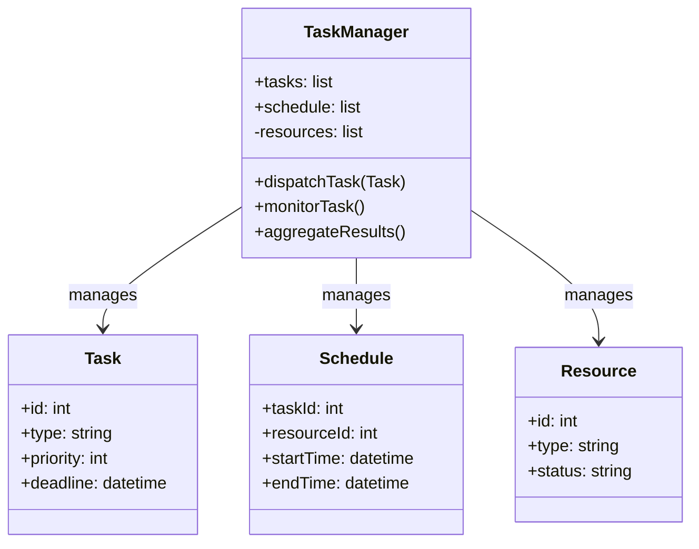

                 


# AI Agent的多任务并行处理能力开发

## 关键词
AI Agent, 多任务并行处理, 任务调度算法, 资源分配, 系统架构设计, 数学模型, 代码实现

## 摘要
本文深入探讨了AI Agent在多任务并行处理能力开发的关键技术，涵盖背景介绍、核心概念、算法原理、系统架构设计、项目实战及优化建议。通过详细分析多任务并行处理的原理和实现方法，结合实际案例和代码实现，帮助读者理解如何开发高效、可靠的AI Agent系统。

---

# 第一部分: AI Agent的背景与概念

## 第1章: AI Agent的基本概念

### 1.1 AI Agent的定义
AI Agent（人工智能代理）是一种能够感知环境并采取行动以实现目标的智能实体。它可以是一个软件程序、机器人或其他智能系统，具备自主决策和问题解决能力。

### 1.2 AI Agent的核心属性
- **自主性**：能够在没有外部干预的情况下独立运行。
- **反应性**：能够根据环境变化动态调整行为。
- **目标导向性**：具备明确的目标，并采取行动以实现这些目标。
- **学习能力**：能够通过经验改进自身的性能。

### 1.3 AI Agent的类型
AI Agent可以根据多种标准进行分类，常见的分类方式包括：
1. **按智能水平**：
   - **反应式AI Agent**：基于当前感知做出反应，不具备长期记忆。
   - **认知式AI Agent**：具备复杂推理和规划能力，能够处理复杂任务。
2. **按任务类型**：
   - **专用AI Agent**：专注于特定任务。
   - **通用AI Agent**：能够处理多种任务。

### 1.4 多任务并行处理的背景与意义
随着AI技术的快速发展，AI Agent需要处理的任务日益复杂。多任务并行处理能力的开发，使得AI Agent能够同时执行多个任务，提高了效率和响应速度，适用于实时处理和资源受限的环境。

---

# 第二部分: 多任务并行处理的核心原理

## 第2章: 多任务并行处理的算法原理

### 2.1 多任务学习的基本原理
多任务学习（Multi-Task Learning, MTL）是一种通过共享多个任务之间的共同特征来提高学习效果的方法。其核心思想是，多个任务之间存在某种关联性，可以利用这种关联性来提升模型的泛化能力。

#### 2.1.1 多任务学习的数学模型
多任务学习的损失函数可以表示为多个任务损失的加权和：
$$ L = \lambda_1 L_1 + \lambda_2 L_2 + \dots + \lambda_n L_n $$
其中，$\lambda_i$是任务$i$的权重系数。

#### 2.1.2 参数共享机制
在多任务学习中，模型参数会被多个任务共享，以减少参数数量并提高学习效率。例如，可以共享全连接层的权重，但每个任务有自己的输出层。

### 2.2 并行处理算法的选择
在多任务并行处理中，选择合适的并行算法至关重要。常见的并行处理算法包括：
1. **多线程处理**：适用于任务之间没有依赖关系的情况。
2. **多进程处理**：适用于任务之间需要共享资源的情况。
3. **分布式处理**：适用于任务量非常大的情况，可以通过分布式计算框架（如MPI、OpenMP等）来实现。

### 2.3 任务调度算法的实现
任务调度算法是多任务并行处理的核心，其目的是合理分配任务到不同的计算资源上，以最大化资源利用率和任务执行效率。

#### 2.3.1 基于优先级的任务调度算法
优先级调度是一种常见的任务调度算法，根据任务的优先级进行调度。优先级可以基于任务的重要性、截止时间、资源需求等因素来确定。

#### 2.3.2 基于负载均衡的任务调度算法
负载均衡调度算法旨在均匀分配任务到不同的计算资源上，以避免某些资源过载而其他资源空闲的情况。常见的负载均衡算法包括轮转调度、随机调度和最少负载调度。

---

# 第三部分: 系统分析与架构设计

## 第3章: 系统分析与架构设计

### 3.1 问题场景介绍
在实际应用中，AI Agent需要处理的任务可能包括图像识别、语音识别、自然语言处理等多种任务。这些任务可能需要同时执行，并且任务之间可能存在依赖关系。

### 3.2 系统功能需求
- **任务接收与解析**：能够接收多个任务请求，并对任务进行解析和分类。
- **任务调度与分配**：根据任务的优先级和资源情况，合理分配任务到不同的计算资源上。
- **任务执行与监控**：能够执行任务，并对任务执行情况进行实时监控。
- **结果汇总与反馈**：能够汇总任务执行结果，并向用户反馈结果。

### 3.3 系统架构设计
#### 3.3.1 领域模型


#### 3.3.2 系统架构设计图


#### 3.3.3 接口设计
- **任务管理接口**：
  - `dispatchTask(Task task)`
  - `monitorTask(int taskId)`
  - `aggregateResults()`
- **资源管理接口**：
  - `allocateResource(Task task)`
  - `releaseResource(Task task)`

---

# 第四部分: 项目实战与优化

## 第4章: 项目实战

### 4.1 环境安装与配置
#### 4.1.1 安装Python
```bash
# 安装Python 3.8及以上版本
sudo apt-get update
sudo apt-get install python3.8
```

#### 4.1.2 安装依赖库
```bash
pip install numpy
pip install scikit-learn
pip install tensorflow
```

### 4.2 核心代码实现
#### 4.2.1 多任务并行处理的实现
```python
import concurrent.futures

def process_task(task_id, task_type):
    # 处理单个任务的逻辑
    print(f"Processing task {task_id} of type {task_type}")
    return f"Result of task {task_id}"

def main():
    tasks = [
        {'id': 1, 'type': 'image_recognition'},
        {'id': 2, 'type': 'speech_recognition'},
        {'id': 3, 'type': 'nlp'}
    ]
    
    with concurrent.futures.ThreadPoolExecutor() as executor:
        futures = {task['id']: executor.submit(process_task, task['id'], task['type']) for task in tasks}
        for task_id, future in futures.items():
            print(f"Task {task_id} completed: {future.result()}")
            
if __name__ == "__main__":
    main()
```

#### 4.2.2 任务调度算法的实现
```python
import heapq

class TaskScheduler:
    def __init__(self):
        self.tasks = []
        self.heap = []

    def add_task(self, task):
        heapq.heappush(self.heap, (task['priority'], task))

    def dispatch_task(self):
        while self.heap:
            priority, task = heapq.heappop(self.heap)
            self.execute_task(task)

    def execute_task(self, task):
        # 执行任务的逻辑
        print(f"Executing task {task['id']}")
```

### 4.3 项目小结
通过上述代码实现，我们可以看到AI Agent的多任务并行处理能力可以通过多线程或分布式计算来实现。任务调度算法的实现决定了任务的执行顺序和资源利用率，是整个系统的核心部分。

---

# 第五部分: 优化与调优

## 第5章: 优化与调优

### 5.1 优化策略
1. **资源分配优化**：根据任务的资源需求动态分配资源。
2. **负载均衡优化**：通过负载均衡算法确保资源的充分利用。
3. **任务调度优化**：根据任务的优先级和截止时间动态调整调度策略。

### 5.2 调优方法
1. **监控任务执行情况**：实时监控任务的执行状态，及时发现和处理异常。
2. **调整任务优先级**：根据任务的重要性和紧急程度动态调整优先级。
3. **优化资源分配策略**：根据任务的资源需求和系统资源情况动态调整资源分配。

---

# 第六部分: 安全与伦理

## 第6章: 安全与伦理

### 6.1 安全问题
- **数据泄露**：确保任务数据的安全性，防止数据泄露。
- **任务干扰**：防止恶意任务干扰正常任务的执行。

### 6.2 伦理问题
- **任务优先级的伦理考量**：在多任务并行处理中，任务的优先级可能涉及到伦理问题，例如在医疗领域，任务优先级可能关系到患者的生命安全。
- **资源分配的公平性**：确保资源分配的公平性，避免资源被滥用或分配不公。

---

# 附录

## 附录A: 术语表

- **AI Agent**：人工智能代理，能够感知环境并采取行动以实现目标的智能实体。
- **多任务并行处理**：同时处理多个任务的能力，能够提高效率和响应速度。
- **任务调度算法**：用于合理分配任务到不同的计算资源上的算法。

## 附录B: 参考文献
1. Russell, S., & Norvig, P. (2010). Artificial Intelligence: A Modern Approach.
2. Goodfellow, I., Bengio, Y., & Courville, A. (2016). Deep Learning.

---

# 结语

AI Agent的多任务并行处理能力开发是一项复杂而重要的任务，需要结合算法原理、系统架构设计和实际项目经验。通过本文的探讨，我们可以更好地理解AI Agent的多任务并行处理能力，并为实际应用提供参考。

---

作者：AI天才研究院/AI Genius Institute & 禅与计算机程序设计艺术 /Zen And The Art of Computer Programming

