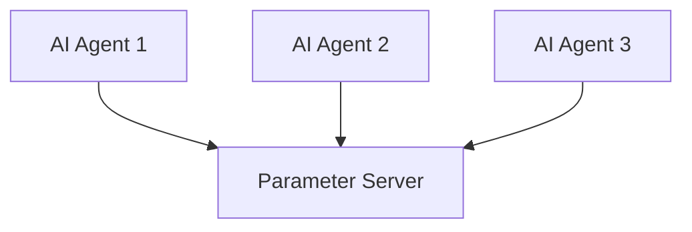
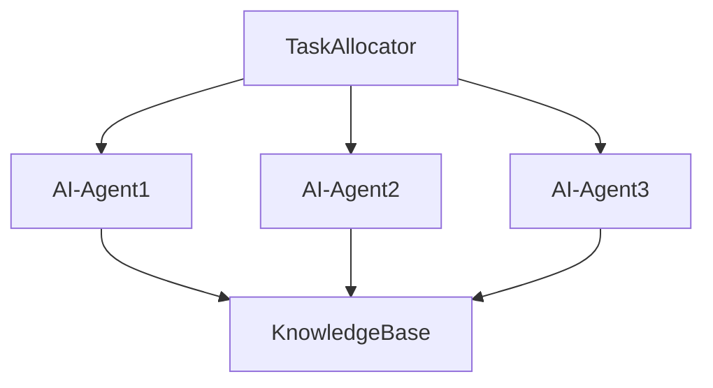
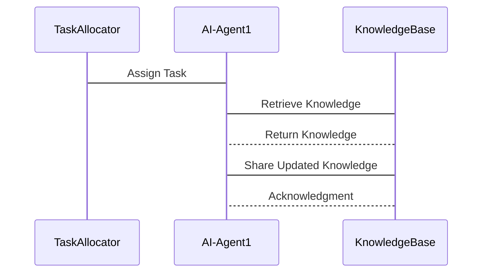

                 


# 《AI Agent的多任务并行学习与知识共享》

> **关键词**：AI Agent、多任务学习、并行计算、知识共享、协作学习、分布式系统

> **摘要**：  
本文深入探讨了AI Agent在多任务并行学习与知识共享领域的核心原理、实现方法和实际应用。从AI Agent的基本概念出发，详细分析了多任务并行学习的理论基础、算法优化策略，以及知识共享的机制与协作学习的实现方法。通过结合数学模型、系统架构设计和实际项目案例，本文为读者提供了一套全面理解和应用AI Agent多任务并行学习与知识共享的系统性方法。

---

## 第三部分: 知识共享与协作学习

### # 第3章: 知识共享的机制与实现

#### ## 3.1 知识共享的核心机制

##### ### 3.1.1 知识表示与编码
###### - **符号表示**：使用符号逻辑（如谓词逻辑）表示知识，例如将“狗是一种动物”表示为`dog(x) → animal(x)`。
###### - **语义表示**：通过语义网络或向量表示知识，例如使用Word2Vec将词语映射为向量。
###### - **知识图谱**：构建结构化的知识图谱，如图中的节点表示实体，边表示关系。

##### ### 3.1.2 知识共享协议
###### - **发布-订阅模型**：AI Agent通过发布知识片段，其他Agent通过订阅主题获取知识。
###### - **点对点通信**：直接通过端到端通信共享知识，适用于小型网络。
###### - **分布式共享**：通过分布式系统（如分布式文件系统）存储和共享知识，适用于大规模网络。

##### ### 3.1.3 知识冲突的解决
###### - **协商机制**：通过协商解决知识冲突，例如通过投票或协商算法达成一致。
###### - **版本控制**：记录知识的版本，解决冲突后保留历史版本以备追溯。
###### - **冲突检测与修复**：通过冲突检测算法（如一致性检查）自动修复知识冲突。

#### ## 3.2 知识共享的实现步骤

##### ### 3.2.1 知识编码与表示
###### - 使用符号逻辑或向量表示知识。
###### - 示例：将“猫是动物”编码为`cat(x) → animal(x)`，并将其表示为向量形式。

##### ### 3.2.2 知识共享协议设计
###### - 设计发布-订阅接口，定义消息格式和通信协议。
###### - 示例：使用MQTT协议实现轻量级通信。

##### ### 3.2.3 知识存储与检索
###### - 使用分布式数据库（如MongoDB）存储知识。
###### - 示例：将知识存储为JSON格式，支持关键词检索。

#### ## 3.3 知识共享的优化策略

##### ### 3.3.1 知识压缩与加密
###### - 压缩知识表示，减少传输数据量。
###### - 加密知识数据，确保共享安全。

##### ### 3.3.2 并行化知识共享
###### - 使用多线程或分布式方法并行共享知识。
###### - 示例：使用Raft一致性算法实现分布式知识共享。

#### ## 3.4 本章小结

---

### # 第4章: 协作学习的实现与优化

#### ## 4.1 协作学习的核心策略

##### ### 4.1.1 联邦学习（Federated Learning）
###### - 定义：多个AI Agent在本地数据上训练模型，通过共享参数更新进行协作。
###### - 优点：保护数据隐私，避免数据集中化。
###### - 示例：在移动设备上训练模型，通过蜂窝网络进行参数同步。

##### ### 4.1.2 参数服务器架构
###### - 定义：多个AI Agent作为工作者（worker）节点，参数服务器（parameter server）集中管理模型参数。
###### - 优点：高效同步，易于扩展。
###### - 示例：使用Google的Parameter Server架构实现大规模模型训练。

##### ### 4.1.3 异步更新与同步机制
###### - 异步更新：AI Agent独立更新参数，不阻塞其他任务。
###### - 同步机制：周期性同步所有AI Agent的参数，确保一致性。

#### ## 4.2 协作学习的实现步骤

##### ### 4.2.1 系统架构设计
###### - 使用分布式系统架构，例如：


##### ### 4.2.2 通信协议设计
###### - 使用gRPC或HTTP/2实现高效的通信。
###### - 示例：定义`/update_parameters`接口，用于参数更新。

##### ### 4.2.3 模型训练与同步
###### - 在本地训练模型，通过API同步参数到参数服务器。
###### - 示例：使用Python实现本地训练：
```python
import requests

def update_parameters(parameters):
    response = requests.post('http://localhost:8080/update_parameters', json=parameters)
    return response.json()
```

#### ## 4.3 协作学习的优化策略

##### ### 4.3.1 异步优化
###### - 使用异步梯度下降（Asynchronous Gradient Descent）加快训练速度。
###### - 示例：在参数服务器中异步更新参数。

##### ### 4.3.2 并行优化
###### - 使用并行计算框架（如MPI、OpenMP）加速训练。
###### - 示例：使用多线程优化本地训练过程。

##### ### 4.3.3 模型压缩与剪枝
###### - 压缩模型大小，减少通信开销。
###### - 示例：使用剪枝技术移除不重要的神经网络节点。

#### ## 4.4 本章小结

---

### # 第5章: 系统实现与优化

#### ## 5.1 系统架构设计

##### ### 5.1.1 系统功能模块
###### - **任务分配模块**：负责分配多任务给不同的AI Agent。
###### - **学习引擎模块**：执行并行学习和参数更新。
###### - **知识库模块**：存储和管理共享知识。
###### - **通信模块**：实现AI Agent之间的通信与数据交换。

##### ### 5.1.2 系统架构图


#### ## 5.2 接口设计与实现

##### ### 5.2.1 接口设计
###### - **任务分配接口**：`/assign_task`
###### - **知识共享接口**：`/share_knowledge`
###### - **模型同步接口**：`/sync_model`

##### ### 5.2.2 接口实现
###### - 使用RESTful API实现接口。
###### - 示例：使用Flask框架实现`/assign_task`接口：
```python
from flask import Flask, jsonify

app = Flask(__name__)

@app.route('/assign_task', methods=['POST'])
def assign_task():
    data = request.json
    return jsonify({'status': 'success', 'message': 'Task assigned successfully'})
```

#### ## 5.3 交互流程图

##### ### 5.3.1 交互流程


#### ## 5.4 系统优化

##### ### 5.4.1 并行化优化
###### - 使用多线程或分布式系统加速任务处理。
###### - 示例：使用Celery实现分布式任务队列。

##### ### 5.4.2 知识共享优化
###### - 使用高效的通信协议（如WebSocket）实现实时知识共享。
###### - 示例：使用WebSocket进行实时通信：
```python
import websockets
import asyncio

async def share_knowledge():
    async with websockets.connect('ws://localhost:8080') as websocket:
        await websocket.send('knowledge')
        response = await websocket.recv()
        print(response)
```

#### ## 5.5 本章小结

---

## 第六部分: 项目实战与最佳实践

### # 第6章: 项目实战

#### ## 6.1 项目背景与目标
##### - 项目背景：设计一个多任务并行学习的AI Agent系统，实现知识共享与协作学习。
##### - 项目目标：提高AI Agent的任务处理效率，优化知识共享机制。

#### ## 6.2 项目环境与工具
##### - 开发环境：Python 3.9、Ubuntu 20.04
##### - 开发工具：PyCharm、Jupyter Notebook
##### - 依赖库：Flask、requests、mermaid、numpy

#### ## 6.3 核心代码实现

##### ### 6.3.1 任务分配模块
```python
import requests

def assign_task(task_id):
    response = requests.post('http://localhost:8080/assign_task', json={'task_id': task_id})
    return response.json()
```

##### ### 6.3.2 知识共享模块
```python
import websockets
import asyncio

async def share_knowledge(knowledge):
    async with websockets.connect('ws://localhost:8080') as websocket:
        await websocket.send(knowledge)
        response = await websocket.recv()
        return response
```

##### ### 6.3.3 模型同步模块
```python
def sync_model(parameters):
    response = requests.post('http://localhost:8080/sync_model', json=parameters)
    return response.json()
```

#### ## 6.4 测试与优化

##### ### 6.4.1 功能测试
###### - 测试任务分配功能。
###### - 测试知识共享功能。
###### - 测试模型同步功能。

##### ### 6.4.2 性能优化
###### - 优化通信延迟。
###### - 优化知识共享效率。
###### - 优化模型训练速度。

#### ## 6.5 项目总结
##### - 项目成果：实现了一个高效的多任务并行学习与知识共享系统。
##### - 经验总结：并行计算和分布式系统是提升性能的关键，知识共享机制的设计需要充分考虑安全性和效率。

### # 第7章: 最佳实践与未来展望

#### ## 7.1 最佳实践

##### ### 7.1.1 系统设计
###### - 使用模块化设计，便于扩展和维护。
###### - 使用分布式系统架构，提升性能和可靠性。

##### ### 7.1.2 开发实践
###### - 使用版本控制工具（如Git）管理代码。
###### - 使用CI/CD流程自动化测试和部署。

##### ### 7.1.3 运维实践
###### - 使用监控工具（如Prometheus）监控系统性能。
###### - 使用日志管理工具（如ELK）分析系统日志。

#### ## 7.2 未来展望

##### ### 7.2.1 技术发展
###### - 更高效的知识共享算法。
###### - 更智能的协作学习策略。
###### - 更强大的分布式计算框架。

##### ### 7.2.2 应用场景
###### - 更多领域（如医疗、金融）的应用。
###### - 更复杂的任务协作。
###### - 更智能化的知识共享。

#### ## 7.3 总结
##### - 通过本文的探讨，AI Agent的多任务并行学习与知识共享技术将推动人工智能系统向更高效、更智能的方向发展。

---

**作者：AI天才研究院/AI Genius Institute & 禅与计算机程序设计艺术 /Zen And The Art of Computer Programming**

