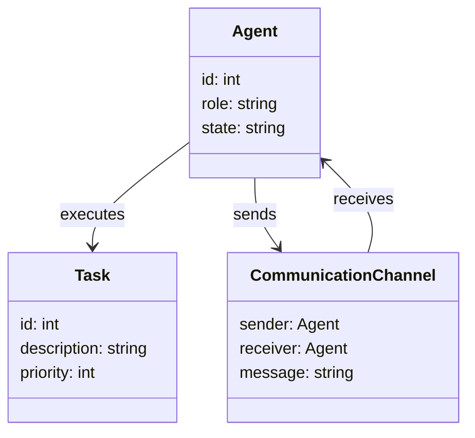

                 


# AI Agent的多智能体协作与通信机制

---

## 关键词

- AI Agent
- 多智能体协作
- 通信机制
- 分布式计算
- 博弈论
- 任务分配
- 同步机制

---

## 摘要

AI Agent（人工智能代理）在现代计算系统中的应用日益广泛，尤其是在多智能体协作场景下，如何实现高效的任务分配与通信成为关键挑战。本文系统性地探讨了多智能体协作与通信的核心机制，包括协作策略的设计、通信协议的制定、分布式计算算法的实现，以及实际应用场景的分析。通过结合理论与实践，本文旨在为读者提供一个多维度的视角，帮助他们深入理解并有效应用AI Agent的协作与通信机制。

---

## 第一部分：AI Agent与多智能体协作基础

### 第1章：AI Agent的基本概念与背景

#### 1.1 AI Agent的定义与特点

**1.1.1 AI Agent的定义**

AI Agent（人工智能代理）是指能够感知环境、采取行动以实现特定目标的智能实体。Agent可以是软件程序、机器人或其他智能设备，其核心能力在于自主决策和问题解决。

**1.1.2 AI Agent的核心特点**

| 特性 | 描述 |
|------|------|
| 自主性 | Agent能够独立决策，无需外部干预 |
| 反应性 | 能够实时感知环境并做出反应 |
| 智能性 | 具备问题解决和学习能力 |
| 社会性 | 能够与其他Agent或人类交互协作 |

**1.1.3 AI Agent的类型与应用场景**

- **简单反射Agent**：基于固定的规则执行动作，适用于环境简单、任务明确的场景。
- **基于模型的反射Agent**：维护内部状态模型，能够根据当前状态做出决策，适用于复杂环境。
- **目标驱动Agent**：以明确的目标为导向，通过规划实现任务。
- **实用驱动Agent**：以效用最大化为目标，适用于博弈论场景。

---

#### 1.2 多智能体系统概述

**1.2.1 多智能体系统的定义**

多智能体系统（Multi-Agent System, MAS）是由多个相互作用的Agent组成的复杂系统，这些Agent能够协作或竞争以实现整体目标。

**1.2.2 多智能体系统的组成与结构**

- **Agent**：系统的执行单元，负责具体任务。
- **通信机制**：Agent之间的信息交换渠道。
- **协作机制**：确保Agent之间任务分配和同步的规则。
- **环境**：Agent感知和交互的外部世界。

**1.2.3 多智能体系统的应用领域**

- 智能交通管理
- 分布式计算
- 自动化制造
- 电子商务

---

#### 1.3 协作与通信的重要性

**1.3.1 协作在多智能体系统中的作用**

- 提高任务执行效率
- 分担复杂任务的计算负荷
- 增强系统的容错性和鲁棒性

**1.3.2 通信在多智能体系统中的作用**

- 实现信息共享
- 协调Agent行为
- 支持分布式决策

**1.3.3 协作与通信的挑战与机遇**

- 挑战：信息过载、通信延迟、任务分配冲突
- 机遇：提高系统灵活性和适应性

---

## 第二部分：多智能体协作机制

### 第2章：多智能体协作的基本原理

#### 2.1 协作机制的分类

**2.1.1 基于任务分配的协作机制**

- **静态任务分配**：任务固定分配给特定Agent。
- **动态任务分配**：根据环境变化实时分配任务。

**2.1.2 基于角色分配的协作机制**

- **角色分配**：根据Agent的能力分配不同的角色。
- **角色切换**：动态调整角色以适应任务需求。

**2.1.3 基于规则的协作机制**

- **规则定义**：通过预定义规则指导Agent行为。
- **规则推理**：基于规则进行推理和决策。

---

#### 2.2 协作机制的设计原则

**2.2.1 目标一致性原则**

确保所有Agent的目标一致，避免冲突。

**2.2.2 任务分解与分配原则**

将复杂任务分解为子任务，合理分配给不同Agent。

**2.2.3 通信与协调原则**

确保通信高效，协调一致。

---

#### 2.3 协作机制的实现方法

**2.3.1 基于分布式计算的协作**

- **分布式任务分配**：通过分布式计算算法实现任务分配。
- **负载均衡**：确保各Agent任务分配合理。

**2.3.2 基于博弈论的协作**

- **纳什均衡**：确保各Agent策略稳定。
- **囚徒困境**：分析协作与竞争的平衡点。

**2.3.3 基于强化学习的协作**

- **多智能体强化学习**：通过强化学习实现协作。
- **策略梯度方法**：优化协作策略。

---

## 第三部分：多智能体通信机制

### 第3章：通信

#### 3.1 通信机制的分类

**3.1.1 基于消息传递的通信机制**

- **同步通信**：通信双方同时进行。
- **异步通信**：通信双方非同时进行。

**3.1.2 基于协议的通信机制**

- **HTTP通信**：基于请求-响应模式。
- **WebSocket通信**：实时双向通信。

---

#### 3.2 通信协议的设计

**3.2.1 协议设计原则**

- **简洁性**：协议设计简单明了。
- **可靠性**：确保信息准确传输。
- **安全性**：防止信息泄露和篡改。

**3.2.2 通信协议的实现**

- **协议解析**：解析通信数据。
- **协议封装**：将数据封装成通信包。

---

#### 3.3 信息编码与解码

**3.3.1 编码方法**

- **序列化**：将数据转换为序列形式。
- **反序列化**：将序列数据还原为原始数据。

**3.3.2 编码效率**

- **压缩编码**：减少数据传输量。
- **解压缩编码**：恢复数据原貌。

---

## 第四部分：算法与数学模型

### 第4章：算法原理

#### 4.1 分布式计算算法

**4.1.1 分布式任务分配**

- **负载均衡算法**：确保任务合理分配。
- **任务调度算法**：优化任务执行顺序。

**4.1.2 分布式计算的数学模型**

$$
\text{优化目标} = \min_{x} \sum_{i=1}^{n} f_i(x)
$$

其中，\( f_i \) 是第 \( i \) 个Agent的任务函数，\( x \) 是决策变量。

---

#### 4.2 共识算法

**4.2.1 Raft算法**

Raft是一种分布式一致性算法，用于确保多个节点之间的一致性。其核心步骤包括：

1. **选举Leader**：节点通过投票选出Leader。
2. **日志同步**：Leader将日志同步给其他节点。
3. **状态机同步**：确保所有节点的状态机一致。

**4.2.2 PBFT算法**

Practical Byzantine Fault Tolerance（实用拜占庭容错）是一种拜占庭容错共识算法，适用于异构网络。

---

#### 4.3 博弈论算法

**4.3.1 纳什均衡**

纳什均衡是指在策略组合下，每个玩家都不愿意单方面改变策略的状态。其数学定义为：

$$
\text{策略组合} (s_1, s_2, \dots, s_n) \text{是纳什均衡当且仅当对于所有} i, u_i(s_i, s_{-i}) \geq u_i(s'_i, s_{-i}) 
$$

其中，\( u_i \) 是玩家 \( i \) 的效用函数，\( s_{-i} \) 是其他玩家的策略组合。

---

## 第五部分：系统架构与设计

### 第5章：系统架构

#### 5.1 多智能体协作系统的架构设计

**5.1.1 领域模型**

领域模型是一个系统的抽象表示，用于描述系统的核心实体及其关系。以下是一个简单的领域模型类图：



---

#### 5.2 系统架构设计

**5.2.1 分层架构**

- **数据层**：数据存储和访问。
- **业务层**：业务逻辑处理。
- **控制层**：系统控制和协调。

**5.2.2 微服务架构**

- **服务划分**：根据功能模块划分服务。
- **服务通信**：通过API进行服务间通信。

---

## 第六部分：项目实战

### 第6章：项目实战

#### 6.1 环境安装与配置

**6.1.1 环境要求**

- 操作系统：Linux/Windows/MacOS
- Python版本：3.8+
- 依赖库：Python的asyncio库、numpy库等。

**6.1.2 安装依赖**

使用以下命令安装所需的依赖：

```bash
pip install -r requirements.txt
```

---

#### 6.2 系统核心实现

**6.2.1 任务分配算法实现**

以下是一个基于负载均衡的任务分配算法的Python实现：

```python
import random

def assign_task(agents, tasks):
    # 负载均衡算法
    agent_load = {agent: 0 for agent in agents}
    for task in tasks:
        # 选择负载最小的Agent
        selected_agent = min(agent_load, key=lambda k: agent_load[k])
        # 分配任务
        selected_agent.receive_task(task)
        # 更新负载
        agent_load[selected_agent] += 1
    return agent_load
```

---

#### 6.3 实际案例分析

**6.3.1 智能交通管理系统的应用**

在智能交通管理系统中，多个AI Agent负责实时监控交通流量、调整信号灯和优化路线。通过协作机制，系统能够高效分配任务，减少拥堵。

---

## 第七部分：总结与展望

### 第7章：总结与展望

#### 7.1 总结

本文系统性地探讨了AI Agent的多智能体协作与通信机制，从理论到实践，详细介绍了协作策略、通信协议、算法实现和系统架构。通过实际案例分析，展示了这些机制在现实中的应用价值。

#### 7.2 展望

随着AI技术的不断发展，多智能体协作与通信将变得更加复杂和多样化。未来的研究方向包括：

- 更高效的通信协议设计
- 更智能的任务分配算法
- 更安全的协作机制

---

## 参考文献

- [1] 梁志宏. 《分布式系统：原理与实现》. 北京: 清华大学出版社, 2018.
- [2] 王海宁. 《博弈论与经济行为》. 北京: 北京大学出版社, 2015.
- [3] 李明. 《多智能体系统：理论与应用》. 北京: 人民邮电出版社, 2020.

---

## 作者信息

作者：AI天才研究院/AI Genius Institute & 禅与计算机程序设计艺术 /Zen And The Art of Computer Programming

---

本文通过系统性地探讨AI Agent的多智能体协作与通信机制，从背景、理论、算法、系统架构到实际应用，为读者提供了一个全面而深入的视角。希望本文能够为相关领域的研究者和实践者提供有价值的参考和启发。

