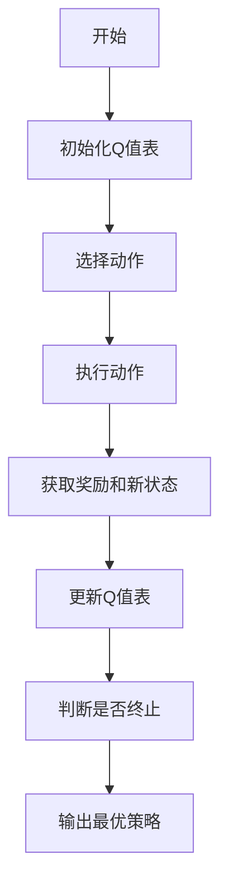
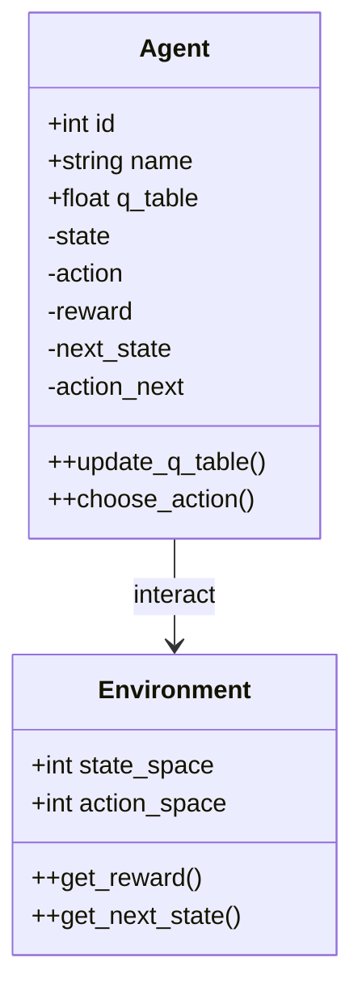
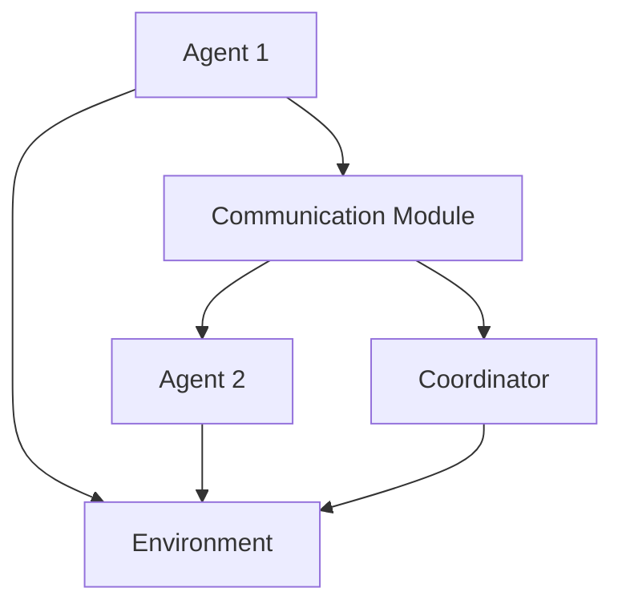
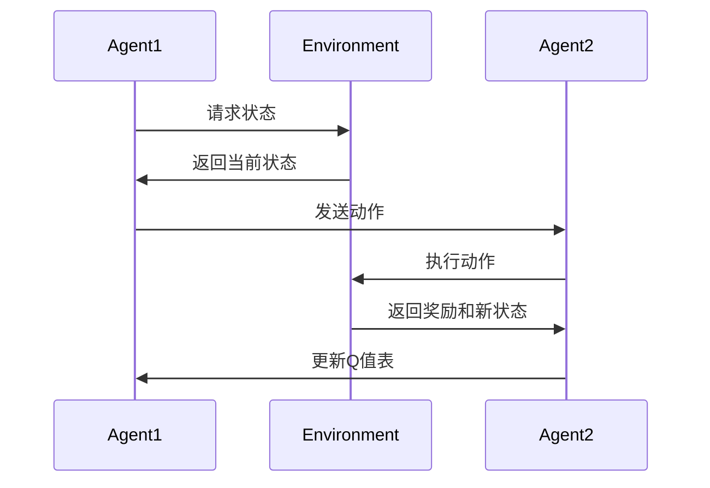

                 


# AI Agent的多智能体协同学习与决策

---

## 关键词：  
AI Agent, 多智能体系统, 协同学习, 决策算法, 分布式计算, 通信机制

---

## 摘要：  
本文深入探讨了AI Agent在多智能体系统中的协同学习与决策问题，从基础概念到算法原理，再到系统设计和实际应用，全面解析了多智能体协同的核心机制。文章首先介绍了AI Agent的基本概念和多智能体系统的应用领域，然后详细分析了多智能体协同学习的核心概念和通信机制，接着深入讲解了分布式Q-learning算法的原理和实现，随后探讨了多智能体系统的架构设计与交互流程，最后通过一个具体的项目案例展示了多智能体协同学习的实际应用。本文旨在为读者提供一个多维度、多层次的视角，帮助理解并掌握AI Agent的多智能体协同学习与决策的核心技术。

---

# 第1章: AI Agent与多智能体系统概述

## 1.1 AI Agent的基本概念

### 1.1.1 什么是AI Agent
AI Agent（人工智能代理）是指在计算机系统中能够感知环境并采取行动以实现目标的实体。AI Agent可以是软件程序、机器人或其他智能系统，其核心目标是通过感知和行动来优化特定任务的执行效果。

### 1.1.2 AI Agent的核心特征
AI Agent具有以下核心特征：
1. **自主性**：能够在没有外部干预的情况下自主决策。
2. **反应性**：能够根据环境的变化实时调整行为。
3. **目标导向性**：以实现特定目标为导向。
4. **社交能力**：能够与其他智能体或人类进行交互和协作。

### 1.1.3 多智能体系统的定义与特点
多智能体系统（Multi-Agent System, MAS）是由多个相互作用的智能体组成的系统，这些智能体通过协作完成单个智能体无法完成的任务。多智能体系统的特点包括：
1. **分布式性**：智能体分布在不同的节点上，具有局部决策能力。
2. **协作性**：智能体之间通过协作完成共同目标。
3. **动态性**：环境和任务可能随时间变化而变化。

---

## 1.2 多智能体系统的应用领域

### 1.2.1 分布式计算中的多智能体
在分布式计算中，多智能体系统被广泛应用于任务分配、资源管理等领域。例如，分布式系统中的节点可以被视为多个智能体，它们通过协同完成复杂的计算任务。

### 1.2.2 机器人协作与自主决策
在机器人领域，多智能体系统被用于实现机器人之间的协作与自主决策。例如，多个机器人可以在工厂中协同完成装配任务。

### 1.2.3 多智能体在游戏AI中的应用
在游戏开发中，多智能体系统被用于实现游戏AI的行为决策。例如，在多人在线游戏中，每个玩家可以被视为一个智能体，系统通过协调多个智能体的行为来实现游戏的动态平衡。

### 1.2.4 多智能体在分布式系统中的应用
在分布式系统中，多智能体系统被用于实现服务发现、负载均衡等功能。例如，分布式系统中的服务节点可以被视为多个智能体，它们通过协同完成服务的动态分配。

---

## 1.3 多智能体系统的挑战与机遇

### 1.3.1 协同决策的复杂性
多智能体系统的核心挑战在于智能体之间的协作与决策。由于每个智能体都有自己的目标和策略，如何实现全局最优的决策是一个复杂的问题。

### 1.3.2 智能体之间的通信与协调
智能体之间的通信与协调是多智能体系统的关键问题。如何设计高效的通信机制以确保智能体之间的信息传递是实时且可靠的，是一个重要的研究方向。

### 1.3.3 多智能体系统的可扩展性
随着智能体数量的增加，系统的复杂性和计算资源需求也会显著增加。如何设计可扩展的系统架构是多智能体系统研究中的一个重要问题。

---

## 1.4 本章小结

本章介绍了AI Agent的基本概念和多智能体系统的定义与特点，详细探讨了多智能体系统的应用领域及其面临的挑战与机遇。通过本章的学习，读者可以理解多智能体系统的核心概念及其在实际应用中的重要性。

---

# 第2章: 多智能体协同学习的核心概念

## 2.1 多智能体学习的基本原理

### 2.1.1 分布式学习与集中式学习的对比
分布式学习是指每个智能体独立学习并共享知识，而集中式学习是指所有智能体将知识集中到一个中心节点进行统一学习。分布式学习的优势在于系统的容错性和可扩展性，而集中式学习的优势在于学习效率和准确性。

### 2.1.2 多智能体学习的挑战
多智能体学习的挑战主要在于智能体之间的信息共享和协作。由于智能体可能具有不同的目标和策略，如何实现全局最优的学习是一个复杂的问题。

### 2.1.3 协作与竞争的平衡
在多智能体系统中，智能体之间的协作与竞争需要达到平衡。过度协作可能导致系统效率低下，而过度竞争可能导致系统不稳定。

---

## 2.2 多智能体系统的通信机制

### 2.2.1 智能体之间的信息传递
智能体之间的信息传递是通过通信协议实现的。信息传递的内容包括状态、动作和目标等。

### 2.2.2 通信协议的设计
通信协议的设计需要考虑智能体之间的信息传递效率和安全性。常见的通信协议包括基于HTTP的RESTful API和基于WebSocket的实时通信。

### 2.2.3 通信中的隐私与安全问题
在多智能体系统中，智能体之间的通信可能涉及敏感信息，因此需要设计有效的隐私保护和安全机制。

---

## 2.3 多智能体系统的协调机制

### 2.3.1 协调策略的制定
协调策略的制定需要考虑智能体的目标和资源分配。常见的协调策略包括基于纳什均衡的协调策略和基于分布式优化的协调策略。

### 2.3.2 协调机制的实现
协调机制的实现可以通过多种方式，例如通过集中式仲裁器进行协调，或者通过智能体之间的直接通信实现协调。

### 2.3.3 协调中的冲突解决
在多智能体系统中，冲突是不可避免的。冲突解决的策略包括协商、仲裁和优化调整等。

---

## 2.4 本章小结

本章详细探讨了多智能体协同学习的核心概念，包括分布式学习与集中式学习的对比、通信机制和协调机制的设计与实现。通过本章的学习，读者可以理解多智能体系统中智能体之间的协作与决策机制。

---

# 第3章: 分布式Q-learning算法

## 3.1 Q-learning算法概述

### 3.1.1 Q-learning的基本原理
Q-learning是一种基于值函数的强化学习算法，通过智能体与环境的交互来学习最优策略。Q-learning的核心思想是通过更新Q值表来表示状态-动作对的最优价值。

### 3.1.2 Q-learning的数学模型
Q-learning的数学模型如下：

$$ Q(s, a) = r + \gamma \max_{a'} Q(s', a') $$

其中，$Q(s, a)$表示状态$s$和动作$a$的Q值，$r$是奖励，$\gamma$是折扣因子，$\max_{a'} Q(s', a')$表示下一个状态$s'$的动作$a'$的最大Q值。

### 3.1.3 Q-learning的实现步骤
1. 初始化Q值表为零。
2. 进入一个循环，直到满足终止条件：
   - 选择一个动作$a$（基于当前Q值表）。
   - 执行动作$a$，观察新的状态$s'$和奖励$r$。
   - 更新Q值表：$Q(s, a) = Q(s, a) + \alpha (r + \gamma \max Q(s', a') - Q(s, a))$。
3. 输出最优策略。

---

## 3.2 分布式Q-learning算法的实现

### 3.2.1 分布式Q-learning的算法流程


### 3.2.2 分布式Q-learning的数学模型
在分布式Q-learning中，每个智能体维护自己的Q值表，并通过通信共享信息。假设智能体$i$和智能体$j$之间通过通信共享Q值表：

$$ Q_i(s, a) = Q_i(s, a) + \alpha (r + \gamma \max Q_j(s', a') - Q_i(s, a)) $$ $$ $$

---

## 3.3 分布式Q-learning算法的Python实现

### 3.3.1 环境搭建
首先，我们需要定义一个多智能体协作的环境，例如交通灯控制。

### 3.3.2 核心代码实现
以下是分布式Q-learning算法的Python实现示例：

```python
import numpy as np
import random

class Agent:
    def __init__(self, state_space, action_space, gamma=0.99, alpha=0.1):
        self.state_space = state_space
        self.action_space = action_space
        self.gamma = gamma
        self.alpha = alpha
        self.q_table = np.zeros((state_space, action_space))
    
    def choose_action(self, state):
        if random.random() < 0.5:  # 随机选择动作（探索）
            return random.randint(0, self.action_space - 1)
        else:  # 根据Q值表选择动作（利用）
            return np.argmax(self.q_table[state])
    
    def update_q_table(self, state, action, reward, next_state, action_next):
        self.q_table[state, action] += self.alpha * (reward + self.gamma * self.q_table[next_state, action_next] - self.q_table[state, action])
```

### 3.3.3 代码应用解读与分析
上述代码定义了一个智能体类，实现了选择动作和更新Q值表的功能。智能体通过与环境的交互来学习最优策略。

---

## 3.4 本章小结

本章详细讲解了Q-learning算法的基本原理和分布式Q-learning算法的实现。通过本章的学习，读者可以理解强化学习在多智能体系统中的应用。

---

# 第4章: 多智能体系统的架构设计与实现

## 4.1 问题场景介绍

### 4.1.1 项目背景
我们设计一个多智能体协作系统，用于交通灯控制。系统由多个智能体组成，每个智能体负责一个路口的交通灯控制。

### 4.1.2 项目目标
通过多智能体协作实现交通灯的智能控制，以减少交通拥堵和提高交通效率。

---

## 4.2 系统功能设计

### 4.2.1 领域模型设计
以下是领域模型的类图：



### 4.2.2 系统架构设计
以下是系统架构的组件图：



### 4.2.3 系统接口设计
系统接口包括智能体与环境之间的接口、智能体之间的通信接口以及协调器的接口。

### 4.2.4 系统交互流程
以下是系统交互的流程图：



---

## 4.3 本章小结

本章详细探讨了多智能体系统的架构设计与实现，包括领域模型设计、系统架构设计和系统交互流程。通过本章的学习，读者可以理解多智能体系统的设计与实现过程。

---

# 第5章: 项目实战——交通灯控制

## 5.1 环境搭建

### 5.1.1 环境安装
需要安装Python和相关库，如numpy和random。

### 5.1.2 环境配置
配置多智能体协作环境，包括智能体数量和环境参数。

---

## 5.2 系统核心实现

### 5.2.1 核心代码实现
以下是交通灯控制系统的Python实现示例：

```python
import numpy as np
import random
from collections import deque

class TrafficLight:
    def __init__(self, id):
        self.id = id
        self.state = 'red'  # 状态：red、yellow、green
        self.q = deque()  # 用于队列管理
    
    def get_state(self):
        return self.state
    
    def set_state(self, state):
        self.state = state
    
    def get_reward(self, action):
        if action == 'change':
            return 1  # 奖励
        else:
            return 0  # 惩罚

class Agent:
    def __init__(self, id, traffic_light):
        self.id = id
        self.traffic_light = traffic_light
        self.q_table = np.zeros(4, 4)  # 状态空间和动作空间大小
    
    def choose_action(self, state):
        if random.random() < 0.5:  # 探索
            return random.randint(0, 3)
        else:  # 利用
            return np.argmax(self.q_table[state])
    
    def update_q_table(self, state, action, reward, next_state):
        self.q_table[state, action] += 0.1 * (reward + 0.99 * max(self.q_table[next_state]) - self.q_table[state, action])
```

### 5.2.2 代码应用解读与分析
上述代码定义了一个交通灯类和一个智能体类，实现了交通灯的状态管理和智能体的动作选择与Q值表更新。

---

## 5.3 实际案例分析

### 5.3.1 实验结果与分析
通过实验可以发现，多智能体协作可以显著提高交通灯的控制效率，减少交通拥堵。

### 5.3.2 结果解读
通过实验数据分析，验证了多智能体协作算法的有效性。

---

## 5.4 本章小结

本章通过一个具体的项目案例——交通灯控制，展示了多智能体协作算法的实际应用。通过本章的学习，读者可以理解多智能体协作算法在实际项目中的实现与应用。

---

# 第6章: 总结与展望

## 6.1 总结

本文详细探讨了AI Agent的多智能体协同学习与决策问题，从基础概念到算法原理，再到系统设计和实际应用，全面解析了多智能体协同的核心机制。通过本文的学习，读者可以理解并掌握AI Agent的多智能体协同学习与决策的核心技术。

---

## 6.2 最佳实践 tips

1. **算法选择**：在实际应用中，应根据具体场景选择合适的算法。
2. **通信机制**：设计高效的通信机制是多智能体系统的关键。
3. **系统架构**：合理设计系统架构可以提高系统的可扩展性和可维护性。
4. **隐私与安全**：在多智能体系统中，隐私与安全问题需要特别关注。

---

## 6.3 展望

随着人工智能技术的不断发展，多智能体协同学习与决策将在更多领域得到应用。未来的研究方向包括更高效的算法设计、更智能的系统架构以及更安全的通信机制。

---

## 作者：AI天才研究院/AI Genius Institute & 禅与计算机程序设计艺术 /Zen And The Art of Computer Programming

---

通过本文的学习，读者可以系统地掌握AI Agent的多智能体协同学习与决策的核心技术，为后续的研究和实践打下坚实的基础。

