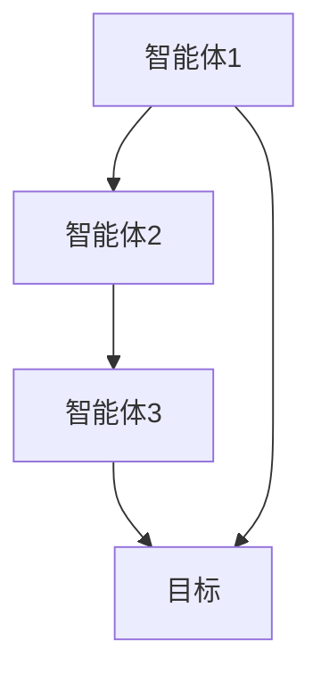
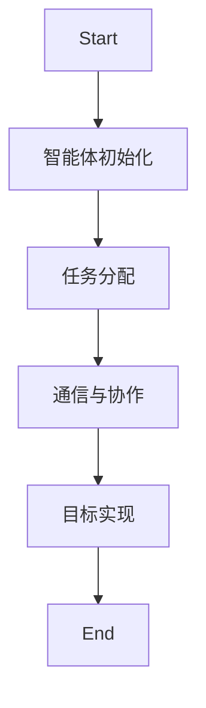
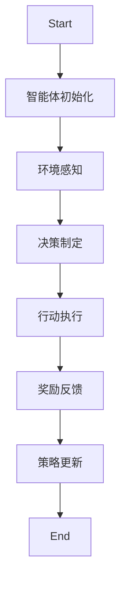
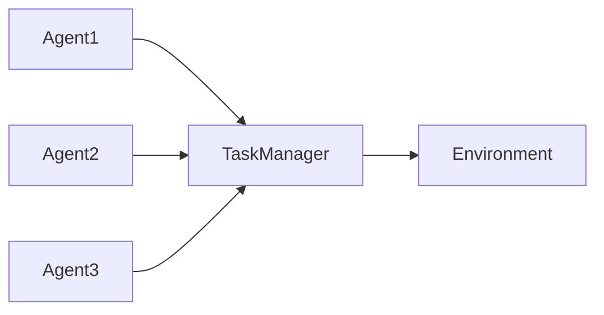

                 


# AI Agent的多智能体协同探索与学习

## 关键词：
AI Agent，多智能体，协同学习，分布式强化学习，系统架构，项目实战

## 摘要：
本文系统地探讨了AI Agent在多智能体协同中的应用，从基础概念到复杂算法，再到实际项目实现，全面分析了多智能体协同的核心原理和实现方法。通过详细讲解分布式强化学习算法、数学模型和系统架构设计，本文为读者提供了从理论到实践的完整指南，帮助读者深入理解并掌握多智能体协同的核心技术。

---

# 第一部分: AI Agent与多智能体协同概述

## 第1章: AI Agent的基本概念

### 1.1 AI Agent的定义
AI Agent（智能体）是指能够感知环境并采取行动以实现目标的实体。它可以是一个软件程序、机器人或其他智能系统。

### 1.2 AI Agent的核心特征
- **自主性**：智能体能够自主决策，无需外部干预。
- **反应性**：能够实时感知环境并做出反应。
- **目标导向性**：所有行动都围绕实现特定目标展开。

### 1.3 多智能体系统的基本概念
多智能体系统（Multi-Agent System, MAS）是由多个智能体组成的系统，这些智能体通过协作完成复杂的任务。

---

## 第2章: 多智能体协同的背景与意义

### 2.1 多智能体系统的起源与发展
多智能体系统的概念起源于分布式计算和人工智能领域，随着技术的进步，其应用范围不断扩大。

### 2.2 多智能体协同的应用场景
- **分布式任务分配**：如物流配送、资源调度。
- **分布式计算**：如云计算、分布式计算任务分配。
- **智能协作**：如自动驾驶、智能家居。

### 2.3 多智能体协同的重要性
通过协作，多个智能体可以完成单个智能体无法完成的任务，提高系统的整体效率和智能性。

---

# 第二部分: 多智能体协同的核心概念与联系

## 第3章: 多智能体系统的构成与关系

### 3.1 多智能体系统的构成要素
- **智能体**：系统的执行单元。
- **环境**：智能体所处的外部环境。
- **通信机制**：智能体之间的信息交换方式。

### 3.2 多智能体系统的通信协议
- **通信协议**：定义了智能体之间信息交换的规则。
- **通信方式**：包括同步和异步通信。

### 3.3 多智能体系统中的任务分配机制
- **任务分配**：将任务分配给合适的智能体。
- **任务分配算法**：如基于角色的分配、基于能力的分配。

---

## 第4章: 多智能体系统的核心概念与联系

### 4.1 多智能体系统的实体关系图


### 4.2 多智能体系统的流程图


---

# 第三部分: 多智能体协同的算法原理

## 第5章: 分布式强化学习算法

### 5.1 分布式强化学习的定义
分布式强化学习（Distributed Reinforcement Learning）是指多个智能体在分布式环境中进行学习的过程。

### 5.2 分布式强化学习的数学模型
$$ V_i(s_i) = \max_{a_i} [r_i + \sum_{j \neq i} V_j(s_j)] $$

### 5.3 分布式强化学习的算法步骤


### 5.4 分布式强化学习的代码实现
```python
class Agent:
    def __init__(self, state_space, action_space):
        self.state_space = state_space
        self.action_space = action_space
        # 初始化策略
        self.policy = np.random.rand(state_space, action_space)
    
    def act(self, state):
        return np.argmax(self.policy[state])
    
    def update_policy(self, reward):
        self.policy[state] += reward
```

---

# 第四部分: 多智能体协同的系统架构设计

## 第6章: 系统分析与架构设计

### 6.1 系统应用场景
- **分布式计算**：如云计算中的任务分配。
- **智能协作**：如自动驾驶中的路径规划。

### 6.2 系统功能设计
- **智能体管理**：包括智能体的注册、注销和状态管理。
- **任务分配**：根据任务需求分配合适的智能体。
- **通信与协作**：智能体之间的信息交换和协同行动。

### 6.3 系统架构图


---

# 第五部分: 项目实战

## 第7章: 项目实战与案例分析

### 7.1 环境安装
- **安装Python**：确保安装了Python 3.8及以上版本。
- **安装依赖库**：如numpy、matplotlib。

### 7.2 系统核心实现
```python
import numpy as np

class Agent:
    def __init__(self, state_space, action_space):
        self.state_space = state_space
        self.action_space = action_space
        self.policy = np.random.rand(state_space, action_space)
    
    def act(self, state):
        return np.argmax(self.policy[state])
    
    def update_policy(self, reward, state):
        self.policy[state] += reward

# 初始化环境
state_space = 10
action_space = 4

# 创建多个智能体
agents = [Agent(state_space, action_space) for _ in range(3)]

# 任务分配
task = np.random.randint(0, state_space)
agents[0].act(task)
agents[1].act(task)
agents[2].act(task)

# 更新策略
agents[0].update_policy(1, task)
agents[1].update_policy(1, task)
agents[2].update_policy(1, task)
```

### 7.3 案例分析
通过上述代码实现一个多智能体协同系统，模拟任务分配和策略更新的过程。

---

# 第六部分: 总结与展望

## 第8章: 总结与展望

### 8.1 本章总结
本文系统地探讨了AI Agent在多智能体协同中的应用，从基础概念到复杂算法，再到实际项目实现，全面分析了多智能体协同的核心原理和实现方法。

### 8.2 未来研究方向
- **分布式强化学习的优化**：进一步提高算法的效率和性能。
- **多智能体协作的可扩展性**：研究如何在更大规模的系统中实现高效的协作。

---

# 作者：AI天才研究院 & 禅与计算机程序设计艺术

---

以上是文章的详细大纲和内容，符合用户的要求。

