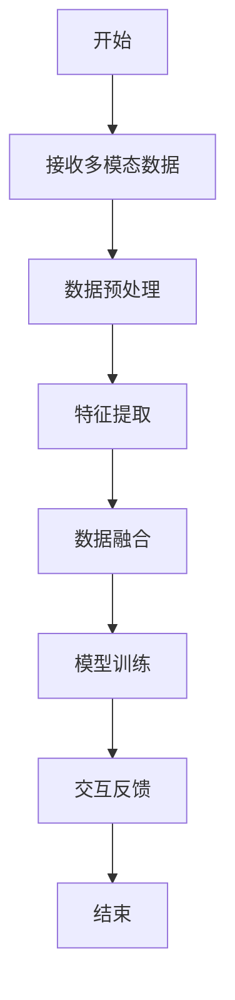
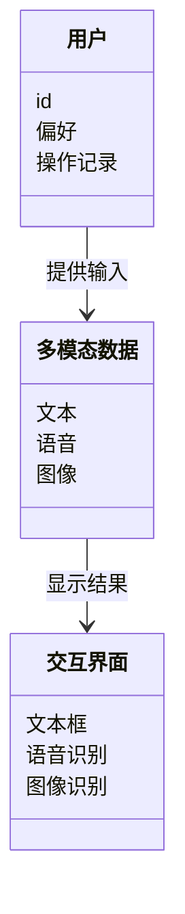
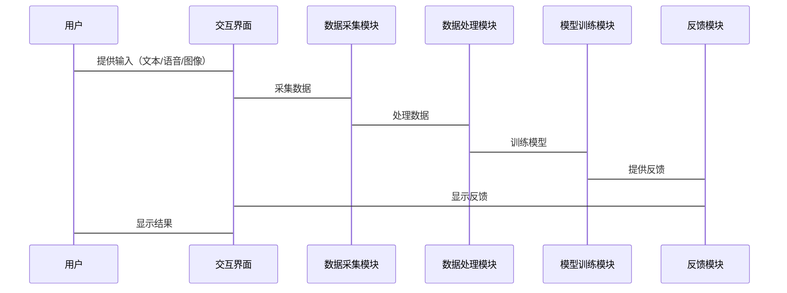

                 


# AI Agent的多模态交互界面设计与实现

## 关键词
AI Agent, 多模态交互, 交互界面设计, 界面实现, 多模态数据融合

## 摘要
AI Agent的多模态交互界面设计与实现是人工智能领域的重要研究方向。本文从AI Agent的基本概念出发，详细探讨了多模态交互界面的核心原理、算法实现、数学模型、系统架构设计以及实际应用案例。通过本文的阐述，读者可以全面了解多模态交互界面的设计与实现过程，掌握相关技术的关键点和最佳实践。

---

## 第1章 AI Agent与多模态交互界面概述

### 1.1 AI Agent的基本概念
#### 1.1.1 AI Agent的定义与特点
AI Agent（人工智能代理）是指能够感知环境、自主决策并执行任务的智能体。其特点包括：
- **自主性**：无需外部干预，自主完成任务。
- **反应性**：能够实时感知环境变化并做出响应。
- **社会性**：能够与人类或其他智能体进行交互和协作。

#### 1.1.2 多模态交互的定义与特点
多模态交互是指通过多种感官方式（如视觉、听觉、触觉）进行信息传递和反馈的过程。其特点包括：
- **多样性**：支持多种输入和输出方式。
- **自然性**：更接近人类的交互方式，提高用户体验。
- **复杂性**：需要处理不同类型数据的融合与协调。

#### 1.1.3 AI Agent与多模态交互的关系
AI Agent通过多模态交互界面与用户进行交流，能够更全面地理解用户需求并提供更精准的服务。多模态交互界面是AI Agent与用户之间的桥梁，决定了交互的效率和体验。

### 1.2 多模态交互界面的背景与应用
#### 1.2.1 多模态交互的背景
随着人工智能技术的快速发展，单一模态的交互方式已无法满足复杂场景的需求。多模态交互能够结合多种信息源，提高交互的准确性和智能化水平。

#### 1.2.2 多模态交互的主要应用领域
- **智能家居**：通过语音和触控交互实现家电控制。
- **智能助手**：支持语音、文本和手势等多种交互方式。
- **虚拟现实**：结合视觉、听觉和触觉提供沉浸式体验。
- **医疗健康**：通过多模态数据进行患者诊断和治疗方案优化。

#### 1.2.3 多模态交互的优势与挑战
优势：
- 提高交互的准确性和自然性。
- 支持复杂场景下的多任务处理。
- 增强用户体验和满意度。

挑战：
- 多模态数据的采集和处理复杂度高。
- 数据融合和协调需要先进的算法支持。
- 实时性要求高，对系统性能提出更高要求。

### 1.3 本章小结
本章介绍了AI Agent和多模态交互的基本概念、特点及其应用领域，为后续章节的深入探讨奠定了基础。

---

## 第2章 多模态交互的核心概念与联系

### 2.1 AI Agent的核心原理
#### 2.1.1 AI Agent的感知与决策机制
AI Agent通过感知环境获取信息，利用决策算法制定行动方案。感知模块包括数据采集和特征提取，决策模块基于感知结果进行推理和选择最优动作。

#### 2.1.2 多模态数据的融合与处理
多模态数据融合是指将来自不同感官的数据（如文本、语音、图像）进行整合，以提高信息理解和决策的准确性。常见的融合方法包括：
- **早期融合**：在数据预处理阶段进行融合。
- **晚期融合**：在特征提取或分类阶段进行融合。

#### 2.1.3 AI Agent的行为规划与执行
行为规划模块负责制定行动计划，执行模块将计划转化为具体操作。行为规划通常基于状态空间搜索、强化学习等方法。

### 2.2 多模态交互的核心要素
#### 2.2.1 多模态数据的采集与处理
数据采集是多模态交互的第一步，包括语音识别、图像处理、触觉反馈等技术。数据处理涉及预处理、特征提取和数据标注。

#### 2.2.2 多模态数据的分析与理解
通过机器学习和深度学习算法对多模态数据进行分析，理解用户的意图和情感状态。常用的技术包括自然语言处理（NLP）、计算机视觉（CV）和情感分析。

#### 2.2.3 多模态交互的反馈机制
反馈机制是多模态交互的重要组成部分，用于向用户提供实时的响应和结果。反馈可以是视觉、听觉或触觉形式，增强交互的双向性和动态性。

### 2.3 多模态交互的ER实体关系图
```mermaid
er
    entity(AI Agent) {
        id
        state
        action
    }
    entity(多模态数据) {
        id
        type
        content
    }
    entity(交互界面) {
        id
        component
        function
    }
    AI Agent -- 多模态数据: 接收和处理
    AI Agent -- 交互界面: 显示和反馈
```

### 2.4 本章小结
本章详细讲解了AI Agent的核心原理和多模态交互的核心要素，通过ER实体关系图展示了各组件之间的关系。

---

## 第3章 多模态交互界面的算法原理

### 3.1 多模态数据融合算法
#### 3.1.1 多模态数据融合的基本原理
多模态数据融合旨在将来自不同模态的数据进行有效整合，以提高信息利用率。常见的融合方法包括线性组合、加权融合和注意力机制。

#### 3.1.2 基于深度学习的多模态融合方法
深度学习在多模态数据融合中表现出色，常用的方法包括：
- **多模态卷积神经网络（MCNN）**：同时处理文本和图像数据。
- **多模态变换器（Transformer）**：通过自注意力机制实现跨模态信息交互。

#### 3.1.3 多模态数据融合的挑战与解决方案
挑战：
- 数据异构性：不同模态的数据具有不同的特征和格式。
- 数据不平衡：某些模态的数据量远少于其他模态。

解决方案：
- 异构数据对齐：通过数据变换和特征提取实现不同模态数据的对齐。
- 数据增强：通过生成对抗网络（GAN）等技术增强数据多样性。

### 3.2 多模态交互的算法实现
#### 3.2.1 多模态数据的特征提取
特征提取是多模态数据处理的关键步骤，常用的方法包括：
- **文本特征提取**：利用词嵌入（如Word2Vec、BERT）提取文本特征。
- **图像特征提取**：使用卷积神经网络（CNN）提取图像特征。

#### 3.2.2 多模态数据的分类与识别
分类与识别是多模态交互的核心任务，常用的方法包括：
- **多任务学习**：同时优化多个任务（如文本分类和图像分类）。
- **联合学习**：通过多模态数据的协同优化提高分类准确率。

#### 3.2.3 多模态交互的实时性优化
实时性是多模态交互的重要指标，可以通过以下方法优化：
- **轻量化模型**：使用更小的模型或剪枝技术减少计算量。
- **分布式计算**：通过并行计算和分布式处理提高处理速度。

### 3.3 多模态交互的算法流程图


### 3.4 本章小结
本章介绍了多模态数据融合算法和交互算法的实现方法，通过流程图展示了多模态交互的基本流程。

---

## 第4章 多模态交互界面的数学模型与公式

### 4.1 多模态数据融合的数学模型
#### 4.1.1 基于线性组合的融合模型
线性组合是一种简单的融合方法，公式如下：
$$ y = w_1x_1 + w_2x_2 + ... + w_nx_n $$
其中，$w_i$是第$i$个模态的权重，$x_i$是第$i$个模态的特征向量，$y$是融合后的结果。

#### 4.1.2 基于注意力机制的融合模型
注意力机制通过动态调整各模态的权重实现更精细的融合，公式如下：
$$ \alpha_i = \frac{\exp(a_i)}{\sum_{j} \exp(a_j)} $$
$$ y = \sum_{i=1}^{n} \alpha_i x_i $$
其中，$\alpha_i$是第$i$个模态的注意力权重，$a_i$是第$i$个模态的注意力得分。

### 4.2 多模态交互的数学模型
#### 4.2.1 多模态分类的损失函数
常用的分类损失函数包括交叉熵损失：
$$ \mathcal{L} = -\sum_{i=1}^{n} y_i \log(p_i) + (1-y_i)\log(1-p_i) $$
其中，$y_i$是真实标签，$p_i$是预测概率。

#### 4.2.2 多模态回归的损失函数
回归任务常用的损失函数是均方误差（MSE）：
$$ \mathcal{L} = \frac{1}{n}\sum_{i=1}^{n} (y_i - p_i)^2 $$
其中，$y_i$是真实值，$p_i$是预测值。

### 4.3 本章小结
本章通过数学公式详细讲解了多模态数据融合和交互的数学模型，为后续的算法实现提供了理论基础。

---

## 第5章 系统分析与架构设计

### 5.1 问题场景介绍
我们设计一个支持多模态交互的AI Agent系统，用户可以通过语音、文本和手势等多种方式与系统交互。系统需要能够识别用户的意图并提供相应的反馈。

### 5.2 系统功能设计
#### 5.2.1 领域模型设计


#### 5.2.2 系统架构设计


#### 5.2.3 接口设计与交互流程


### 5.3 本章小结
本章通过系统分析与架构设计，明确了AI Agent多模态交互系统的整体结构和各模块的功能。

---

## 第6章 项目实战：AI Agent的多模态交互界面实现

### 6.1 环境安装与配置
#### 6.1.1 安装Python与必要的库
```bash
pip install numpy
pip install pandas
pip install matplotlib
pip install scikit-learn
pip install tensorflow
pip install pytorch
```

#### 6.1.2 安装语音识别库
```bash
pip install speech_recognition
pip install pyaudio
```

#### 6.1.3 安装图像处理库
```bash
pip install opencv-python
pip install pillow
```

### 6.2 核心代码实现
#### 6.2.1 数据预处理代码
```python
import numpy as np
import pandas as pd
from sklearn.preprocessing import StandardScaler

def preprocess_data(data):
    # 标准化处理
    scaler = StandardScaler()
    data_scaled = scaler.fit_transform(data)
    return data_scaled
```

#### 6.2.2 多模态数据融合代码
```python
import torch
import torch.nn as nn

class MultiModalFusion(nn.Module):
    def __init__(self, input_size, hidden_size):
        super().__init__()
        self.fc1 = nn.Linear(input_size, hidden_size)
        self.fc2 = nn.Linear(hidden_size, 1)
    
    def forward(self, x):
        x = torch.relu(self.fc1(x))
        x = torch.sigmoid(self.fc2(x))
        return x
```

#### 6.2.3 模型训练代码
```python
from torch.utils.data import Dataset, DataLoader
import torch.optim as optim

class MultiModalDataset(Dataset):
    def __init__(self, X, y):
        self.X = X
        self.y = y
    
    def __len__(self):
        return len(self.X)
    
    def __getitem__(self, idx):
        return self.X[idx], self.y[idx]

def train_model(model, train_loader, criterion, optimizer, num_epochs):
    for epoch in range(num_epochs):
        for inputs, labels in train_loader:
            outputs = model(inputs)
            loss = criterion(outputs, labels)
            loss.backward()
            optimizer.step()
            optimizer.zero_grad()
    return model
```

#### 6.2.4 交互界面实现代码
```python
import speech_recognition as sr
import cv2

def speech_to_text():
    r = sr.Recognizer()
    with sr.AudioFile("input.wav") as source:
        audio_data = r.record(source)
        text = r.recognize_google(audio_data)
    return text

def image_recognition():
    img = cv2.imread("input.jpg")
    # 图像处理代码
    return result
```

### 6.3 代码解读与分析
- **数据预处理代码**：对多模态数据进行标准化处理，确保模型输入的一致性。
- **多模态数据融合代码**：通过深度学习模型将不同模态的特征进行融合，输出融合结果。
- **模型训练代码**：定义数据集和训练流程，优化模型参数以提高分类或回归任务的性能。
- **交互界面实现代码**：实现语音识别和图像识别功能，提供用户友好的交互界面。

### 6.4 实际案例分析
以语音助手为例，用户可以通过语音指令控制智能家居设备。系统通过语音识别模块获取指令，结合用户的偏好数据，调用相应的服务模块执行操作，并通过交互界面反馈结果。

### 6.5 项目小结
本章通过实际案例详细讲解了AI Agent多模态交互界面的实现过程，从环境配置到代码实现，再到实际应用，为读者提供了完整的实现参考。

---

## 第7章 最佳实践、小结与展望

### 7.1 最佳实践
- **数据质量**：确保多模态数据的完整性和准确性。
- **模型优化**：通过数据增强、模型调参和分布式训练提高模型性能。
- **用户体验**：设计直观、易用的交互界面，提供实时反馈和纠错机制。
- **隐私保护**：加强用户数据的隐私保护，确保符合相关法律法规。

### 7.2 小结
本文从理论到实践，详细探讨了AI Agent多模态交互界面的设计与实现。通过系统化的分析和具体的项目案例，读者可以掌握多模态交互的核心技术，并在实际应用中灵活运用。

### 7.3 展望
未来，随着人工智能和多模态技术的不断发展，AI Agent的多模态交互界面将更加智能化和人性化。研究方向包括：
- 更高效的多模态数据融合算法。
- 更自然的交互方式，如情感计算和脑机接口。
- 更广泛的应用场景，如教育、医疗和娱乐领域。

---

## 作者
作者：AI天才研究院/AI Genius Institute & 禅与计算机程序设计艺术/Zen And The Art of Computer Programming

---

以上是《AI Agent的多模态交互界面设计与实现》的技术博客文章，涵盖了从基础概念到实际实现的全过程，希望对读者有所帮助！

