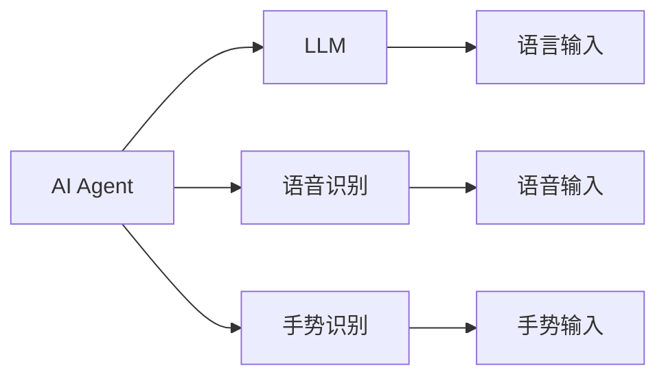

                 


# AI Agent的多模态交互：整合LLM与语音、手势识别

> 关键词：AI Agent, 多模态交互, LLM, 语音识别, 手势识别, 多模态数据融合

> 摘要：本文将探讨AI Agent如何通过整合大型语言模型（LLM）与语音、手势识别技术实现多模态交互。我们将从背景介绍、核心概念、算法原理、系统架构到项目实战，逐步分析多模态交互的实现过程，帮助读者深入理解这一技术的原理与应用。

---

## 第一部分: AI Agent的多模态交互概述

### 第1章: AI Agent与多模态交互的背景

#### 1.1 问题背景与问题描述
- **AI Agent的定义与特点**  
  AI Agent（人工智能代理）是指能够感知环境、自主决策并执行任务的智能实体。与传统程序不同，AI Agent具备自主性、反应性、目标导向性和社会性等特性。
  
- **多模态交互的定义与重要性**  
  多模态交互是指通过多种感官通道（如语言、视觉、听觉等）进行信息交换。在AI Agent中，多模态交互能够提升用户体验，增强系统的理解和表达能力。

- **当前AI Agent交互的主要挑战**  
  当前AI Agent主要依赖单一模态（如文本或语音）进行交互，难以充分利用多模态信息。这限制了系统的智能化水平和用户体验。

#### 1.2 多模态交互的核心概念
- **AI Agent在多模态交互中的角色**  
  AI Agent作为多模态交互的中心，负责协调不同模态数据的处理与融合。

- **多模态交互的边界与外延**  
  多模态交互的边界包括输入模态（如语音、手势、文本）和输出模态（如语音、文字、图像）。外延则涉及跨模态理解、实时性、鲁棒性等问题。

- **多模态交互的核心要素**  
  - **语言模型（LLM）**：负责理解和生成自然语言文本。  
  - **语音识别**：将语音信号转换为文本。  
  - **手势识别**：识别手势动作并转换为相应的指令或语义信息。

#### 1.3 AI Agent多模态交互的核心要素
- **语言模型（LLM）的作用**  
  LLM通过处理文本输入，生成自然语言回复，实现与用户的对话交互。

- **语音识别与手势识别的技术特点**  
  - 语音识别：基于声学特征提取和语言模型，将语音信号转换为文本。  
  - 手势识别：基于视觉特征提取和手势模型，识别手势动作并生成语义信息。

- **多模态数据融合的实现方式**  
  多模态数据融合可以通过以下方式实现：  
  - **早期融合**：在特征提取阶段融合多模态数据。  
  - **晚期融合**：在高层语义表示阶段融合多模态数据。

---

### 第2章: 多模态交互的核心概念与联系

#### 2.1 AI Agent、LLM、语音与手势识别的核心原理
- **AI Agent的决策机制**  
  AI Agent通过感知环境、理解用户意图、生成多模态回复，实现与用户的交互。

- **LLM的语言理解与生成原理**  
  LLM基于大量预训练数据，通过自注意力机制和前馈网络，生成与输入文本相关的输出。

- **语音识别与手势识别的技术原理**  
  - 语音识别：基于深度学习模型（如CTC、Transformer），将语音信号转换为文本。  
  - 手势识别：基于视觉模型（如CNN、Transformer），识别手势动作并生成语义信息。

#### 2.2 核心概念的属性特征对比
- **AI Agent与传统交互方式的对比**  
  | 属性       | AI Agent多模态交互 | 传统单模态交互 |
  |------------|--------------------|----------------|
  | 输入方式   | 文本、语音、手势  | 文本或语音     |
  | 输出方式   | 文本、语音、图像  | 文本或语音     |
  | 理解能力   | 多模态信息融合     | 单一模态理解    |
  | 实时性     | 高                | 中等           |

- **LLM与传统NLP模型的对比**  
  | 属性       | LLM                | 传统NLP模型     |
  |------------|--------------------|----------------|
  | 模型规模    | 大（如GPT-3）      | 小              |
  | 训练数据    | 多样化             | 有限            |
  | 应用场景    | 多任务、多模态      | 单一任务        |

- **语音与手势识别的性能对比**  
  | 属性       | 语音识别          | 手势识别         |
  |------------|--------------------|----------------|
  | 实时性     | 较高              | 较低            |
  | 准确率      | 中等（依赖于环境）  | 高（室内环境）    |
  | 交互方式    | 单向（听者被动）    | 双向（可主动）    |

#### 2.3 实体关系图


---

### 第3章: 多模态交互的算法原理

#### 3.1 多模态数据融合算法
- **多模态数据融合的流程**  
  1. **数据采集**：通过麦克风和摄像头采集语音和手势数据。  
  2. **特征提取**：将语音信号转换为频谱特征，将手势图像转换为视觉特征。  
  3. **融合策略**：通过加权融合或多任务学习方式，将多模态特征融合为统一表示。  
  4. **语义理解**：基于LLM或视觉模型，生成语义表示。  
  5. **任务执行**：根据语义理解结果，执行相应任务。

- **多模态数据融合的数学模型**  
  多模态数据融合可以通过以下模型实现：  
  $$ y = f(x_1, x_2, \ldots, x_n) $$  
  其中，$x_i$表示不同模态的输入数据，$y$表示融合后的输出结果。

- **多模态数据融合的实现代码**  
  ```python
  import torch
  import torch.nn as nn

  class MultiModalFusion(nn.Module):
      def __init__(self, input_dim1, input_dim2, hidden_dim):
          super().__init__()
          self.fc1 = nn.Linear(input_dim1, hidden_dim)
          self.fc2 = nn.Linear(input_dim2, hidden_dim)
          self.fc3 = nn.Linear(hidden_dim, 1)

      def forward(self, x1, x2):
          x1_out = torch.relu(self.fc1(x1))
          x2_out = torch.relu(self.fc2(x2))
          fused = torch.cat((x1_out, x2_out), dim=1)
          output = torch.sigmoid(self.fc3(fused))
          return output
  ```

#### 3.2 LLM与语音、手势识别的协同工作流程
- **LLM的输入处理**  
  LLM接收多模态数据融合后的语义表示，生成自然语言回复。

- **语音识别与手势识别的实时数据处理**  
  - 语音识别：实时接收语音信号，生成文本输入。  
  - 手势识别：实时接收手势图像，生成语义输入。

- **多模态数据的联合推理**  
  系统通过联合推理，将语音、手势和文本信息进行融合，生成更准确的语义表示。

---

## 总结

通过以上分析，我们可以看到，AI Agent的多模态交互整合了LLM、语音和手势识别技术，能够显著提升系统的智能化水平和用户体验。未来，随着技术的进步，多模态交互将更加广泛地应用于各个领域，为人类带来更智能、更便捷的交互方式。

作者：AI天才研究院/AI Genius Institute & 禅与计算机程序设计艺术 /Zen And The Art of Computer Programming

