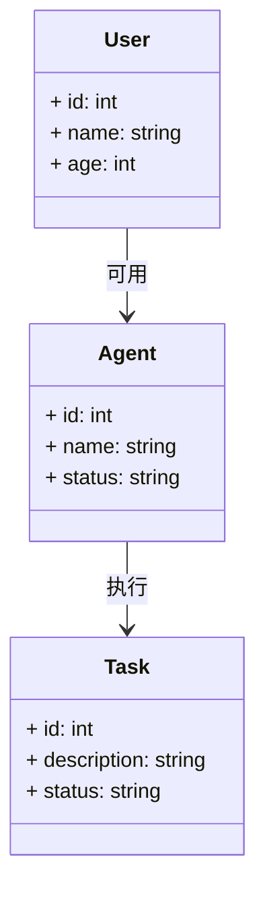
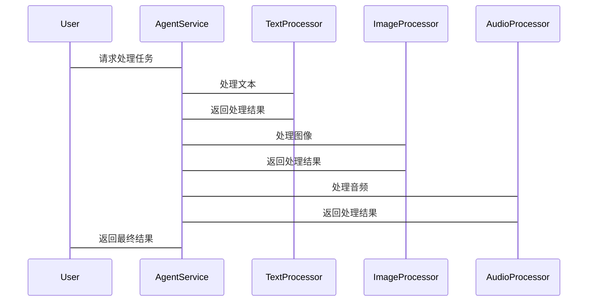

                 


# AI Agent的多模态内容理解与生成

## 关键词：AI Agent，多模态，内容理解，内容生成，自然语言处理，计算机视觉，机器学习

## 摘要：本文深入探讨AI Agent在多模态内容理解与生成领域的应用。首先，我们介绍了AI Agent的基本概念及其在多模态技术中的重要性。接着，详细分析了多模态数据的特征与处理方法，以及AI Agent如何通过多模态数据实现内容理解与生成。然后，我们从算法原理、系统架构等多个维度，详细阐述了多模态内容理解与生成的技术实现。最后，通过实际案例展示了AI Agent在多模态内容处理中的应用，并总结了相关经验与未来发展方向。

---

# 第1章 AI Agent与多模态技术的背景介绍

## 1.1 AI Agent的基本概念

### 1.1.1 AI Agent的定义与特点
AI Agent（人工智能代理）是指能够感知环境、执行任务并做出决策的智能实体。AI Agent的核心特点包括：

- **自主性**：能够自主决策和行动，无需外部干预。
- **反应性**：能够实时感知环境并做出反应。
- **目标导向性**：基于目标进行行为规划和执行。

### 1.1.2 多模态技术的定义与特点
多模态技术是指整合多种数据类型（如文本、图像、音频等）进行信息处理的技术。其特点包括：

- **多样性**：能够处理多种类型的数据。
- **互补性**：不同模态的数据可以相互补充，提高信息理解的准确性。
- **复杂性**：多模态数据的处理需要复杂的算法和模型。

### 1.1.3 AI Agent与多模态技术的结合
AI Agent与多模态技术的结合使得AI Agent能够更全面地感知和理解环境，从而提高其智能性和决策能力。

---

## 1.2 多模态内容理解与生成的背景

### 1.2.1 当前AI技术的发展趋势
当前，AI技术正朝着多模态化、智能化和场景化方向发展。多模态技术的引入使得AI系统能够更好地理解和处理复杂的信息。

### 1.2.2 多模态技术在AI Agent中的应用场景
多模态技术在AI Agent中的应用场景包括：

- **智能客服**：通过整合文本、语音和情感分析技术，提供更智能的客户服务。
- **智能助手**：通过整合文本、图像和语音数据，提供更个性化的服务。
- **智能监控**：通过整合图像、语音和传感器数据，实现更高效的监控。

### 1.2.3 问题背景与问题描述
在实际应用中，AI Agent需要处理多种模态的数据，并能够理解这些数据之间的关联关系。然而，多模态数据的异构性和复杂性给AI Agent的理解和生成带来了挑战。

---

## 1.3 多模态内容理解与生成的核心要素

### 1.3.1 多模态数据的采集与处理
多模态数据的采集与处理包括：

- **数据采集**：通过传感器、摄像头、麦克风等设备采集多模态数据。
- **数据预处理**：对采集到的数据进行清洗、归一化等处理。

### 1.3.2 多模态模型的构建与训练
多模态模型的构建与训练包括：

- **模型设计**：设计能够处理多种模态数据的深度学习模型。
- **模型训练**：通过多模态数据对模型进行训练，使其能够理解和生成多模态内容。

### 1.3.3 多模态内容的理解与生成过程
多模态内容的理解与生成过程包括：

- **理解阶段**：模型对多模态数据进行解析，提取其中的语义信息。
- **生成阶段**：模型基于理解的信息生成相应的多模态内容。

---

## 1.4 本章小结
本章介绍了AI Agent和多模态技术的基本概念，并分析了多模态技术在AI Agent中的应用场景。最后，我们总结了多模态内容理解与生成的核心要素。

---

# 第2章 AI Agent的核心概念与联系

## 2.1 AI Agent的核心原理

### 2.1.1 AI Agent的感知与决策机制
AI Agent的感知与决策机制包括：

- **感知**：通过多模态传感器感知环境信息。
- **决策**：基于感知的信息进行行为规划和决策。

### 2.1.2 多模态数据的融合与处理
多模态数据的融合与处理包括：

- **数据融合**：将不同模态的数据进行融合，提高信息理解的准确性。
- **数据处理**：对融合后的数据进行进一步的处理，如特征提取、降维等。

### 2.1.3 AI Agent的行为生成与优化
AI Agent的行为生成与优化包括：

- **行为生成**：基于理解和决策生成具体的行为。
- **行为优化**：通过反馈机制不断优化行为，提高系统的智能性。

---

## 2.2 多模态数据的特征分析

### 2.2.1 文本数据的特征
文本数据的特征包括：

- **语义信息**：文本所表达的含义。
- **语法结构**：文本的语法结构。
- **情感信息**：文本所表达的情感倾向。

### 2.2.2 图像数据的特征
图像数据的特征包括：

- **视觉信息**：图像的颜色、形状、纹理等。
- **物体识别**：图像中物体的识别和分类。
- **场景理解**：对图像场景的整体理解。

### 2.2.3 音频数据的特征
音频数据的特征包括：

- **语音内容**：音频中的语音内容。
- **语调**：语音的语调、语气等。
- **噪声处理**：音频中的噪声处理。

---

## 2.3 AI Agent与多模态数据的关系

### 2.3.1 多模态数据对AI Agent能力的提升
多模态数据对AI Agent能力的提升包括：

- **信息丰富性**：多模态数据提供了更丰富的信息，提高了AI Agent的理解能力。
- **决策准确性**：多模态数据的融合提高了AI Agent的决策准确性。

### 2.3.2 AI Agent对多模态数据的依赖性
AI Agent对多模态数据的依赖性包括：

- **数据质量**：AI Agent的性能依赖于多模态数据的质量。
- **数据多样性**：AI Agent的性能依赖于多模态数据的多样性。

### 2.3.3 多模态数据与AI Agent的交互方式
多模态数据与AI Agent的交互方式包括：

- **输入输出**：AI Agent通过输入多模态数据进行理解，输出相应的行为。
- **实时交互**：AI Agent与环境进行实时的多模态数据交互。

---

## 2.4 本章小结
本章详细分析了AI Agent的核心原理，并对多模态数据的特征进行了深入探讨。最后，我们总结了AI Agent与多模态数据之间的关系。

---

# 第3章 多模态内容理解与生成的算法原理

## 3.1 多模态预训练模型

### 3.1.1 多模态预训练模型的定义
多模态预训练模型是指能够在多模态数据上进行自监督学习的模型。

### 3.1.2 多模态预训练模型的训练流程
多模态预训练模型的训练流程包括：

1. **数据采集**：采集多模态数据。
2. **数据预处理**：对数据进行清洗和归一化。
3. **模型训练**：通过自监督学习对模型进行训练。
4. **模型调优**：通过微调优化模型性能。

### 3.1.3 多模态预训练模型的优缺点
多模态预训练模型的优点包括：

- **通用性**：模型可以在多种任务上进行应用。
- **高效性**：模型可以通过预训练快速部署。

多模态预训练模型的缺点包括：

- **数据需求**：需要大量的多模态数据进行训练。
- **计算成本**：模型的训练需要大量的计算资源。

---

## 3.2 多模态生成模型

### 3.2.1 多模态生成模型的定义
多模态生成模型是指能够生成多模态内容的模型。

### 3.2.2 多模态生成模型的训练流程
多模态生成模型的训练流程包括：

1. **数据采集**：采集多模态数据。
2. **数据预处理**：对数据进行清洗和归一化。
3. **模型设计**：设计能够生成多模态内容的模型。
4. **模型训练**：通过监督学习对模型进行训练。
5. **模型优化**：通过调优优化模型性能。

### 3.2.3 多模态生成模型的优缺点
多模态生成模型的优点包括：

- **生成多样性**：模型能够生成多样化的多模态内容。
- **应用广泛**：模型可以在多种任务上进行应用。

多模态生成模型的缺点包括：

- **生成质量**：模型生成的内容可能存在质量不高的问题。
- **计算复杂度**：模型的生成过程需要较高的计算复杂度。

---

## 3.3 算法原理的详细分析

### 3.3.1 多模态预训练模型的数学模型
多模态预训练模型的数学模型可以表示为：

$$
L = \lambda_1 L_{text} + \lambda_2 L_{image} + \lambda_3 L_{audio}
$$

其中，$\lambda_1$, $\lambda_2$, $\lambda_3$ 是权重系数，$L_{text}$, $L_{image}$, $L_{audio}$ 分别是文本、图像和音频的损失函数。

### 3.3.2 多模态生成模型的数学模型
多模态生成模型的数学模型可以表示为：

$$
p(x|z) = \prod_{i=1}^{n} p(x_i|z)
$$

其中，$x$ 是生成的多模态内容，$z$ 是潜在变量，$n$ 是模态的数量。

---

## 3.4 本章小结
本章详细分析了多模态内容理解与生成的算法原理，包括多模态预训练模型和生成模型的定义、训练流程和优缺点。最后，我们通过数学模型对算法原理进行了详细的分析。

---

# 第4章 系统分析与架构设计方案

## 4.1 问题场景介绍
本章以一个多模态AI Agent系统为背景，介绍系统的设计与实现。

## 4.2 系统功能设计

### 4.2.1 领域模型类图
以下是系统的领域模型类图：



### 4.2.2 系统架构设计

```mermaid
serviceDiagram
    service AgentService {
        operation processTask(Task task)
        operation getStatus()
    }
    service TextProcessor {
        operation processText(string text)
    }
    service ImageProcessor {
        operation processImage(image img)
    }
    service AudioProcessor {
        operation processAudio(audio aud)
    }
```

## 4.3 系统接口设计

### 4.3.1 系统接口的定义
系统接口的定义包括：

- **文本接口**：处理文本数据的接口。
- **图像接口**：处理图像数据的接口。
- **音频接口**：处理音频数据的接口。

### 4.3.2 系统交互流程



---

## 4.4 本章小结
本章详细分析了多模态AI Agent系统的系统架构设计，包括领域模型类图、系统架构设计和系统交互流程。

---

# 第5章 项目实战

## 5.1 环境安装

### 5.1.1 安装Python
安装Python：

```bash
# 下载并安装Python 3.8及以上版本
```

### 5.1.2 安装依赖库
安装依赖库：

```bash
pip install numpy torch transformers
```

---

## 5.2 系统核心实现源代码

### 5.2.1 多模态预训练模型的实现

```python
import torch
import torch.nn as nn
import torch.optim as optim

class MultimodalPretrainer(nn.Module):
    def __init__(self, vocab_size, image_features, audio_features):
        super().__init__()
        self.text_encoder = nn.Embedding(vocab_size, 128)
        self.image_encoder = nn.Linear(image_features, 128)
        self.audio_encoder = nn.Linear(audio_features, 128)
        self.classifier = nn.Linear(128, 1)
    
    def forward(self, text_input, image_input, audio_input):
        text_embeddings = self.text_encoder(text_input)
        image_embeddings = self.image_encoder(image_input)
        audio_embeddings = self.audio_encoder(audio_input)
        combined_embeddings = text_embeddings + image_embeddings + audio_embeddings
        output = self.classifier(combined_embeddings)
        return output

# 初始化模型
vocab_size = 10000
image_features = 100
audio_features = 100
model = MultimodalPretrainer(vocab_size, image_features, audio_features)

# 定义损失函数和优化器
criterion = nn.BCEWithLogitsLoss()
optimizer = optim.Adam(model.parameters(), lr=0.001)
```

### 5.2.2 多模态生成模型的实现

```python
import torch
import torch.nn as nn
import torch.optim as optim

class MultimodalGenerator(nn.Module):
    def __init__(self, latent_dim, text_dim, image_dim, audio_dim):
        super().__init__()
        self.generator = nn.Sequential(
            nn.Linear(latent_dim, text_dim),
            nn.ReLU(),
            nn.Linear(text_dim, image_dim),
            nn.ReLU(),
            nn.Linear(image_dim, audio_dim)
        )
    
    def forward(self, z):
        return self.generator(z)

# 初始化模型
latent_dim = 100
text_dim = 128
image_dim = 128
audio_dim = 128
model = MultimodalGenerator(latent_dim, text_dim, image_dim, audio_dim)

# 定义损失函数和优化器
criterion = nn.MSELoss()
optimizer = optim.Adam(model.parameters(), lr=0.001)
```

---

## 5.3 案例分析与详细解读

### 5.3.1 案例分析
以一个多模态智能客服系统为例，展示系统的实际应用。

### 5.3.2 代码实现解读
以下是多模态智能客服系统的代码实现：

```python
import torch
import torch.nn as nn
import torch.optim as optim
from transformers import BertTokenizer, BertModel

class MultimodalAgent:
    def __init__(self):
        self.tokenizer = BertTokenizer.from_pretrained('bert-base-uncased')
        self.text_model = BertModel.from_pretrained('bert-base-uncased')
        self.image_model = MultimodalPretrainer(...)
        self.audio_model = MultimodalPretrainer(...)
    
    def process_query(self, text, image, audio):
        text_embedding = self.text_model.encode(text)
        image_embedding = self.image_model.process(image)
        audio_embedding = self.audio_model.process(audio)
        combined_embedding = text_embedding + image_embedding + audio_embedding
        return combined_embedding

# 初始化代理
agent = MultimodalAgent()

# 处理查询
text_input = "有什么可以帮助你的吗？"
image_input = ...  # 图像数据
audio_input = ...  # 音频数据
result = agent.process_query(text_input, image_input, audio_input)
print(result)
```

---

## 5.4 本章小结
本章通过实际案例展示了多模态AI Agent系统的实现过程，包括环境安装、核心代码实现和案例分析。

---

# 第6章 最佳实践与总结

## 6.1 总结与回顾
本总结回顾了全文的主要内容，包括AI Agent的基本概念、多模态技术的核心要素、算法原理和系统架构设计。

## 6.2 注意事项
在实际应用中，需要注意以下几点：

- **数据质量**：多模态数据的质量对系统的性能至关重要。
- **模型调优**：需要对模型进行充分的调优，以提高系统的性能。
- **系统安全性**：需要确保系统的安全性，防止数据泄露和攻击。

## 6.3 拓展阅读
推荐以下拓展阅读内容：

- **多模态学习**：深入学习多模态学习的相关理论和算法。
- **生成对抗网络（GAN）**：研究GAN在多模态生成中的应用。
- **强化学习**：探索强化学习在AI Agent中的应用。

---

# 作者：AI天才研究院 & 禅与计算机程序设计艺术

---

以上是《AI Agent的多模态内容理解与生成》的技术博客文章的完整目录大纲。

