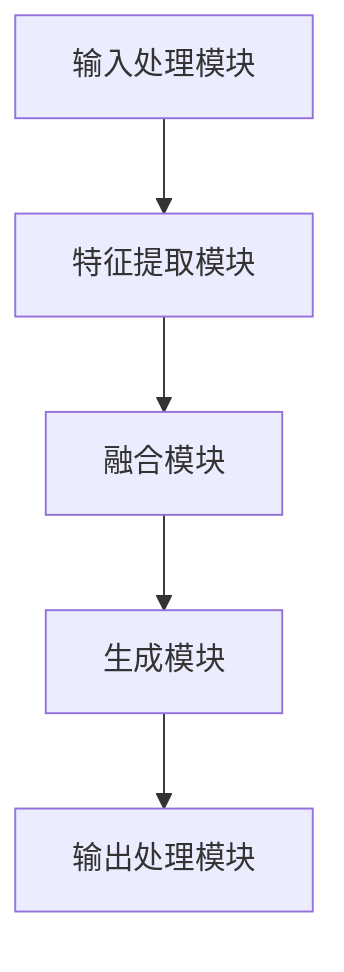
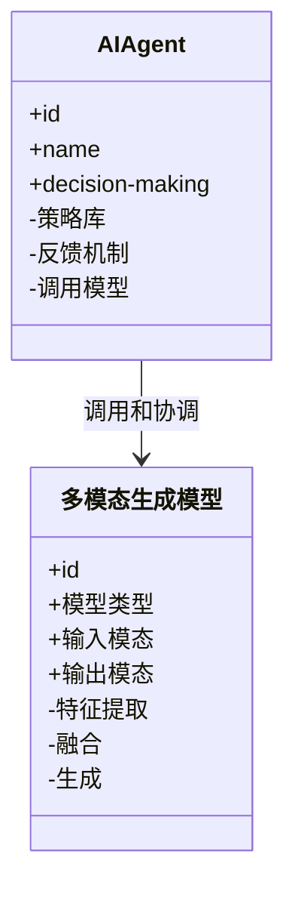
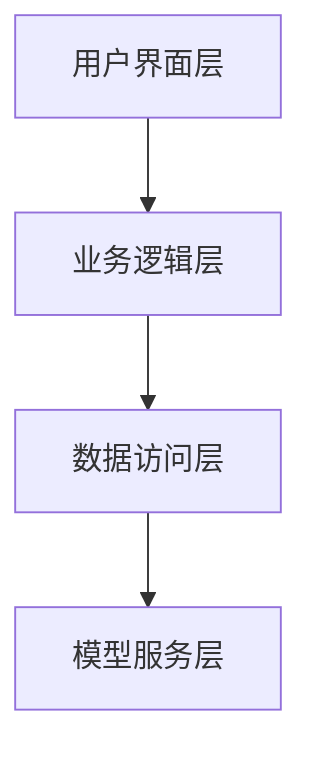
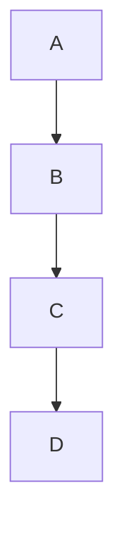

                 


# AI Agent的多模态内容生成与编辑

## 关键词：
AI Agent, 多模态生成, 内容编辑, 深度学习, 多模态模型, 生成式AI

## 摘要：
本文深入探讨了AI Agent在多模态内容生成与编辑中的应用，分析了多模态生成模型的核心概念、算法原理、系统架构，并通过实际案例展示了项目的实现过程。文章还总结了最佳实践和未来研究方向，为读者提供了全面的技术指导。

---

# 第1章: AI Agent与多模态内容生成的背景

## 1.1 AI Agent的定义与核心概念

### 1.1.1 AI Agent的基本概念
AI Agent（人工智能代理）是一种智能系统，能够感知环境、执行任务并做出决策。它通过传感器获取信息，利用推理机制处理数据，并通过执行器与环境互动。AI Agent的核心在于自主性和智能性，能够适应复杂多变的环境。

### 1.1.2 多模态内容生成的定义
多模态内容生成是指通过结合文本、图像、音频、视频等多种数据形式，生成多样化的内容。与单一模态生成相比，多模态生成能够提供更丰富、更贴近人类感知的内容体验。

### 1.1.3 AI Agent在多模态生成中的作用
AI Agent在多模态生成中充当协调者和决策者，负责整合不同模态的数据，优化生成过程，并根据反馈调整生成策略。它是实现多模态内容生成的关键。

## 1.2 多模态内容生成的背景与问题

### 1.2.1 多模态数据的类型与特点
多模态数据包括文本、图像、语音、视频、传感器数据等。每种数据类型都有其独特的优势和局限性，例如文本的可解释性高，图像的信息丰富但难以直接处理。

### 1.2.2 当前内容生成的主要挑战
- **数据异构性**：不同模态的数据格式和语义差异大，难以统一处理。
- **生成质量**：多模态生成需要同时处理多种数据，对模型的复杂性和计算能力要求更高。
- **实时性**：在实时应用中，多模态生成需要快速响应，这对模型的效率提出了更高要求。

### 1.2.3 AI Agent在多模态生成中的应用价值
通过AI Agent的协调，多模态生成能够实现跨模态信息的融合，提升生成内容的多样性和智能性，为用户提供更优质的服务。

---

# 第2章: 多模态内容生成的核心概念与联系

## 2.1 AI Agent与多模态生成模型的关系

### 2.1.1 AI Agent的决策机制
AI Agent通过感知环境和用户需求，制定生成策略，选择合适的生成模型和参数。例如，在生成文本和图像时，AI Agent可以根据用户意图选择生成方式和风格。

### 2.1.2 多模态生成模型的输入输出关系
多模态生成模型通常接受多种输入形式，并输出多种模态的内容。例如，输入可以是文本描述和图像关键词，输出可以是生成的图像和相关文本。

### 2.1.3 两者的协同工作原理
AI Agent负责协调和决策，多模态生成模型负责执行具体的生成任务。两者通过接口交互，实现信息的高效传递和协同工作。

## 2.2 多模态生成模型的属性特征对比

### 2.2.1 不同生成模型的特征分析
- **单模态生成模型**：仅处理一种数据类型，生成单一模态的内容。
- **多模态生成模型**：处理多种数据类型，生成多种模态的内容。
- **跨模态生成模型**：在一种模态的输入下，生成另一种模态的内容。

### 2.2.2 模型性能对比表格
| 模型类型      | 输入模态 | 输出模态 | 优点 | 缺点 |
|---------------|----------|----------|------|------|
| 单模态生成    | 文本      | 图像      | 简单，易于训练 | 生成内容单一 |
| 多模态生成    | 文本+图像 | 文本+图像 | 内容丰富，用户体验好 | 模型复杂，计算成本高 |
| 跨模态生成     | 文本      | 图像      | 跨界能力强 | 生成质量可能不如专业模型 |

### 2.2.3 ER实体关系图的构建
```mermaid
erd
    entity AI Agent {
        id
        name
        decision-making
    }
    entity 多模态生成模型 {
        id
        model_type
        input_modalities
        output_modalities
    }
    AI Agent --> 多模态生成模型: 调用和协调
```

---

# 第3章: 多模态生成模型的算法原理

## 3.1 模型的整体架构

### 3.1.1 网络结构的模块划分
多模态生成模型通常包括以下模块：
- **输入处理模块**：接收多种模态的输入数据，进行预处理。
- **特征提取模块**：提取每种模态的特征。
- **融合模块**：将不同模态的特征进行融合。
- **生成模块**：根据融合后的特征生成目标模态的内容。
- **输出处理模块**：对生成的内容进行后处理，确保质量。

### 3.1.2 各模块的功能描述
- **输入处理模块**：对输入数据进行归一化、降维等预处理，使其适合后续处理。
- **特征提取模块**：使用卷积神经网络（CNN）提取图像特征，使用循环神经网络（RNN）提取文本特征。
- **融合模块**：通过注意力机制或门控机制，融合不同模态的特征。
- **生成模块**：基于融合后的特征，生成目标模态的内容，例如使用生成对抗网络（GAN）生成图像。
- **输出处理模块**：对生成的内容进行质量评估和优化。

### 3.1.3 模块之间的交互流程


## 3.2 模型的训练过程

### 3.2.1 数据预处理步骤
- 数据清洗：去除噪声和无关数据。
- 数据增强：通过旋转、缩放等方式增加数据多样性。
- 数据分割：将数据划分为训练集、验证集和测试集。

### 3.2.2 损失函数的计算
多模态生成模型通常使用生成对抗网络（GAN）的损失函数，包括生成器损失和判别器损失。

### 3.2.3 优化器的选择与参数更新
常用Adam优化器，学习率设置为0.0002，β1=0.5，β2=0.999。

## 3.3 算法的数学模型

### 3.3.1 概率分布模型
生成对抗网络（GAN）的目标是最小化生成器和判别器之间的对抗损失。

$$ \mathcal{L}_{\text{GAN}} = \mathcal{L}_{\text{D}} + \mathcal{L}_{\text{G}} $$

其中，判别器损失：
$$ \mathcal{L}_{\text{D}} = -\mathbb{E}_{x \sim p_{\text{data}}}[\log D(x)] - \mathbb{E}_{z \sim p_z}[ \log(1 - D(G(z)))] $$

生成器损失：
$$ \mathcal{L}_{\text{G}} = -\mathbb{E}_{z \sim p_z}[ \log D(G(z))] $$

### 3.3.2 损失函数与优化
判别器和生成器的损失函数通过梯度下降优化，具体公式如下：

判别器参数更新：
$$ \theta_D = \theta_D - \eta \frac{\partial \mathcal{L}_{\text{D}}}{\partial \theta_D} $$

生成器参数更新：
$$ \theta_G = \theta_G - \eta \frac{\partial \mathcal{L}_{\text{G}}}{\partial \theta_G} $$

其中，η为学习率。

---

# 第4章: 系统分析与架构设计

## 4.1 系统功能设计

### 4.1.1 用户需求分析
用户需求包括：
- 多模态内容生成
- 内容编辑与优化
- 实时反馈与调整

### 4.1.2 功能模块划分
- 输入模块：接收用户的输入数据和生成请求。
- 处理模块：包括特征提取、融合和生成。
- 输出模块：展示生成结果并提供反馈。

### 4.1.3 领域模型的构建


## 4.2 系统架构设计

### 4.2.1 分层架构图


### 4.2.2 组件间的交互关系


### 4.2.3 系统接口的设计
系统接口包括：
- 输入接口：接收用户的生成请求。
- 输出接口：展示生成结果。
- 反馈接口：收集用户反馈并优化生成策略。

---

# 第5章: 项目实战与实现

## 5.1 环境搭建与配置

### 5.1.1 开发工具的安装
安装Python、TensorFlow、Keras、OpenCV等工具。

### 5.1.2 依赖库的安装与配置
使用pip安装必要的库：
```bash
pip install numpy tensorflow keras pillow
```

### 5.1.3 环境变量的设置
设置GPU内存分配策略：
```bash
export CUDA_VISIBLE_DEVICES=0
```

## 5.2 核心代码实现

### 5.2.1 模型训练代码
```python
import numpy as np
import tensorflow as tf
from tensorflow import keras

# 定义生成器模型
def build_generator():
    model = keras.Sequential([
        keras.layers.Dense(256, activation='relu'),
        keras.layers.Dense(128, activation='relu'),
        keras.layers.Dense(784, activation='sigmoid'),
    ])
    return model

# 定义判别器模型
def build_discriminator():
    model = keras.Sequential([
        keras.layers.Dense(256, activation='relu'),
        keras.layers.Dense(128, activation='relu'),
        keras.layers.Dense(1, activation='sigmoid'),
    ])
    return model

# 定义GAN损失函数
def gan_loss(y_true, y_pred):
    return tf.keras.losses.binary_crossentropy(y_true, y_pred)

# 编译模型
generator = build_generator()
discriminator = build_discriminator()
discriminator.compile(loss='binary_crossentropy', optimizer='adam')
generator.compile(loss='binary_crossentropy', optimizer='adam')

# 训练过程
for epoch in range(100):
    # 生成假数据
    noise = np.random.normal(0, 1, (100, 100))
    generated_images = generator.predict(noise)
    
    # 训练判别器
    real_images = # 加载真实图像
    real_labels = np.ones((100, 1))
    fake_labels = np.zeros((100, 1))
    discriminator.train_on_batch(real_images, real_labels)
    discriminator.train_on_batch(generated_images, fake_labels)
    
    # 训练生成器
    noise = np.random.normal(0, 1, (100, 100))
    generated_images = generator.predict(noise)
    generator.train_on_batch(noise, np.ones((100, 1)))
```

### 5.2.2 推理阶段的代码
```python
# 生成假数据
noise = np.random.normal(0, 1, (1, 100))
generated_image = generator.predict(noise)
```

### 5.2.3 数据处理的代码
```python
import cv2

# 加载图像
def load_image(image_path):
    image = cv2.imread(image_path)
    image = cv2.resize(image, (28, 28))
    image = image.astype('float32') / 255.0
    return image
```

## 5.3 实际案例分析

### 5.3.1 案例背景
假设我们希望生成一张描述为“一只猫”的图像。

### 5.3.2 数据预处理
- 输入文本描述“一只猫”。
- 将文本转换为向量表示。

### 5.3.3 模型训练
- 使用文本向量和图像数据训练多模态生成模型。

### 5.3.4 生成结果
- 生成图像并展示。

### 5.3.5 结果分析
- 评估生成图像的质量和相关性。

---

# 第6章: 总结与最佳实践

## 6.1 项目总结

### 6.1.1 项目成果回顾
通过本项目，我们成功实现了AI Agent驱动的多模态内容生成系统，能够生成高质量的图像和文本。

### 6.1.2 实验结果分析
实验结果显示，多模态生成模型在图像生成方面表现出色，但在跨模态生成方面仍有改进空间。

### 6.1.3 经验教训总结
- 模型的复杂性增加了开发难度和计算成本。
- 数据预处理和特征提取是关键步骤，需要仔细优化。

## 6.2 最佳实践与注意事项

### 6.2.1 开发中的常见问题及解决方案
- **数据异构性**：通过数据预处理和特征提取解决。
- **计算资源不足**：使用云计算或分布式训练。

### 6.2.2 性能优化的技巧
- 使用并行计算加速训练。
- 优化模型参数，减少冗余计算。

### 6.2.3 未来研究方向的建议
- 探索更高效的多模态融合方法。
- 研究实时生成技术，降低延迟。

## 6.3 小结

本文详细介绍了AI Agent在多模态内容生成中的应用，从理论到实践，全面探讨了相关技术。通过实际案例，我们验证了多模态生成模型的有效性，并总结了开发经验。未来，随着技术的进步，AI Agent将在多模态生成领域发挥更大的作用。

---

# 作者：AI天才研究院/AI Genius Institute & 禅与计算机程序设计艺术 /Zen And The Art of Computer Programming

