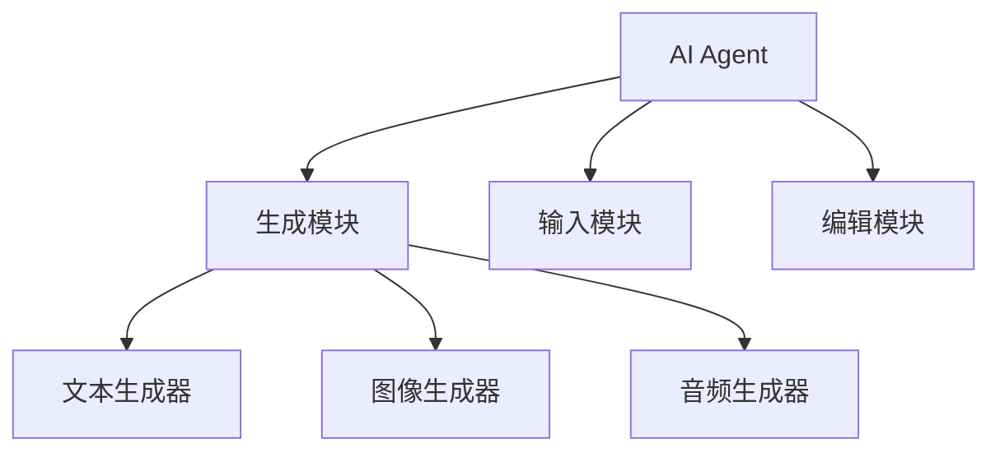
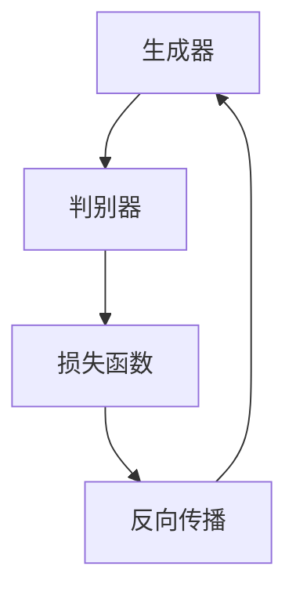
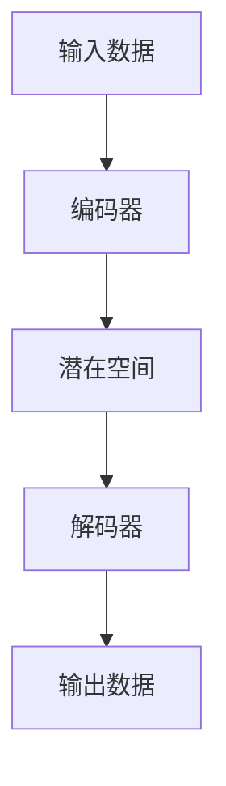
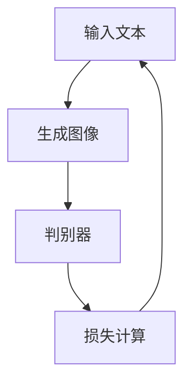
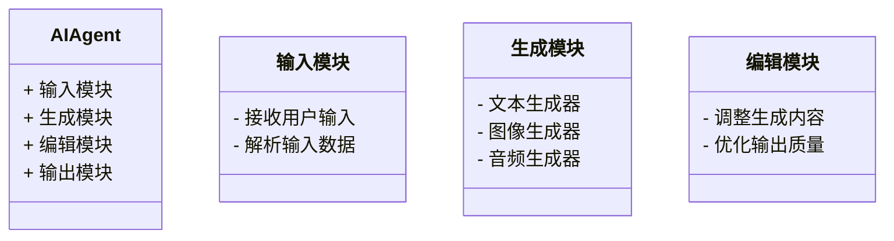
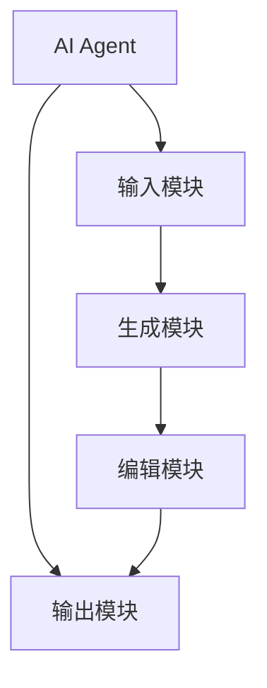
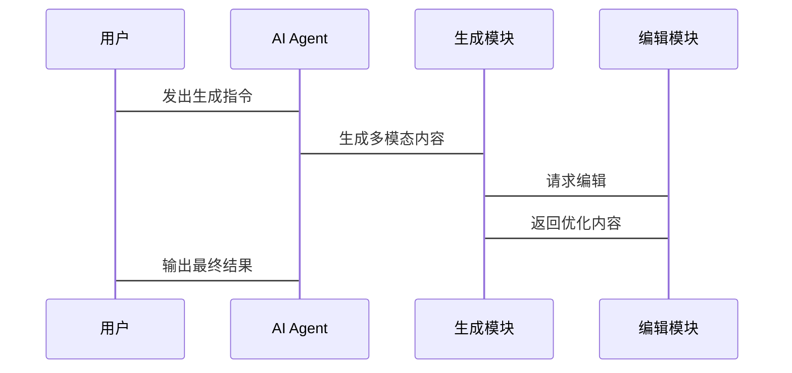

                 


# AI Agent的多模态内容生成与编辑系统

## 关键词：AI Agent，多模态生成，内容编辑，深度学习，计算机视觉，NLP

## 摘要：  
本文深入探讨了AI Agent在多模态内容生成与编辑系统中的应用。通过结合自然语言处理、计算机视觉和生成对抗网络等技术，AI Agent能够生成和编辑多种模态的内容，如文本、图像、音频和视频。本文首先介绍了AI Agent和多模态生成的基本概念，然后详细分析了多模态生成的算法原理，包括生成对抗网络和变体自编码器等。接着，从系统架构、功能设计和接口设计等多方面详细阐述了AI Agent的多模态生成系统，并通过实际案例展示了系统的实现与应用。最后，本文总结了AI Agent在多模态生成中的优势与挑战，并提出了未来的研究方向。

---

# 第一部分：AI Agent与多模态内容生成的背景介绍

## 第1章：AI Agent的基本概念

### 1.1 AI Agent的定义  
AI Agent（人工智能代理）是指能够感知环境、自主决策并执行任务的智能体。AI Agent可以通过接收输入、分析信息并生成输出来与用户或系统进行交互。  

### 1.2 AI Agent的核心特征  
- **自主性**：AI Agent能够在没有外部干预的情况下自主决策。  
- **反应性**：能够实时感知环境变化并做出响应。  
- **目标导向性**：基于目标或任务驱动行为。  
- **学习能力**：通过数据和反馈不断优化性能。  

### 1.3 AI Agent的分类与应用场景  
- **简单反射型AI Agent**：基于规则的简单决策，如游戏中的AI对手。  
- **基于模型的AI Agent**：利用内部模型进行复杂决策，如自动驾驶系统。  
- **目标驱动型AI Agent**：为实现特定目标而行动，如智能助手（Siri、Alexa）。  
- **学习驱动型AI Agent**：通过机器学习模型不断优化行为，如AlphaGo。  

---

## 第2章：多模态内容生成的背景与意义

### 2.1 多模态数据的定义  
多模态数据是指包含多种类型的数据形式，例如文本、图像、音频、视频和传感器数据等。多模态数据能够更全面地描述现实世界，为AI系统提供了更丰富的输入信息。  

### 2.2 多模态生成的挑战与机遇  
- **挑战**：不同模态的数据具有不同的特征和生成机制，如何协调多种模态的生成过程是一个难题。  
- **机遇**：通过多模态生成，AI Agent可以提供更丰富、更自然的交互体验，如生成带有图像的文本描述或结合音频的视频内容。  

### 2.3 多模态生成在AI Agent中的作用  
AI Agent通过多模态生成技术，可以实现更智能、更自然的交互方式。例如，AI Agent可以根据用户的输入生成文本、图像和音频，提供多样化的输出形式。  

---

## 第3章：问题背景与描述

### 3.1 当前内容生成的痛点  
- **单一性**：传统的内容生成系统通常只支持单一模态的生成，缺乏多样性和丰富性。  
- **割裂性**：不同模态的数据生成过程相互独立，难以实现协同生成。  
- **效率低下**：多模态生成需要协调多种算法和技术，过程复杂且效率较低。  

### 3.2 多模态生成的需求分析  
- **用户需求**：用户希望AI系统能够生成多样化的输出形式，提高交互体验。  
- **技术需求**：AI Agent需要具备多模态数据处理和生成的能力，以支持复杂的任务。  

### 3.3 AI Agent在多模态生成中的角色  
AI Agent作为多模态生成的核心驱动力，负责接收输入、协调生成过程并输出结果。AI Agent需要结合多种模态的数据特征，优化生成效果，确保输出符合用户需求。  

---

## 第4章：问题解决与边界

### 4.1 多模态生成的解决方案  
- **技术方案**：结合深度学习、生成对抗网络（GAN）和变体自编码器（VAE）等技术，实现多模态数据的联合生成。  
- **系统架构**：设计高效的系统架构，支持多种模态数据的协同生成和编辑。  

### 4.2 AI Agent的边界与外延  
- **边界**：AI Agent的功能范围和适用场景，如仅支持特定类型的多模态生成。  
- **外延**：AI Agent的多模态生成能力可以扩展到更多领域，如教育、医疗和娱乐等。  

### 4.3 系统的核心要素与组成  
- **输入模块**：接收用户的输入指令或数据。  
- **生成模块**：利用深度学习模型生成多种模态的内容。  
- **编辑模块**：对生成的内容进行调整和优化。  
- **输出模块**：将生成和编辑后的内容输出给用户。  

---

## 第5章：本章小结

### 5.1 核心概念回顾  
- AI Agent的基本概念、核心特征和应用场景。  
- 多模态生成的背景、挑战和意义。  

### 5.2 下一章的预览  
下一章将深入探讨AI Agent和多模态生成系统的核心概念与联系，分析其原理和实现方式。

---

# 第二部分：AI Agent的多模态生成系统核心概念与联系

## 第6章：AI Agent与多模态生成系统的核心概念与联系

### 6.1 核心概念原理  
- **多模态生成模型**：通过深度学习模型生成多种模态的数据，如文本和图像。  
- **AI Agent的决策机制**：基于输入信息和目标，选择最优的生成策略。  
- **多模态数据的融合方式**：将不同模态的数据进行融合，以提高生成效果。  

### 6.2 核心概念属性特征对比  

| 属性 | 单模态生成 | 多模态生成 |  
|------|------------|------------|  
| 输入 | 单一类型数据 | 多种类型数据 |  
| 输出 | 单一类型内容 | 多种类型内容 |  
| 复杂度 | 较低 | 较高 |  

### 6.3 实体关系图  



---

## 第7章：AI Agent的多模态生成系统的算法原理

### 7.1 生成对抗网络（GAN）原理  



### 7.2 变体自编码器（VAE）原理  



### 7.3 多模态生成模型（CLIP）原理  



---

## 第8章：数学模型与公式解析

### 8.1 GAN的损失函数  

$$ \text{损失函数} = \min_{G} \max_{D} \mathbb{E}_{x}[\log D(x)] + \mathbb{E}_{z}[ \log(1 - D(G(z)))] $$  

### 8.2 VAE的概率分布  

$$ p(x) = \int p(x|z) p(z) dz $$  

### 8.3 CLIP的对比学习策略  

$$ \text{损失} = -\log \frac{p(x,y)}{p(x)p(y|x)} $$  

---

## 第9章：系统分析与架构设计方案

### 9.1 问题场景介绍  
AI Agent需要根据用户的输入生成多模态内容，例如根据文本生成图像或根据图像生成描述文本。  

### 9.2 系统功能设计  



### 9.3 系统架构设计  



### 9.4 系统接口设计  
- **输入接口**：接收用户指令或数据。  
- **输出接口**：输出生成或编辑后的内容。  
- **内部接口**：生成模块和编辑模块之间的交互接口。  

### 9.5 交互流程  



---

## 第10章：项目实战

### 10.1 环境安装  
```bash
pip install tensorflow-gpu==2.5.0
pip install numpy==1.21.0
pip install pillow==9.0.0
pip install matplotlib==3.5.0
```

### 10.2 核心代码实现  

```python
import tensorflow as tf
from tensorflow.keras import layers

# 定义生成器模型
def build_generator():
    model = tf.keras.Sequential([
        layers.Dense(256, activation='relu'),
        layers.Dense(128, activation='relu'),
        layers.Dense(784, activation='sigmoid')
    ])
    return model

# 定义判别器模型
def build_discriminator():
    model = tf.keras.Sequential([
        layers.Dense(256, activation='relu'),
        layers.Dense(128, activation='relu'),
        layers.Dense(1, activation='sigmoid')
    ])
    return model

# 定义损失函数
cross_entropy = tf.keras.losses.BinaryCrossentropy()

# 定义生成器和判别器的损失
def generator_loss(fake_output):
    return cross_entropy(tf.ones_like(fake_output), fake_output)

def discriminator_loss(real_output, fake_output):
    real_loss = cross_entropy(tf.ones_like(real_output), real_output)
    fake_loss = cross_entropy(tf.zeros_like(fake_output), fake_output)
    return real_loss + fake_loss
```

### 10.3 案例分析与代码解读  
- **案例分析**：生成器和判别器的博弈过程，生成器通过不断优化生成图像来欺骗判别器。  
- **代码解读**：上述代码实现了GAN的基本结构，包括生成器、判别器和损失函数的定义。  

### 10.4 项目小结  
通过实际项目，读者可以理解AI Agent多模态生成系统的实现过程，并掌握相关技术的应用方法。

---

## 第11章：最佳实践与小结

### 11.1 最佳实践  
- **数据预处理**：确保输入数据的多样性和质量。  
- **模型优化**：选择合适的超参数和优化算法，提高生成效果。  
- **系统设计**：合理设计系统架构，确保生成和编辑过程高效协同。  

### 11.2 小结  
本文详细探讨了AI Agent在多模态内容生成与编辑系统中的应用，从理论到实践，全面分析了系统的实现过程和关键点。  

### 11.3 注意事项  
- **数据隐私**：注意保护用户数据的隐私和安全。  
- **性能优化**：在实际应用中，需关注系统的运行效率和资源消耗。  

### 11.4 拓展阅读  
- 推荐阅读《Deep Learning》（Ian Goodfellow等著）以深入了解生成模型的基本原理。  
- 关注最新的多模态生成技术，如扩散模型（Diffusion Models）和文本到图像生成的前沿研究。  

---

## 作者：AI天才研究院/AI Genius Institute & 禅与计算机程序设计艺术 /Zen And The Art of Computer Programming

---

通过以上内容，读者可以系统地了解AI Agent的多模态内容生成与编辑系统的实现原理、技术细节和实际应用。希望本文能够为相关领域的研究和实践提供有价值的参考和指导。

