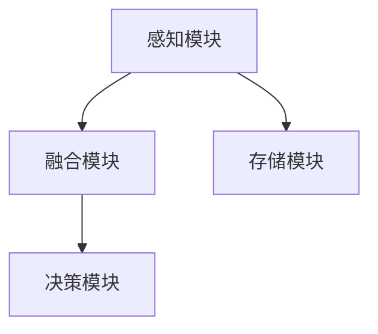

                 


# AI Agent的多模态学习：整合视觉、听觉和文本信息

## 关键词：AI Agent，多模态学习，视觉信息，听觉信息，文本信息，深度学习，多模态融合

## 摘要：  
AI Agent（人工智能代理）的多模态学习是一种整合视觉、听觉和文本信息的高级学习方法，旨在通过多模态数据的协同作用提升AI Agent的理解和决策能力。本文将从多模态数据的特点出发，深入分析视觉、听觉和文本信息的处理方法，探讨多模态数据融合的策略，并结合实际案例，展示如何通过系统架构设计实现高效的多模态学习。通过本文的阐述，读者将对AI Agent的多模态学习有全面的理解，并能够将其应用于实际场景中。

---

# 第一部分: AI Agent的多模态学习概述

## 第1章: AI Agent与多模态学习概述

### 1.1 AI Agent的基本概念  
#### 1.1.1 AI Agent的定义与特点  
AI Agent是一种能够感知环境、自主决策并执行任务的智能实体。与传统程序不同，AI Agent具备以下特点：  
- **自主性**：能够在没有外部干预的情况下独立运作。  
- **反应性**：能够实时感知环境并做出响应。  
- **学习能力**：通过数据和经验提升自身的性能。  

#### 1.1.2 多模态学习的定义与背景  
多模态学习是指AI Agent能够同时处理和理解多种类型的数据（如视觉、听觉和文本）并从中学习知识。多模态学习的核心目标是通过整合不同模态的信息，提升AI Agent的理解能力和决策水平。  

#### 1.1.3 多模态学习的核心目标与应用场景  
多模态学习的核心目标是通过整合多种数据源，解决单一模态数据的局限性。应用场景包括：  
- **智能助手**：通过整合语音和文本信息，提供更智能的交互体验。  
- **智能安防**：结合视觉和语音信息，实现更精准的监控和报警。  
- **医疗健康**：通过整合医学图像和文本信息，辅助医生进行诊断。  

---

## 第2章: 视觉信息处理基础  

### 2.1 图像识别与目标检测  
#### 2.1.1 基于深度学习的图像识别技术  
图像识别是AI Agent处理视觉信息的基础技术。基于深度学习的图像识别技术（如CNN）能够从图像中提取高层次特征并进行分类。  

#### 2.1.2 目标检测算法原理与实现  
目标检测技术（如YOLO、Faster R-CNN）能够定位图像中的目标并进行分类。其核心步骤包括：  
1. **特征提取**：通过CNN提取图像的特征图。  
2. **候选框生成**：通过滑动窗口或区域建议网络生成候选框。  
3. **目标分类与定位**：对候选框进行分类和精确定位。  

#### 2.1.3 图像分割与场景理解  
图像分割技术（如U-Net）能够将图像中的像素级分割为不同的区域，帮助AI Agent理解场景中的细节。  

---

## 第3章: 听觉信息处理基础  

### 3.1 语音识别与语音合成  
#### 3.1.1 语音识别的原理与技术  
语音识别技术（如深度学习中的CTC、Transformer）能够将语音信号转换为文本。其核心步骤包括：  
1. **特征提取**：将语音信号转换为频谱图或MFCC特征。  
2. **序列建模**：通过RNN或Transformer建模时序特征。  
3. **解码与输出**：将模型输出的字符序列解码为文本。  

#### 3.1.2 基于深度学习的语音合成  
语音合成技术（如Tacotron、VITS）能够将文本转换为自然的语音。其核心在于生成与文本匹配的语音波形。  

#### 3.1.3 语音处理的挑战与解决方案  
语音处理的挑战包括噪声干扰、语种多样性等问题。解决方案包括基于注意力机制的端到端模型和多任务学习框架。  

---

## 第4章: 文本信息处理基础  

### 4.1 自然语言理解与生成  
#### 4.1.1 自然语言理解（NLU）  
NLU技术（如BERT、GPT）能够理解文本的语义含义。其核心在于将文本映射到语义空间，并通过预训练模型提升理解能力。  

#### 4.1.2 自然语言生成（NLG）  
NLG技术能够生成与输入文本相关的输出文本。基于Transformer的模型（如GPT、T5）在文本生成任务中表现出色。  

#### 4.1.3 文本处理的挑战与解决方案  
文本处理的挑战包括语义模糊性和上下文依赖性。解决方案包括多模态学习和基于强化学习的生成模型。  

---

## 第5章: 多模态数据融合方法  

### 5.1 多模态数据融合的策略  
多模态数据融合的策略包括：  
1. **早期融合**：在特征提取阶段进行多模态数据的整合。  
2. **晚期融合**：在高层语义空间进行多模态数据的整合。  

#### 5.1.1 多模态注意力机制  
多模态注意力机制（如多模态Transformer）能够同时关注不同模态的信息，并通过注意力权重进行信息融合。  

#### 5.1.2 多模态数据融合的数学模型  
多模态数据融合的数学模型可以表示为：  
$$ z = f(x_v, x_a, x_t) $$  
其中，$x_v$、$x_a$、$x_t$分别表示视觉、听觉和文本模态的输入，$z$为融合后的输出。  

---

## 第6章: 系统架构设计与实现  

### 6.1 系统架构设计  
系统架构设计包括：  
1. **数据流设计**：定义多模态数据的输入、处理和输出流程。  
2. **模块划分**：将系统划分为感知模块、融合模块和决策模块。  
3. **接口设计**：定义模块之间的交互接口和数据格式。  

#### 6.1.1 系统架构图（Mermaid）  


### 6.2 交互流程设计  
交互流程设计包括：  
1. **输入处理**：接收多模态数据并进行预处理。  
2. **数据融合**：通过注意力机制进行多模态数据的融合。  
3. **决策输出**：根据融合后的信息生成最终的决策结果。  

---

## 第7章: 项目实战与案例分析  

### 7.1 项目环境配置  
项目环境配置包括：  
- **编程语言**：Python 3.8+  
- **深度学习框架**：TensorFlow/PyTorch  
- **依赖库**：numpy、pandas、scikit-learn  

### 7.2 系统核心实现（代码示例）  
```python
import tensorflow as tf
from tensorflow.keras.layers import Input, Dense, Activation
from tensorflow.keras.models import Model

# 定义多模态输入
input_v = Input(shape=(128,))  # 视觉模态特征
input_a = Input(shape=(64,))   # 听觉模态特征
input_t = Input(shape=(32,))   # 文本模态特征

# 多模态融合
merged = tf.keras.layers.concatenate([input_v, input_a, input_t])
dense = Dense(64, activation='relu')(merged)
output = Dense(1, activation='sigmoid')(dense)

# 定义模型
model = Model(inputs=[input_v, input_a, input_t], outputs=output)
model.compile(optimizer='adam', loss='binary_crossentropy', metrics=['accuracy'])
```

### 7.3 案例分析与实现解读  
通过上述代码示例，我们可以看到多模态数据融合的基本实现方式。视觉、听觉和文本模态的特征通过拼接的方式进行融合，并通过全连接层和激活函数进行非线性变换，最终输出分类结果。  

---

## 第8章: 总结与展望  

### 8.1 本章总结  
本文系统地介绍了AI Agent的多模态学习技术，涵盖了视觉、听觉和文本信息的处理方法，以及多模态数据融合的策略。通过实际案例的分析，展示了如何将多模态学习技术应用于实际场景中。  

### 8.2 未来研究方向  
未来的研究方向包括：  
1. **更高效的多模态融合方法**：探索更优的注意力机制和融合策略。  
2. **多模态学习的可解释性**：提升AI Agent决策的透明性和可解释性。  
3. **多模态学习的实时性优化**：降低计算复杂度，提升实时处理能力。  

---

## 作者：AI天才研究院/AI Genius Institute & 禅与计算机程序设计艺术/Zen And The Art of Computer Programming

