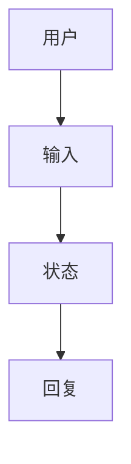
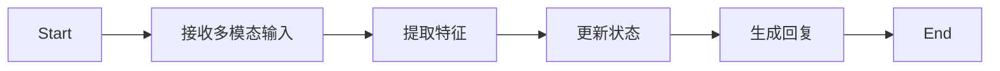
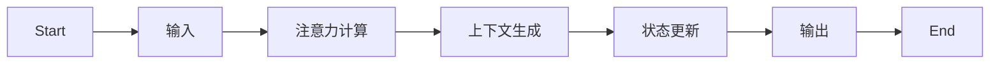
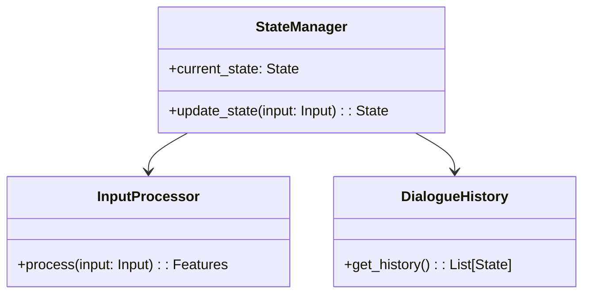
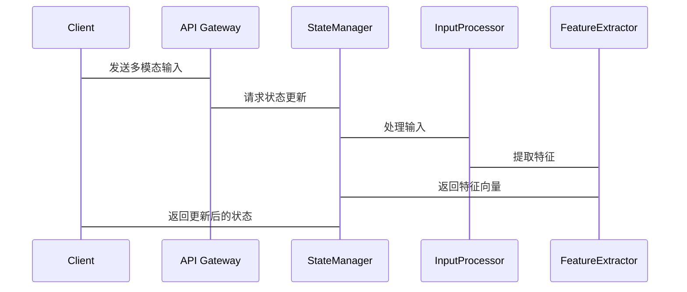

                 


# AI Agent的多模态对话状态追踪与管理

## 关键词：AI Agent, 多模态对话, 状态追踪, 管理系统, 对话历史, 多模态数据融合, 状态更新

## 摘要：
本文深入探讨AI Agent在多模态对话中的状态追踪与管理技术。首先，分析对话状态追踪的重要性及其在多模态环境下的挑战。接着，介绍多模态数据的融合方法和状态表示的创新策略。通过具体算法实现，展示如何利用注意力机制和序列建模优化状态更新。最后，结合系统架构设计和项目实战，提供可操作的解决方案和实践指导，帮助读者掌握AI Agent多模态对话状态管理的核心技术。

---

# 第1章: 多模态对话状态追踪与管理的背景与问题

## 1.1 问题背景
### 1.1.1 对话状态追踪的重要性
在AI Agent与用户的交互中，对话状态是理解用户意图、生成恰当回复的核心基础。准确的状态追踪能够提升对话的连贯性和用户体验。

### 1.1.2 多模态对话的挑战与机遇
多模态对话结合了文本、语音、图像等多种信息，能够更全面地理解用户需求。然而，不同模态数据的融合和同步带来了技术挑战。

### 1.1.3 当前技术的局限性与改进方向
传统的方法往往仅依赖单一模态数据，难以充分利用多模态信息的优势。如何高效整合多模态数据，实现动态状态更新，是当前技术的改进重点。

## 1.2 问题描述
### 1.2.1 对话状态的定义与分类
对话状态包括用户意图、上下文信息等，可以分为显式状态和隐含状态。显式状态直接反映用户需求，隐含状态则需要通过上下文推断。

### 1.2.2 多模态数据的融合问题
多模态数据的异步性和多样性增加了融合的难度。如何在不同模态之间建立有效关联，是实现准确状态追踪的关键。

### 1.2.3 状态追踪中的动态更新与不确定性处理
对话过程中，用户输入可能不完整或模糊，导致状态的不确定性。如何实时更新和修正状态，是技术难点。

## 1.3 问题解决方法
### 1.3.1 多模态数据的整合策略
采用联合表示方法，将不同模态数据映射到统一语义空间，便于融合和分析。

### 1.3.2 状态表示与更新的算法选择
利用深度学习模型，如Transformer和序列模型，捕捉对话的全局依赖关系，实现动态状态更新。

### 1.3.3 对话历史与上下文的关联分析
通过构建对话历史图，关联当前输入与历史信息，辅助状态的准确理解和更新。

## 1.4 边界与外延
### 1.4.1 多模态对话的边界条件
明确对话的场景限制，如实时性、数据来源等，确保系统在特定条件下稳定运行。

### 1.4.2 相关领域的区别与联系
对比自然语言处理、计算机视觉等领域，分析多模态对话状态管理的共性和独特性。

### 1.4.3 技术的适用范围与限制
明确技术的适用场景和局限，如数据量需求、计算资源限制等，帮助用户合理应用技术。

## 1.5 核心要素与概念结构
### 1.5.1 对话状态的核心要素
包括用户意图、上下文信息、对话历史等关键要素，构成了状态追踪的基础。

### 1.5.2 多模态数据的特征提取
对文本、语音、图像等模态进行特征提取，确保数据的语义一致性。

### 1.5.3 状态管理的逻辑框架
通过状态表示、融合、更新的流程，构建完整的管理框架。

---

# 第2章: 多模态对话状态追踪的核心概念与联系

## 2.1 核心概念原理
### 2.1.1 对话状态的表示方法
采用向量或符号表示，捕捉状态的语义信息。例如，使用词嵌入表示用户意图。

### 2.1.2 多模态数据的特征融合
将不同模态的特征向量进行加权融合，利用注意力机制确定各模态的贡献。

### 2.1.3 状态更新的机制与流程
基于当前输入和历史状态，通过模型计算新的状态表示。

## 2.2 核心概念对比与特征分析
### 2.2.1 不同状态表示方法的对比
对比词袋模型、TF-IDF和词嵌入等方法，分析其优缺点。

### 2.2.2 多模态数据特征的对比分析
比较文本、语音、图像特征的提取难度和信息量。

### 2.2.3 状态更新机制的优缺点
分析同步更新和异步更新的适用场景及性能差异。

## 2.3 实体关系图与流程图
### 2.3.1 实体关系图（ER图）

### 2.3.2 流程图（Mermaid）


---

# 第3章: 多模态对话状态追踪的算法原理

## 3.1 注意力机制在对话状态追踪中的应用
### 3.1.1 注意力机制的基本原理
通过计算输入数据中各部分的重要性权重，聚焦关键信息。

### 3.1.2 在多模态数据融合中的应用
将注意力机制应用于文本、语音、图像特征的融合，提升语义理解的准确性。

### 3.1.3 示例代码与解释
```python
def attention(inputs, attention_mask=None):
    # 输入：inputs [batch_size, seq_len, hidden_size]
    # 输出：outputs [batch_size, seq_len, hidden_size]
    # 实现自注意力机制
    pass
```

## 3.2 状态更新模型的数学推导
### 3.2.1 状态更新的公式
$$ s_t = f(s_{t-1}, x_t) $$
其中，$s_t$ 是当前状态，$s_{t-1}$ 是前一状态，$x_t$ 是当前输入。

### 3.2.2 算法流程图（Mermaid）


---

# 第4章: 多模态对话状态管理的系统分析与架构设计

## 4.1 问题场景介绍
### 4.1.1 多模态对话系统的基本结构
包括输入模块、处理模块、状态管理模块和输出模块。

## 4.2 系统功能设计
### 4.2.1 领域模型（Mermaid类图）


## 4.3 系统架构设计
### 4.3.1 系统架构图（Mermaid）
```mermaid
graph LR
    Client --> API Gateway
    API Gateway --> StateManager
    StateManager --> InputProcessor
    InputProcessor --> FeatureExtractor
    FeatureExtractor --> Database
    Database --> StateManager
```

## 4.4 系统接口设计
### 4.4.1 输入接口
定义输入格式和数据类型，确保多模态数据的正确接收。

### 4.4.2 输出接口
规定输出格式，确保状态更新信息的准确传递。

## 4.5 系统交互流程（Mermaid序列图）


---

# 第5章: 多模态对话状态管理的项目实战

## 5.1 环境安装与配置
### 5.1.1 安装依赖
安装Python、TensorFlow、Keras等工具，搭建开发环境。

### 5.1.2 环境配置
配置虚拟环境，确保各库版本兼容。

## 5.2 核心代码实现
### 5.2.1 状态管理类
```python
class StateManager:
    def __init__(self):
        self.current_state = None
    
    def update_state(self, input_features):
        # 实现状态更新逻辑
        pass
```

### 5.2.2 特征提取函数
```python
def extract_features(input_data):
    # 实现特征提取逻辑
    return features
```

## 5.3 案例分析与解读
### 5.3.1 实际案例
通过具体案例，展示状态追踪的完整流程。

### 5.3.2 代码实现细节
详细解读关键代码段，说明实现原理和优化技巧。

## 5.4 项目小结
总结项目实现的关键点和经验教训，为后续优化提供参考。

---

# 第6章: 多模态对话状态管理的最佳实践与总结

## 6.1 最佳实践
### 6.1.1 数据预处理技巧
确保数据的清洁和一致性，提升模型性能。

### 6.1.2 模型优化策略
采用早停、学习率调整等方法，优化训练效果。

## 6.2 小结
回顾文章内容，强调多模态对话状态管理的重要性和技术要点。

## 6.3 注意事项
提醒读者注意技术实现中的常见问题，如数据同步、模型收敛等。

## 6.4 拓展阅读
推荐相关领域的书籍和论文，鼓励读者深入研究。

---

# 作者：AI天才研究院 & 禅与计算机程序设计艺术

---

以上为文章的完整目录和部分内容展示，您可以根据实际需求进行扩展和补充。

