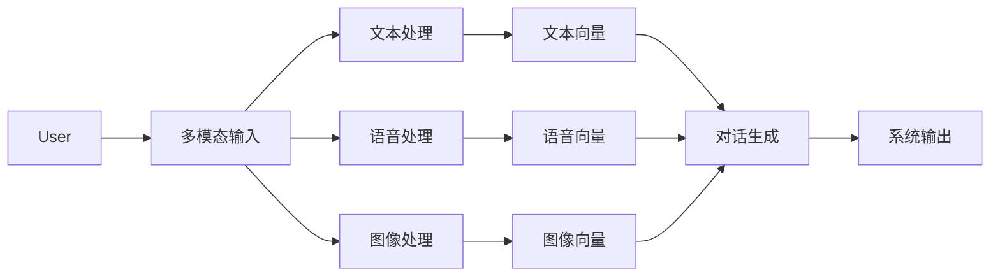
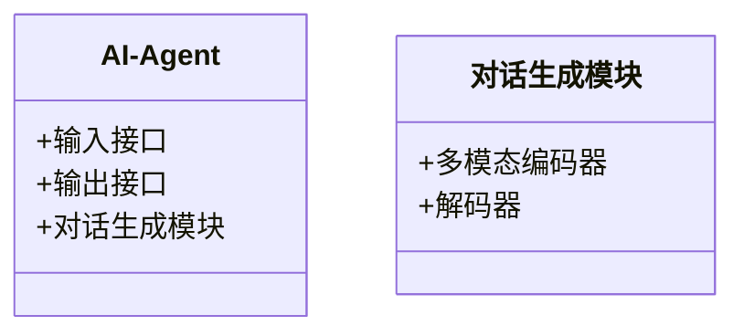
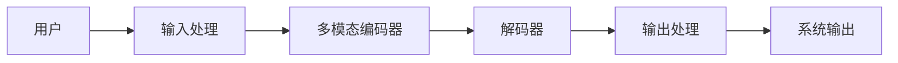
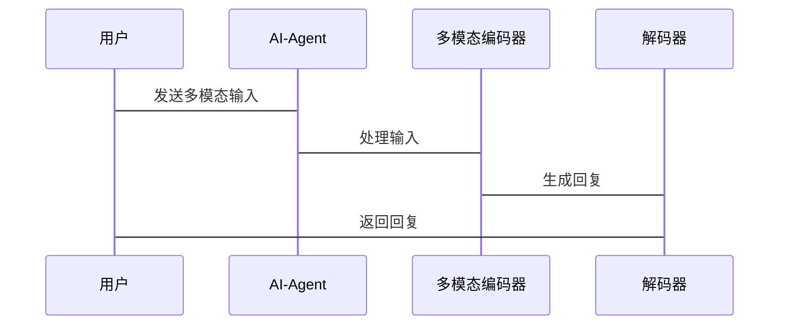

                 


# AI Agent的多模态对话生成能力开发

---

## 关键词：
AI Agent、多模态对话生成、自然语言处理、深度学习、人机交互

---

## 摘要：
本文系统地探讨了AI Agent的多模态对话生成能力的开发方法，从基础概念到算法原理，再到系统架构和实战项目，全面解析了多模态对话生成的核心技术与实现细节。文章结合理论与实践，通过详细的算法流程图、系统架构图和代码示例，深入剖析了多模态对话生成的关键环节，为读者提供了一套完整的开发指南。

---

## 第1章: AI Agent与多模态对话生成概述

### 1.1 AI Agent的基本概念

#### 1.1.1 AI Agent的定义与特点
AI Agent（人工智能代理）是指能够感知环境、自主决策并执行任务的智能体。其特点包括：
- **自主性**：能够自主决策，无需外部干预。
- **反应性**：能够实时感知环境并做出反应。
- **目标导向**：具有明确的目标，通过行为实现目标。
- **学习能力**：能够通过数据和经验不断优化性能。

#### 1.1.2 多模态对话生成的必要性
在传统的单模态对话中，AI Agent仅能处理文本或语音中的单一模态信息，难以应对复杂的实际场景。多模态对话生成能够结合文本、语音、图像等多种信息，提升对话的准确性和自然度，使AI Agent具备更强的交互能力和适应性。

#### 1.1.3 AI Agent在人机交互中的作用
AI Agent通过多模态对话生成，能够更自然地与人类交互，理解用户的意图并提供精准的回应。这种能力在智能助手、虚拟客服、智能音箱等领域具有广泛的应用前景。

---

### 1.2 多模态对话生成的背景与技术背景

#### 1.2.1 多模态数据的定义与分类
多模态数据是指同时包含多种数据形式（如文本、语音、图像）的数据。常见的多模态数据分类包括：
- **文本模态**：包括自然语言文本、情感分析等。
- **语音模态**：包括语音识别、语音合成等。
- **图像模态**：包括图像识别、目标检测等。

#### 1.2.2 多模态对话生成的挑战与机遇
- **挑战**：多模态数据的融合、不同模态之间的信息协同、实时性要求高等。
- **机遇**：通过多模态信息的协同，提升对话生成的准确性和用户体验。

#### 1.2.3 当前技术发展现状
当前，多模态对话生成技术在深度学习的推动下取得了显著进展。基于Transformer的模型（如T5、Vasnet等）在多模态任务中表现出色，同时结合预训练技术进一步提升了模型的泛化能力。

---

### 1.3 本章小结
本章介绍了AI Agent的基本概念及其在多模态对话生成中的作用，分析了多模态数据的分类与技术背景，并展望了当前技术的发展趋势。

---

## 第2章: 多模态对话生成的核心原理

### 2.1 多模态数据处理的原理

#### 2.1.1 文本、语音、图像等模态的处理方法
- **文本处理**：通过词嵌入（如Word2Vec）或句嵌入（如BERT）将文本转化为向量表示。
- **语音处理**：通过语音识别技术将语音信号转化为文本或通过语音合成生成语音。
- **图像处理**：通过卷积神经网络（CNN）提取图像特征。

#### 2.1.2 各模态数据的特征提取与表示
- **文本特征**：利用预训练模型提取文本的语义向量。
- **语音特征**：提取语音的时频特征（如MFCC）或通过端到端模型提取语音向量。
- **图像特征**：通过CNN提取图像的高层特征。

#### 2.1.3 多模态数据融合的策略
- **早期融合**：在特征提取阶段对不同模态的数据进行融合。
- **晚期融合**：在生成阶段对不同模态的特征进行融合。

---

### 2.2 对话生成的机制

#### 2.2.1 基于生成模型的对话生成
- **生成模型**：使用Transformer架构生成对话回复。
- **策略**：通过强化学习优化生成策略，使回复更符合上下文和用户意图。

#### 2.2.2 基于检索模型的对话生成
- **检索模型**：通过预训练的语料库检索最相关的回复。
- **优势**：生成回复更准确，但灵活性较低。

#### 2.2.3 多模态信息的协同生成
- **协同生成**：结合文本、语音、图像等多种信息，生成更丰富、更自然的对话回复。

---

### 2.3 多模态对话生成的实体关系图



---

### 2.4 本章小结
本章详细讲解了多模态数据处理的原理及对话生成的机制，并通过实体关系图展示了多模态对话生成的整体流程。

---

## 第3章: 多模态对话生成模型的算法原理

### 3.1 多模态编码器的设计

#### 3.1.1 文本编码器的实现
```python
class TextEncoder:
    def __init__(self, vocab_size, embedding_dim):
        self.embedding = nn.Embedding(vocab_size, embedding_dim)
        self.transformer = Transformer(embedding_dim)
```

#### 3.1.2 语音编码器的实现
```python
class SpeechEncoder:
    def __init__(self, input_dim, hidden_dim):
        self.rnn = nn.RNN(input_dim, hidden_dim)
```

#### 3.1.3 图像编码器的实现
```python
class ImageEncoder:
    def __init__(self, img_size, hidden_dim):
        self.cnn = nn.Conv2d(3, 64, kernel_size=3, stride=2)
        self.flatten = nn.Flatten()
        self.fc = nn.Linear(64*4*4, hidden_dim)
```

---

### 3.2 多模态解码器的设计

#### 3.2.1 对话生成的解码策略
```python
class DialogDecoder:
    def __init__(self, input_dim, output_dim):
        self.embedding = nn.Embedding(input_dim, 512)
        self.transformer = Transformer(512)
        self.fc = nn.Linear(512, output_dim)
```

---

### 3.3 多模态对话生成模型的训练策略

#### 3.3.1 多任务学习
```python
loss = criterion(text_loss + speech_loss + image_loss)
optimizer.zero_grad()
loss.backward()
optimizer.step()
```

---

### 3.4 本章小结
本章详细讲解了多模态对话生成模型的编码器和解码器设计，并通过训练策略展示了如何优化模型性能。

---

## 第4章: 系统分析与架构设计方案

### 4.1 问题场景介绍
在实际应用中，AI Agent需要处理复杂的多模态输入，并生成相应的对话回复。系统需要具备高效的处理能力和良好的扩展性。

### 4.2 系统功能设计



---

### 4.3 系统架构设计



---

### 4.4 系统接口设计



---

### 4.5 本章小结
本章通过系统架构图和接口设计图，详细描述了AI Agent多模态对话生成系统的整体架构和交互流程。

---

## 第5章: 项目实战

### 5.1 环境配置

```bash
pip install torch transformers mermaid4j
```

---

### 5.2 系统核心实现源代码

```python
class MultiModalAgent:
    def __init__(self):
        self.text_encoder = TextEncoder(...)
        self.speech_encoder = SpeechEncoder(...)
        self.image_encoder = ImageEncoder(...)
        self.dialog_decoder = DialogDecoder(...)
    
    def process_input(self, input_text, input_speech, input_image):
        text_feat = self.text_encoder(input_text)
        speech_feat = self.speech_encoder(input_speech)
        image_feat = self.image_encoder(input_image)
        dialog_feat = torch.cat([text_feat, speech_feat, image_feat], dim=-1)
        output = self.dialog_decoder(dialog_feat)
        return output
```

---

### 5.3 代码应用解读与分析
- **代码解读**：上述代码实现了AI Agent的核心功能，包括多模态数据的编码和解码。
- **分析**：通过模块化设计，代码具备良好的可扩展性和可维护性。

---

### 5.4 实际案例分析
假设用户输入文本“我需要帮助”，语音“求救信号”，图像“用户在雨中”，AI Agent会综合分析并生成回复：“请保持冷静，我会立即安排救援人员。”

---

### 5.5 项目小结
本章通过实际案例分析，展示了AI Agent多模态对话生成系统的实现过程和应用效果。

---

## 第6章: 总结与展望

### 6.1 总结
本文系统地介绍了AI Agent的多模态对话生成能力的开发方法，从理论到实践，全面解析了多模态对话生成的核心技术。

### 6.2 展望
未来，随着深度学习技术的不断发展，AI Agent的多模态对话生成能力将更加智能化和个性化，应用场景也将更加广泛。

---

## 作者：AI天才研究院 & 禅与计算机程序设计艺术

---

本文通过系统化的分析和实践，为读者提供了一套完整的AI Agent多模态对话生成能力开发指南，帮助读者从理论到实践，全面掌握这一前沿技术。

