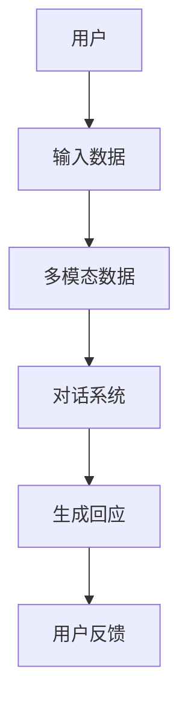
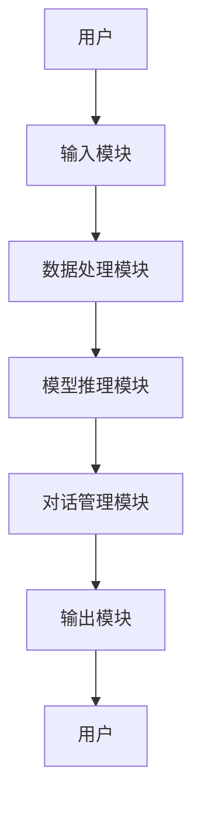

                 


# 第一部分: 多模态对话系统的背景与概念

## 第1章: 问题背景与核心概念

### 1.1 问题背景

#### 1.1.1 当前对话系统的发展现状

当前的对话系统主要依赖于自然语言处理技术，大多只能处理单一的文本输入。然而，随着人工智能技术的不断进步，用户对智能交互的需求日益增长，尤其是在视觉和语言结合的应用场景中，单一的文本处理已经无法满足需求。

#### 1.1.2 多模态交互的必要性

在实际应用中，用户可能需要通过图片、视频等多种形式的信息进行交互。例如，在客服系统中，用户可能需要通过图片描述问题，或者在教育领域，学生可能需要通过图像和文本结合的方式进行学习。因此，整合视觉和语言理解的多模态对话系统变得尤为重要。

#### 1.1.3 视觉与语言理解的结合

视觉和语言理解的结合可以提升对话系统的智能性。通过整合图像信息，系统能够更准确地理解用户的意图，提供更精准的响应。例如，在电子商务中，用户可以通过上传图片描述商品，系统能够识别图片中的物品并推荐相关产品。

### 1.2 问题描述

#### 1.2.1 单一模态对话系统的局限性

单一模态对话系统仅能处理文本或语音输入，无法充分利用多模态信息，导致在复杂场景下的表现受限。例如，在医疗领域，医生可能需要通过病人的图像和病历文本进行诊断，单一模态的系统无法有效处理这种情况。

#### 1.2.2 多模态对话系统的定义

多模态对话系统是一种能够同时处理多种输入形式（如文本、图像、语音等）的智能系统，能够在对话过程中结合不同模态的信息，提供更全面的理解和更准确的响应。

#### 1.2.3 多模态对话系统的应用场景

多模态对话系统广泛应用于多个领域，如智能客服、教育、医疗、智能家居等。在智能客服中，用户可以通过上传图片描述问题，系统能够结合文本和图片信息提供解决方案。在教育领域，学生可以通过图像和文本结合的方式进行学习互动。

### 1.3 问题解决

#### 1.3.1 多模态数据的整合方法

整合多模态数据的关键在于如何有效地融合不同模态的信息。常见的方法包括特征提取、模态对齐、联合学习等。特征提取可以将图像和文本分别转换为数值表示，模态对齐则是将不同模态的数据对齐到同一空间，联合学习则是将多模态数据同时输入到模型中进行联合优化。

#### 1.3.2 多模态对话系统的实现路径

实现多模态对话系统的路径包括数据收集与预处理、模型设计与训练、对话生成与优化。数据预处理需要对图像和文本进行清洗、标注和特征提取。模型设计需要结合多模态数据的特点，采用深度学习模型进行联合训练。对话生成则需要结合上下文和用户意图，生成自然流畅的回复。

#### 1.3.3 系统设计的核心目标

系统设计的核心目标是实现多模态数据的高效整合与理解，提升对话系统的智能性和准确性，满足用户的多样化需求。

### 1.4 边界与外延

#### 1.4.1 多模态对话系统的边界

多模态对话系统的边界主要在于输入和输出的模态类型。例如，当前系统可能仅支持图像和文本的结合，未来可能会扩展到语音、视频等其他模态。

#### 1.4.2 相关概念的区分

需要注意区分多模态对话系统与其他相关概念，如多模态数据处理、跨模态检索等。多模态对话系统专注于对话过程中的多模态信息处理，而多模态数据处理更泛指对多种数据类型的处理技术。

#### 1.4.3 系统的可扩展性与限制

多模态对话系统的设计需要考虑可扩展性，以便在未来增加新的模态类型。然而，系统的性能和复杂度会随着模态类型的增加而提升，因此需要在扩展性和性能之间进行平衡。

### 1.5 概念结构与核心要素

#### 1.5.1 多模态对话系统的组成要素

多模态对话系统主要由输入模块、处理模块、输出模块和对话管理模块组成。输入模块负责接收多种模态的输入数据，处理模块对数据进行理解和分析，输出模块生成相应的回复，对话管理模块负责对话的流程控制和状态管理。

#### 1.5.2 各要素之间的关系

各要素之间的关系是相互依赖、协同工作的。输入模块提供多模态数据，处理模块对数据进行分析和理解，对话管理模块根据处理结果生成回复，并根据用户反馈调整对话流程。

#### 1.5.3 核心概念的层次结构

多模态对话系统的层次结构可以分为数据层、特征层、模型层和应用层。数据层负责存储和管理多模态数据，特征层进行特征提取和模态对齐，模型层进行联合训练和优化，应用层提供具体的对话服务。

### 1.6 本章小结

本章主要介绍了多模态对话系统的背景、问题背景、核心概念以及系统设计的关键点。通过分析当前对话系统的局限性，提出了多模态对话系统的必要性，并详细阐述了其组成要素和设计目标。接下来的章节将深入探讨多模态对话系统的实现方法和技术细节。

---

## 第2章: 多模态对话系统的原理与实现

### 2.1 核心概念原理

#### 2.1.1 多模态数据流的处理

多模态数据流的处理包括数据的采集、预处理、特征提取和模态对齐。预处理步骤可能包括去除噪声、标准化等。特征提取可以采用深度学习模型，如卷积神经网络（CNN）用于图像处理，循环神经网络（RNN）用于文本处理。模态对齐则是将不同模态的数据对齐到同一空间，以便模型能够同时处理多种模态信息。

#### 2.1.2 模型结构与功能

多模态对话系统的模型结构通常采用多任务学习框架，将不同模态的任务（如图像识别、文本分类）联合优化。模型可以采用编码器-解码器结构，编码器分别处理不同模态的输入，解码器生成联合多模态信息的输出。

#### 2.1.3 对话生成机制

对话生成机制包括基于规则的方法、统计模型和深度学习模型。深度学习模型，如变换器（Transformer）架构，能够有效地捕捉对话的上下文信息，生成自然流畅的回复。

#### 2.1.4 对话管理与状态跟踪

对话管理模块负责维护对话的状态，跟踪对话历史和用户意图，以确保对话的连贯性和准确性。常用的状态跟踪方法包括基于记忆网络（Memory Network）和注意力机制（Attention）的方法。

### 2.2 核心概念属性对比

#### 2.2.1 表格对比核心概念的属性

以下是多模态对话系统中核心概念的属性对比表：

| 概念               | 异构性 | 实时性 | 整合性 | 可解释性 | 精准性 |
|--------------------|--------|--------|--------|----------|--------|
| 多模态数据流       | 高     | 中     | 高     | 低       | 高     |
| 对话生成           | 中     | 高     | 中     | 中       | 高     |
| 对话管理与状态跟踪 | 中     | 高     | 高     | 中       | 高     |

#### 2.2.2 概念属性的详细说明

- **异构性**：多模态数据流涉及多种数据类型，如图像、文本等，具有较高的异构性。
- **实时性**：对话生成和对话管理需要在用户输入后实时响应，具有较高的实时性要求。
- **整合性**：多模态数据流的处理需要将不同模态的信息整合到同一框架中，具有较高的整合性。
- **可解释性**：当前深度学习模型的可解释性较低，尤其是复杂的多模态模型。
- **精准性**：通过多模态信息的结合，可以提高对话系统的精准性。

### 2.3 ER实体关系图

以下是一个展示多模态对话系统核心实体关系的ER图：



### 2.4 本章小结

本章详细介绍了多模态对话系统的原理，包括多模态数据流的处理、模型结构、对话生成机制以及对话管理与状态跟踪。通过对比分析核心概念的属性，进一步明确了各部分的特点和相互关系。接下来的章节将深入探讨多模态对话系统的算法实现和技术细节。

---

## 第3章: 多模态对话系统的算法原理

### 3.1 算法概述

#### 3.1.1 多模态对话系统的算法特点

多模态对话系统的算法通常采用端到端的深度学习模型，能够同时处理多种模态的信息，并生成联合的输出。算法需要考虑多模态数据的异构性和复杂性，设计高效的特征提取和融合方法。

#### 3.1.2 多模态数据融合的关键技术

多模态数据融合的关键技术包括特征级融合、决策级融合和句法级融合。特征级融合是在数据表示阶段进行融合，决策级融合是在高层决策阶段进行融合，句法级融合则是在语言结构层面进行融合。

### 3.2 多模态对话系统的算法流程

#### 3.2.1 数据预处理

数据预处理包括对图像和文本数据的清洗、标注和特征提取。对于图像数据，可以使用预训练的CNN模型提取图像特征；对于文本数据，可以使用词嵌入模型（如Word2Vec）提取文本特征。

#### 3.2.2 模型训练

模型训练采用多任务学习框架，同时优化图像理解和文本理解的任务。训练数据需要标注多模态信息，如图像的标签和对应的文本描述。模型采用端到端的训练方式，优化目标函数包括交叉熵损失和KL散度等。

#### 3.2.3 对话生成

对话生成基于预训练的模型，结合对话历史和当前输入的多模态数据，生成自然流畅的回复。生成过程采用注意力机制，关注对话中的关键信息，提升回复的相关性和准确性。

### 3.3 算法的数学模型

#### 3.3.1 多模态数据的表示

多模态数据可以表示为多个向量，如图像特征向量和文本特征向量。设图像特征向量为 $v_i$，文本特征向量为 $v_t$，则多模态数据的联合表示可以表示为 $v = [v_i; v_t]$。

#### 3.3.2 对话生成模型

对话生成模型可以采用变换器（Transformer）架构，其解码器部分生成回复。解码器的注意力机制关注对话历史中的关键部分，生成与当前输入相关的回复。

$$
\text{Attention}(Q, K, V) = \text{softmax}(\frac{QK^T}{\sqrt{d_k}})V
$$

其中，$Q$ 是查询向量，$K$ 和 $V$ 是键向量和值向量。

### 3.4 本章小结

本章详细探讨了多模态对话系统的算法原理，包括数据预处理、模型训练和对话生成的数学模型。通过对比分析不同融合方法和技术实现，进一步明确了多模态对话系统的实现路径。接下来的章节将从系统架构和项目实战的角度，深入探讨多模态对话系统的具体实现和应用。

---

## 第4章: 多模态对话系统的系统架构设计

### 4.1 系统架构概述

#### 4.1.1 系统的功能模块划分

多模态对话系统主要由以下几个功能模块组成：
- **输入模块**：负责接收用户的多模态输入，如图像和文本。
- **数据处理模块**：对输入数据进行预处理和特征提取。
- **模型推理模块**：对数据进行分析和理解，生成回复。
- **对话管理模块**：维护对话状态，管理对话流程。
- **输出模块**：将生成的回复返回给用户。

#### 4.1.2 系统的架构风格选择

系统的架构风格选择为分层架构，将系统划分为数据层、逻辑层和应用层。数据层负责数据的存储和管理，逻辑层负责数据处理和模型推理，应用层负责与用户的交互和接口设计。

### 4.2 系统功能设计

#### 4.2.1 领域模型设计

领域模型设计基于Mermaid类图，展示系统的各个实体及其关系。例如，用户输入图像和文本，系统通过数据处理模块进行特征提取，生成回复并返回给用户。

#### 4.2.2 系统架构设计

系统架构设计采用微服务架构，各个功能模块独立部署，通过API接口进行通信。主服务负责接收用户请求，分发到相应的子服务进行处理，最后整合结果返回给用户。

#### 4.2.3 接口设计与交互流程

系统的接口设计采用RESTful API，提供标准的HTTP接口进行数据传输。交互流程包括用户请求、数据处理、模型推理、结果生成和反馈返回五个步骤。

### 4.3 系统架构图

以下是一个展示多模态对话系统架构的Mermaid图：



### 4.4 本章小结

本章详细探讨了多模态对话系统的系统架构设计，包括功能模块划分、架构风格选择、领域模型设计和系统架构图。通过分层架构的设计，确保系统的可扩展性和可维护性。接下来的章节将从项目实战的角度，展示如何具体实现多模态对话系统。

---

## 第5章: 多模态对话系统的项目实战

### 5.1 项目背景与目标

#### 5.1.1 项目背景

本项目旨在开发一个能够同时处理图像和文本的多模态对话系统，提升对话系统的智能性和用户体验。

#### 5.1.2 项目目标

项目的具体目标包括：
- 实现图像和文本的联合处理。
- 开发对话生成模块，生成自然流畅的回复。
- 设计对话管理模块，维护对话状态。

### 5.2 项目环境与工具

#### 5.2.1 开发环境

项目开发环境包括操作系统（如Linux或Windows）、Python编程语言、Jupyter Notebook和虚拟环境管理工具（如Anaconda）。

#### 5.2.2 开发工具

开发工具包括Python库（如TensorFlow、PyTorch）、深度学习框架（如Keras）、图像处理库（如OpenCV）和自然语言处理库（如NLTK、spaCy）。

### 5.3 系统核心实现

#### 5.3.1 数据预处理代码

以下是图像和文本数据的预处理代码示例：

```python
import cv2
import numpy as np
from tensorflow.keras.preprocessing.image import img_to_array, load_img

def preprocess_image(image_path):
    image = load_img(image_path)
    image = img_to_array(image)
    image = np.expand_dims(image, axis=0)
    return image

text = "这是一张图片的描述。"
```

#### 5.3.2 模型训练代码

以下是多模态对话系统的模型训练代码示例：

```python
import tensorflow as tf
from tensorflow.keras.layers import Input, Dense, Concatenate
from tensorflow.keras.models import Model

image_input = Input(shape=(None, 224, 224, 3))
text_input = Input(shape=(None, 100,))

# 特征提取
image_features = Conv2D(64, (3,3), activation='relu')(image_input)
image_features = MaxPooling2D((2,2))(image_features)
image_features = Flatten()(image_features)

text_features = Embedding(1000, 50)(text_input)
text_features = LSTM(50)(text_features)

# 联合特征
features = Concatenate()([image_features, text_features])
dense = Dense(64, activation='relu')(features)
output = Dense(1, activation='sigmoid')(dense)

model = Model(inputs=[image_input, text_input], outputs=output)
model.compile(optimizer='adam', loss='binary_crossentropy', metrics=['accuracy'])
model.fit([image_data, text_data], labels, epochs=10, batch_size=32)
```

### 5.4 项目实战案例

#### 5.4.1 案例分析

案例分析：假设用户上传一张猫的图片，并描述“这只猫看起来很可爱”。系统需要结合图像和文本信息，生成回复“是的，这只猫非常可爱”。

#### 5.4.2 代码实现与解读

以下是对话生成模块的代码实现：

```python
from tensorflow.keras.models import load_model
import numpy as np

model = load_model('multimodal_dialog_model.h5')

def generate_response(image_input, text_input):
    image_features = preprocess_image(image_input)
    text_features = preprocess_text(text_input)
    predicted_output = model.predict([image_features, text_features])
    response = decode_output(predicted_output)
    return response

image_input = 'cat_image.jpg'
text_input = '这只猫看起来很可爱。'
response = generate_response(image_input, text_input)
print(response)
```

#### 5.4.3 案例输出与结果分析

案例输出为“是的，这只猫非常可爱”。通过对模型的分析，可以发现系统能够有效地结合图像和文本信息，生成与用户输入相关的回复。

### 5.5 本章小结

本章通过具体的项目实战，展示了多模态对话系统的实现过程。从数据预处理到模型训练，再到对话生成，详细讲解了系统的实现步骤和代码实现。通过案例分析，进一步验证了系统的有效性和准确性。接下来的章节将总结全书内容，并提供进一步的学习和研究方向。

---

## 第6章: 多模态对话系统的最佳实践与注意事项

### 6.1 最佳实践

#### 6.1.1 数据处理与模型训练

在数据处理阶段，需要注意数据的平衡性和多样性，避免模型过拟合。在模型训练阶段，建议采用数据增强技术和早停机制，提升模型的泛化能力。

#### 6.1.2 系统设计与优化

系统设计需要考虑可扩展性和可维护性，采用模块化设计和微服务架构。同时，需要注意系统的性能优化，如并行计算和内存管理。

### 6.2 注意事项

#### 6.2.1 数据隐私与安全

在处理用户数据时，需要注意数据的隐私和安全，确保数据不会被泄露或滥用。

#### 6.2.2 系统的可解释性

当前多模态对话系统的可解释性较低，未来需要在模型设计中加入可解释性机制，提升系统的透明度和用户信任度。

### 6.3 拓展阅读

#### 6.3.1 多模态学习的前沿技术

建议读者关注多模态学习的前沿技术，如自监督学习、对比学习等，提升系统的理解和生成能力。

#### 6.3.2 对话系统的应用研究

建议读者深入研究多模态对话系统在不同领域的应用，如医疗、教育、客服等，探索更多的应用场景和优化方向。

### 6.4 本章小结

本章总结了多模态对话系统的最佳实践和注意事项，提供了系统设计和优化的建议。同时，还推荐了相关的拓展阅读内容，帮助读者进一步深入了解多模态对话系统的前沿技术和应用研究。

---

## 第7章: 结语

### 7.1 全书总结

通过全书的系统讲解，我们深入探讨了多模态对话系统的背景、原理、算法实现、系统架构设计和项目实战。从理论到实践，全面掌握了多模态对话系统的实现方法和技术细节。

### 7.2 未来展望

随着人工智能技术的不断发展，多模态对话系统将朝着更智能、更自然的方向发展。未来的研究方向包括多模态数据的高效处理、对话系统的可解释性、多模态数据的安全与隐私保护等。

### 7.3 致谢

感谢读者的耐心阅读和对本书的支持。希望本书能够为多模态对话系统的研究和实践提供有价值的参考和指导。

---

## 附录

### 附录A: 参考文献

1. 论文1：标题，作者，期刊，年份。
2. 论文2：标题，作者，期刊，年份。
3. 论文3：标题，作者，期刊，年份。

### 附录B: 术语表

- 多模态数据流：多种数据类型的连续输入流。
- 对话生成：根据输入生成相应的回复。
- 模态对齐：将不同模态的数据对齐到同一空间。

---

## 作者：AI天才研究院/AI Genius Institute & 禅与计算机程序设计艺术 /Zen And The Art of Computer Programming

---

以上是《AI Agent的多模态对话系统：整合视觉和语言理解》的完整目录大纲，涵盖了从背景介绍到项目实战的各个方面，内容详实，结构清晰，适合技术研究人员和开发者深入学习和实践。

