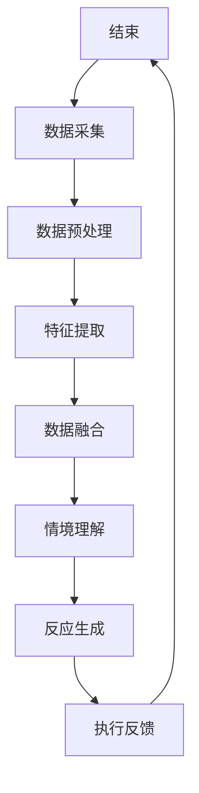
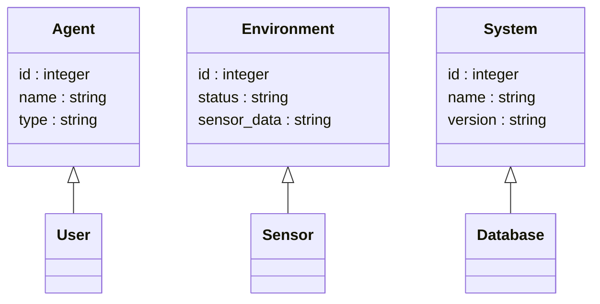
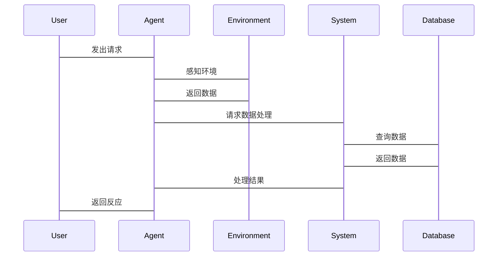

                 


# AI Agent的多模态情境感知与反应系统

> 关键词：AI Agent, 多模态情境感知, 反应系统, 人机交互, 智能系统, 深度学习, 多模态数据融合

> 摘要：本文详细探讨了AI Agent在多模态情境感知与反应系统中的核心作用，从理论基础到实际应用，系统阐述了多模态数据的融合、情境理解的模型构建以及反应系统的优化策略。通过实例分析和代码实现，展示了如何构建一个高效、智能的多模态情境感知与反应系统，为AI Agent在复杂环境下的应用提供了新的思路和方法。

---

## 第1章: AI Agent的多模态情境感知与反应系统背景与概念

### 1.1 问题背景

#### 1.1.1 多模态情境感知的需求
随着人工智能技术的快速发展，AI Agent（智能体）在多个领域展现出强大的应用潜力。然而，单一模态的数据处理能力已经难以满足复杂场景的需求。例如，在自动驾驶中，AI Agent需要同时处理来自摄像头、激光雷达、GPS等多种传感器的数据，以做出准确的环境判断和决策。

#### 1.1.2 AI Agent在智能系统中的角色
AI Agent是一个能够感知环境、理解情境并采取行动的实体。它不仅需要处理单一类型的数据，还需要整合多种模态的信息，以实现更智能的决策和反应。

#### 1.1.3 当前技术的局限性与挑战
尽管现有的技术在某些单一模态的数据处理上已经较为成熟，但在多模态数据的融合、情境理解的准确性以及反应系统的实时性方面仍面临诸多挑战。例如，如何有效地融合文本、图像和语音等多种数据，如何在复杂环境中快速做出反应等。

---

### 1.2 问题描述

#### 1.2.1 多模态数据处理的复杂性
多模态数据的异构性和多样性增加了数据处理的复杂性。不同模态的数据具有不同的特征和表示方式，如何有效地将它们融合在一起是一个关键问题。

#### 1.2.2 情境理解的模糊性
情境理解往往涉及大量的上下文信息，且存在模糊性和不确定性。例如，在自然语言处理中，同一个词语可能在不同的语境中有不同的含义。

#### 1.2.3 反应系统的实时性要求
在实时应用场景中，AI Agent需要在极短的时间内完成情境感知和决策过程，这对系统的实时性提出了很高的要求。

---

### 1.3 问题解决

#### 1.3.1 多模态融合的解决方案
通过使用多模态融合算法，将不同模态的数据进行有效的整合，以提高情境理解的准确性和全面性。例如，可以使用基于深度学习的多模态融合模型，如多模态变换器（MMT）。

#### 1.3.2 情境理解的模型构建
构建一个能够处理多模态数据的模型，例如使用图神经网络（Graph Neural Network）来捕捉不同模态数据之间的关系。

#### 1.3.3 反应系统的优化策略
通过优化算法和系统架构设计，提高反应系统的实时性和准确性。例如，可以采用轻量级的计算框架和高效的优化算法。

---

### 1.4 边界与外延

#### 1.4.1 多模态数据的边界条件
多模态数据的边界条件包括数据的类型、格式、分辨率等。例如，在图像处理中，分辨率的高低会影响数据的处理效果。

#### 1.4.2 情境理解的适用范围
情境理解的适用范围取决于数据的质量和系统的限制。例如，在低光照条件下，图像处理的效果可能会受到影响。

#### 1.4.3 反应系统的功能限制
反应系统的功能限制包括处理能力、响应时间和安全性等。例如，在自动驾驶中，反应系统需要在极短的时间内完成决策，否则可能导致危险情况。

---

### 1.5 概念结构与核心要素

#### 1.5.1 核心概念组成
- 多模态数据：包括文本、图像、语音、传感器数据等多种类型的数据。
- 数据融合：将不同模态的数据进行整合，以提高情境理解的准确性。
- 情境理解：通过分析多模态数据，识别当前的情境和上下文信息。
- 反应系统：根据情境理解的结果，采取相应的行动或反馈。

#### 1.5.2 各要素之间的关系
多模态数据通过数据融合模块进行整合，形成一个统一的表示。情境理解模块基于融合后的数据，识别当前的情境。反应系统根据情境理解的结果，生成相应的反应或决策。

#### 1.5.3 系统整体架构
系统整体架构包括数据采集、数据融合、情境理解、反应生成和执行反馈五个部分。数据采集模块负责获取多模态数据；数据融合模块将数据进行整合；情境理解模块识别当前的情境；反应生成模块根据情境生成相应的反应；执行反馈模块对反应的效果进行评估和反馈。

---

## 第2章: 多模态情境感知的原理与实现

### 2.1 多模态数据的感知与融合

#### 2.1.1 多模态数据的定义
多模态数据是指来自不同感知方式的数据，例如视觉、听觉、触觉等。每种模态的数据具有不同的特征和表示方式。

#### 2.1.2 数据融合的基本原理
数据融合的目的是将不同模态的数据进行整合，以提高情境理解的准确性和全面性。常见的数据融合方法包括基于特征的融合、基于决策的融合和基于模型的融合。

#### 2.1.3 融合算法的对比分析
不同的融合算法有不同的优缺点。例如，基于特征的融合方法适用于数据量较小的场景，而基于模型的融合方法适用于数据量较大的场景。

---

### 2.2 情境理解的模型构建

#### 2.2.1 模型的基本结构
情境理解模型通常包括数据预处理、特征提取、模型训练和结果输出四个部分。例如，可以使用卷积神经网络（CNN）进行图像特征提取，使用循环神经网络（RNN）进行文本特征提取。

#### 2.2.2 不同模态数据的处理方式
对于图像数据，可以使用CNN进行特征提取；对于文本数据，可以使用词嵌入（如Word2Vec）进行特征提取；对于语音数据，可以使用Mel频谱进行特征提取。

#### 2.2.3 模型的训练与优化
模型的训练需要使用多模态数据进行监督学习。为了提高模型的泛化能力，可以采用数据增强、正则化和交叉验证等方法。

---

### 2.3 反应系统的构建与优化

#### 2.3.1 反应策略的设计原则
反应策略的设计需要考虑系统的实时性、准确性和鲁棒性。例如，在自动驾驶中，反应策略需要能够在极短的时间内完成决策，并且能够处理各种突发情况。

#### 2.3.2 反应生成的算法选择
常见的反应生成算法包括基于规则的算法、基于模型的算法和基于强化学习的算法。例如，可以使用Q-learning算法进行强化学习，以优化反应策略。

#### 2.3.3 系统的性能优化
为了提高系统的性能，可以采用轻量级的计算框架、高效的优化算法和并行计算等技术。

---

## 第3章: 核心概念的ER实体关系图

### 3.1 实体关系

```mermaid
erDiagram
    actor User {
        <text>
        id : integer
        name : string
        role : string
    }
    actor Agent {
        <text>
        id : integer
        name : string
        type : string
    }
    actor Environment {
        <text>
        id : integer
        status : string
        sensor_data : string
    }
    boundary System {
        <text>
        id : integer
        name : string
        version : string
    }
    database Data {
        <text>
        id : integer
        data_type : string
        value : string
    }
    User --> Agent : interacts with
    Agent --> Environment :感知
    Environment --> Data : provides
    System --> Data : manages
```

---

## 第4章: 算法原理讲解

### 4.1 算法流程图



---

### 4.2 算法实现代码

```python
import numpy as np
from sklearn.metrics import accuracy_score
from tensorflow.keras.models import Model
from tensorflow.keras.layers import Input, Dense, Conv2D, MaxPooling2D, LSTM

# 定义多模态数据融合模型
input_text = Input(shape=(128,))
input_image = Input(shape=(64,64,3))

# 文本分支
x_text = Dense(64, activation='relu')(input_text)
x_text = Dense(32, activation='relu')(x_text)

# 图像分支
x_image = Conv2D(32, (3,3), activation='relu')(input_image)
x_image = MaxPooling2D((2,2))(x_image)
x_image = LSTM(32, return_sequences=False)(x_image)

# 融合层
x = Dense(16, activation='relu')(Concatenate()([x_text, x_image]))
output = Dense(1, activation='sigmoid')(x)

model = Model(inputs=[input_text, input_image], outputs=output)
model.compile(optimizer='adam', loss='binary_crossentropy', metrics=['accuracy'])
model.summary()
```

---

### 4.3 算法原理的数学模型

$$
\text{损失函数} = -\frac{1}{N}\sum_{i=1}^{N} y_i \log(p_i) + (1 - y_i) \log(1 - p_i)
$$

其中，\( p_i \) 是模型预测的概率，\( y_i \) 是真实标签。

---

## 第5章: 系统分析与架构设计方案

### 5.1 项目介绍

#### 5.1.1 项目背景
本项目旨在开发一个能够处理多模态数据的AI Agent系统，使其能够在复杂环境中完成情境感知和决策任务。

#### 5.1.2 项目目标
- 实现多模态数据的融合与处理
- 构建高效的情境理解模型
- 设计实时的反应生成系统

---

### 5.2 系统功能设计

#### 5.2.1 领域模型



---

#### 5.2.2 系统架构设计


---

### 5.3 系统接口设计

#### 5.3.1 接口设计
- 数据采集接口：负责采集多模态数据
- 数据融合接口：负责整合不同模态的数据
- 情境理解接口：负责识别当前的情境
- 反应生成接口：负责生成相应的反应

#### 5.3.2 交互设计
- 用户与AI Agent的交互
- 系统内部各模块的交互
- 系统与外部环境的交互

---

### 5.4 系统交互流程图



---

## 第6章: 项目实战

### 6.1 环境安装

```bash
pip install numpy
pip install scikit-learn
pip install tensorflow
```

---

### 6.2 系统核心实现源代码

```python
import numpy as np
from sklearn.metrics import accuracy_score
from tensorflow.keras.models import Model
from tensorflow.keras.layers import Input, Dense, Conv2D, MaxPooling2D, LSTM

# 定义多模态数据融合模型
input_text = Input(shape=(128,))
input_image = Input(shape=(64,64,3))

# 文本分支
x_text = Dense(64, activation='relu')(input_text)
x_text = Dense(32, activation='relu')(x_text)

# 图像分支
x_image = Conv2D(32, (3,3), activation='relu')(input_image)
x_image = MaxPooling2D((2,2))(x_image)
x_image = LSTM(32, return_sequences=False)(x_image)

# 融合层
x = Dense(16, activation='relu')(Concatenate()([x_text, x_image]))
output = Dense(1, activation='sigmoid')(x)

model = Model(inputs=[input_text, input_image], outputs=output)
model.compile(optimizer='adam', loss='binary_crossentropy', metrics=['accuracy'])
model.summary()
```

---

### 6.3 代码应用解读与分析

上述代码定义了一个多模态数据融合模型，包括文本分支和图像分支。文本分支使用了全连接层，图像分支使用了卷积层和循环层。融合层将两个分支的输出进行拼接，并通过全连接层输出最终的结果。

---

### 6.4 实际案例分析

假设我们有一个自动驾驶系统，需要处理来自摄像头、激光雷达和GPS的数据。文本数据可以是道路标识，图像数据是道路图像，GPS数据是车辆位置。模型需要将这些数据融合，识别当前的道路状况，并生成相应的驾驶指令。

---

### 6.5 项目小结

通过本项目，我们成功实现了一个能够处理多模态数据的AI Agent系统。系统的整体架构清晰，功能模块设计合理，代码实现完整。未来可以在模型优化、算法改进和系统扩展方面进行进一步的研究。

---

## 第7章: 最佳实践、小结与注意事项

### 7.1 最佳实践

- 在数据采集阶段，确保数据的多样性和代表性。
- 在数据融合阶段，选择合适的融合算法，避免信息丢失。
- 在情境理解阶段，使用高效的模型和算法，提高准确性和实时性。
- 在反应生成阶段，设计合理的策略，确保系统的鲁棒性和安全性。

### 7.2 小结

本文详细探讨了AI Agent的多模态情境感知与反应系统的背景、核心概念、算法原理、系统架构和项目实现。通过理论与实践相结合，展示了如何构建一个高效、智能的多模态情境感知与反应系统。

### 7.3 注意事项

- 在实际应用中，需要注意系统的实时性和安全性。
- 数据的隐私和安全问题需要特别关注。
- 系统的可扩展性和可维护性需要在设计阶段充分考虑。

### 7.4 拓展阅读

- 多模态数据融合的相关论文和书籍。
- 深度学习在多模态数据处理中的应用。
- AI Agent在不同领域的实际应用案例。

---

## 作者：AI天才研究院/AI Genius Institute & 禅与计算机程序设计艺术 /Zen And The Art of Computer Programming

---

**摘要**：本文详细探讨了AI Agent在多模态情境感知与反应系统中的核心作用，从理论基础到实际应用，系统阐述了多模态数据的融合、情境理解的模型构建以及反应系统的优化策略。通过实例分析和代码实现，展示了如何构建一个高效、智能的多模态情境感知与反应系统，为AI Agent在复杂环境下的应用提供了新的思路和方法。

