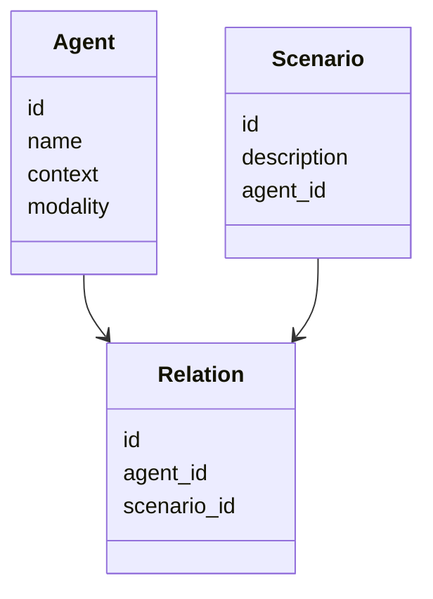
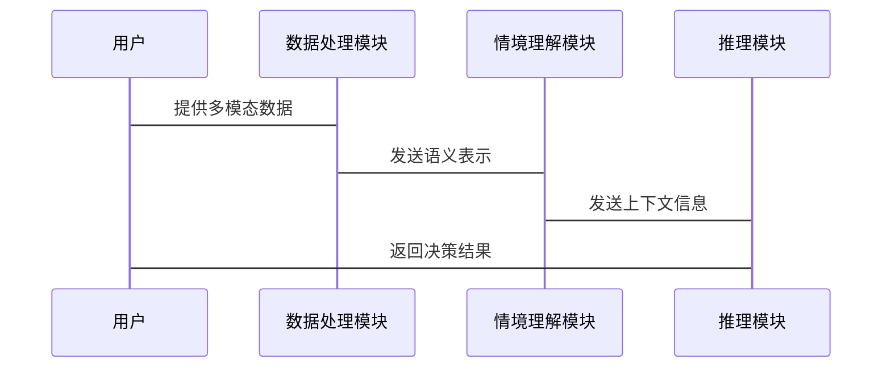

                 


# AI Agent的多模态情境理解与推理

> 关键词：AI Agent、多模态、情境理解、推理、系统架构

> 摘要：本文深入探讨AI Agent在多模态情境理解与推理领域的核心概念、算法原理、系统架构及实际应用。通过详细的背景分析、核心概念对比、算法流程图、系统类图及实际案例，全面解析多模态情境理解与推理的技术实现与实践应用。文章最后提供代码实现、项目实战及最佳实践建议，为读者提供系统的知识体系和实用的指导。

---

# 第1章: 多模态情境理解与推理的背景介绍

## 1.1 多模态情境理解与推理的核心概念

### 1.1.1 问题背景与问题描述
在复杂的现实场景中，AI Agent需要处理多种模态数据（如文本、图像、语音等）以理解情境并进行推理。然而，多模态数据的异构性和复杂性给情境理解与推理带来了巨大挑战。

### 1.1.2 问题解决的思路与方法
通过融合多模态数据，构建统一的语义表示，结合上下文分析与逻辑推理，实现对复杂情境的理解与决策。

### 1.1.3 多模态情境理解与推理的边界与外延
- 输入：多模态数据
- 输出：语义理解与决策
- 方法：数据融合、上下文分析、逻辑推理
- 外延：涵盖自然语言处理、计算机视觉、语音识别等多个领域

## 1.2 AI Agent的定义与演进

### 1.2.1 AI Agent的基本定义
AI Agent是一种能够感知环境、自主决策并执行任务的智能实体。

### 1.2.2 AI Agent的演进历程
从基于规则的简单Agent到深度学习驱动的复杂Agent，AI Agent不断进化，逐步具备多模态处理能力。

### 1.2.3 当前AI Agent的核心要素
- 感知能力：多模态数据处理
- 决策能力：基于情境的推理与决策
- 学习能力：持续优化与自适应

## 1.3 多模态情境理解与推理的技术背景

### 1.3.1 多模态数据的特点与优势
- 特点：异构性、互补性、复杂性
- 优势：提供更全面的信息，增强理解能力

### 1.3.2 情境理解的必要性与挑战
- 必要性：理解上下文以做出准确决策
- 挑战：数据融合、语义理解、实时性

### 1.3.3 推理能力的重要性与实现难点
- 重要性：基于情境做出推理和决策
- 实现难点：逻辑推理的复杂性、实时推理的效率

## 1.4 应用背景与实际案例

### 1.4.1 多模态情境理解与推理的应用领域
- 智能客服：多模态交互
- 智能助手：情境感知与决策
- 智慧城市：多源数据融合

### 1.4.2 典型案例分析与经验总结
以智能客服为例，多模态数据（文本、语音、用户行为）的融合提高了情境理解的准确性，从而提升了决策的效率。

### 1.4.3 未来发展趋势与研究方向
- 多模态数据的高效融合
- 高效推理算法的开发
- 实时性与可扩展性的提升

## 1.5 本章小结
本章介绍了多模态情境理解与推理的背景、核心概念、技术背景及应用案例，为后续章节奠定了基础。

---

# 第2章: 多模态情境理解与推理的核心概念与联系

## 2.1 核心概念原理

### 2.1.1 多模态数据处理的基本原理
通过数据预处理、特征提取和数据融合，将多模态数据转换为统一的语义表示。

### 2.1.2 情境理解的模型构建
基于上下文分析，构建语义网络，实现对情境的理解。

### 2.1.3 推理过程的逻辑框架
通过逻辑推理算法，从已知信息推导出结论或决策。

## 2.2 核心概念属性特征对比

| 概念 | 输入 | 输出 | 方法 | 特性 |
|------|------|------|------|------|
| 多模态数据处理 | 文本、图像、语音等 | 统一语义表示 | 融合算法 | 高度依赖模型设计 |
| 情境理解 | 统一语义表示 | 上下文语义 | 上下文分析 | 需要领域知识支持 |
| 推理过程 | 上下文语义 | 结论或决策 | 推理算法 | 需要逻辑推理能力 |

```mermaid
erDiagram
    agent [AI Agent] {
        id : integer
        name : string
        context : string
        modality : string
    }
    scenario [情境] {
        id : integer
        description : string
        agent_id : integer
    }
    relation [关联] {
        id : integer
        agent_id : integer
        scenario_id : integer
    }
    agent -[1..n] relation
    scenario -[0..1] relation
```

---

## 2.3 本章小结
本章通过核心概念对比和实体关系图，详细阐述了多模态情境理解与推理的关键要素及其相互关系。

---

# 第3章: 多模态情境理解与推理的算法原理

## 3.1 算法原理概述

### 3.1.1 多模态融合算法
通过将文本、图像等多模态数据进行融合，生成统一的语义表示。

### 3.1.2 上下文分析算法
基于语义网络进行上下文分析，提取关键信息。

### 3.1.3 推理算法
使用逻辑推理算法，从上下文信息中推导出结论。

## 3.2 多模态融合算法实现

### 3.2.1 算法流程
1. 数据预处理
2. 特征提取
3. 数据融合
4. 语义表示

### 3.2.2 算法代码实现
```python
import numpy as np

def modality_fusion(text_features, image_features):
    # 简单的融合方法：取平均值
    fused_features = np.mean([text_features, image_features], axis=0)
    return fused_features

# 示例文本和图像特征
text_features = np.random.rand(10)
image_features = np.random.rand(10)

# 融合特征
fused_features = modality_fusion(text_features, image_features)
print(fused_features)
```

### 3.2.3 数学模型与公式
$$
\text{融合特征} = \frac{\text{文本特征} + \text{图像特征}}{2}
$$

## 3.3 推理算法实现

### 3.3.1 推理流程
1. 输入上下文信息
2. 提取关键特征
3. 进行逻辑推理
4. 输出结论

### 3.3.2 推理算法代码
```python
def logical_inference(context_features):
    # 简单的逻辑推理：判断是否满足条件
    if context_features[0] > 0.5:
        return "结论1"
    else:
        return "结论2"

# 示例上下文特征
context_features = np.random.rand(10)

# 推理结果
result = logical_inference(context_features)
print(result)
```

### 3.3.3 推理数学模型
$$
\text{结论} = \begin{cases}
\text{结论1} & \text{如果 } f(x) > 0.5 \\
\text{结论2} & \text{否则}
\end{cases}
$$

## 3.4 本章小结
本章详细讲解了多模态融合算法和推理算法的实现方法，并通过代码示例和数学公式进行了说明。

---

# 第4章: 多模态情境理解与推理的系统架构设计

## 4.1 系统分析

### 4.1.1 问题场景介绍
设计一个多模态AI Agent，能够处理文本、图像等多种数据，实现情境理解与推理。

### 4.1.2 系统介绍
系统包括数据输入、数据处理、情境理解与推理、决策输出四个模块。

## 4.2 系统功能设计

### 4.2.1 领域模型设计


### 4.2.2 系统架构设计


### 4.2.3 系统接口设计
- 输入接口：接收多模态数据
- 输出接口：输出决策结果
- 接口设计：RESTful API

### 4.2.4 系统交互流程图


## 4.3 本章小结
本章详细设计了多模态情境理解与推理系统的架构，并通过类图和流程图展示了系统的实现细节。

---

# 第5章: 多模态情境理解与推理的项目实战

## 5.1 环境安装与配置

### 5.1.1 安装依赖
```bash
pip install numpy matplotlib
```

### 5.1.2 环境配置
```bash
export PATH=/path/to/your/environment/bin:$PATH
```

## 5.2 系统核心实现

### 5.2.1 核心代码实现
```python
import numpy as np
import matplotlib.pyplot as plt

def plot_feature_distribution(features, label):
    plt.hist(features, bins=10, alpha=0.5, label=label)
    plt.legend()
    plt.show()

# 示例特征
features = np.random.rand(100)
label = "融合特征分布"

# 绘制分布图
plot_feature_distribution(features, label)
```

### 5.2.2 代码功能解读
- 功能：绘制特征分布图
- 输入：特征向量和标签
- 输出：绘制的图像

## 5.3 实际案例分析

### 5.3.1 案例背景
以智能客服为例，处理用户输入的文本和语音数据。

### 5.3.2 数据处理
- 文本数据：情感分析
- 语音数据：语调分析

### 5.3.3 情境理解
- 上下文分析：用户情绪
- 语义理解：用户需求

### 5.3.4 推理与决策
- 推理：用户需求与情绪的结合
- 决策：提供个性化服务

## 5.4 项目小结
本章通过实际案例分析，展示了多模态情境理解与推理技术的应用，并总结了项目实施的经验。

---

# 第6章: 多模态情境理解与推理的最佳实践

## 6.1 小贴士

### 6.1.1 数据处理
- 确保数据质量
- 处理数据异构性

### 6.1.2 模型选择
- 根据任务选择合适的模型
- 考虑计算效率

### 6.1.3 推理优化
- 优化推理算法
- 提高推理效率

## 6.2 注意事项

### 6.2.1 数据隐私
- 确保数据安全
- 遵守隐私保护法规

### 6.2.2 系统性能
- 优化系统架构
- 提高处理效率

### 6.2.3 可扩展性
- 设计可扩展的系统
- 考虑未来的扩展需求

## 6.3 拓展阅读

### 6.3.1 推荐书籍
- 《深度学习》
- 《自然语言处理实战》

### 6.3.2 推荐论文
- "Multi-modal Fusion: A Survey"
- "Contextual Understanding with Neural Networks"

## 6.4 本章小结
本章提供了多模态情境理解与推理技术的最佳实践建议，包括小贴士、注意事项和拓展阅读内容。

---

# 作者：AI天才研究院/AI Genius Institute & 禅与计算机程序设计艺术 /Zen And The Art of Computer Programming

