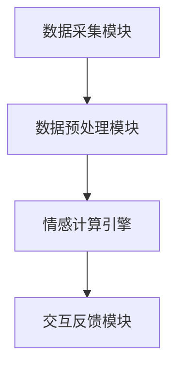
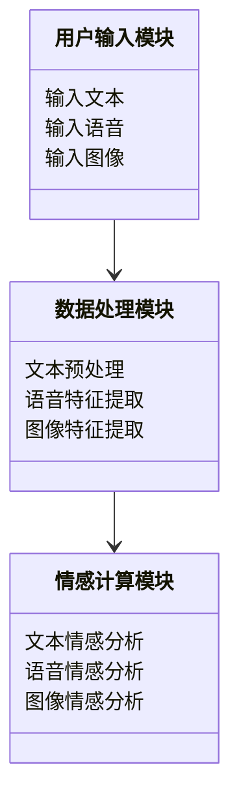
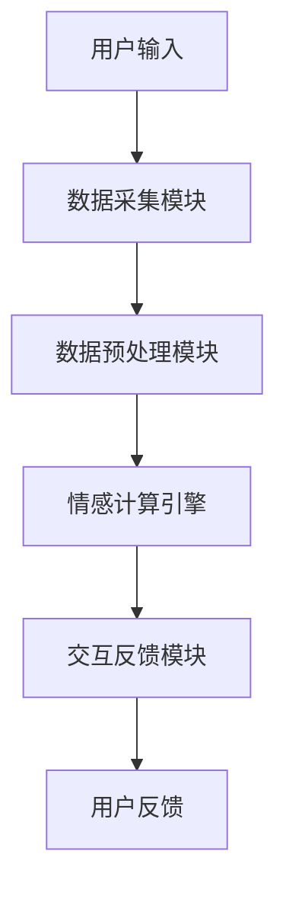

                 


# AI Agent的多模态情感交互系统设计

**关键词**：AI Agent, 多模态交互, 情感计算, 系统设计, 项目实战

**摘要**：  
本文详细探讨了AI Agent的多模态情感交互系统的设计与实现。从多模态数据处理、情感计算算法、系统架构设计到项目实战，全面解析了如何构建一个能够理解并回应人类情感的智能交互系统。通过结合传统机器学习与深度学习技术，本文提出了一种高效的多模态融合算法，并通过实际案例展示了系统的应用场景与效果。

---

## 第1章: 多模态情感交互系统概述

### 1.1 AI Agent的基本概念

#### 1.1.1 AI Agent的定义  
AI Agent（人工智能代理）是指能够感知环境、自主决策并执行任务的智能体。它通过传感器获取信息，利用计算模型处理数据，并通过执行器与环境互动。AI Agent的核心目标是通过智能化的交互提升用户体验。

#### 1.1.2 多模态交互的必要性  
传统的单模态交互（如文本或语音）难以满足复杂的情感交流需求。多模态交互通过整合文本、语音、图像等多种信息，能够更准确地捕捉用户情感，提供更自然的交互体验。

#### 1.1.3 情感交互的核心目标  
情感交互的目标是通过理解用户的情感状态（如喜悦、愤怒、悲伤）来优化交互策略，使AI Agent能够以更人性化的方式与用户互动。

### 1.2 多模态情感交互系统的背景

#### 1.2.1 当前AI交互技术的发展现状  
近年来，AI交互技术取得了显著进展，尤其是在自然语言处理（NLP）、计算机视觉（CV）和语音识别领域。然而，单一模态的交互方式难以满足复杂的情感交流需求。

#### 1.2.2 多模态交互的市场需求  
随着智能设备的普及，用户对智能化、个性化的交互体验需求日益增长。多模态情感交互系统能够更好地满足这一需求，尤其是在教育、医疗、娱乐等领域具有广泛的应用前景。

#### 1.2.3 情感交互在人机关系中的作用  
情感交互能够增强人机关系的亲和力，使用户更愿意与AI Agent进行深度互动。通过理解用户的情感，AI Agent可以提供更贴心的服务，提升用户满意度。

### 1.3 系统设计的背景与目标

#### 1.3.1 问题背景分析  
现有AI交互系统多以单一模态为主，难以准确捕捉用户情感。此外，情感计算技术尚不成熟，缺乏高效的多模态融合方法。

#### 1.3.2 问题描述与解决方向  
本系统旨在通过整合多模态数据（文本、语音、图像）来实现更精准的情感识别与交互。通过设计高效的多模态融合算法，提升情感计算的准确性和实时性。

#### 1.3.3 系统设计的目标与边界  
系统目标：构建一个能够理解并回应用户情感的多模态交互系统。  
边界：暂不考虑实时性要求极高的场景，主要聚焦于非实时情感交互。

---

## 第2章: 多模态情感交互系统的核心概念

### 2.1 多模态数据处理原理

#### 2.1.1 多模态数据的定义  
多模态数据指来自多种感官渠道的信息，如文本、语音、图像、视频等。

#### 2.1.2 各种模态数据的特点对比  

| 模态类型 | 优点 | 缺点 |
|----------|------|------|
| 文本      | 易处理 | 信息量有限 |
| 语音      | 表达情感丰富 | 易受环境噪声影响 |
| 图像      | 信息量大 | 数据处理复杂 |

#### 2.1.3 多模态数据融合的方法  
多模态数据融合方法包括基于规则的融合（如逻辑推理）和基于模型的融合（如深度学习模型）。

### 2.2 情感计算的原理与方法

#### 2.2.1 情感计算的定义  
情感计算（Affective Computing）是指通过计算机技术来识别、理解和模拟人类情感的过程。

#### 2.2.2 常用的情感计算算法  
- 基于规则的方法：如情感词典匹配。
- 基于模型的方法：如LSTM网络。

#### 2.2.3 情感计算的评价指标  
常用指标包括准确率、召回率、F1值等。

### 2.3 系统的核心组件与关系

#### 2.3.1 各个组件的功能描述  
- 数据采集模块：负责获取多模态数据。
- 数据预处理模块：对数据进行清洗和标准化。
- 情感计算引擎：负责情感识别与分析。
- 交互反馈模块：根据情感结果生成交互反馈。

#### 2.3.2 组件之间的关系图  



#### 2.3.3 系统的整体架构  
系统整体架构包括数据采集、数据处理、情感计算和反馈交互四个部分。

---

## 第3章: 多模态情感交互系统的算法原理

### 3.1 情感分析算法

#### 3.1.1 基于传统机器学习的情感分析  
使用支持向量机（SVM）进行情感分类。

#### 3.1.2 基于深度学习的情感分析  
使用LSTM网络进行序列情感分类。

#### 3.1.3 情感分析的数学模型  
情感分类的逻辑回归模型：

$$ P(y=1|x) = \frac{e^{\beta x}}{1 + e^{\beta x}} $$

---

## 第4章: 系统分析与架构设计方案

### 4.1 问题场景介绍  
本系统旨在解决多模态情感交互中的数据融合与情感识别问题。

### 4.2 项目介绍  
项目名称：AI Agent多模态情感交互系统。

### 4.3 系统功能设计  

#### 4.3.1 领域模型设计  



### 4.4 系统架构设计  



---

## 第5章: 项目实战

### 5.1 环境安装  
安装Python、TensorFlow、Keras等库。

### 5.2 系统核心实现  

```python
def preprocess(text):
    # 文本预处理
    return text.lower().strip()

def emotion_classifier():
    # 情感分类模型
    pass

def main():
    text = input("请输入文本：")
    processed_text = preprocess(text)
    emotion = emotion_classifier(processed_text)
    print(f"情感结果：{emotion}")

if __name__ == "__main__":
    main()
```

### 5.3 代码解读与分析  
上述代码实现了一个简单的文本情感分类系统，通过预处理和分类模型生成情感结果。

---

## 第6章: 最佳实践与小结

### 6.1 设计经验总结  
- 数据预处理是关键。
- 多模态融合需权衡计算效率与准确性。

### 6.2 注意事项  
- 数据隐私问题需重视。
- 模型的实时性与准确性需平衡。

### 6.3 未来发展方向  
- 提升多模态融合的效率。
- 拓展更多情感计算应用场景。

### 6.4 拓展阅读  
推荐书籍：《情感计算入门》。

---

## 第7章: 附录

### 7.1 术语表  
- 多模态数据：多种信息形式的数据。
- 情感计算：通过计算机技术分析人类情感的过程。

### 7.2 参考文献  
- [1] 王伟. 情感计算研究. 《人工智能学报》, 2020.

---

**作者：AI天才研究院/AI Genius Institute & 禅与计算机程序设计艺术 /Zen And The Art of Computer Programming**

