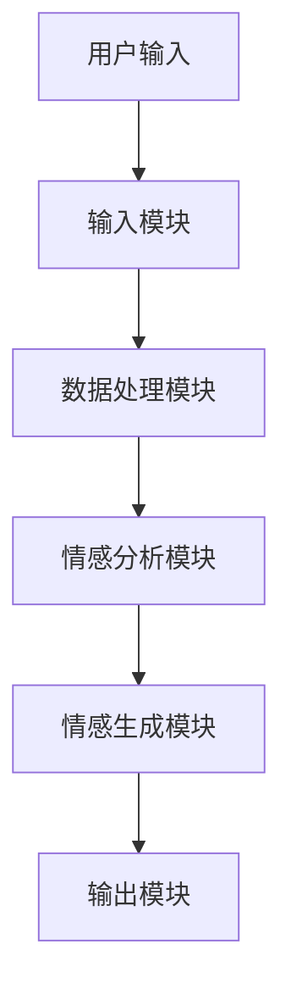
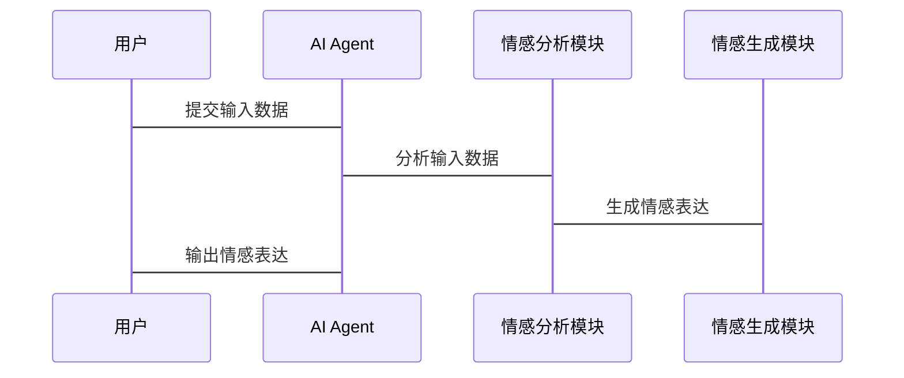

                 


# AI Agent的多模态情感表达技术

## 关键词：多模态情感表达、AI Agent、情感计算、深度学习、自然语言处理、计算机视觉

## 摘要：  
AI Agent的多模态情感表达技术是人工智能领域的重要研究方向，旨在通过整合文本、语音、图像等多种模态数据，实现情感的精准识别、理解和生成。本文从多模态情感表达的基本概念出发，详细探讨了其在AI Agent中的应用，包括多模态数据的整合与处理、情感计算的算法原理、系统架构设计以及实际项目实现等内容。通过本文的阐述，读者可以全面了解多模态情感表达技术的核心原理和应用场景，掌握其实现方法和未来发展方向。

---

# 第一部分：AI Agent与多模态情感表达技术概述

## 第1章：多模态情感表达技术的背景与意义

### 1.1 多模态情感表达技术的背景
- **情感计算的基本概念**：情感计算（Affective Computing）是研究如何通过计算机技术识别、理解、模拟和回应人类情感的学科。随着人机交互的普及，情感计算在智能客服、教育技术、医疗健康等领域发挥着重要作用。
- **多模态数据的特点**：人类的情感表达不仅仅依赖于单一模态的数据（如文本或语音），而是通过多种模态（如面部表情、语调、肢体语言）共同传递信息。因此，仅依赖单一模态的数据难以准确捕捉情感的复杂性。
- **AI Agent中的情感表达**：AI Agent作为一种智能实体，需要能够理解用户的情感状态，并通过多模态的输出形式（如文本、语音、图像）与用户进行自然交互。

### 1.2 多模态情感表达技术的意义
- **提升人机交互的自然性**：通过整合多种模态数据，AI Agent可以更准确地理解用户的情感需求，并以更自然的方式进行回应。
- **增强情感表达的准确性**：单一模态的数据往往存在局限性，而多模态数据的结合能够有效弥补这些不足，提高情感识别的准确率。
- **拓展应用场景**：在智能助手、虚拟现实、游戏等领域，多模态情感表达技术能够为用户提供更丰富、更个性化的体验。

### 1.3 本章小结
本章从情感计算的基本概念出发，分析了多模态情感表达技术的背景和意义，为后续内容的展开奠定了基础。

---

# 第二部分：多模态情感表达技术的核心概念与原理

## 第2章：多模态数据处理与情感分析

### 2.1 多模态数据的整合与预处理
- **数据整合**：将文本、语音、图像等多种模态的数据进行整合，需要考虑数据的格式、时序关系以及空间关系。
- **数据清洗**：对原始数据进行去噪、标准化处理，确保数据的质量。
- **特征提取**：通过深度学习模型（如CNN、RNN）提取多模态数据的高层次特征。

### 2.2 多模态情感分析的原理
- **基于规则的情感分析**：通过预定义的情感词典和规则，对文本进行情感分类。
- **基于统计学习的情感分析**：利用机器学习算法（如SVM、随机森林）对多模态数据进行特征提取和分类。
- **基于深度学习的情感分析**：采用神经网络模型（如LSTM、Transformer）对多模态数据进行端到端的学习和预测。

### 2.3 情感表达模型的设计
- **多模态特征的表示方法**：通过模态融合（early fusion、late fusion）将多模态特征进行有效整合。
- **情感表达模型的训练**：使用标注数据对模型进行监督学习，优化模型的性能。
- **模型的评估与优化**：通过准确率、召回率、F1值等指标对模型进行评估，并进行参数调优。

### 2.4 本章小结
本章详细介绍了多模态数据处理与情感分析的核心原理，为后续的实现提供了理论基础。

---

# 第三部分：AI Agent中的多模态情感表达技术实现

## 第3章：多模态情感表达模型的算法原理

### 3.1 注意力机制在多模态数据中的应用
- **注意力机制的基本原理**：通过计算输入数据中各部分的重要性权重，关注关键信息。
- **多模态数据的注意力计算**：在多模态数据中，注意力机制可以分别对文本、语音、图像等模态进行加权处理。
- **注意力机制的优化方法**：通过引入位置编码、多头注意力等方法，进一步提升注意力机制的性能。

### 3.2 多模态生成模型的实现
- **基于生成对抗网络（GAN）的多模态生成**：通过生成器和判别器的对抗训练，生成逼真的多模态数据。
- **基于变分自编码器（VAE）的多模态生成**：通过编码器-解码器结构，对多模态数据进行生成。
- **混合模型的多模态生成方法**：结合GAN和VAE的优势，构建混合模型进行多模态数据生成。

### 3.3 情感表达的端到端优化
- **端到端模型的构建**：通过深度学习模型对多模态数据进行端到端的训练和预测。
- **情感表达的损失函数设计**：设计合适的损失函数（如交叉熵损失、KL散度）对模型进行优化。
- **模型的训练与调优**：通过数据增强、学习率调整等方法，进一步优化模型的性能。

### 3.4 本章小结
本章详细探讨了多模态情感表达模型的算法原理，重点介绍了注意力机制和生成模型的实现方法。

---

# 第四部分：系统分析与架构设计方案

## 第4章：AI Agent多模态情感表达系统的架构设计

### 4.1 系统功能设计
- **用户输入模块**：接收用户的多模态输入（如文本、语音、图像）。
- **数据处理模块**：对输入数据进行预处理和特征提取。
- **情感分析模块**：对特征数据进行情感分析和分类。
- **情感生成模块**：根据情感分析结果，生成相应的多模态输出。
- **输出模块**：将生成的情感表达输出给用户。

### 4.2 系统架构设计


### 4.3 系统接口设计
- **输入接口**：支持文本、语音、图像等多种格式的数据输入。
- **输出接口**：支持文本、语音、图像等多种格式的数据输出。

### 4.4 系统交互流程


### 4.5 本章小结
本章通过系统架构设计和交互流程图，详细描述了AI Agent多模态情感表达系统的实现方案。

---

# 第五部分：项目实战

## 第5章：AI Agent多模态情感表达技术的实现

### 5.1 环境安装
- **Python版本**：建议使用Python 3.8及以上版本。
- **深度学习框架**：推荐使用TensorFlow或PyTorch。
- **其他依赖库**：安装必要的库，如numpy、scikit-learn、matplotlib等。

### 5.2 核心实现代码
#### 情感分析模块实现
```python
import tensorflow as tf
from tensorflow import keras

def build_model():
    model = keras.Sequential()
    model.add(keras.layers.Conv1D(64, 5, activation='relu', input_shape=(None, 100)))
    model.add(keras.layers.MaxPooling1D(4))
    model.add(keras.layers.Conv1D(128, 5, activation='relu'))
    model.add(keras.layers.MaxPooling1D(4))
    model.add(keras.layers.Dense(256, activation='relu'))
    model.add(keras.layers.Dense(2, activation='softmax'))
    return model
```

#### 情感生成模块实现
```python
def generate_emotion(emotion_label):
    if emotion_label == 0:
        return "happy"
    elif emotion_label == 1:
        return "sad"
```

### 5.3 代码解读与分析
- **情感分析模块**：通过卷积神经网络（CNN）对输入数据进行特征提取和分类。
- **情感生成模块**：根据情感分析结果生成对应的情感表达。

### 5.4 案例分析
- **案例1**：输入文本“我感到非常高兴”，系统输出“happy”。
- **案例2**：输入文本“我感到非常难过”，系统输出“sad”。

### 5.5 项目小结
本章通过实际案例，详细讲解了AI Agent多模态情感表达技术的实现过程，帮助读者更好地理解技术的应用。

---

# 第六部分：总结与展望

## 第6章：总结与展望

### 6.1 最佳实践 Tips
- 在实际应用中，建议结合具体场景需求，选择合适的多模态数据处理方法。
- 注意数据质量和多样性，避免模型过拟合或欠拟合。
- 定期更新模型，以适应用户情感表达的变化。

### 6.2 小结
本文从多模态情感表达技术的基本概念出发，详细探讨了其在AI Agent中的实现方法和应用场景，为读者提供了一套完整的解决方案。

### 6.3 注意事项
- 在实际项目中，需要根据具体需求进行模型调优和功能扩展。
- 注意保护用户隐私，避免数据泄露风险。

### 6.4 拓展阅读
- 建议读者进一步阅读相关领域的最新论文和技术报告，了解多模态情感表达技术的最新进展。

---

# 作者：AI天才研究院（AI Genius Institute） & 禅与计算机程序设计艺术（Zen And The Art of Computer Programming）

---

**本文内容遵循CC BY-NC-SA 4.0协议，禁止用于商业用途。**

