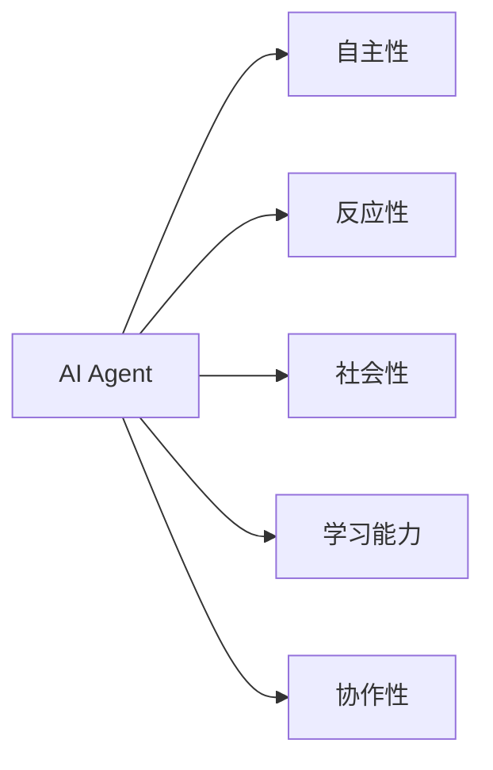
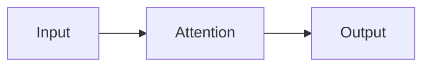
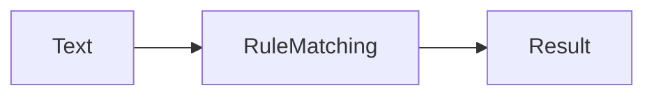
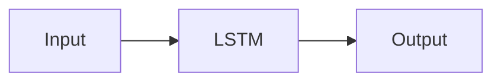
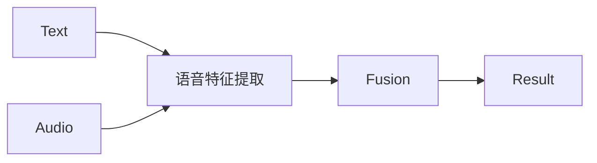
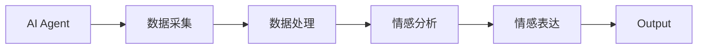
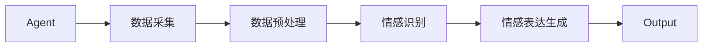
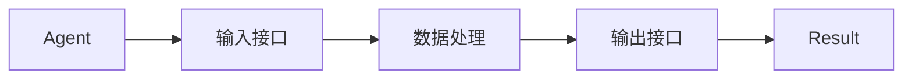
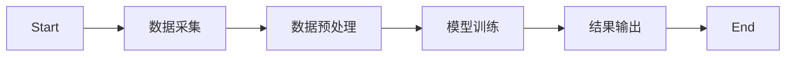

                 

# AI Agent的多模态情感计算与表达

## 关键词：
- AI Agent
- 多模态情感计算
- 情感表达
- 深度学习
- 多模态数据融合

## 摘要：
本文深入探讨AI Agent在多模态情感计算与表达中的应用，涵盖背景、核心概念、算法原理、系统架构及项目实战。通过详细分析多模态数据处理、情感计算模型以及系统设计，结合实际案例，展示如何实现高效的情感计算与表达。本文旨在为研究人员和技术从业者提供全面的理论与实践指导，推动AI Agent在情感智能领域的进一步发展。

---

## 第1章: AI Agent概述

### 1.1 AI Agent的定义与特点
AI Agent（智能体）是指在计算机系统中能够感知环境并采取行动以实现目标的实体。其特点包括自主性、反应性、社会性、学习能力和协作性。

#### 图1-1: AI Agent的基本概念

### 1.2 多模态情感计算的背景与意义
情感计算旨在理解、识别和模拟人类情感。多模态数据（如文本、语音、图像）的结合，提升了情感计算的准确性和丰富性。

#### 图1-2: 情感计算流程

### 1.3 情感表达的多模态整合
通过整合多种数据模态，AI Agent能够更准确地理解和表达情感。常见的情感表达方式包括文本、语音和面部表情。

---

## 第2章: 多模态情感计算的核心概念

### 2.1 情感计算的基本原理
情感计算涉及数据采集、特征提取和情感识别。基于机器学习和深度学习的方法被广泛应用。

#### 图2-1: 情感计算流程图

### 2.2 多模态数据的处理方法
多模态数据的预处理和融合是关键步骤。常用方法包括特征对齐和融合策略。

#### 表2-1: 多模态数据特征对比
| 特征 | 文本 | 语音 | 图像 |
|------|------|------|------|
| 类型 | 文本序列 | 频率/幅度 | 像素值 |
| 处理 | 分词/词嵌入 | 频率分析 | 坍塌/边缘检测 |

### 2.3 情感表达的多模态融合
通过融合多模态数据，提升情感计算的准确性和鲁棒性。常用方法包括加权融合和注意力机制。

#### 图2-2: 注意力机制示意图

---

## 第3章: 多模态情感计算的算法原理

### 3.1 情感计算的基础算法
基于规则和机器学习的情感分析方法。

#### 图3-1: 基于规则的情感分析流程

### 3.2 深度学习在情感计算中的应用
深度学习模型如LSTM和Transformer在情感分析中表现优异。

#### 图3-2: LSTM情感分析模型

### 3.3 多模态数据融合的算法
基于特征融合和模型融合的方法。

#### 图3-3: 多模态融合流程

---

## 第4章: 多模态情感计算的系统架构

### 4.1 系统架构设计
AI Agent的情感计算系统包括数据采集、处理、分析和输出模块。

#### 图4-1: 系统架构图

### 4.2 系统功能模块划分
模块包括数据预处理、情感识别和情感表达生成。

#### 图4-2: 系统功能模块

### 4.3 系统接口设计
系统接口需处理多模态数据输入和输出。

#### 图4-3: 系统接口设计

---

## 第5章: 项目实战

### 5.1 项目概述
构建一个基于文本、语音和面部表情的多模态情感分析系统。

### 5.2 环境配置
安装Python、TensorFlow和相关库。

### 5.3 核心实现
实现特征提取、模型训练和结果输出。

#### 图5-1: 项目流程

---

## 第6章: 总结与展望

### 6.1 总结
本文系统介绍了AI Agent的多模态情感计算与表达，涵盖理论与实践。

### 6.2 未来展望
未来研究方向包括更高效的情感计算算法和跨领域应用。

---

## 作者：AI天才研究院/AI Genius Institute & 禅与计算机程序设计艺术 /Zen And The Art of Computer Programming

---

**本文为AI天才研究院原创，转载请注明出处。**

