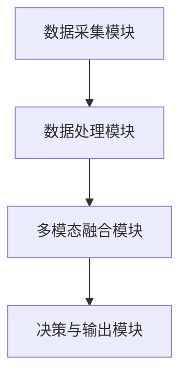
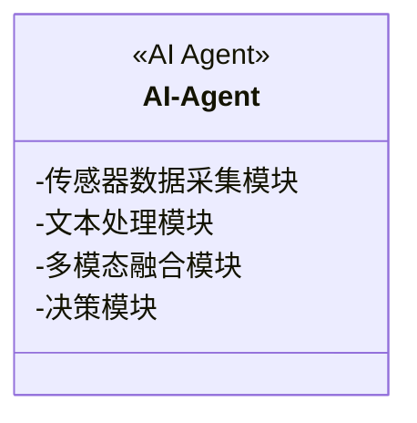
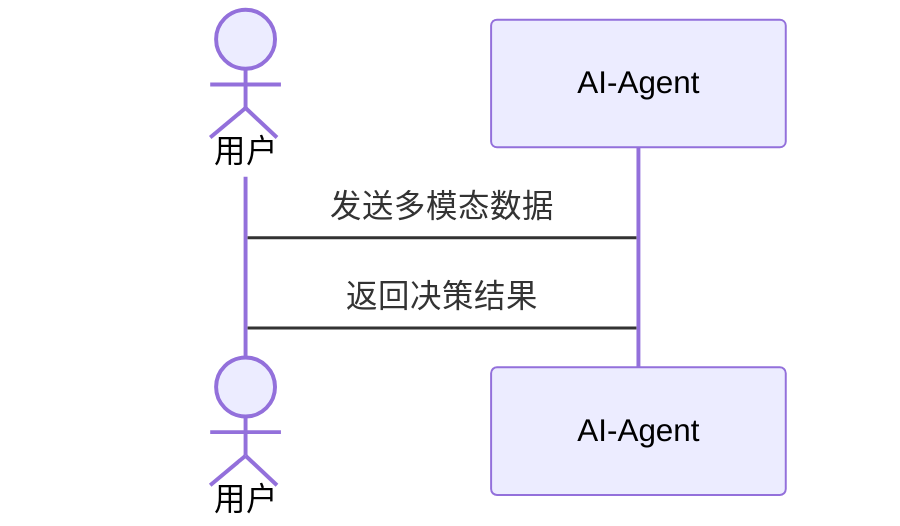

                 


# AI Agent的多模态理解：整合LLM与传感器数据

**关键词：** AI Agent，多模态理解，大语言模型（LLM），传感器数据，数据融合，系统架构

**摘要：** 本文探讨AI Agent在多模态数据整合中的应用，重点分析如何将大语言模型（LLM）与传感器数据相结合，提升AI Agent的感知、理解与决策能力。文章从背景、核心概念、算法原理、系统架构到实际案例，详细阐述了多模态理解的整合方法与实现路径，为AI Agent的技术发展提供了深入的理论与实践指导。

---

# 第1章: AI Agent与多模态理解概述

## 1.1 AI Agent的基本概念

### 1.1.1 AI Agent的定义与特点
- AI Agent（智能体）是指能够感知环境、自主决策并执行任务的智能系统。
- 其特点包括：
  - **自主性**：无需外部干预，自主完成任务。
  - **反应性**：能够实时感知环境变化并做出反应。
  - **目标导向性**：以明确的目标为导向进行决策。
  - **学习能力**：通过数据或经验不断优化自身能力。

### 1.1.2 多模态理解的核心概念
- 多模态理解指AI Agent能够同时处理多种类型的数据（如文本、图像、声音、传感器数据等）并从中提取信息。
- 其核心目标是通过多模态数据的协同作用，提升AI Agent的感知能力、理解能力和决策能力。

### 1.1.3 AI Agent在多模态理解中的作用
- AI Agent作为多模态数据的整合者与执行者，能够将来自不同模态的数据进行融合，形成对环境的全面理解。
- 通过多模态数据的协同，AI Agent能够做出更准确、更可靠的决策。

## 1.2 LLM与传感器数据的整合背景

### 1.2.1 大语言模型（LLM）的发展历程
- 从早期的简单文本生成模型到现在的大型预训练模型（如GPT系列、BERT系列），LLM的能力不断提升。
- LLM的核心优势在于其强大的文本理解和生成能力，能够处理复杂的语义信息。

### 1.2.2 传感器数据的类型与特点
- **传感器数据**包括来自摄像头、麦克风、温度传感器等多种设备的数据。
- 其特点：
  - **实时性**：能够实时感知环境变化。
  - **多样性**：涵盖视觉、听觉、触觉等多种感知方式。
  - **连续性**：数据通常是连续的、时间相关的。

### 1.2.3 LLM与传感器数据整合的必要性
- 单独使用LLM会导致对环境理解的片面性，无法处理实时的物理世界信息。
- 单独使用传感器数据难以进行语义理解，无法与人类语言进行有效交互。
- 通过整合LLM与传感器数据，AI Agent能够实现对物理世界与语义世界的统一理解。

## 1.3 问题背景与目标

### 1.3.1 当前AI Agent的局限性
- 传统AI Agent往往局限于单一模态的数据处理，难以应对复杂的多模态场景。
- 语义理解能力有限，难以进行深度的语义交互。

### 1.3.2 多模态理解的挑战与机遇
- **挑战**：
  - 多模态数据的异构性：不同类型的数据格式、语义差异大。
  - 数据融合的复杂性：如何有效整合不同类型的数据并提取有用的信息。
  - 计算资源的需求：多模态数据的处理需要较高的计算能力。
- **机遇**：
  - 提升AI Agent的感知能力，使其能够更好地理解复杂环境。
  - 为人类与AI Agent的交互提供更自然、更丰富的接口。

### 1.3.3 本书的研究目标与意义
- 本书旨在探讨如何将LLM与传感器数据进行有效整合，构建具备多模态理解能力的AI Agent。
- 通过理论分析与实践案例相结合，为AI Agent的技术发展提供参考。

## 1.4 本章小结
- 本章介绍了AI Agent与多模态理解的基本概念，分析了LLM与传感器数据整合的背景与必要性。
- 通过讨论当前AI Agent的局限性与多模态理解的挑战与机遇，明确了本书的研究目标与意义。

---

# 第2章: 多模态数据的整合与分析

## 2.1 多模态数据的分类与特征

### 2.1.1 文本数据的特点
- **结构化**：文本数据通常以字符、词语、句子的形式组织。
- **语义丰富**：文本能够表达复杂的语义信息。
- **多样性**：文本数据可以是新闻、对话、文档等多种形式。

### 2.1.2 图像数据的特点
- **视觉性**：图像数据以视觉信息为主。
- **空间性**：图像数据具有空间关系，能够反映物体的位置与形状。
- **多样性**：图像数据可以是照片、图表、图形等多种形式。

### 2.1.3 传感器数据的特点
- **实时性**：传感器数据通常是实时采集的。
- **连续性**：数据通常是连续的、时间相关的。
- **多样性**：传感器数据可以是温度、湿度、光照等多种物理量。

## 2.2 多模态数据的融合方法

### 2.2.1 数据层面的融合
- 在数据层面进行融合，即将不同模态的数据进行简单的拼接或组合。
- 例如，将文本数据与图像数据进行简单的拼接，形成一个多模态的数据输入。

### 2.2.2 特征层面的融合
- 在特征层面进行融合，即将不同模态的数据分别提取特征后，进行融合。
- 例如，将图像数据提取视觉特征，将文本数据提取语义特征，然后将这些特征进行融合。

### 2.2.3 决策层面的融合
- 在决策层面进行融合，即将不同模态的数据分别用于不同的决策模块，然后将决策结果进行整合。
- 例如，图像数据用于目标检测，文本数据用于语义理解，最终将两者的结果进行融合，形成最终的决策。

## 2.3 LLM与传感器数据的协同机制

### 2.3.1 LLM在文本处理中的优势
- LLM能够处理复杂的语义信息，能够进行自然语言理解与生成。
- LLM具有强大的上下文理解能力，能够处理长文本信息。

### 2.3.2 传感器数据的时空特性
- 传感器数据通常具有时空特性，能够反映物体的位置、运动状态等信息。
- 传感器数据的时间序列特性使其能够用于预测与实时分析。

### 2.3.3 两者的互补性与协同性
- LLM擅长处理语义信息，而传感器数据擅长处理物理世界的信息。
- 通过将两者进行协同，AI Agent能够实现对物理世界与语义世界的统一理解。

## 2.4 本章小结
- 本章分析了多模态数据的分类与特征，探讨了多模态数据的融合方法。
- 重点讨论了LLM与传感器数据的协同机制，分析了两者在AI Agent中的互补性与协同性。

---

# 第3章: 多模态融合算法概述

## 3.1 多模态数据融合的数学模型

### 3.1.1 联合概率分布模型
- 多模态数据的联合概率分布可以表示为：
$$ P(x,y) = \frac{P(x|y)P(y)}{P(x)} $$
- 其中，$x$ 表示一种模态的数据，$y$ 表示另一种模态的数据。

### 3.1.2 图论与知识图谱模型
- 图论模型通过构建图结构来表示多模态数据之间的关系。
- 知识图谱模型通过构建语义网络来表示多模态数据的语义关系。

### 3.1.3 神经网络融合模型
- 神经网络融合模型通过深度学习方法来融合多模态数据。
- 例如，多模态双向Transformer网络（MM-BERT）可以同时处理文本和图像数据。

## 3.2 基于LLM的多模态理解算法

### 3.2.1 文本到多模态的映射
- 通过将文本数据映射到多模态空间，实现文本与图像、传感器数据的协同理解。
- 例如，将文本描述的场景映射到图像空间，形成图像的语义表示。

### 3.2.2 多模态特征的联合表示
- 将不同模态的数据特征进行联合表示，形成统一的语义表示。
- 例如，将图像特征与文本特征进行融合，形成一个多维的语义表示。

### 3.2.3 基于LLM的多模态推理
- 利用LLM进行多模态推理，将不同模态的数据特征进行融合，形成最终的推理结果。
- 例如，结合图像信息和文本信息，进行目标检测与语义理解。

## 3.3 算法实现的数学公式
- 多模态融合的公式可以表示为：
$$ f(x) = \sigma(Wx + b) $$
- 其中，$W$ 是权重矩阵，$b$ 是偏置项，$\sigma$ 是激活函数。

## 3.4 本章小结
- 本章介绍了多模态数据融合的数学模型，探讨了基于LLM的多模态理解算法。
- 通过公式推导与模型分析，展示了多模态数据融合的实现方法。

---

# 第4章: AI Agent的系统架构设计

## 4.1 系统功能设计

### 4.1.1 数据采集模块
- 负责采集多模态数据，包括文本、图像、传感器数据等。

### 4.1.2 数据处理模块
- 对采集到的数据进行预处理，包括清洗、归一化等。

### 4.1.3 多模态融合模块
- 将不同模态的数据进行融合，形成统一的语义表示。

### 4.1.4 决策与输出模块
- 根据融合后的数据，进行决策并输出结果。

## 4.2 系统架构图


## 4.3 系统实现细节

### 4.3.1 领域模型类图


### 4.3.2 系统交互序列图


## 4.4 本章小结
- 本章设计了AI Agent的系统架构，包括数据采集、处理、融合与决策输出模块。
- 通过类图与序列图展示了系统的整体架构与交互流程。

---

# 第5章: 项目实战与案例分析

## 5.1 项目背景
- 某智能家居系统需要通过AI Agent实现对家庭环境的智能监控与管理。

## 5.2 环境安装
- **安装Python**：版本要求3.8及以上。
- **安装TensorFlow**：用于深度学习模型的训练与部署。
- **安装OpenCV**：用于图像处理与计算机视觉。
- **安装传感器驱动**：用于采集环境数据。

## 5.3 核心代码实现

### 5.3.1 数据采集模块
```python
import numpy as np

class SensorDataCollector:
    def __init__(self):
        self.sensors = []
    
    def add_sensor(self, sensor):
        self.sensors.append(sensor)
    
    def collect_data(self):
        data = []
        for sensor in self.sensors:
            data.append(sensor.read())
        return data
```

### 5.3.2 多模态融合模块
```python
import tensorflow as tf

class MultiModalFuser:
    def __init__(self, model_path):
        self.model = tf.keras.models.load_model(model_path)
    
    def fuse(self, text, image):
        # 将文本与图像数据输入模型
        input_text = tf.keras.preprocessing.text.text_to_word_sequence(text)
        input_image = tf.keras.preprocessing.image.load_image(image)
        input_image = tf.keras.preprocessing.image.img_to_array(input_image)
        # 预测结果
        prediction = self.model.predict([input_text, input_image])
        return prediction[0]
```

## 5.4 项目运行与结果分析
- 通过运行代码，AI Agent能够实时采集环境数据并进行多模态融合，最终输出决策结果。
- 例如，当检测到室内温度过高时，AI Agent会触发空调开启的指令。

## 5.5 本章小结
- 本章通过一个智能家居项目的实际案例，展示了AI Agent在多模态数据整合中的应用。
- 通过代码实现与结果分析，验证了多模态数据整合的有效性。

---

# 第6章: 最佳实践与总结

## 6.1 小结
- 本文详细探讨了AI Agent在多模态数据整合中的应用，重点分析了LLM与传感器数据的协同机制。
- 通过理论分析与实践案例，展示了如何将多模态数据整合到AI Agent中，提升其感知、理解与决策能力。

## 6.2 注意事项
- 在实际应用中，需要注意多模态数据的异构性与融合的复杂性。
- 需要合理选择数据融合的方法，确保系统的性能与效率。
- 需要关注模型的可解释性与鲁棒性，确保系统的安全与稳定。

## 6.3 扩展阅读
- 《Large Language Models: A Survey》
- 《Multi-modal Data Fusion: A Comprehensive Survey》
- 《Deep Learning for Multi-modal Data Processing》

---

# 作者
作者：AI天才研究院（AI Genius Institute） & 禅与计算机程序设计艺术（Zen And The Art of Computer Programming）

