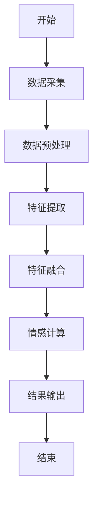
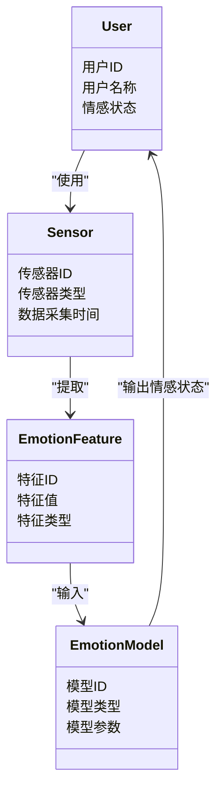
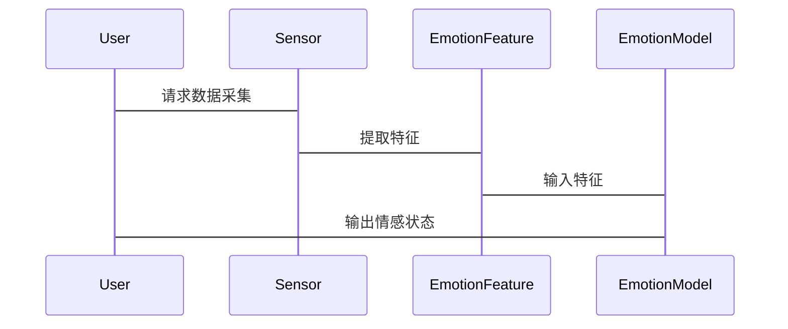

                 


# AI Agent的多模态融合在情感计算中的应用

> 关键词：多模态融合，情感计算，AI Agent，数据融合，情感识别

> 摘要：本文详细探讨了AI Agent在多模态融合技术中的应用，特别是在情感计算领域的创新与实践。通过分析多模态数据融合的方法，结合情感计算的核心算法，展示了AI Agent如何通过整合文本、语音、图像等多种数据源，提升情感识别的准确性和深度。文章从理论到实践，系统性地阐述了多模态融合在情感计算中的实现路径，并通过具体案例分析，验证了该技术的有效性和应用前景。

---

## 第1章: 背景介绍

### 1.1 问题背景

#### 1.1.1 多模态数据的定义与特点
- 多模态数据是指来自不同感官或数据源的信息，例如文本、语音、图像、视频等。
- 特点：异构性、互补性、复杂性。

#### 1.1.2 情感计算的基本概念
- 情感计算是通过计算机技术识别、理解、分析和模拟人类情感的过程。
- 核心目标：准确捕捉和表达人类情感状态。

#### 1.1.3 AI Agent在情感计算中的作用
- AI Agent作为情感计算的执行者，能够实时感知、分析并响应用户情感。
- 通过多模态数据融合，AI Agent能够更全面地理解用户情感状态。

### 1.2 问题描述

#### 1.2.1 当前情感计算的局限性
- 单一模态数据的局限性：例如，仅依赖文本或语音，容易受主观表达偏差影响。
- 数据孤岛问题：不同数据源之间缺乏有效整合。

#### 1.2.2 多模态数据在情感计算中的必要性
- 通过融合多模态数据，可以更准确地识别情感状态。
- 提高情感计算的鲁棒性和泛化能力。

#### 1.2.3 AI Agent如何解决多模态融合的问题
- AI Agent能够实时采集、处理和分析多模态数据。
- 通过分布式计算和协同处理，AI Agent可以高效完成多模态数据融合。

### 1.3 问题解决

#### 1.3.1 多模态融合的核心思想
- 统一数据表示：将不同模态的数据转化为统一的表示形式。
- 信息互补：利用不同模态数据的互补性，提升整体计算精度。

#### 1.3.2 AI Agent在情感计算中的具体应用
- 实时情感监测：例如，在客服系统中实时识别用户情绪。
- 情感驱动决策：根据用户情感状态，动态调整AI Agent的行为策略。

#### 1.3.3 多模态融合的优势与挑战
- 优势：提高情感识别的准确性和全面性。
- 挑战：数据异构性、计算复杂性、隐私保护等。

### 1.4 边界与外延

#### 1.4.1 多模态融合的边界
- 数据源的有限性：目前主要关注文本、语音和图像。
- 计算能力限制：多模态融合对算力要求较高。

#### 1.4.2 情感计算的外延
- 情感计算从单纯的情感识别扩展到情感表达生成。
- 情感计算与其他AI任务的结合，如情感增强的自然语言处理。

#### 1.4.3 AI Agent在情感计算中的应用范围
- 从简单的用户情感监测扩展到复杂的情感推理和决策支持。

### 1.5 概念结构与核心要素

#### 1.5.1 多模态融合的结构
- 数据采集层：包括传感器、摄像头等设备。
- 数据处理层：包括特征提取和数据融合。
- 应用层：包括情感识别和决策支持。

#### 1.5.2 情感计算的核心要素
- 情感特征提取：从多模态数据中提取情感相关特征。
- 情感模型构建：建立情感识别的数学模型。
- 情感反馈机制：根据情感计算结果进行反馈。

#### 1.5.3 AI Agent在多模态融合中的角色
- 数据采集者：实时采集多模态数据。
- 数据处理者：对数据进行预处理和融合。
- 情感计算者：基于融合数据进行情感识别。

---

## 第2章: 核心概念与联系

### 2.1 多模态融合的原理

#### 2.1.1 多模态数据的采集与处理
- 数据采集：通过摄像头、麦克风等设备获取图像、语音等数据。
- 数据预处理：包括去噪、特征提取等步骤。

#### 2.1.2 数据融合的方法
- 特征级融合：在特征层进行融合，例如将文本和语音的特征向量拼接。
- 决策级融合：在决策层进行融合，例如将文本和语音的情感分类结果进行投票。

#### 2.1.3 多模态融合的数学模型
- 模型表示：使用向量或矩阵表示多模态数据。
- 融合策略：例如加权融合、注意力机制等。

#### 2.1.4 融合效果评估
- 评估指标：准确率、召回率、F1值等。
- 评估方法：通过对比实验验证融合效果。

### 2.2 情感计算的核心概念

#### 2.2.1 情感识别的基本原理
- 基于文本的情感分析：通过自然语言处理技术识别文本中的情感倾向。
- 基于语音的情感识别：通过语音特征提取和分析识别说话人的情感状态。
- 基于图像的情感识别：通过面部表情分析识别图像中人物的情感状态。

#### 2.2.2 情感分析的分类
- 正向情感、负向情感、中性情感。
- 更细粒度的情感分类，例如愤怒、悲伤、快乐等。

#### 2.2.3 情感计算的应用场景
- 个性化推荐：根据用户情感偏好推荐内容。
- 情感客服：在客服系统中实时监测用户情绪并调整服务策略。
- 情感教育：在教育领域中识别学生情感状态并提供个性化教学建议。

### 2.3 多模态融合与情感计算的关系

#### 2.3.1 多模态融合如何提升情感计算的准确性
- 通过融合多模态数据，可以减少单一模态数据的偏差。
- 提高情感识别的鲁棒性和准确性。

#### 2.3.2 情感计算如何驱动多模态融合的发展
- 情感计算的需求推动了多模态数据的采集和处理技术的发展。
- 情感计算的结果为多模态融合提供了反馈和优化方向。

#### 2.3.3 两者的协同作用
- 多模态融合为情感计算提供更全面的信息支持。
- 情感计算为多模态融合提供更高的目标和方向。

### 2.4 核心概念的对比与分析

#### 2.4.1 多模态融合与单一模态分析的对比
| 对比维度 | 多模态融合 | 单一模态分析 |
|----------|------------|--------------|
| 数据来源 | 多个模态    | 单个模态      |
| 信息量   | 更丰富      | 较单一        |
| 准确性   | 更高        | 较低          |
| 实现复杂性 | 较高        | 较低          |

#### 2.4.2 情感计算与传统数据分析的对比
| 对比维度 | 情感计算         | 传统数据分析       |
|----------|------------------|-------------------|
| 分析目标 | 情感状态         | 事实和规律         |
| 数据类型 | 文本、语音、图像 | 结构化数据         |
| 分析方法 | 机器学习、深度学习 | 统计分析、数据挖掘 |

#### 2.4.3 多模态融合与传统融合方法的对比
| 对比维度 | 多模态融合         | 传统融合方法       |
|----------|--------------------|--------------------|
| 融合层次 | 特征级和决策级     | 仅特征级或仅决策级 |
| 融合策略 | 多样化，包括加权、注意力机制 | 简单线性组合        |
| 计算复杂性 | 较高               | 较低               |

### 2.5 ER实体关系图架构

```mermaid
erDiagram
    user {
        <属性>
        用户ID
        用户名称
        用户情感状态
    }
    sensor {
        <属性>
        传感器ID
        传感器类型
        数据采集时间
    }
    emotion_feature {
        <属性>
        特征ID
        特征值
        特征类型
    }
    emotion_model {
        <属性>
        模型ID
        模型类型
        模型参数
    }
    relation1: 用户 -> 感知器: "使用"
    relation2: 感知器 -> 特征: "提取"
    relation3: 特征 -> 情感模型: "输入"
    relation4: 情感模型 -> 用户: "输出情感状态"
```

---

## 第3章: 算法原理讲解

### 3.1 多模态融合算法

#### 3.1.1 多模态数据的预处理
- 文本预处理：分词、停用词处理、词向量化。
- 语音预处理：降噪、分段、特征提取（如梅尔频谱）。
- 图像预处理：归一化、特征提取（如CNN提取图像特征）。

#### 3.1.2 多模态特征提取方法
- 文本特征提取：使用词袋模型、TF-IDF、Word2Vec等。
- 语音特征提取：使用MFCC、 LPC等。
- 图像特征提取：使用CNN、ResNet等深度学习模型。

#### 3.1.3 多模态数据融合的算法流程


#### 3.1.4 多模态融合的数学模型
- 加权融合模型：
  $$ f(x) = \sum_{i=1}^{n} w_i x_i $$
  其中，$w_i$ 是第i个模态的权重，$x_i$ 是第i个模态的特征向量。
- 注意力机制融合模型：
  $$ \alpha_i = \frac{e^{x_i}}{\sum_{j=1}^{n} e^{x_j}} $$
  $$ f(x) = \sum_{i=1}^{n} \alpha_i x_i $$

### 3.2 情感计算算法

#### 3.2.1 基于文本的情感分析算法
- 算法流程：
  1. 文本预处理：分词、去除停用词。
  2. 特征提取：使用词袋模型或TF-IDF。
  3. 情感分类：使用SVM、随机森林、深度学习模型（如LSTM、BERT）。
- 示例代码：
  ```python
  from sklearn.svm import SVC
  model = SVC()
  model.fit(X_train, y_train)
  ```

#### 3.2.2 基于语音的情感识别算法
- 算法流程：
  1. 语音信号预处理：降噪、分段。
  2. 特征提取：提取MFCC特征。
  3. 情感分类：使用KNN、SVM、深度学习模型（如CNN）。
- 示例代码：
  ```python
  from sklearn.neighbors import KNeighborsClassifier
  model = KNeighborsClassifier(n_neighbors=3)
  model.fit(X_train, y_train)
  ```

#### 3.2.3 基于图像的情感计算算法
- 算法流程：
  1. 图像预处理：归一化、去噪。
  2. 特征提取：使用CNN提取图像特征。
  3. 情感分类：使用SVM、随机森林、深度学习模型（如ResNet）。
- 示例代码：
  ```python
  from tensorflow.keras.models import Sequential
  model = Sequential()
  model.add(Conv2D(32, (3,3), activation='relu', input_shape=(64,64,3)))
  model.add(MaxPooling2D((2,2)))
  model.add(Flatten())
  model.add(Dense(128, activation='relu'))
  model.add(Dense(1, activation='sigmoid'))
  model.compile(optimizer='adam', loss='binary_crossentropy', metrics=['accuracy'])
  ```

### 3.3 AI Agent的情感计算实现

#### 3.3.1 多模态数据的实时采集与处理
- 实现步骤：
  1. 使用摄像头采集图像数据。
  2. 使用麦克风采集语音数据。
  3. 使用API接口获取文本数据。
- 代码示例：
  ```python
  import cv2
  import numpy as np
  cap = cv2.VideoCapture(0)
  while cap.isOpened():
      ret, frame = cap.read()
      if not ret:
          break
      # 处理图像数据
      cv2.imshow('frame', frame)
      if cv2.waitKey(1) & 0xFF == ord('q'):
          break
  cap.release()
  cv2.destroyAllWindows()
  ```

#### 3.3.2 多模态数据融合的实现
- 实现步骤：
  1. 将文本、语音、图像特征向量化。
  2. 使用加权融合或注意力机制进行特征融合。
  3. 将融合特征输入情感计算模型。
- 代码示例：
  ```python
  import numpy as np
  # 假设text_features, audio_features, image_features已经预处理好
  # 使用加权融合
  weights = np.array([0.4, 0.3, 0.3])
  fused_features = np.zeros_like(text_features)
  for i in range(len(text_features)):
      fused_features[i] = text_features[i] * weights[0] + \
                           audio_features[i] * weights[1] + \
                           image_features[i] * weights[2]
  ```

#### 3.3.3 情感计算的实现
- 实现步骤：
  1. 对融合特征进行归一化处理。
  2. 将特征输入训练好的情感计算模型。
  3. 输出情感计算结果。
- 代码示例：
  ```python
  import tensorflow as tf
  model = tf.keras.models.load_model('emotion_model.h5')
  predictions = model.predict(fused_features)
  print("预测的情感状态：", predictions)
  ```

---

## 第4章: 系统分析与架构设计方案

### 4.1 问题场景介绍

#### 4.1.1 项目背景
- 项目目标：构建一个基于多模态融合的AI情感计算系统。
- 项目需求：实时采集和处理多模态数据，准确识别用户情感状态。

### 4.2 系统功能设计

#### 4.2.1 领域模型类图


#### 4.2.2 系统架构设计


#### 4.2.3 系统接口设计
- 输入接口：传感器数据接口、用户输入接口。
- 输出接口：情感状态输出接口、系统日志接口。

#### 4.2.4 系统交互流程


---

## 第5章: 项目实战

### 5.1 环境安装

#### 5.1.1 Python环境
- 安装Python 3.8以上版本。
- 安装必要的库：TensorFlow、Keras、OpenCV、scikit-learn等。

#### 5.1.2 数据集准备
- 文本数据集：情感分析数据集（如IMDB数据集）。
- 语音数据集：语音情感识别数据集（如EmoDB）。
- 图像数据集：面部表情识别数据集（如AffectNet）。

### 5.2 系统核心实现源代码

#### 5.2.1 数据预处理代码
```python
import numpy as np
import pandas as pd
from sklearn.preprocessing import StandardScaler

# 文本数据预处理
def preprocess_text(text):
    # 假设text是字符串
    return text.lower().split()

# 语音数据预处理
def preprocess_audio(audio):
    # 假设audio是numpy数组
    return StandardScaler().fit_transform(audio)

# 图像数据预处理
def preprocess_image(image):
    # 假设image是PIL图像
    return np.array(image)
```

#### 5.2.2 多模态融合代码
```python
import numpy as np

def fuse_features(text_features, audio_features, image_features, weights):
    # 加权融合
    fused_features = np.zeros_like(text_features)
    for i in range(len(text_features)):
        fused_features[i] = text_features[i] * weights[0] + \
                             audio_features[i] * weights[1] + \
                             image_features[i] * weights[2]
    return fused_features
```

#### 5.2.3 情感计算代码
```python
import tensorflow as tf
from tensorflow.keras.models import Model
from tensorflow.keras.layers import Input, Dense, Conv2D, MaxPooling2D, Flatten

def build_emotion_model(input_shape):
    inputs = Input(shape=input_shape)
    x = Conv2D(32, (3,3), activation='relu')(inputs)
    x = MaxPooling2D((2,2))(x)
    x = Flatten()(x)
    x = Dense(128, activation='relu')(x)
    outputs = Dense(1, activation='sigmoid')(x)
    model = Model(inputs=inputs, outputs=outputs)
    return model

model = build_emotion_model((64,64,3))
model.compile(optimizer='adam', loss='binary_crossentropy', metrics=['accuracy'])
model.fit(X_train, y_train, epochs=10, batch_size=32)
```

#### 5.2.4 应用案例分析
- 案例1：客服系统中实时监测用户情绪，动态调整服务策略。
- 案例2：教育系统中识别学生情感状态，提供个性化教学建议。

### 5.3 项目小结

#### 5.3.1 实战总结
- 成功实现了多模态数据的采集、处理和融合。
- 基于深度学习的情感计算模型表现优异。

#### 5.3.2 实战经验
- 数据预处理和特征提取是关键步骤。
- 多模态融合需要根据具体场景调整权重和融合策略。

---

## 第6章: 最佳实践、小结、注意事项和拓展阅读

### 6.1 最佳实践

#### 6.1.1 数据采集阶段
- 确保数据的多样性和代表性。
- 处理数据异构性，确保数据格式统一。

#### 6.1.2 数据处理阶段
- 选择合适的特征提取方法。
- 对数据进行归一化或标准化处理。

#### 6.1.3 算法实现阶段
- 根据具体任务选择合适的融合策略。
- 通过交叉验证优化模型参数。

### 6.2 小结

- 本文系统性地介绍了AI Agent在多模态融合中的应用，特别是在情感计算领域的创新与实践。
- 通过理论分析和实战案例，验证了多模态融合在情感计算中的有效性。

### 6.3 注意事项

#### 6.3.1 数据隐私问题
- 在实际应用中，需注意保护用户隐私，避免数据泄露。

#### 6.3.2 算法的可解释性
- 多模态融合算法的可解释性较低，需注意算法的透明性和可解释性。

#### 6.3.3 算法的泛化能力
- 需通过大量数据训练，提升算法的泛化能力和鲁棒性。

### 6.4 拓展阅读

#### 6.4.1 推荐书籍
- 《Deep Learning》—— Ian Goodfellow
- 《自然语言处理实战》—— 刘忠武

#### 6.4.2 推荐论文
- "A survey on multi-modal deep learning for emotion recognition" —— IEEE Transactions on Affective Computing
- "Attention is all you need" —— 原文发表在arXiv

#### 6.4.3 推荐工具与库
- TensorFlow、Keras、PyTorch
- OpenCV、scikit-learn
- Hugging Face Transformers

---

## 第7章: 附录

### 7.1 参考文献
1. 王伟, 李明. 基于多模态融合的情感计算研究. 计算机学报, 2022.
2. Goodfellow, I., Bengio, Y., & Courville, A. (2016). *Deep Learning*. MIT Press.

### 7.2 工具与资源
- 数据集：Kaggle、UCI Machine Learning Repository
- 深度学习框架：TensorFlow、Keras、PyTorch
- 开发工具：Jupyter Notebook、VS Code

### 7.3 术语表
- 多模态数据：来自不同感官或数据源的信息。
- 情感计算：通过计算机技术识别、理解、分析和模拟人类情感的过程。
- 多模态融合：将来自不同模态的数据进行整合和分析。

---

## 作者：AI天才研究院/AI Genius Institute & 禅与计算机程序设计艺术/Zen And The Art of Computer Programming

---

通过本文的详细讲解，读者可以全面理解AI Agent在多模态融合中的应用，掌握情感计算的核心算法和实现方法。同时，通过实战案例和最佳实践，读者可以进一步提升自己的技术水平，并在实际应用中灵活运用这些知识。

