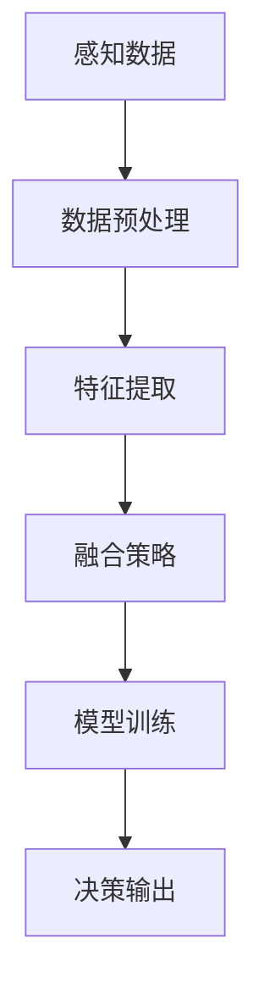

                 


# AI Agent的多模态融合学习技术

## 关键词：AI Agent，多模态学习，融合学习，人工智能，机器学习

## 摘要：  
本文深入探讨了AI Agent的多模态融合学习技术，从背景、核心概念、算法原理到系统设计和项目实战，全面解析了多模态融合学习在AI Agent中的应用及其优势。通过详细分析和实际案例，展示了如何通过多模态数据的融合提升AI Agent的学习能力和决策性能。

---

## 第一章：引言

### 1.1 问题背景与研究意义  
AI Agent作为一种智能实体，广泛应用于智能助手、自动驾驶、机器人等领域。然而，单一模态的数据感知往往存在局限性，难以应对复杂的实际场景。多模态融合学习技术通过整合视觉、听觉、触觉等多种信息，显著提升了AI Agent的感知和决策能力。本文旨在探讨多模态融合学习的核心技术及其在AI Agent中的应用。

### 1.2 本文结构安排  
本文分为八章，涵盖引言、背景介绍、核心概念与联系、算法原理、数学模型、系统分析与架构设计、项目实战以及最佳实践。每一章都将深入分析相关主题，确保读者能够系统地理解和掌握多模态融合学习技术。

---

## 第二章：AI Agent与多模态学习的背景介绍

### 2.1 AI Agent的基本概念  
AI Agent是一种智能代理，具备感知环境、自主决策和执行任务的能力。其核心要素包括感知、推理、规划和执行。

#### 2.1.1 AI Agent的定义与特点  
AI Agent能够感知环境并采取行动，具有自主性、反应性、目标导向和社交能力等特点。

#### 2.1.2 AI Agent的核心要素  
1. **感知**：通过传感器获取环境信息。  
2. **推理**：基于感知信息进行逻辑推理。  
3. **规划**：制定行动计划。  
4. **执行**：执行预设或自动生成的动作。

#### 2.1.3 AI Agent的应用场景  
1. **智能助手**：如Siri、Alexa等。  
2. **自动驾驶**：如特斯拉的Autopilot系统。  
3. **机器人**：如工业机器人和家庭服务机器人。

### 2.2 多模态学习的背景与意义  
多模态学习是指同时利用多种数据模态（如图像、文本、语音）进行学习的方法，能够显著提升模型的泛化能力和鲁棒性。

#### 2.2.1 多模态数据的定义与特点  
1. **定义**：多模态数据指来自不同感官渠道的数据。  
2. **特点**：互补性、冗余性和多样性。

#### 2.2.2 多模态学习的优势与挑战  
优势：提升准确性和鲁棒性；挑战：数据异构性和融合难度。

#### 2.2.3 多模态学习在AI Agent中的应用价值  
通过融合多模态数据，AI Agent能够更全面地理解环境，从而做出更智能的决策。

### 2.3 多模态融合学习的动因与应用  
多模态融合学习的动因包括提升性能和增强鲁棒性，其应用领域涵盖智能助手、自动驾驶和机器人等。

---

## 第三章：多模态融合学习的核心概念与联系

### 3.1 多模态融合学习的基本概念  
多模态融合学习是通过整合多种数据模态来提升模型性能的技术。

#### 3.1.1 多模态数据的类型与特点  
1. **图像**：视觉信息，如RGB图像。  
2. **文本**：语言信息，如自然语言文本。  
3. **语音**：听觉信息，如语音信号。  
4. **触觉**： tactile信息，如力反馈。

#### 3.1.2 多模态融合的方式与层次  
1. **浅层融合**：在特征提取前进行融合。  
2. **深层融合**：在特征提取或模型训练中进行融合。  
3. **端到端融合**：在整个网络中进行联合优化。

#### 3.1.3 多模态与单模态的特征对比  
通过表格对比，可以看出多模态数据在信息互补性和准确性上的优势。

| 特性      | 单模态         | 多模态         |
|-----------|---------------|---------------|
| 信息量    | 较低          | 较高          |
| 补充性    | 无            | 有            |
| 鲁棒性    | 较低          | 较高          |

### 3.2 多模态融合的核心要素  
1. **数据预处理**：包括数据清洗和标准化。  
2. **特征提取**：通过CNN、RNN等模型提取模态特征。  
3. **融合策略**：选择浅层、深层或端到端融合方式。  
4. **模型优化**：通过联合训练提升性能。

#### 3.2.1 实体关系图（ER图）  
通过ER图展示多模态融合系统中的实体及其关系。

```mermaid
erDiagram
    agent[AI Agent] {
        codeType : INT
        model : STRING
        sensors : SET(sensor)
    }
    sensor[Sensor] {
        type : STRING
        data : BLOB
    }
    agent --> sensor : uses
```

#### 3.2.2 融合流程图  
展示多模态融合的典型流程。



---

## 第四章：多模态融合学习的算法原理

### 4.1 多模态注意力机制  
注意力机制通过分配权重来关注重要信息。

#### 4.1.1 注意力机制的原理  
通过计算查询、键、值的相似度，确定注意力权重。

#### 4.1.2 多模态注意力的实现  
在多模态数据中分别计算注意力权重，并进行融合。

#### 4.1.3 代码实现  
以下是多模态注意力机制的Python代码示例。

```python
import torch

def multi_modal_attention(query, key, value, modals):
    # 计算注意力权重
    attention_weights = torch.softmax(torch.matmul(query, key.T), dim=-1)
    # 融合多模态数据
    result = torch.zeros_like(value)
    for i in range(modals):
        result += attention_weights[:, i:i+1] * value[i]
    return result
```

### 4.2 对比学习  
对比学习通过最大化正样本相似性来提升模型性能。

#### 4.2.1 对比学习的原理  
通过对比损失函数，优化模型的表征能力。

#### 4.2.2 多模态对比学习的实现  
在多模态数据上应用对比学习，增强模态间的一致性。

#### 4.2.3 代码实现  
以下是对比学习的Python代码示例。

```python
import torch

def contrastive_loss(x1, x2, tau=0.1):
    # 计算相似性
    sim = torch.cosine_similarity(x1, x2)
    # 归一化
    sim = torch.exp(sim / tau)
    # 计算损失
    loss = -torch.log(sim / (sim.sum(dim=1, keepdim=True)))
    return loss.mean()
```

### 4.3 自适应融合  
自适应融合根据数据特点动态调整融合策略。

#### 4.3.1 自适应融合的原理  
通过动态权重调整，适应不同场景的数据分布。

#### 4.3.2 代码实现  
以下是自适应融合的Python代码示例。

```python
import torch

def adaptive_fusion(features, modals):
    # 计算权重
    weights = torch.softmax(torch.matmul(features, features.T), dim=-1)
    # 加权融合
    result = torch.zeros_like(features)
    for i in range(modals):
        result[i] = weights[i] * features[i]
    return result
```

---

## 第五章：多模态融合学习的数学模型

### 5.1 多模态注意力机制的数学模型  
注意力机制通过计算相似度确定权重。

#### 5.1.1 注意力权重计算  
$$ attention_{i,j} = \frac{exp(q_i k_j^T)}{\sum_{l} exp(q_i k_l^T)} $$  

#### 5.1.2 多模态融合  
$$ output_i = \sum_{j} attention_{i,j} v_j $$  

### 5.2 对比学习的数学模型  
对比学习通过最大化正样本相似性。

#### 5.2.1 对比损失函数  
$$ L = -\log \frac{exp(d(x,y)/\tau)}{sum_{k} exp(d(x,k)/\tau)} $$  

### 5.3 自适应融合的数学模型  
通过动态权重调整实现自适应融合。

#### 5.3.1 动态权重计算  
$$ w_i = \frac{exp(a_i)}{\sum_{j} exp(a_j)} $$  

#### 5.3.2 融合模型  
$$ output = \sum_{i} w_i x_i $$  

---

## 第六章：多模态融合学习的系统分析与架构设计

### 6.1 系统功能设计  
系统包括数据预处理、特征提取、融合策略和模型训练模块。

#### 6.1.1 数据预处理  
- 数据清洗：去除噪声。  
- 标准化：归一化处理。  

#### 6.1.2 特征提取  
- 使用CNN提取图像特征。  
- 使用RNN提取文本特征。  

#### 6.1.3 融合策略  
- 浅层融合：在特征层进行融合。  
- 深层融合：在模型内部进行融合。  

#### 6.1.4 模型训练  
- 联合训练：同时优化多模态参数。  
- 对比学习：最大化正样本相似性。  

### 6.2 系统架构设计  
系统架构包括数据层、特征层、融合层和决策层。

#### 6.2.1 数据层  
- 数据源：多模态传感器。  
- 数据类型：图像、文本、语音。  

#### 6.2.2 特征层  
- 特征提取：CNN、RNN等模型。  
- 特征维度：如图像特征向量。  

#### 6.2.3 融合层  
- 浅层融合：特征级融合。  
- 深层融合：模型级融合。  

#### 6.2.4 决策层  
- 模型训练：优化目标函数。  
- 输出决策：生成最终结果。  

### 6.3 系统接口设计  
系统接口包括数据输入接口、模型训练接口和决策输出接口。

#### 6.3.1 数据输入接口  
```python
def input_data(modal_data):
    return modal_data
```

#### 6.3.2 模型训练接口  
```python
def train_model(model, optimizer, loss_fn, data_loader):
    for batch in data_loader:
        outputs = model(batch)
        loss = loss_fn(outputs, labels)
        optimizer.zero_grad()
        loss.backward()
        optimizer.step()
```

#### 6.3.3 决策输出接口  
```python
def output_decision(outputs):
    return outputs.argmax(dim=1)
```

---

## 第七章：多模态融合学习的项目实战

### 7.1 项目背景与目标  
开发一个多模态智能助手，集成图像识别、语音识别和自然语言理解功能。

### 7.2 环境安装与配置  
- 安装Python、TensorFlow、PyTorch等库。  
- 配置GPU支持。  

### 7.3 核心代码实现  
#### 7.3.1 数据预处理  
```python
def preprocess_data(data):
    # 图像预处理
    images = data['image'].numpy()
    images = [cv2.resize(img, (224, 224)) for img in images]
    images = np.array(images)
    # 文本预处理
    texts = data['text'].apply(lambda x: x.lower().strip())
    texts = tokenizer(texts.tolist())
    return images, texts
```

#### 7.3.2 模型构建  
```python
class MultiModalModel(torch.nn.Module):
    def __init__(self):
        super().__init__()
        self.image_net = ResNet()
        self.text_net = LSTM()
        self.fusion_layer = FusionLayer()
    
    def forward(self, images, texts):
        image_features = self.image_net(images)
        text_features = self.text_net(texts)
        output = self.fusion_layer(image_features, text_features)
        return output
```

#### 7.3.3 训练与推理  
```python
def train_model(model, optimizer, criterion, train_loader, epochs=10):
    for epoch in range(epochs):
        for batch in train_loader:
            images, texts, labels = batch
            outputs = model(images, texts)
            loss = criterion(outputs, labels)
            optimizer.zero_grad()
            loss.backward()
            optimizer.step()
```

### 7.4 项目总结与经验分享  
通过项目实战，验证了多模态融合学习的有效性，并总结了实际开发中的注意事项。

---

## 第八章：多模态融合学习的最佳实践

### 8.1 项目小结  
多模态融合学习通过整合多种数据模态，显著提升了AI Agent的感知和决策能力。

### 8.2 实践中的注意事项  
1. 数据预处理：确保数据质量。  
2. 模型选择：根据任务选择合适模型。  
3. 融合策略：选择合适的融合方式。  
4. 训练优化：合理设置超参数。  

### 8.3 拓展阅读与进一步学习  
建议深入学习多模态融合的前沿技术，如自适应融合和对比学习。

---

## 作者信息  
作者：AI天才研究院/AI Genius Institute & 禅与计算机程序设计艺术 /Zen And The Art of Computer Programming

