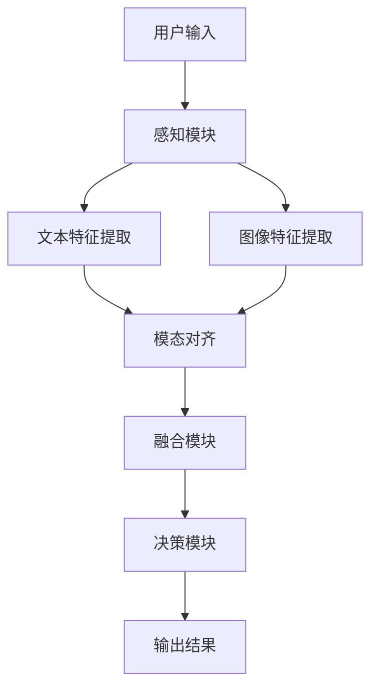

                 

# AI Agent的多模态融合技术：提升理解深度

> 关键词：AI Agent, 多模态融合, 深度理解, 机器学习, 多模态数据, 系统架构, 实际应用

> 摘要：AI Agent通过多模态融合技术能够更全面地理解和处理信息，提升其在复杂场景中的智能水平。本文将从多模态融合的核心概念、数学模型、系统架构到实际应用进行全面解析，探讨如何通过多模态数据的高效融合，提升AI Agent的理解深度和应用场景的广泛性。

---

## 第1章: 多模态融合的核心概念与技术背景

### 1.1 AI Agent的基本概念
AI Agent（人工智能代理）是指具有感知环境、理解和执行任务能力的智能体。它能够通过多种模态（如文本、图像、语音、视频等）感知外界信息，并基于这些信息做出决策和行动。AI Agent的核心目标是通过多模态数据的融合，实现更强大的理解和推理能力。

### 1.2 多模态融合的定义与意义
多模态融合是指将来自不同模态的数据（如文本、图像、语音等）进行整合，以提升信息理解和处理能力的技术。通过多模态融合，AI Agent能够更好地捕捉和利用多源信息，从而在复杂场景中表现出更高的智能水平。

### 1.3 多模态融合的核心要素
- **模态数据**：包括文本、图像、语音、视频等不同类型的数据。
- **模态对齐**：将不同模态的数据在语义或特征空间中对齐，以便更好地融合。
- **融合策略**：通过加权、对齐或其他方法，将多模态数据整合为统一的表示。

---

## 第2章: 多模态融合的数学模型与算法原理

### 2.1 多模态表示学习
多模态表示学习的目标是将不同模态的数据映射到一个共同的表示空间中，以便后续的融合和分析。常见的多模态表示学习方法包括：

#### 2.1.1 深度学习模型
- **卷积神经网络（CNN）**：用于处理图像数据。
- **循环神经网络（RNN）**：用于处理序列数据，如文本和语音。
- **Transformer**：用于处理序列数据，具有全局依赖关系捕捉能力。

#### 2.1.2 对抗训练
通过生成对抗网络（GAN）对齐不同模态的数据分布。例如，使用两个判别器分别对齐文本和图像的特征。

### 2.2 模态对齐方法
模态对齐是多模态融合的关键步骤，旨在将不同模态的数据对齐到一个共同的语义空间中。

#### 2.2.1 统计方法
- **概率分布对齐**：通过计算不同模态数据的概率分布，并通过拉普拉斯近似等方法对齐特征。
- **特征对齐**：通过主成分分析（PCA）或线性回归对齐特征空间。

#### 2.2.2 深度学习方法
- **自动对齐**：通过神经网络自动学习模态间的对齐关系。
- **对比学习**：通过对比不同模态的数据，学习对齐策略。

### 2.3 融合策略
融合策略决定了如何将不同模态的特征整合到一个统一的表示中。

#### 2.3.1 线性融合
$$y = \alpha_1 x_1 + \alpha_2 x_2 + \alpha_3 x_3$$
其中，$\alpha_i$ 是权重系数，$x_i$ 是不同模态的特征向量。

#### 2.3.2 非线性融合
$$y = \sigma(\alpha_1 x_1 + \alpha_2 x_2 + \alpha_3 x_3)$$
其中，$\sigma$ 是激活函数，如ReLU或Sigmoid。

---

## 第3章: 多模态融合的系统架构与设计

### 3.1 系统架构设计
AI Agent的多模态融合系统通常包括以下几个模块：

#### 3.1.1 感知模块
负责从多模态数据中提取特征，例如：
- 文本模块：使用BERT提取文本特征。
- 图像模块：使用ResNet提取图像特征。

#### 3.1.2 模态对齐模块
对齐不同模态的特征，例如通过对比学习对齐文本和图像的特征空间。

#### 3.1.3 融合模块
将对齐后的特征进行融合，生成统一的表示。

#### 3.1.4 决策模块
基于融合后的表示，进行决策和行动。

### 3.2 系统交互流程

---

## 第4章: 多模态融合技术的实际应用

### 4.1 自然语言处理中的应用
- **多语言翻译**：通过融合文本和语音模态，提升翻译的准确性和流畅性。
- **情感分析**：结合文本和图像模态，分析用户的情感倾向。

### 4.2 计算机视觉中的应用
- **图像识别**：通过融合文本和图像模态，提升图像识别的准确率。
- **视频分析**：通过融合视频和语音模态，实现视频内容的理解和分析。

### 4.3 跨模态检索与推荐系统
- **跨模态检索**：基于多模态数据，实现跨模态的高效检索。
- **推荐系统**：通过融合用户行为、文本和图像数据，提升推荐的精准度。

---

## 第5章: 多模态融合技术的挑战与未来展望

### 5.1 当前挑战
- **模态对齐的准确性**：如何实现不同模态数据的高效对齐。
- **融合策略的有效性**：如何设计高效的融合策略。
- **计算资源的限制**：如何在有限的计算资源下实现高效的多模态融合。

### 5.2 未来展望
- **更高效的对齐方法**：研究更高效的模态对齐算法，如基于生成对抗网络的对齐方法。
- **更智能的融合策略**：研究基于自适应权重的融合策略，提升融合的灵活性和准确性。
- **多模态数据的实时处理**：研究如何在实时场景中实现高效的多模态融合。

---

## 第6章: 总结与最佳实践

### 6.1 总结
多模态融合技术是提升AI Agent智能水平的关键技术。通过高效地融合多模态数据，AI Agent能够更好地理解复杂场景，并做出更准确的决策。

### 6.2 最佳实践
- **选择合适的模态对齐方法**：根据具体场景选择合适的模态对齐方法，如对比学习或生成对抗网络。
- **设计高效的融合策略**：根据实际需求设计高效的融合策略，如线性融合或非线性融合。
- **优化系统架构**：通过优化系统架构，提升系统的高效性和可扩展性。

---

## 作者信息

作者：AI天才研究院/AI Genius Institute  
联系方式：[email protected]  
个人简介：专注于人工智能领域的研究与实践，致力于推动AI技术的创新与发展。

---

通过以上内容，您可以全面了解AI Agent的多模态融合技术的核心概念、数学模型、系统架构以及实际应用。希望本文能够为您提供有价值的信息，并激发您对多模态融合技术的兴趣与研究。

