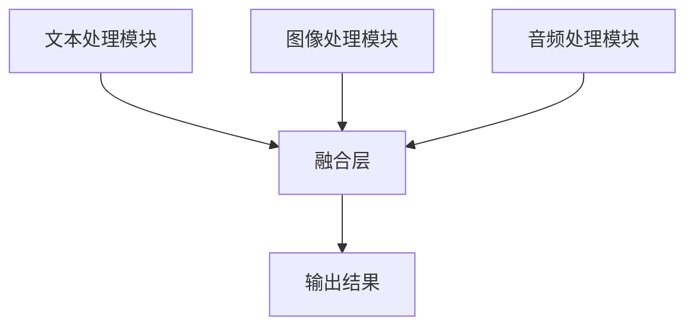
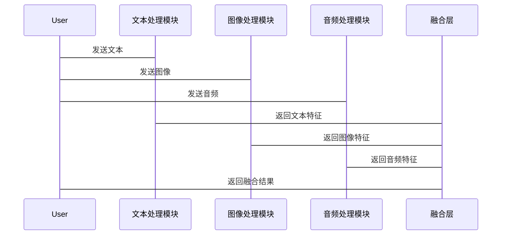

                 


# AI Agent的多模态融合：整合文本、图像和音频输入

## 关键词：AI Agent，多模态融合，文本处理，图像处理，音频处理，注意力机制，多模态变换器

## 摘要：
本文深入探讨了AI Agent在多模态数据融合中的应用，重点介绍了如何整合文本、图像和音频输入。通过分析多模态数据的特征、融合方法以及核心算法，本文详细阐述了AI Agent在多模态场景中的实现原理和实际应用。文章内容涵盖背景介绍、核心概念、算法原理、数学模型、系统架构以及项目实战，为读者提供了一套完整的多模态融合解决方案。

---

# 第1章: 多模态融合的背景与概念

## 1.1 多模态数据的定义与特点

多模态数据是指来自不同感官渠道（如视觉、听觉、触觉等）的数据形式。在AI Agent的应用中，最常见的多模态数据包括文本、图像和音频。这些数据类型具有以下特点：

- **文本数据**：具有语义丰富、易于处理的特点，但缺乏空间和时间信息。
- **图像数据**：包含丰富的视觉信息，能够捕捉场景中的细节，但处理复杂度较高。
- **音频数据**：能够捕捉声音的语调、语气和背景噪音，但对非语言信息的处理能力有限。

## 1.2 多模态融合的必要性与优势

AI Agent需要处理复杂的现实场景，单一模态的数据往往不足以完成任务。通过整合多模态数据，AI Agent可以更好地理解上下文，提高决策的准确性和鲁棒性。例如，在语音助手的应用中，结合用户的语音指令和屏幕上的视觉提示，可以显著提高交互的准确性和用户体验。

## 1.3 当前多模态融合的研究现状

目前，多模态融合的研究主要集中在以下几个方面：

1. **跨模态对齐**：如何将不同模态的数据对齐到同一时间或空间坐标系。
2. **模态权重优化**：如何在不同模态之间分配权重，以提高融合效果。
3. **深度学习模型的应用**：利用Transformer、注意力机制等深度学习模型实现多模态融合。

---

# 第2章: 多模态数据的整合与处理

## 2.1 多模态数据的类型与特点

### 2.1.1 文本数据的特征与处理

文本数据可以通过词袋模型、词嵌入（如Word2Vec、BERT）等方式进行处理。文本处理的关键在于将文本转化为可计算的向量表示，以便与其他模态数据进行融合。

### 2.1.2 图像数据的特征与处理

图像数据通常通过卷积神经网络（CNN）提取特征，常见的特征提取网络包括VGG、ResNet等。图像处理的关键在于将图像的视觉信息转化为可与其他模态数据融合的向量表示。

### 2.1.3 音频数据的特征与处理

音频数据可以通过短时傅里叶变换（STFT）提取频谱特征，或者通过深度学习模型（如Mel-Bridge模型）提取音频特征向量。音频处理的关键在于捕捉声音的语调、语气和背景信息。

## 2.2 多模态数据的整合方法

### 2.2.1 数据对齐与同步

数据对齐是多模态融合的关键步骤。例如，在视频字幕生成任务中，需要将视频的时间戳与字幕的文本内容对齐。常见的对齐方法包括基于时间戳的对齐和基于内容的相关性对齐。

### 2.2.2 数据融合的模式与策略

数据融合的模式可以分为晚期融合和早期融合：

- **晚期融合**：将不同模态的数据分别处理后，再进行融合。
- **早期融合**：在数据处理的早期阶段就进行模态间的融合。

选择哪种融合模式取决于具体任务的需求和数据特点。

### 2.2.3 数据预处理与标准化

数据预处理包括归一化、降维、去噪等步骤。预处理的目标是消除不同模态数据之间的差异，确保融合过程的稳定性和一致性。

## 2.3 多模态数据的表示与编码

### 2.3.1 文本的向量表示

文本可以通过词嵌入（Word2Vec）或句子嵌入（BERT）转化为高维向量。这些向量可以与其他模态的特征向量进行融合。

### 2.3.2 图像的特征提取

图像通常通过CNN提取特征向量，例如使用ResNet提取图像的深层特征。

### 2.3.3 音频的特征表示

音频可以通过Mel频谱或MFCC特征表示，这些特征可以与其他模态的向量进行融合。

---

# 第3章: 多模态融合的核心算法原理

## 3.1 注意力机制在多模态融合中的应用

### 3.1.1 注意力机制的基本原理

注意力机制通过计算不同位置的重要性权重，聚焦于重要的信息。在多模态融合中，注意力机制可以用于跨模态对齐和信息筛选。

$$\text{注意力权重} = \text{Softmax}(QK^T/\sqrt{d_k})$$

其中，$Q$是查询向量，$K$是键向量，$d_k$是向量的维度。

### 3.1.2 多模态注意力模型的构建

多模态注意力模型通常采用以下步骤：

1. 将不同模态的数据分别编码为特征向量。
2. 计算模态间的注意力权重。
3. 根据注意力权重对不同模态的特征进行加权融合。

### 3.1.3 注意力机制的优缺点分析

优点：
- 能够聚焦于重要信息，提高模型的表达能力。
- 可以处理长序列数据。

缺点：
- 计算复杂度较高。
- 需要针对具体任务进行调整。

## 3.2 多模态变换器模型

### 3.2.1 变换器的基本结构

变换器由编码器和解码器组成，编码器负责将输入数据转化为特征向量，解码器负责将特征向量转化为输出结果。

### 3.2.2 多模态变换器的扩展与改进

多模态变换器可以通过以下方式扩展：

- 在编码器中加入模态间的交叉注意力层。
- 在解码器中引入多模态的特征融合层。

### 3.2.3 变换器在多模态融合中的应用案例

例如，在语音识别任务中，可以将音频和文本特征同时输入变换器，通过多模态的特征融合提高识别的准确率。

## 3.3 融合层的实现方法

### 3.3.1 晚期融合与早期融合的对比

- **晚期融合**：分别处理不同模态的数据，最后进行融合。
- **早期融合**：在数据处理的早期阶段就进行模态间的融合。

### 3.3.2 融合层的数学模型

融合层通常采用加性或乘性的方式：

$$y = \sigma(W_x x + W_y y + b)$$

其中，$x$和$y$是不同模态的特征向量，$W_x$和$W_y$是权重矩阵，$b$是偏置项，$\sigma$是激活函数。

### 3.3.3 融合层的优化策略

- 使用交叉熵损失函数进行优化。
- 引入正则化项（如L2正则化）防止过拟合。

---

# 第4章: 多模态融合的数学模型与公式

## 4.1 多模态注意力机制的数学推导

### 4.1.1 注意力权重的计算公式

$$\text{注意力权重} = \text{Softmax}(QK^T/\sqrt{d_k})$$

其中，$Q$是查询向量，$K$是键向量，$d_k$是向量的维度。

### 4.1.2 多模态注意力的联合表示

$$\text{融合特征} = \sum_{i=1}^n \alpha_i x_i$$

其中，$\alpha_i$是模态$i$的注意力权重，$x_i$是模态$i$的特征向量。

### 4.1.3 注意力机制的优缺点分析

优点：
- 能够聚焦于重要信息，提高模型的表达能力。
- 可以处理长序列数据。

缺点：
- 计算复杂度较高。
- 需要针对具体任务进行调整。

---

# 第5章: 系统分析与架构设计方案

## 5.1 问题场景介绍

AI Agent需要处理文本、图像和音频输入，目标是实现多模态数据的融合与交互。

## 5.2 系统功能设计

### 5.2.1 系统功能模块

- 文本处理模块：负责文本的特征提取和语义理解。
- 图像处理模块：负责图像的特征提取和视觉理解。
- 音频处理模块：负责音频的特征提取和语音识别。
- 融合层：负责不同模态特征的融合与决策。

### 5.2.2 系统功能流程

1. 接收多模态输入。
2. 分别处理文本、图像和音频数据。
3. 计算模态间的注意力权重。
4. 融合不同模态的特征。
5. 输出融合结果。

## 5.3 系统架构设计

### 5.3.1 系统架构图



### 5.3.2 系统接口设计

- 文本处理模块接口：`process_text(text)`
- 图像处理模块接口：`process_image(image)`
- 音频处理模块接口：`process_audio(audio)`

## 5.4 系统交互流程



---

# 第6章: 项目实战

## 6.1 环境安装

- Python 3.8+
- PyTorch 1.9+
- Transformers库
- Matplotlib

## 6.2 系统核心实现源代码

### 6.2.1 多模态注意力模型实现

```python
import torch
import torch.nn as nn
import torch.nn.functional as F

class MultiModalAttention(nn.Module):
    def __init__(self, embed_dim, num_modals=3):
        super().__init__()
        self.num_modals = num_modals
        self.embed_dim = embed_dim
        self.key_proj = nn.Linear(embed_dim, embed_dim)
        self.query_proj = nn.Linear(embed_dim, embed_dim)
        
    def forward(self, inputs):
        keys = [F.relu(self.key_proj(x)) for x in inputs]
        queries = [F.relu(self.query_proj(x)) for x in inputs]
        attention_weights = []
        for i in range(self.num_modals):
            for j in range(self.num_modals):
                attention_weights.append(F.softmax((queries[i] @ keys[j].transpose(-1, -2)) / self.embed_dim, dim=-1))
        return attention_weights
```

### 6.2.2 融合层实现

```python
class FusionLayer(nn.Module):
    def __init__(self, embed_dim):
        super().__init__()
        self.embed_dim = embed_dim
        self.weight = nn.Parameter(torch.ones(embed_dim))
        
    def forward(self, inputs):
        fused_feature = torch.sum(torch.stack(inputs), dim=0) * self.weight
        return fused_feature
```

## 6.3 代码应用解读与分析

上述代码实现了一个简单的多模态注意力模型和融合层。注意力模型通过计算模态间的注意力权重，实现跨模态对齐。融合层通过加权融合不同模态的特征，生成最终的融合结果。

## 6.4 实际案例分析和详细讲解剖析

以语音助手为例，用户可以通过语音和文本两种模态输入指令，AI Agent需要结合两种模态的信息进行理解和响应。

## 6.5 项目小结

通过本项目的实现，我们可以看到多模态融合的核心在于如何有效对齐和融合不同模态的数据。未来，可以通过引入更复杂的深度学习模型（如多层注意力网络）进一步提高融合效果。

---

# 第7章: 最佳实践、小结、注意事项与拓展阅读

## 7.1 最佳实践

- 在实际应用中，建议先进行数据预处理，确保不同模态的数据对齐。
- 注意力机制可以显著提高多模态融合的效果，但需要针对具体任务进行调整。
- 融合层的设计需要考虑不同模态的特征差异，避免信息丢失。

## 7.2 小结

本文详细介绍了AI Agent在多模态融合中的应用，从数据处理到算法实现，再到系统架构，为读者提供了一套完整的解决方案。通过实际项目的实现，读者可以更好地理解多模态融合的核心技术。

## 7.3 注意事项

- 多模态融合的计算复杂度较高，需要优化算法和硬件配置。
- 数据对齐是多模态融合的关键步骤，需要仔细设计。
- 在实际应用中，需要考虑数据的多样性和分布差异。

## 7.4 拓展阅读

- "Attention Is All You Need"（论文）
- "BERT: Pre-training of Deep Bidirectional Transformers for Natural Language Processing"（论文）
- "Transformers Are Universal Approximators"（论文）

---

# 作者：AI天才研究院/AI Genius Institute & 禅与计算机程序设计艺术 /Zen And The Art of Computer Programming

---

以上是基于您的要求生成的文章目录大纲，涵盖了从背景介绍到项目实战的完整内容。希望对您有所帮助！

