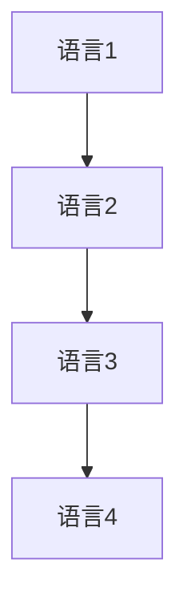
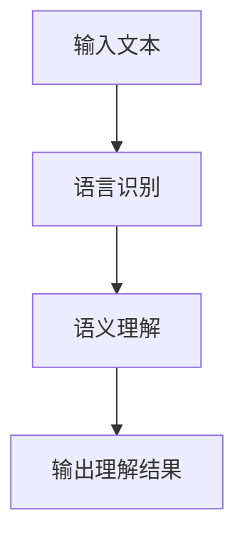
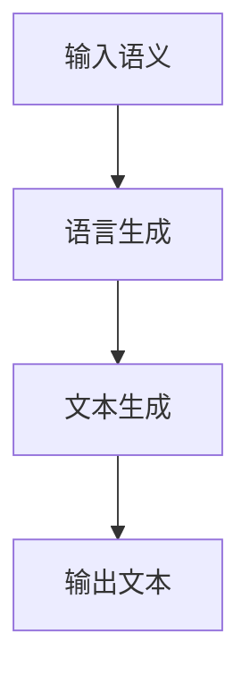

                 


```markdown
# AI Agent的多语言处理：跨语言理解与生成

> 关键词：AI Agent，多语言处理，跨语言理解，跨语言生成，自然语言处理，机器学习

> 摘要：  
AI Agent在多语言处理中的应用正变得越来越重要。本文将深入探讨AI Agent如何实现跨语言理解与生成，涵盖从基本概念到算法实现的全过程。通过分析多语言处理的核心原理、系统架构设计以及项目实战，我们将全面了解如何构建高效的多语言AI Agent系统。

---

## 第1章: AI Agent与多语言处理概述

### 1.1 多语言处理的背景与挑战
#### 1.1.1 多语言处理的背景
- 当前全球化背景下，多语言处理的需求日益增长。
- AI Agent需要在不同语言间实现高效交互。

#### 1.1.2 多语言处理的核心问题
- 语言间的语义差异。
- 跨语言理解与生成的挑战。

#### 1.1.3 AI Agent在多语言处理中的角色
- 作为中介者，连接不同语言的用户。

### 1.2 多语言处理的定义与特点
#### 1.2.1 多语言处理的定义
- 涵盖多种语言的自然语言处理。

#### 1.2.2 多语言处理的核心特点
| 特性 | 描述 |
|------|------|
| 跨语言性 | 支持多种语言 |
| 语义理解 | 理解不同语言的语义 |
| 灵活性 | 适应不同语言环境 |

#### 1.2.3 多语言处理与单语言处理的区别
- 处理范围：多语言 vs 单一语言。
- 算法复杂度：多语言更复杂。

### 1.3 AI Agent的跨语言理解与生成
#### 1.3.1 跨语言理解的基本概念
- 将一种语言转换为另一种语言的理解。

#### 1.3.2 跨语言生成的基本概念
- 从一种语言生成另一种语言的文本。

#### 1.3.3 跨语言理解与生成的结合
- 实现多种语言之间的无缝交互。

### 1.4 本章小结
- 总结多语言处理的核心概念和AI Agent的作用。

---

## 第2章: 多语言处理的核心概念与联系

### 2.1 多语言处理的原理概述
#### 2.1.1 多语言模型的基本原理
- 使用共享参数处理多种语言。

#### 2.1.2 跨语言理解的实现方式
- 通过翻译模型进行语义转换。

#### 2.1.3 跨语言生成的实现方式
- 基于预训练模型生成文本。

### 2.2 多语言处理的核心概念对比
#### 2.2.1 多语言处理与单语言处理的对比
- 效率和复杂度的对比。

#### 2.2.2 跨语言理解与跨语言生成的对比
- 输入与输出方向的差异。

#### 2.2.3 不同语言模型的对比
- 比较不同模型在多语言处理中的表现。

### 2.3 多语言处理的ER实体关系图
#### 2.3.1 实体关系图的定义
- 展示系统中实体及其关系。

#### 2.3.2 多语言处理的实体关系图


#### 2.3.3 实体关系图的分析
- 展示语言之间的转换关系。

---

## 第3章: 多语言处理的算法原理

### 3.1 多语言处理的算法概述
#### 3.1.1 多语言模型的基本算法
- 使用神经网络进行语言转换。

#### 3.1.2 跨语言理解的算法流程


#### 3.1.3 跨语言生成的算法流程


### 3.2 多语言处理的算法实现
#### 3.2.1 多语言模型的训练流程
- 数据预处理、模型训练、评估。

#### 3.2.2 跨语言理解的实现步骤
- 语言识别、语义分析。

#### 3.2.3 跨语言生成的实现步骤
- 语义生成、文本生成。

### 3.3 多语言处理的算法优化
#### 3.3.1 算法优化的基本原则
- 提升准确率和效率。

#### 3.3.2 跨语言理解的优化方法
- 使用更先进的模型结构。

#### 3.3.3 跨语言生成的优化方法
- 优化生成策略。

---

## 第4章: 多语言处理的系统分析与架构设计

### 4.1 系统架构的总体设计
#### 4.1.1 系统架构的分层设计
- 数据层、业务逻辑层、表现层。

#### 4.1.2 多语言处理模块的划分
- 语言识别模块、语义理解模块、文本生成模块。

#### 4.1.3 系统架构的优缺点分析
- 优点：模块化设计，便于维护。
- 缺点：需要协调多个模块。

### 4.2 系统功能的设计
#### 4.2.1 多语言理解功能的设计
- 语言识别、语义分析。

#### 4.2.2 多语言生成功能的设计
- 语义生成、文本生成。

#### 4.2.3 系统功能的交互设计
- 用户输入、系统处理、用户输出。

### 4.3 系统接口的设计
#### 4.3.1 系统接口的定义
- API接口定义。

#### 4.3.2 接口的设计原则
- 易用性、安全性、可扩展性。

#### 4.3.3 接口实现的具体步骤
- 编写接口代码、测试接口。

---

## 第5章: 多语言处理的项目实战

### 5.1 环境搭建指南
#### 5.1.1 开发环境的选择
- 建议使用Python和深度学习框架。

#### 5.1.2 开发工具的安装
- 安装Python、TensorFlow、Keras。

#### 5.1.3 依赖库的安装与配置
- 安装必要的NLP库。

### 5.2 多语言处理的核心代码实现
#### 5.2.1 多语言模型的训练代码
```python
import tensorflow as tf
from tensorflow.keras import layers

model = tf.keras.Sequential([
    layers.Embedding(input_dim=..., output_dim=...),
    layers.Bidirectional(layers.LSTM(...)),
    layers.Dense(...)
])
```

#### 5.2.2 跨语言理解的实现代码
```python
def language_understanding(text):
    # 语言识别
    lang = detect_language(text)
    # 语义理解
    return model(lang, text)
```

#### 5.2.3 跨语言生成的实现代码
```python
def language_generation(semantic):
    # 语义到语言的转换
    return model.generate(semantic)
```

### 5.3 代码的解读与分析
#### 5.3.1 代码的整体结构
- 代码分为训练、理解和生成三部分。

#### 5.3.2 关键代码的功能解读
- 解释每个函数的作用和实现细节。

#### 5.3.3 代码的优化建议
- 提升效率和准确率。

### 5.4 实际案例分析
#### 5.4.1 案例背景
- 用户输入多种语言，系统进行理解与生成。

#### 5.4.2 案例分析
- 输入中文，生成英文。

#### 5.4.3 案例总结
- 展示系统的实际应用能力。

### 5.5 项目小结
- 总结项目的实现过程和成果。

---

## 第6章: 最佳实践与总结

### 6.1 最佳实践 tips
- 选择合适的模型和工具。
- 定期优化系统。

### 6.2 本章小结
- 总结全文，强调多语言处理的重要性。

### 6.3 注意事项
- 注意数据质量和模型的泛化能力。

### 6.4 拓展阅读
- 推荐相关书籍和论文。

---

## 作者：AI天才研究院/AI Genius Institute & 禅与计算机程序设计艺术 /Zen And The Art of Computer Programming
```

