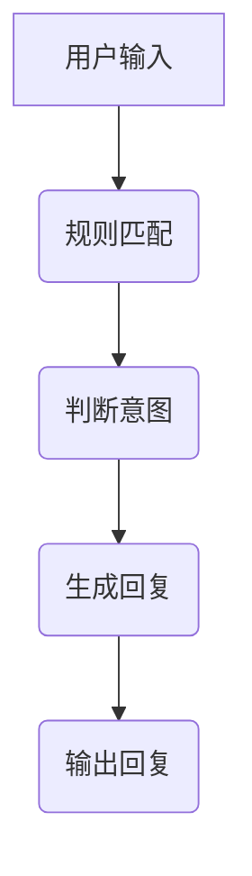
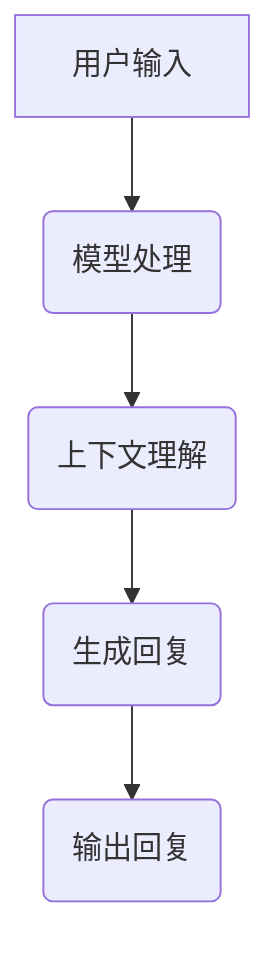
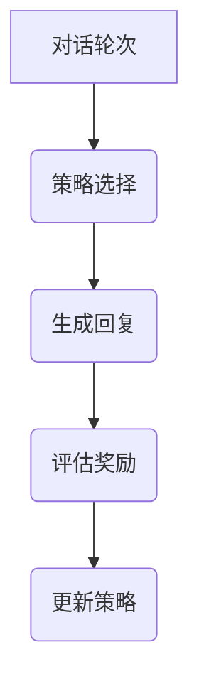
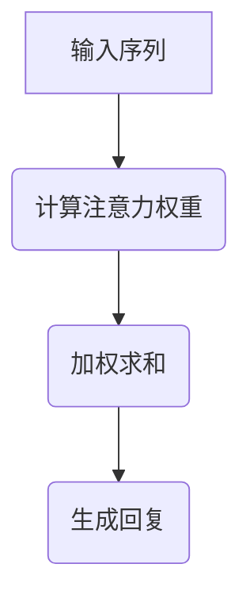
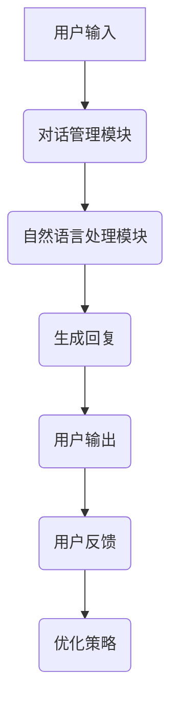

                 


# AI Agent的多轮对话能力优化

> 关键词：AI Agent, 多轮对话, 对话系统, 自然语言处理, 优化算法, 深度学习

> 摘要：本文深入探讨了AI Agent在多轮对话中的优化能力，从核心概念、算法原理、系统架构到实战应用，全面解析了如何提升对话系统的性能和用户体验。通过结合理论与实践，本文为技术从业者提供了从基础到进阶的详细指导。

---

# 第一部分: AI Agent的多轮对话能力优化背景介绍

## 第1章: 问题背景与概念解析

### 1.1 问题背景

#### 1.1.1 多轮对话的定义与特点
多轮对话是指用户与AI Agent之间进行的连续交互，每个轮次（turn）中，双方交替发送信息。与单轮对话相比，多轮对话能够更好地模拟真实的人类交流，提供更自然、更智能的用户体验。

- **特点**：
  - **连续性**：对话轮次之间存在逻辑关联。
  - **上下文依赖**：后续轮次的回答依赖于之前的对话内容。
  - **复杂性**：需要处理歧义、意图变化和用户情绪等复杂因素。

#### 1.1.2 当前对话系统的主要挑战
尽管AI Agent在单轮对话中表现优异，但在多轮对话中仍面临诸多挑战：

- **上下文管理**：如何有效维护和更新对话状态，避免信息丢失或混淆。
- **意图识别**：用户的意图可能在对话过程中发生变化，如何准确捕捉和跟踪意图。
- **对话策略**：如何根据当前对话状态选择最优的回复策略，确保对话流畅且符合用户期望。

#### 1.1.3 多轮对话能力优化的必要性
优化多轮对话能力是提升AI Agent用户体验的关键：

- **提升用户满意度**：通过更自然的交互方式，增强用户对AI Agent的信任和依赖。
- **提高系统效率**：优化对话流程，减少不必要的轮次，降低系统负载。
- **拓展应用场景**：支持更复杂的对话任务，如电商咨询、智能客服等。

### 1.2 对话系统的核心概念

#### 1.2.1 对话轮次的定义
对话轮次是指用户和AI Agent之间的一次交互。每个轮次包括输入（用户消息）和输出（系统回复）。

- **输入**：用户的自然语言输入，如“我需要帮助”。
- **输出**：AI Agent根据输入生成的回复，如“请告诉我您需要什么帮助”。

#### 1.2.2 上下文管理的重要性
上下文管理是多轮对话的核心，涉及以下关键点：

- **上下文表示**：将对话历史转化为结构化的表示，供系统理解和处理。
- **上下文更新**：根据每一轮对话更新上下文内容，确保后续轮次的回复准确。
- **上下文存储**：采用适当的数据结构（如JSON或数据库）存储和管理上下文。

#### 1.2.3 对话状态的核心要素
对话状态是指系统对当前对话的理解和记忆，主要包括：

- **输入状态**：用户在当前轮次的输入内容。
- **输出状态**：系统在当前轮次的回复内容。
- **历史记录**：完整的对话历史，用于上下文管理。

## 第2章: 技术演进与应用价值

### 2.1 对话系统的历史发展

#### 2.1.1 基于规则的对话系统
- **特点**：依赖预定义的规则和关键词匹配。
- **优缺点**：
  - 优点：简单易懂，适用于特定场景。
  - 缺点：灵活性差，难以处理复杂对话。

#### 2.1.2 统计模型驱动的对话系统
- **特点**：基于概率模型，通过统计学习生成回复。
- **优缺点**：
  - 优点：能够处理一定复杂性，回复更自然。
  - 缺点：依赖大量数据，训练成本高。

#### 2.1.3 深度学习时代的对话系统
- **特点**：基于深度学习模型（如Transformer、BERT）进行对话生成和理解。
- **优缺点**：
  - 优点：能够处理上下文信息，生成更自然的回复。
  - 缺点：训练数据需求大，模型复杂度高。

### 2.2 多轮对话能力优化的应用场景

#### 2.2.1 智能客服系统
- **场景**：用户咨询产品信息、处理订单问题等。
- **优化点**：准确理解用户意图，提供个性化服务。

#### 2.2.2 智能音箱与智能家居控制
- **场景**：用户通过语音指令控制家电。
- **优化点**：支持连续对话，理解上下文关系。

#### 2.2.3 企业级AI助手
- **场景**：内部员工使用AI助手处理日常事务。
- **优化点**：支持复杂任务，提高工作效率。

### 2.3 优化多轮对话能力的商业价值

#### 2.3.1 提升用户体验
- **用户满意度**：通过优化对话流程，减少用户等待时间。
- **用户粘性**：通过个性化服务，增强用户对AI Agent的信任。

#### 2.3.2 提高系统效率
- **减少错误率**：优化对话策略，降低误解和错误回复。
- **降低运营成本**：通过自动化处理，减少人工干预。

#### 2.3.3 降低运营成本
- **自动化处理**：通过AI Agent处理大量简单任务，降低人力成本。
- **数据驱动优化**：利用对话数据进行模型优化，提升系统性能。

---

# 第二部分: AI Agent多轮对话的核心概念与原理

## 第3章: 对话系统的类型与原理

### 3.1 基于规则的对话系统

#### 3.1.1 规则驱动对话的优缺点
- **优点**：
  - 实现简单，易于调试和维护。
  - 适用于特定场景，如简单的信息查询。
- **缺点**：
  - 灵活性差，难以处理复杂对话。
  - 需要大量人工规则设计，成本高。

#### 3.1.2 规则设计的关键点
- **关键词匹配**：通过关键词识别用户的意图。
- **条件判断**：根据条件判断选择回复内容。
- **状态转移**：根据对话状态转移规则，生成回复。

#### 3.1.3 规则优化的策略
- **简化规则**：减少不必要的规则，提高效率。
- **动态调整**：根据对话历史动态调整规则。
- **结合上下文**：将规则与上下文信息相结合。

### 3.2 基于模型的对话系统

#### 3.2.1 统计模型的基本原理
- **概率生成**：基于概率模型生成回复，如马尔可夫链模型。
- **数据驱动**：依赖大量对话数据进行训练，生成符合统计规律的回复。

#### 3.2.2 深度学习模型的核心机制
- **神经网络结构**：如Transformer、LSTM等。
- **注意力机制**：通过注意力机制捕捉对话中的重要信息。
- **生成式模型**：如GPT、BERT等，能够生成多样化的回复。

#### 3.2.3 深度学习优化对话系统的实现
- **模型训练**：使用大量的多轮对话数据进行模型训练。
- **对话生成**：基于上下文生成回复，考虑对话历史和当前输入。
- **动态调整**：根据对话进展动态调整模型参数，优化回复质量。

### 3.3 基于模型的对话系统的优缺点

#### 3.3.1 基于模型的优势
- **自动化学习**：模型能够自动学习对话模式，减少人工干预。
- **灵活性高**：能够处理复杂对话，适应不同场景。
- **可扩展性**：模型可以通过训练更多数据不断优化性能。

#### 3.3.2 基于模型的缺点
- **训练成本高**：需要大量数据和计算资源。
- **模型复杂性**：模型结构复杂，调试和维护难度大。
- **结果不可控**：生成式模型可能生成不符合预期的回复。

## 第4章: 对话系统的算法原理

### 4.1 基于规则的对话管理算法

#### 4.1.1 算法描述
- **规则匹配**：根据用户输入匹配预定义规则，生成回复。
- **状态转移**：根据对话状态转移规则，动态调整系统行为。

#### 4.1.2 算法流程图


#### 4.1.3 算法实现
- **规则库**：定义规则库，包含关键词和对应的回复。
- **匹配逻辑**：根据输入匹配规则，选择合适的回复。
- **状态管理**：维护对话状态，记录上下文信息。

### 4.2 基于模型的对话管理算法

#### 4.2.1 算法描述
- **输入处理**：将用户输入转换为模型可处理的格式。
- **模型推理**：模型根据上下文生成回复。
- **输出处理**：将模型生成的回复格式化输出。

#### 4.2.2 算法流程图


#### 4.2.3 算法实现
- **模型训练**：使用多轮对话数据训练模型，优化参数。
- **输入处理**：将用户输入转换为模型输入格式。
- **模型推理**：模型根据上下文生成回复。
- **输出处理**：将模型生成的回复格式化输出。

## 第5章: 对话系统的优化算法

### 5.1 基于强化学习的对话优化

#### 5.1.1 算法描述
- **奖励机制**：定义奖励函数，根据对话效果给予奖励。
- **策略优化**：通过强化学习优化对话策略，提升回复质量。

#### 5.1.2 算法流程图


#### 5.1.3 算法实现
- **奖励函数**：定义奖励函数，衡量对话质量。
- **策略优化**：通过强化学习优化对话策略。
- **评估与反馈**：根据奖励反馈优化模型参数。

### 5.2 基于注意力机制的对话优化

#### 5.2.1 算法描述
- **注意力机制**：通过注意力机制捕捉对话中的重要信息，生成更相关的回复。

#### 5.2.2 算法流程图


#### 5.2.3 算法实现
- **注意力计算**：计算输入序列的注意力权重。
- **加权求和**：根据注意力权重生成上下文表示。
- **回复生成**：基于上下文表示生成回复。

---

# 第三部分: AI Agent多轮对话的系统分析与架构设计

## 第6章: 对话系统的系统分析

### 6.1 系统需求分析

#### 6.1.1 问题场景
- **场景描述**：用户与AI Agent进行多轮对话，系统需要准确理解用户意图并生成合适的回复。

#### 6.1.2 系统功能
- **功能描述**：
  - 支持多轮对话。
  - 维护对话上下文。
  - 提供多样化的回复。

#### 6.1.3 系统边界
- **输入**：用户的自然语言输入。
- **输出**：系统的自然语言回复。
- **交互**：用户与系统之间的连续对话。

## 第7章: 对话系统的架构设计

### 7.1 系统架构设计

#### 7.1.1 系统架构
- **模块划分**：
  - 对话管理模块：负责对话状态维护和管理。
  - 自然语言处理模块：负责理解和生成自然语言。
  - 用户反馈模块：负责收集和处理用户反馈。

#### 7.1.2 模块交互
- **对话管理模块**：接收用户输入，维护对话状态，调用自然语言处理模块生成回复。
- **自然语言处理模块**：根据对话状态生成回复，返回对话管理模块。
- **用户反馈模块**：收集用户反馈，优化对话策略。

### 7.2 模块设计

#### 7.2.1 对话管理模块
- **功能**：
  - 维护对话状态。
  - 调用自然语言处理模块生成回复。
  - 处理用户反馈。
- **数据流**：用户输入 → 对话管理模块 → 自然语言处理模块 → 对话管理模块 → 用户输出。

#### 7.2.2 自然语言处理模块
- **功能**：
  - 理解用户输入。
  - 生成回复。
  - 处理上下文信息。
- **数据流**：对话状态 → 自然语言处理模块 → 回复内容 → 对话管理模块。

#### 7.2.3 用户反馈模块
- **功能**：
  - 收集用户反馈。
  - 优化对话策略。
  - 提供反馈信息。
- **数据流**：用户反馈 → 用户反馈模块 → 对话管理模块。

### 7.3 系统交互流程

#### 7.3.1 交互流程
1. **用户输入**：用户发送消息。
2. **对话管理模块处理**：接收输入，维护对话状态。
3. **自然语言处理模块处理**：根据对话状态生成回复。
4. **输出回复**：系统返回回复内容。
5. **用户反馈**：用户对回复进行反馈。
6. **优化策略**：根据反馈优化对话策略。

#### 7.3.2 交互流程图


---

# 第四部分: AI Agent多轮对话的实战与优化

## 第8章: 对话系统的项目实战

### 8.1 环境配置

#### 8.1.1 系统环境
- **硬件要求**：具备足够计算能力的服务器或个人电脑。
- **软件要求**：安装Python、TensorFlow、Keras等深度学习框架。

#### 8.1.2 数据集准备
- **训练数据**：多轮对话数据，格式化为JSON或CSV。
- **测试数据**：用于模型验证和测试。

### 8.2 系统核心实现

#### 8.2.1 对话管理模块实现
- **代码示例**：
  ```python
  class DialogManager:
      def __init__(self):
          self.context = {}
      
      def process_input(self, user_input):
          # 维护对话上下文
          self.context['input'] = user_input
          # 调用自然语言处理模块
          response = self.nlp_module.generate_response(self.context)
          return response
      
      def update_context(self, new_context):
          self.context.update(new_context)
  ```

#### 8.2.2 自然语言处理模块实现
- **代码示例**：
  ```python
  class NLPModule:
      def __init__(self):
          self.model = self.load_model()
      
      def generate_response(self, context):
          # 根据上下文生成回复
          input_sequence = self.prepare_input(context)
          output = self.model.predict(input_sequence)
          return self.decode_output(output)
  ```

#### 8.2.3 用户反馈模块实现
- **代码示例**：
  ```python
  class FeedbackModule:
      def __init__(self):
          self.feedback_data = []
      
      def collect_feedback(self, user_feedback):
          self.feedback_data.append(user_feedback)
      
      def optimize_strategy(self):
          # 根据反馈优化策略
          pass
  ```

### 8.3 功能解读与分析

#### 8.3.1 功能解读
- **对话管理模块**：负责对话流程的控制和上下文的维护。
- **自然语言处理模块**：负责理解和生成自然语言。
- **用户反馈模块**：负责收集用户反馈，优化对话策略。

#### 8.3.2 功能分析
- **对话管理模块**：
  - 维护对话上下文，确保每一轮对话的信息完整性。
  - 调用自然语言处理模块生成回复，保证对话流畅性。
- **自然语言处理模块**：
  - 基于上下文生成回复，考虑对话历史和当前输入。
  - 使用深度学习模型优化回复质量。
- **用户反馈模块**：
  - 收集用户反馈，分析用户满意度。
  - 根据反馈优化对话策略，提升用户体验。

### 8.4 案例分析与优化

#### 8.4.1 案例分析
- **案例场景**：用户与AI Agent进行多轮对话，讨论产品信息。
- **对话示例**：
  - 用户：我需要了解产品的功能。
  - AI Agent：请告诉我具体是哪款产品。
  - 用户：是A款产品。
  - AI Agent：A款产品的功能包括...

#### 8.4.2 优化建议
- **优化点**：
  - 提升上下文管理能力，确保每轮对话的信息完整。
  - 使用更先进的深度学习模型，提高回复质量。
  - 结合用户反馈，动态优化对话策略。

---

# 第五部分: AI Agent多轮对话能力优化的进阶与实践

## 第9章: 对话系统的优化进阶

### 9.1 模型调优

#### 9.1.1 模型优化策略
- **参数调整**：优化模型参数，提高回复准确性。
- **数据增强**：通过数据增强技术，增加训练数据多样性。
- **模型压缩**：减少模型体积，提高运行效率。

#### 9.1.2 模型调优案例
- **案例**：使用BERT模型优化对话回复。
  - **步骤**：
    1. 预训练BERT模型。
    2. 使用特定任务数据进行微调。
    3. 评估模型性能，优化参数。
    4. 部署模型，测试回复质量。

### 9.2 对话策略优化

#### 9.2.1 对话策略设计
- **策略选择**：根据对话状态选择最优回复策略。
- **动态调整**：根据对话进展动态调整策略。
- **多策略结合**：结合多种策略，提升整体回复质量。

#### 9.2.2 对话策略优化案例
- **案例**：电商客服对话系统的策略优化。
  - **步骤**：
    1. 分析对话历史，识别用户意图。
    2. 根据意图选择合适的回复策略。
    3. 动态调整策略，提高用户满意度。

### 9.3 用户体验优化

#### 9.3.1 用户体验提升策略
- **个性化服务**：根据用户偏好提供个性化回复。
- **情感分析**：分析用户情感，调整回复语气。
- **多语言支持**：支持多种语言对话，扩大用户群体。

#### 9.3.2 用户体验优化案例
- **案例**：智能音箱的用户体验优化。
  - **步骤**：
    1. 支持多轮对话，理解上下文关系。
    2. 优化语音识别和合成技术，提升交互体验。
    3. 收集用户反馈，持续优化系统。

## 第10章: 项目小结与最佳实践

### 10.1 项目小结

#### 10.1.1 核心收获
- **理解多轮对话的核心概念与原理**。
- **掌握对话系统的架构设计与实现方法**。
- **熟悉模型调优与对话策略优化技巧**。

#### 10.1.2 项目总结
- **系统性分析**：从理论到实践，全面解析AI Agent的多轮对话能力优化。
- **实践价值**：通过具体案例，展示如何将理论应用于实际项目。

### 10.2 最佳实践 tips

#### 10.2.1 系统设计 tips
- **模块化设计**：将系统划分为多个模块，便于维护和扩展。
- **数据管理 tips**：合理管理对话数据，确保数据安全和隐私保护。
- **性能优化 tips**：通过模型压缩和并行计算，提高系统运行效率。

#### 10.2.2 对话优化 tips
- **结合上下文**：在生成回复时，充分考虑对话历史和上下文信息。
- **动态调整策略**：根据对话进展动态优化对话策略，提升回复质量。
- **用户反馈驱动优化**：通过用户反馈不断优化对话系统，提升用户体验。

### 10.3 小结

- **理论与实践结合**：通过系统分析与实战案例，深入理解AI Agent多轮对话能力优化的核心方法。
- **持续优化与创新**：结合最新技术，不断优化对话系统，提升用户体验。

---

# 第六部分: 结语

## 结语

AI Agent的多轮对话能力优化是一项复杂而重要的任务，涉及自然语言处理、深度学习、系统架构等多个领域的知识。通过本文的详细讲解，读者可以系统地掌握多轮对话的核心概念、算法原理、系统架构以及实战技巧。未来，随着技术的不断进步，AI Agent的对话能力将更加智能化和个性化，为人类带来更便捷、更智能的服务体验。

---

作者：AI天才研究院/AI Genius Institute & 禅与计算机程序设计艺术 /Zen And The Art of Computer Programming

