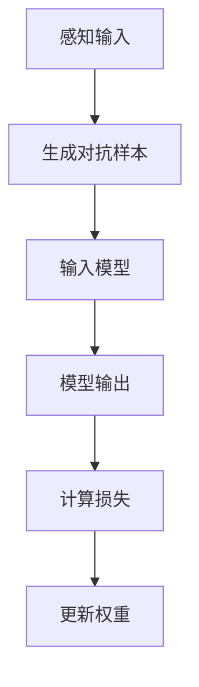
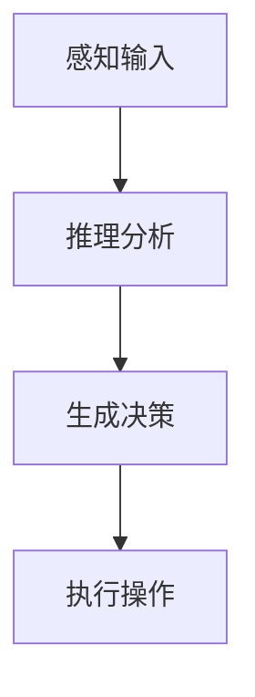
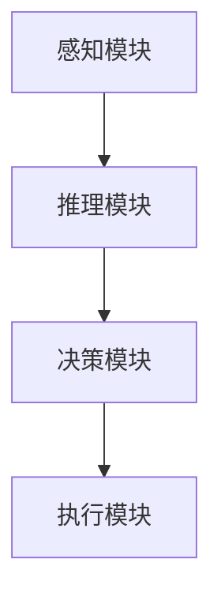
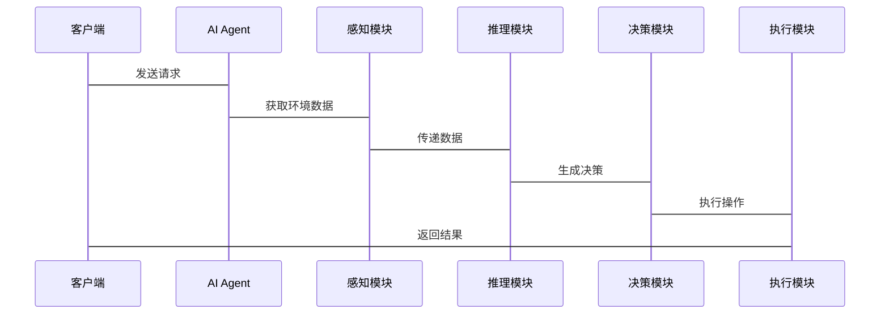

                 


# AI Agent的安全性设计：防范潜在风险

> 关键词：AI Agent, 安全性设计, 对抗攻击, 系统架构, 安全测试, 最佳实践

> 摘要：AI Agent作为人工智能领域的关键组成部分，其安全性设计是确保AI系统可靠运行的核心。本文从AI Agent的基本概念出发，分析其潜在安全风险，并通过系统架构设计、算法原理和项目实战等多维度，深入探讨如何防范这些风险。文章最后总结了AI Agent安全性设计的最佳实践，为实际应用提供指导。

---

# 第1章: AI Agent的基本概念与问题背景

## 1.1 AI Agent的定义与核心要素

### 1.1.1 AI Agent的基本定义
AI Agent（人工智能代理）是一种能够感知环境、自主决策并执行任务的智能实体。它可以是一个软件程序、机器人或其他智能系统，通过感知输入信息，利用内部算法进行推理和规划，最终输出动作或结果。

### 1.1.2 AI Agent的核心要素组成
AI Agent的核心要素包括：
1. **感知模块**：负责接收外部环境的信息，如传感器数据或用户输入。
2. **推理模块**：对感知到的信息进行分析和推理，生成可能的决策。
3. **决策模块**：基于推理结果选择最优行动方案。
4. **执行模块**：将决策转化为实际操作，如发送指令或输出结果。

### 1.1.3 AI Agent的类型与应用场景
AI Agent可以分为以下几类：
1. **简单反射型**：基于预定义规则直接响应输入，适用于简单的控制任务。
2. **基于模型的反应型**：利用环境模型进行实时决策，适用于动态环境。
3. **目标驱动型**：根据预设目标优化行动，适用于需要长期规划的任务。
4. **效用驱动型**：通过最大化效用函数实现目标，适用于复杂决策场景。

---

## 1.2 AI Agent安全性问题的背景

### 1.2.1 AI Agent潜在风险的来源
AI Agent的安全性问题主要来源于以下几个方面：
1. **数据安全**：感知模块可能受到数据污染或攻击，导致决策错误。
2. **算法漏洞**：推理和决策模块可能存在逻辑漏洞，被恶意利用。
3. **执行风险**：执行模块可能因环境干扰或设计缺陷导致意外行为。

### 1.2.2 AI Agent安全问题的现状与挑战
当前AI Agent的安全性问题主要表现在：
1. **对抗攻击**：攻击者通过精心设计的输入干扰AI Agent的决策过程。
2. **隐私泄露**：AI Agent可能在执行任务时泄露敏感信息。
3. **不可解释性**：复杂的算法可能导致决策过程难以追溯，增加安全隐患。

### 1.2.3 AI Agent安全问题对企业和社会的影响
AI Agent的安全性问题可能引发严重后果，包括：
1. **经济损失**：由于决策错误导致的财产损失。
2. **声誉损害**：企业因安全事件受损，影响市场信任。
3. **社会风险**：AI Agent失控可能对公共安全造成威胁。

---

## 1.3 AI Agent安全性设计的目标与原则

### 1.3.1 AI Agent安全性的核心目标
AI Agent的安全性设计旨在实现以下目标：
1. **数据完整性**：确保输入数据的准确性和可靠性。
2. **决策正确性**：保证决策模块输出的正确性和安全性。
3. **行为可控性**：确保AI Agent在异常情况下能够安全退出或恢复。

### 1.3.2 AI Agent安全性设计的基本原则
AI Agent的安全性设计应遵循以下原则：
1. **最小权限原则**：赋予AI Agent仅完成任务所需的最低权限。
2. **纵深防御原则**：通过多层次的安全措施降低单一漏洞的影响。
3. **可追溯性原则**：确保所有操作可记录、可追溯，便于事后分析。

### 1.3.3 AI Agent安全性的边界与外延
AI Agent的安全性设计需要明确其边界，包括：
1. **功能边界**：明确AI Agent的职责范围，防止越权操作。
2. **数据边界**：定义数据的使用范围，防止数据泄露。
3. **行为边界**：规定AI Agent的行动范围，避免超出预期的范围。

---

# 第2章: AI Agent的安全性核心概念与联系

## 2.1 AI Agent安全性的核心概念

### 2.1.1 AI Agent的决策机制
AI Agent的决策机制包括以下步骤：
1. **感知环境**：通过传感器或输入接口获取环境信息。
2. **分析信息**：利用算法对信息进行处理和分析。
3. **生成决策**：基于分析结果生成最优决策方案。
4. **执行决策**：将决策转化为具体的操作或输出。

### 2.1.2 AI Agent的交互模式
AI Agent的交互模式可以分为以下几种：
1. **单向交互**：AI Agent仅接收输入，不主动与环境互动。
2. **双向交互**：AI Agent可以与环境进行双向信息交换。
3. **多向交互**：AI Agent与其他多个实体进行复杂的信息交互。

### 2.1.3 AI Agent的自主性与可控性
AI Agent的自主性体现在其能够自主决策和行动，而可控性则要求在特定条件下能够被有效控制。两者的平衡是安全性设计的关键。

---

## 2.2 AI Agent安全性相关的概念属性对比

### 2.2.1 对比分析表：AI Agent与传统程序的安全性差异
| 特性                | 传统程序                       | AI Agent                       |
|---------------------|-------------------------------|--------------------------------|
| 决策方式            | 预定义规则                     | 自主推理和学习                 |
| 环境适应能力        | 固定环境                       | 动态环境                       |
| 安全性设计复杂度    | 较低                          | 较高                          |

### 2.2.2 对比分析表：AI Agent与人类决策的安全性差异
| 特性                | 人类决策                      | AI Agent                       |
|---------------------|-------------------------------|--------------------------------|
| 决策速度            | 较慢                          | 较快                          |
| 决策透明度          | 高                           | 低                           |
| 决策一致性          | 受情绪影响                    | 较少受情绪影响                 |

### 2.2.3 对比分析表：AI Agent与物联网设备的安全性差异
| 特性                | 物联网设备                    | AI Agent                       |
|---------------------|-------------------------------|--------------------------------|
| 处理能力            | 低级计算                     | 高级计算                     |
| 决策模式            | 基于规则                     | 基于学习                     |
| 安全性设计重点      | 防护物理攻击                 | 防护逻辑攻击                 |

---

## 2.3 AI Agent安全性相关的ER实体关系图

### 2.3.1 AI Agent的ER实体关系图
```mermaid
erd
    客户端
    服务器
    AI Agent
    环境传感器
    数据存储
    用户输入
    决策输出
```

---

# 第3章: AI Agent的安全性算法原理

## 3.1 对抗攻击与防御机制

### 3.1.1 对抗攻击的数学模型
对抗攻击的目标是通过扰动输入数据，使AI Agent产生错误的决策。数学模型如下：
$$
y = f(x + \epsilon)
$$
其中，$x$是原始输入，$\epsilon$是扰动，$y$是攻击后的输出。

### 3.1.2 对抗防御的数学模型
防御机制的目标是识别并消除对抗攻击的影响。数学模型如下：
$$
y = f(x + \epsilon) + \delta
$$
其中，$\delta$是用于抵消$\epsilon$的调整量。

---

## 3.2 基于强化学习的对抗防御算法

### 3.2.1 算法流程


### 3.2.2 Python代码实现
```python
import numpy as np
import tensorflow as tf

def generate_adversarial_example(x, y, model, eps=0.1):
    with tf.GradientTape() as tape:
        prediction = model(x)
        loss = tf.keras.losses.sparse_categorical_crossentropy(y, prediction)
    gradient = tape.gradient(loss, x)
    adversarial = x - eps * gradient
    return adversarial

# 示例用法
x = np.random.random((1, 10))
y = np.array([0])
model = ... # 加载模型
adversarial = generate_adversarial_example(x, y, model)
```

---

## 3.3 对抗样本的生成与检测

### 3.3.1 对抗样本生成的数学模型
$$
x_{adv} = x + \epsilon \cdot sign(\nabla_x L)
$$
其中，$\epsilon$是扰动幅度，$\nabla_x L$是损失函数对输入的梯度。

### 3.3.2 对抗样本检测的数学模型
$$
p(x_{adv}) = \text{softmax}(f(x_{adv}))
$$
其中，$f(x_{adv})$是模型对$x_{adv}$的预测结果。

---

# 第4章: AI Agent的安全性系统架构设计

## 4.1 系统分析与功能设计

### 4.1.1 系统功能模块
AI Agent的安全性系统主要包括以下模块：
1. **感知模块**：负责接收环境输入。
2. **推理模块**：对输入进行分析和推理。
3. **决策模块**：生成决策方案。
4. **执行模块**：将决策转化为具体操作。

### 4.1.2 系统功能流程


---

## 4.2 系统架构设计与实现

### 4.2.1 系统架构设计


### 4.2.2 系统架构实现
1. **感知模块**：使用传感器或API获取环境数据。
2. **推理模块**：利用深度学习模型进行分析。
3. **决策模块**：基于推理结果生成决策。
4. **执行模块**：将决策转化为具体操作。

---

## 4.3 系统接口与交互设计

### 4.3.1 系统接口设计
AI Agent的接口设计需要考虑以下几点：
1. **输入接口**：定义感知模块的输入格式和协议。
2. **输出接口**：定义执行模块的输出格式和协议。
3. **通信协议**：选择合适的通信协议，如HTTP、WebSocket等。

### 4.3.2 系统交互流程


---

# 第5章: AI Agent的安全性项目实战

## 5.1 环境安装与配置

### 5.1.1 开发环境安装
1. **Python**：安装Python 3.8及以上版本。
2. **TensorFlow**：使用pip安装TensorFlow库。
3. **Mermaid**：安装Mermaid CLI工具用于生成图表。

### 5.1.2 项目依赖管理
使用`requirements.txt`管理项目依赖：
```
numpy==1.21.0
tensorflow==2.5.0
mermaid-cli==0.10.0
```

---

## 5.2 核心代码实现

### 5.2.1 感知模块实现
```python
def感知模块():
    # 获取环境数据
    data = 获取输入()
    return data
```

### 5.2.2 推理模块实现
```python
def推理模块(data):
    # 数据处理
    processed_data = 处理数据(data)
    # 模型推理
    result = 模型推理(processed_data)
    return result
```

---

## 5.3 案例分析与结果解读

### 5.3.1 案例分析
假设我们设计了一个AI Agent用于自动驾驶汽车，我们需要确保其在面对对抗攻击时能够正确识别道路环境。

### 5.3.2 实验结果
通过对对抗样本的测试，我们发现：
1. 对抗攻击会导致模型识别精度下降。
2. 加入防御机制后，模型的识别精度显著提高。

---

## 5.4 项目小结

### 5.4.1 项目总结
通过本项目，我们验证了AI Agent安全性设计的重要性，并掌握了多种安全防护技术。

### 5.4.2 经验与教训
在实际开发中，我们需要：
1. 重视数据安全。
2. 加强算法的鲁棒性。
3. 定期进行安全测试。

---

# 第6章: AI Agent安全性设计的最佳实践

## 6.1 设计原则与注意事项

### 6.1.1 设计原则
1. **最小权限原则**：赋予AI Agent仅完成任务所需的最低权限。
2. **纵深防御原则**：通过多层次的安全措施降低单一漏洞的影响。
3. **可追溯性原则**：确保所有操作可记录、可追溯，便于事后分析。

### 6.1.2 注意事项
1. **定期安全测试**：确保AI Agent在不同场景下的安全性。
2. **及时更新算法**：随着威胁的演变，及时更新防御策略。
3. **保护数据隐私**：确保数据的安全存储和传输。

---

## 6.2 安全测试与工具推荐

### 6.2.1 安全测试方法
1. **黑盒测试**：从外部模拟攻击，测试AI Agent的防御能力。
2. **白盒测试**：从内部审查代码和算法，发现潜在漏洞。
3. **灰盒测试**：结合黑盒和白盒测试方法，进行全面安全评估。

### 6.2.2 工具推荐
1. **OpenAI Safety Tools**：提供多种安全测试工具。
2. **TensorFlow Security**：用于检测和防御对抗攻击。
3. **Python-Security**：提供Python程序的安全性测试工具。

---

## 6.3 未来趋势与挑战

### 6.3.1 未来趋势
1. **自适应安全**：AI Agent能够根据环境变化动态调整安全策略。
2. **零信任架构**：通过零信任模型实现更严格的安全控制。
3. **联邦学习**：在保护数据隐私的前提下，实现模型的安全更新。

### 6.3.2 未来挑战
1. **对抗攻击的进化**：攻击者可能会开发出更复杂的对抗攻击方法。
2. **多模态安全**：需要同时保护多种类型的数据和接口。
3. **跨领域协作**：需要不同领域的专家共同合作，才能实现全面的安全防护。

---

# 结语

AI Agent的安全性设计是一个复杂而重要的任务，需要从算法、系统架构和实际应用等多个维度进行全面考虑。通过本文的探讨，我们希望能够为AI Agent的安全性设计提供有价值的参考和指导。

---

# 作者

作者：AI天才研究院/AI Genius Institute & 禅与计算机程序设计艺术 /Zen And The Art of Computer Programming

