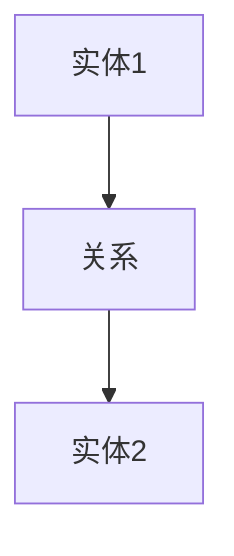
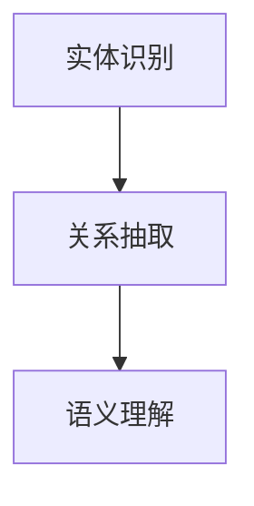
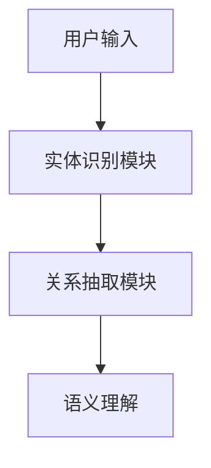
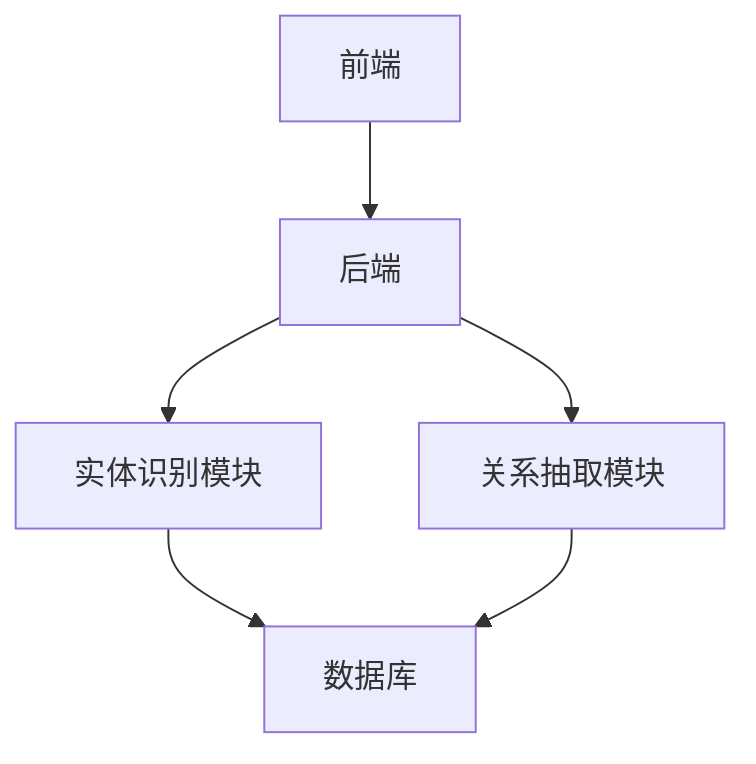

                 


# AI Agent的实体识别与关系抽取：深化语义理解

> 关键词：AI Agent、实体识别、关系抽取、语义理解、自然语言处理、深度学习、知识图谱

> 摘要：AI Agent需要具备语义理解能力，而实体识别与关系抽取是实现这一能力的关键技术。本文将深入探讨实体识别与关系抽取的核心概念、算法原理、系统设计与项目实战，结合丰富的案例分析和详细的技术实现，帮助读者全面理解并掌握这些技术。

---

## 第一部分: AI Agent的实体识别与关系抽取概述

### 第1章: AI Agent与实体识别、关系抽取概述

#### 1.1 AI Agent的基本概念
##### 1.1.1 AI Agent的定义与特点
- **定义**: AI Agent（智能体）是指能够感知环境、自主决策并执行任务的智能系统。
- **特点**: 智能性、自主性、反应性、社交能力。

##### 1.1.2 实体识别在AI Agent中的作用
- 实体识别是AI Agent理解文本内容的基础。
- 实体识别帮助AI Agent构建知识图谱，支持后续的任务处理。

##### 1.1.3 关系抽取在语义理解中的重要性
- 关系抽取揭示实体之间的关联，是语义理解的关键。
- 关系抽取为AI Agent提供上下文信息，支持智能决策。

#### 1.2 实体识别与关系抽取的背景与应用
##### 1.2.1 问题背景与挑战
- **背景**: 自然语言处理（NLP）领域的经典任务，广泛应用于文本挖掘、信息抽取和知识图谱构建。
- **挑战**: 实体边界模糊、关系多样性和复杂性、上下文语义理解难度大。

##### 1.2.2 实体识别与关系抽取的应用场景
- **实体识别**: 假名识别、地名识别、组织机构识别等。
- **关系抽取**: 事件抽取、实体关系网络构建等。

##### 1.2.3 语义理解的深化与实际需求
- 语义理解的深化依赖于精确的实体识别和关系抽取。
- 实际需求包括信息检索、问答系统、智能对话等。

#### 1.3 实体识别与关系抽取的核心概念
##### 1.3.1 实体识别的定义与属性
- **定义**: 识别文本中的实体并标注其类型和位置。
- **属性**: 实体类型（人名、地名、组织机构等）、实体位置（起始和结束索引）。

##### 1.3.2 关系抽取的定义与属性
- **定义**: 识别文本中实体之间的关系并标注关系类型。
- **属性**: 关系类型（因果、并列等）、实体对（头实体和尾实体）。

##### 1.3.3 实体与关系的ER实体关系图架构


## 第2章: 实体识别与关系抽取的核心概念与联系

### 2.1 实体识别的原理与方法
#### 2.1.1 实体识别的基本原理
- **序列标注**: 使用标注数据训练模型，识别文本中的实体。
- **特征工程**: 提取文本特征，如词性、上下文信息等。

#### 2.1.2 实体识别的主要方法
- **基于规则的方法**: 利用预定义的规则匹配实体。
- **统计学习方法**: 使用CRF（条件随机场）进行序列标注。
- **深度学习方法**: 使用RNN、LSTM等模型进行实体识别。

#### 2.1.3 实体识别的特征对比表格
| 特征 | 基于规则 | 统计学习 | 深度学习 |
|------|----------|----------|----------|
| 精度 | 中等 | 高 | 最高 |
| 可解释性 | 高 | 中等 | 低 |
| 训练数据需求 | 少 | 大 | 大 |

### 2.2 关系抽取的原理与方法
#### 2.2.1 关系抽取的基本原理
- **句子级抽取**: 识别句子中实体对及其关系。
- **文档级抽取**: 识别整个文档中实体对及其关系。

#### 2.2.2 关系抽取的主要方法
- **基于规则的方法**: 预定义的关系模式匹配。
- **统计学习方法**: 使用CRF或SVM进行关系分类。
- **深度学习方法**: 使用注意力机制和序列标注模型进行关系抽取。

#### 2.2.3 关系抽取的特征对比表格
| 特征 | 基于规则 | 统计学习 | 深度学习 |
|------|----------|----------|----------|
| 精度 | 中等 | 高 | 最高 |
| 可解释性 | 高 | 中等 | 低 |
| 训练数据需求 | 少 | 大 | 大 |

### 2.3 实体识别与关系抽取的联系与区别
#### 2.3.1 实体识别与关系抽取的联系
- 实体识别是关系抽取的基础。
- 关系抽取依赖于实体识别的结果。

#### 2.3.2 实体识别与关系抽取的区别
- 实体识别关注单个实体的识别。
- 关系抽取关注实体之间的关系。

#### 2.3.3 实体识别与关系抽取的协同工作流程


## 第3章: 实体识别与关系抽取的算法原理

### 3.1 实体识别的算法原理
#### 3.1.1 基于序列标注的实体识别
##### 3.1.1.1 CRF模型
- **原理**: 利用条件随机场进行序列标注。
- **流程**: 
  1. 特征提取：提取每个字符的词性、上下文信息。
  2. 训练：使用标注数据训练CRF模型。
  3. 预测：对未标注文本进行实体识别。

##### 3.1.1.2 LSTM模型
- **原理**: 使用长短时记忆网络进行序列标注。
- **流程**: 
  1. 特征提取：提取每个字符的词向量。
  2. 训练：使用标注数据训练LSTM模型。
  3. 预测：对未标注文本进行实体识别。

#### 3.1.2 基于预训练模型的实体识别
##### 3.1.2.1 BERT模型
- **原理**: 使用预训练的BERT模型进行实体识别。
- **流程**: 
  1. 加载预训练的BERT模型。
  2. 对文本进行分词和向量化。
  3. 使用训练好的模型进行实体识别。

### 3.2 关系抽取的算法原理
#### 3.2.1 基于序列标注的关系抽取
##### 3.2.1.1 CRF模型
- **原理**: 利用条件随机场进行关系抽取。
- **流程**: 
  1. 特征提取：提取每个词语的特征。
  2. 训练：使用标注数据训练CRF模型。
  3. 预测：对未标注文本进行关系抽取。

##### 3.2.1.2 LSTM模型
- **原理**: 使用长短时记忆网络进行关系抽取。
- **流程**: 
  1. 特征提取：提取每个词语的词向量。
  2. 训练：使用标注数据训练LSTM模型。
  3. 预测：对未标注文本进行关系抽取。

#### 3.2.2 基于注意力机制的关系抽取
##### 3.2.2.1 Attention机制
- **原理**: 使用自注意力机制捕捉文本中的关系信息。
- **流程**: 
  1. 对文本进行分词和向量化。
  2. 使用自注意力机制计算每个词的注意力权重。
  3. 基于注意力权重进行关系抽取。

## 第4章: 实体识别与关系抽取的系统设计与架构

### 4.1 系统设计
#### 4.1.1 系统架构


#### 4.1.2 接口设计
- **实体识别接口**: 输入文本，输出实体及其类型。
- **关系抽取接口**: 输入实体对，输出关系类型。

#### 4.1.3 交互流程
1. 用户输入文本。
2. 实体识别模块识别文本中的实体。
3. 关系抽取模块抽取实体之间的关系。
4. 语义理解模块根据实体和关系进行语义分析。

### 4.2 系统架构


## 第5章: 实体识别与关系抽取的项目实战

### 5.1 环境配置
- **Python版本**: 3.8+
- **依赖库**: numpy、pandas、scikit-learn、tensorflow、transformers

### 5.2 核心实现
#### 5.2.1 实体识别实现
```python
from transformers import BertTokenizer, BertModel
from sklearn.feature_extraction.text import TfidfVectorizer
from sklearn.svm import SVC

tokenizer = BertTokenizer.from_pretrained('bert-base-uncased')
model = BertModel.from_pretrained('bert-base-uncased')

def get_entity(text):
    inputs = tokenizer(text, return_tensors='np')
    outputs = model(**inputs)
    # 实体识别逻辑
    return entities
```

#### 5.2.2 关系抽取实现
```python
from transformers import BertTokenizer, BertModel
from sklearn.feature_extraction.text import TfidfVectorizer
from sklearn.svm import SVC

tokenizer = BertTokenizer.from_pretrained('bert-base-uncased')
model = BertModel.from_pretrained('bert-base-uncased')

def extract_relation(text):
    inputs = tokenizer(text, return_tensors='np')
    outputs = model(**inputs)
    # 关系抽取逻辑
    return relations
```

### 5.3 案例分析
- **案例1**: 实体识别案例
  - **输入**: "张三在北京大学工作。"
  - **输出**: 实体为“张三”（人名）和“北京大学”（组织机构）。
- **案例2**: 关系抽取案例
  - **输入**: “张三是北京大学的教授。”
  - **输出**: 实体对（张三，北京大学），关系类型为“工作于”。

### 5.4 项目小结
- 通过项目实战，读者可以掌握实体识别和关系抽取的具体实现方法。
- 实体识别和关系抽取是AI Agent实现语义理解的关键技术。

## 第6章: 总结与展望

### 6.1 总结
- 实体识别和关系抽取是AI Agent实现语义理解的重要技术。
- 通过本文的学习，读者可以掌握实体识别和关系抽取的核心概念、算法原理和系统设计。

### 6.2 展望
- 随着深度学习技术的发展，实体识别和关系抽取的精度和效率将不断提高。
- AI Agent将在更多领域得到应用，如智能客服、智能助手等。

## 作者
作者：AI天才研究院/AI Genius Institute  
作者：禅与计算机程序设计艺术/Zen And The Art of Computer Programming

