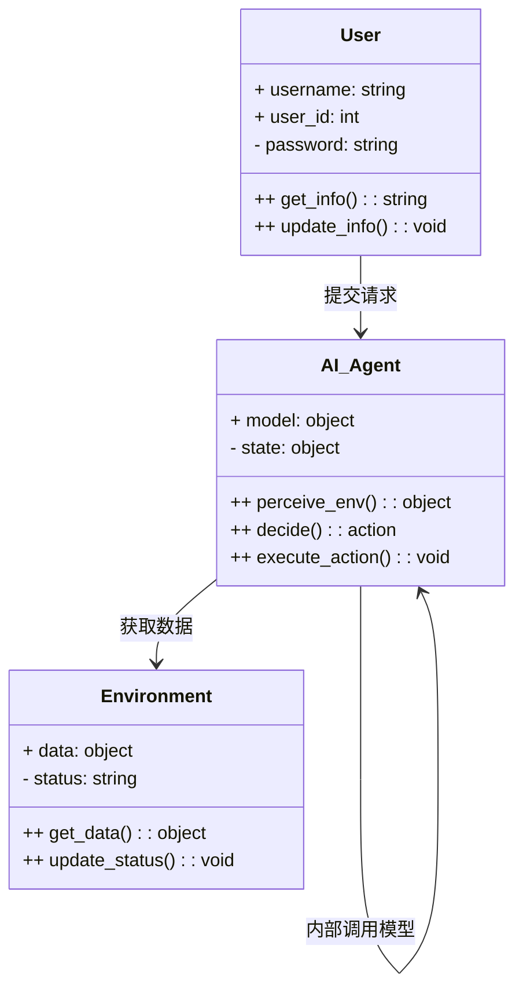
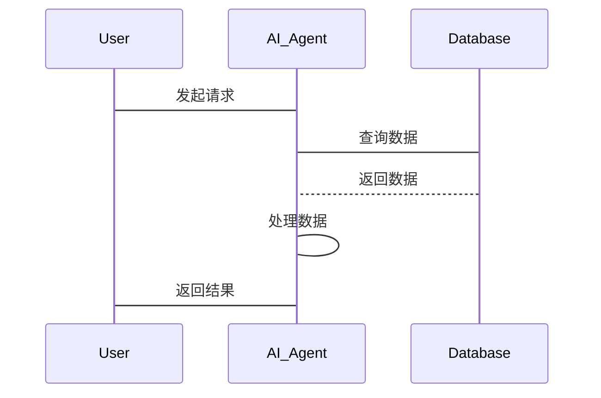

                 


# AI Agent的实时决策与风险评估系统

## 关键词：AI Agent、实时决策、风险评估、机器学习、强化学习、数学建模、系统架构

## 摘要：本文深入探讨了AI Agent在实时决策与风险评估系统中的核心原理与实现方法。通过分析AI Agent的基本概念、决策模型、风险评估算法，以及系统架构设计，结合实际项目案例，详细讲解了如何构建一个高效可靠的实时决策与风险评估系统。文章内容涵盖背景介绍、核心概念、算法原理、系统设计与实现，旨在为读者提供全面的技术指导。

---

# 第1章: AI Agent的背景与概念

## 1.1 问题背景

### 1.1.1 传统决策系统的局限性

传统的决策系统依赖于规则引擎和静态数据，无法应对动态变化的环境。例如，在金融交易中，传统系统难以实时调整策略以应对市场波动。这种局限性使得企业面临决策延迟和风险扩大的问题。

### 1.1.2 AI Agent的提出与意义

AI Agent（人工智能代理）通过结合机器学习和强化学习技术，能够实时感知环境变化并做出最优决策。AI Agent的应用范围广泛，包括金融投资、自动驾驶、智能客服等领域，能够显著提升决策的效率和准确性。

### 1.1.3 实时决策与风险评估的核心问题

实时决策的核心问题是快速响应和准确性，而风险评估的关键在于量化不确定性并制定应对策略。AI Agent通过整合实时数据、动态模型和优化算法，解决了传统系统无法应对的复杂决策问题。

## 1.2 问题描述

### 1.2.1 AI Agent的定义与特点

AI Agent是一种能够感知环境、自主决策并执行任务的智能实体。其特点包括：

1. **自主性**：无需外部干预，自主完成任务。
2. **反应性**：能够实时感知环境变化并做出反应。
3. **学习能力**：通过机器学习和强化学习不断优化决策模型。

### 1.2.2 实时决策的核心挑战

实时决策的核心挑战包括：

1. **数据流处理**：需要实时处理大量动态数据。
2. **决策延迟**：必须在极短时间内做出决策。
3. **不确定性**：面对复杂环境中的不确定性，需要动态调整策略。

### 1.2.3 风险评估的关键要素

风险评估的关键要素包括：

1. **风险因子识别**：识别影响决策的主要风险因素。
2. **风险量化**：量化各风险因子的影响程度。
3. **风险缓解策略**：制定应对风险的最优策略。

## 1.3 问题解决

### 1.3.1 AI Agent的决策机制

AI Agent的决策机制包括：

1. **感知环境**：通过传感器或API获取实时数据。
2. **状态评估**：基于历史数据和实时数据构建状态模型。
3. **决策优化**：利用强化学习优化决策策略。

### 1.3.2 风险评估的方法论

风险评估的方法论包括：

1. **风险建模**：构建风险评估模型，量化风险程度。
2. **风险预测**：利用机器学习模型预测潜在风险。
3. **风险缓解**：制定应对风险的优化策略。

### 1.3.3 实时决策与风险评估的结合

实时决策与风险评估的结合主要体现在：

1. **动态调整决策策略**：根据实时风险评估结果动态调整决策。
2. **风险驱动决策**：将风险评估结果作为决策的主要依据。

## 1.4 边界与外延

### 1.4.1 AI Agent的适用场景

AI Agent适用于以下场景：

1. **金融投资**：实时分析市场数据，制定投资策略。
2. **自动驾驶**：实时感知环境，做出驾驶决策。
3. **智能客服**：实时理解用户需求，提供解决方案。

### 1.4.2 系统边界与功能范围

系统边界与功能范围包括：

1. **输入边界**：实时数据流和用户请求。
2. **输出边界**：决策结果和风险评估报告。
3. **功能范围**：数据处理、状态评估、决策优化、风险评估。

### 1.4.3 相关概念的对比与区分

相关概念的对比与区分：

1. **AI Agent与传统决策系统**：AI Agent具有自主性和学习能力，而传统决策系统依赖于静态规则。
2. **强化学习与监督学习**：强化学习注重策略优化，监督学习注重分类预测。

## 1.5 概念结构与核心要素

### 1.5.1 AI Agent的核心组成

AI Agent的核心组成包括：

1. **感知模块**：实时感知环境数据。
2. **决策模块**：基于感知数据做出决策。
3. **执行模块**：执行决策指令。

### 1.5.2 决策机制与风险评估的关系

决策机制与风险评估的关系：

1. **决策机制**：提供决策的逻辑和算法。
2. **风险评估**：提供决策的依据和优化方向。

### 1.5.3 系统架构的逻辑框架

系统架构的逻辑框架：

1. **数据层**：实时数据获取与存储。
2. **模型层**：构建决策模型和风险评估模型。
3. **应用层**：实现决策与风险评估功能。

---

# 第2章: AI Agent的核心概念与联系

## 2.1 核心概念原理

### 2.1.1 AI Agent的决策模型

AI Agent的决策模型包括：

1. **基于模型的决策树**：通过构建决策树进行分类和预测。
2. **强化学习算法**：通过奖励机制优化决策策略。

### 2.1.2 风险评估的数学模型

风险评估的数学模型包括：

1. **贝叶斯网络**：用于风险因子的联合概率计算。
2. **马尔可夫链**：用于风险状态的转移概率建模。

### 2.1.3 实时决策的算法原理

实时决策的算法原理包括：

1. **在线学习算法**：实时更新模型参数。
2. **近似推理算法**：快速计算概率分布。

## 2.2 概念属性特征对比

### 2.2.1 不同决策模型的对比

不同决策模型的对比：

| 决策模型 | 基于规则 | 基于模型 | 基于强化学习 |
|----------|----------|----------|--------------|
| 优点     | 简单易懂 | 高度灵活 | 自主优化     |
| 缺点     | 静态     | 计算复杂 | 学习时间长   |

### 2.2.2 风险评估方法的优劣势

风险评估方法的优劣势：

| 方法         | 优点             | 缺点             |
|--------------|------------------|------------------|
| 贝叶斯网络    | 高度可解释        | 计算复杂         |
| 马尔可夫链    | 适合序列数据     | 对初始状态敏感   |
| 强化学习      | 自适应能力强     | 需大量样本数据   |

### 2.2.3 AI Agent与传统决策系统的区别

AI Agent与传统决策系统的区别：

| 特性         | AI Agent          | 传统决策系统     |
|--------------|-------------------|-----------------|
| 自主性       | 高                | 低              |
| 反应性       | 高                | 低              |
| 学习能力     | 高                | 无              |

## 2.3 ER实体关系图

```mermaid
er
  actor: 用户
  system: AI Agent决策系统
  decision_rule: 决策规则
  risk_assessment: 风险评估结果
  action: 行动指令
  user_request: 用户请求
  constraint: 约束条件
  environment: 环境数据
  outcome: 结果反馈
  relation1: 用户 -> 用户请求
  relation2: 用户请求 -> AI Agent决策系统
  relation3: 环境数据 -> AI Agent决策系统
  relation4: AI Agent决策系统 -> 决策规则
  relation5: 决策规则 -> 行动指令
  relation6: 行动指令 -> 结果反馈
  relation7: 结果反馈 -> 风险评估结果
  relation8: 风险评估结果 -> 约束条件
```

---

# 第3章: AI Agent的算法原理与实现

## 3.1 算法原理

### 3.1.1 基于强化学习的决策算法

基于强化学习的决策算法：

1. **算法步骤**：
   1. 状态感知：获取当前环境状态。
   2. 行动选择：基于策略选择行动。
   3. 状态转移：执行行动并观察新状态。
   4. 奖励计算：计算行动的奖励值。
   5. 策略优化：更新策略以最大化奖励。

### 3.1.2 风险评估的数学模型

风险评估的数学模型：

1. **贝叶斯网络公式**：
   $$ P(A|B) = \frac{P(B|A)P(A)}{P(B)} $$
2. **马尔可夫链公式**：
   $$ P(s_{t+1}=s') = \sum_{s} P(s'|s, a)P(s) $$

### 3.1.3 实时决策的算法实现

实时决策的算法实现：

```python
class AI_Agent:
    def __init__(self):
        self.model = self.build_model()
        self.model.load_weights("model.h5")

    def build_model(self):
        # 构建决策模型
        pass

    def perceive_env(self):
        # 获取环境数据
        pass

    def decide(self, state):
        # 基于状态做出决策
        pass

    def execute_action(self, action):
        # 执行决策行动
        pass
```

## 3.2 系统分析与架构设计

### 3.2.1 问题场景介绍

问题场景介绍：

1. **金融投资场景**：实时分析股票市场数据，制定投资策略。
2. **自动驾驶场景**：实时感知交通环境，做出驾驶决策。

### 3.2.2 领域模型设计

领域模型设计：



### 3.2.3 系统架构设计

系统架构设计：

```mermaid
archi
    Client -[HTTP请求]-> API Gateway
    API Gateway --> AI_Agent
    AI_Agent --> Database
    Database --> Model Server
    Model Server --> Training Job
```

### 3.2.4 接口设计与交互流程图

接口设计与交互流程图：



---

# 第4章: AI Agent的项目实战

## 4.1 项目背景与目标

### 4.1.1 项目背景

项目背景：

1. **金融投资场景**：实时分析股票市场数据，制定投资策略。
2. **目标**：构建一个基于AI Agent的实时决策系统，实现股票交易的自动化决策。

## 4.2 项目实现

### 4.2.1 环境安装

环境安装：

1. **安装Python**：Python 3.8及以上版本。
2. **安装TensorFlow**：pip install tensorflow.
3. **安装Keras**：pip install keras.
4. **安装其他依赖**：numpy, pandas, matplotlib等。

### 4.2.2 核心实现

核心实现：

```python
import numpy as np
import pandas as pd
from tensorflow.keras import layers, models

# 数据预处理
data = pd.read_csv("stock_data.csv")
train_data = data[:700]
test_data = data[700:]

# 构建模型
model = models.Sequential()
model.add(layers.Dense(64, activation='relu', input_shape=(input_dim,)))
model.add(layers.Dense(32, activation='relu'))
model.add(layers.Dense(1, activation='linear'))
model.compile(optimizer='adam', loss='mean_squared_error')

# 训练模型
model.fit(train_data, epochs=10, batch_size=32, validation_data=test_data)

# 预测测试数据
predictions = model.predict(test_data)
```

### 4.2.3 代码解读与分析

代码解读与分析：

1. **数据预处理**：将股票数据划分为训练集和测试集。
2. **模型构建**：构建一个简单的神经网络模型。
3. **模型训练**：使用训练数据训练模型。
4. **模型预测**：使用测试数据进行预测。

### 4.2.4 案例分析与详细讲解

案例分析与详细讲解：

1. **模型训练效果**：分析模型的训练损失和测试损失。
2. **预测结果分析**：比较实际值和预测值，评估模型的准确性。
3. **风险评估结果**：基于模型预测结果，计算投资风险。

### 4.2.5 项目小结

项目小结：

1. **项目实现**：成功构建了一个基于AI Agent的实时决策系统。
2. **模型优化**：通过多次训练优化模型性能。
3. **风险控制**：通过风险评估模型实现了风险控制。

---

# 第5章: 总结与展望

## 5.1 总结

### 5.1.1 核心内容回顾

核心内容回顾：

1. **AI Agent的定义与特点**：AI Agent是一种能够自主决策和学习的智能实体。
2. **实时决策与风险评估的核心问题**：快速响应、准确决策和风险控制。
3. **算法原理与实现**：基于强化学习的决策算法和贝叶斯网络的风险评估模型。

### 5.1.2 系统设计与实现

系统设计与实现：

1. **系统架构设计**：构建了一个高效的AI Agent实时决策系统。
2. **项目实战**：通过金融投资场景的案例，详细讲解了系统的实现过程。

## 5.2 展望

### 5.2.1 技术趋势

技术趋势：

1. **强化学习的进一步发展**：强化学习在AI Agent中的应用将更加广泛。
2. **多智能体协作**：AI Agent将更加注重多智能体协作，提升决策效率。
3. **实时决策的边缘计算**：通过边缘计算实现更低延迟的实时决策。

### 5.2.2 应用前景

应用前景：

1. **金融领域**：AI Agent将在金融投资、风险管理等领域发挥更大的作用。
2. **自动驾驶**：AI Agent在自动驾驶中的应用将更加成熟。
3. **智能客服**：AI Agent将提供更加智能化的客户服务。

## 5.3 最佳实践 tips

### 5.3.1 技术实现 tips

技术实现 tips：

1. **模型优化**：通过模型压缩和量化技术优化模型性能。
2. **数据处理**：使用高效的数据库和数据处理工具提升数据处理效率。
3. **算法选择**：根据具体场景选择合适的算法，避免盲目跟风。

### 5.3.2 注意事项

注意事项：

1. **模型可解释性**：确保模型具有良好的可解释性，便于调试和优化。
2. **数据隐私**：注意数据隐私保护，确保数据安全。
3. **系统稳定性**：确保系统具有良好的稳定性和容错能力。

### 5.3.3 拓展阅读

拓展阅读：

1. 《强化学习（第2版）》
2. 《机器学习实战》
3. 《深度学习》

---

# 作者：AI天才研究院/AI Genius Institute & 禅与计算机程序设计艺术 /Zen And The Art of Computer Programming

---

**感谢您的阅读！希望这篇文章能为您提供有价值的技术见解和实践指导！**

