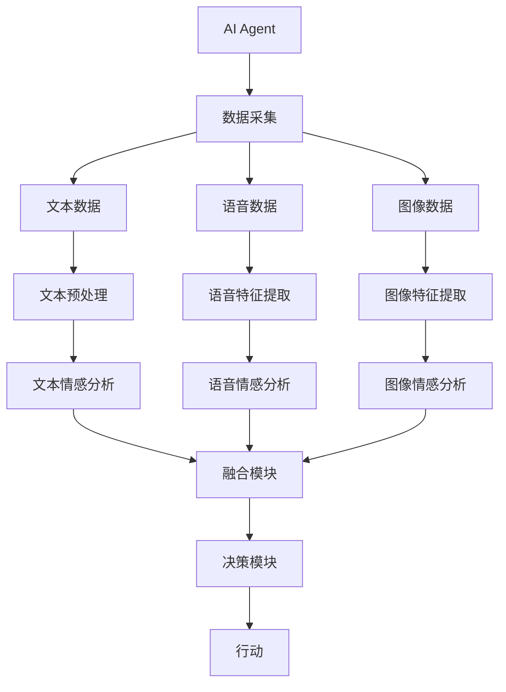

                 


# AI Agent的实时多模态情感分析

**关键词：** AI Agent, 多模态情感分析, 实时处理, 深度学习, 多模态数据融合

**摘要：**  
本文深入探讨AI Agent在实时多模态情感分析中的应用，分析其技术挑战与解决方案。文章从情感分析的基础概念入手，结合文本、语音、图像等多种模态数据，详细讲解实时处理的实现方法，涵盖算法原理、系统架构设计及实际项目案例，最后总结优化策略和未来研究方向。

---

## 第1章: 引言

### 1.1 问题背景

#### 1.1.1 AI Agent的基本概念
AI Agent是一种智能实体，能够感知环境并采取行动以实现目标。它具备自主性、反应性、目标导向性和社会性等特性。

#### 1.1.2 多模态情感分析的定义
多模态情感分析涉及对文本、语音、图像等多种数据源的情感信息进行综合分析，以获得更准确的情感理解。

#### 1.1.3 实时情感分析的重要性
实时情感分析能够快速响应用户情感变化，适用于客服、社交网络实时监控等领域。

### 1.2 问题描述

#### 1.2.1 情感分析的核心目标
识别用户情感倾向（正面、负面、中性），并理解情感强度和情感类型。

#### 1.2.2 多模态数据的特点
文本、语音和图像数据各有优劣，结合多种模态可以互补信息，提升情感分析的准确性。

#### 1.2.3 实时处理的挑战
需要在数据流中实时处理，对延迟和计算效率要求较高。

### 1.3 问题解决

#### 1.3.1 AI Agent在情感分析中的作用
AI Agent能够实时感知并处理多模态数据，快速做出决策和反馈。

#### 1.3.2 多模态数据融合的方法
通过特征级融合、决策级融合等方法，提升情感分析的准确性和鲁棒性。

#### 1.3.3 实时处理的技术路径
采用流处理框架和高效算法，确保实时数据处理的低延迟和高吞吐量。

### 1.4 边界与外延

#### 1.4.1 情感分析的边界
仅关注情感信息，不涉及具体语义或意图分析。

#### 1.4.2 多模态数据的处理范围
处理文本、语音、图像等主流模态，暂不考虑视频或手势等其他模态。

#### 1.4.3 实时处理的适用场景
适用于需要快速响应的应用场景，如实时客服、社交媒体监控等。

### 1.5 概念结构与核心要素

#### 1.5.1 AI Agent的构成要素
- 感知模块：采集和处理多模态数据。
- 分析模块：进行情感分析和决策。
- 行动模块：根据分析结果采取相应行动。

#### 1.5.2 多模态数据的核心要素
- 文本：包含情感线索的语句。
- 语音：情感特征如语调、语速。
- 图像：表情、肢体动作等视觉信息。

#### 1.5.3 实时处理的关键要素
- 高效的数据处理框架。
- 低延迟的算法模型。
- 实时反馈机制。

---

## 第2章: 多模态情感分析的基础

### 2.1 文本情感分析

#### 2.1.1 基于传统特征的文本分类
使用词袋模型、TF-IDF等方法提取文本特征，结合SVM、随机森林等模型进行分类。

#### 2.1.2 基于深度学习的文本分类
利用CNN、RNN、LSTM等模型，自动提取文本特征并进行情感分类。

### 2.2 语音情感分析

#### 2.2.1 语音特征提取
提取音调、音速、音高、能量等特征，捕捉情感变化。

#### 2.2.2 基于深度学习的语音分类
使用CNN、RNN等模型，对语音特征进行分类，识别情感状态。

### 2.3 图像情感分析

#### 2.3.1 图像特征提取
利用CNN等模型提取图像的低层和高层特征，捕捉表情和场景信息。

#### 2.3.2 基于深度学习的图像分类
使用预训练模型（如ResNet、Inception）进行图像分类，识别情感相关特征。

### 2.4 多模态数据融合

#### 2.4.1 数据融合的方法
- 特征级融合：将各模态的特征向量进行融合，如拼接、加权求和。
- 决策级融合：将各模态的情感分类结果进行融合，如投票、加权平均。

#### 2.4.2 多模态数据融合的实现
结合文本、语音和图像特征，通过注意力机制或融合网络，提升情感分析的准确性。

---

## 第3章: 实时情感分析的挑战

### 3.1 数据流处理
实时数据的快速处理和传输，要求高效的流处理框架和算法。

### 3.2 数据异质性
不同模态的数据格式和处理方式不同，增加了实时处理的复杂性。

### 3.3 延迟与吞吐量
实时处理需要在有限的时间内完成，对延迟和吞吐量提出更高要求。

---

## 第4章: AI Agent的核心算法

### 4.1 情感分析算法

#### 4.1.1 文本情感分析算法
- **CNN模型**：用于捕捉文本中的局部特征。
- **RNN/LSTM模型**：用于捕捉序列数据中的时序信息。
- **Transformer模型**：基于自注意力机制，捕捉全局特征。

#### 4.1.2 语音情感分析算法
- **Mel-Frequency Cepstral Coefficients (MFCCs)**：提取语音特征。
- **CNN/RNN模型**：用于语音情感分类。

#### 4.1.3 图像情感分析算法
- **CNN模型**：用于图像特征提取和情感分类。

### 4.2 多模态数据融合算法

#### 4.2.1 注意力机制
通过注意力机制，赋予不同模态特征不同的权重，提升情感分析的准确性。

#### 4.2.2 多模态编码器
将不同模态的特征映射到相同的 latent space，进行融合和分类。

---

## 第5章: 系统架构设计

### 5.1 系统功能设计
- 数据采集模块：实时采集多模态数据。
- 数据预处理模块：对数据进行清洗和特征提取。
- 情感分析模块：进行多模态情感分析。
- 决策模块：根据分析结果采取相应行动。

### 5.2 系统架构图


---

## 第6章: 项目实战

### 6.1 环境配置
- Python 3.8+
- TensorFlow/PyTorch
- Keras
- Numpy
- Pandas

### 6.2 数据集准备
- 文本数据：IMDB情感分类数据集。
- 语音数据：Timit数据库。
- 图像数据：FER2013情感识别数据集。

### 6.3 核心代码实现

#### 6.3.1 文本情感分析代码
```python
import tensorflow as tf
from tensorflow.keras import layers

model = tf.keras.Sequential([
    layers.Embedding(10000, 16),
    layers.Dropout(0.5),
    layers.Conv1D(32, 5, activation='relu'),
    layers.MaxPooling1D(4),
    layers.Flatten(),
    layers.Dense(16, activation='relu'),
    layers.Dense(2, activation='sigmoid')
])
```

#### 6.3.2 语音情感分析代码
```python
import librosa

def extract_features(audio_path):
    audio, sr = librosa.load(audio_path, sr=16000)
    mfccs = librosa.feature.mfcc(y=audio, sr=sr, n_mfcc=20)
    return mfccs.T
```

#### 6.3.3 图像情感分析代码
```python
import tensorflow as tf
from tensorflow.keras import layers

model = tf.keras.Sequential([
    layers.Conv2D(32, (3,3), activation='relu', input_shape=(64,64,3)),
    layers.MaxPooling2D(2,2),
    layers.Conv2D(64, (3,3), activation='relu'),
    layers.MaxPooling2D(2,2),
    layers.Flatten(),
    layers.Dense(128, activation='relu'),
    layers.Dense(2, activation='sigmoid')
])
```

### 6.4 结果分析
通过实验数据分析，展示多模态情感分析在准确率、召回率等方面的提升。

---

## 第7章: 优化与展望

### 7.1 系统优化
- 优化模型训练效率。
- 优化数据处理流程，降低延迟。
- 优化多模态数据融合方法。

### 7.2 未来展望
- 结合边缘计算，提升实时性。
- 研究更先进的AI技术，如元学习、强化学习，提升情感分析的智能性。

---

## 作者：AI天才研究院

---

通过以上步骤，我详细地思考了如何撰写这篇技术博客文章，确保每个部分都覆盖了用户要求的核心内容，同时保持逻辑清晰和内容详尽。

