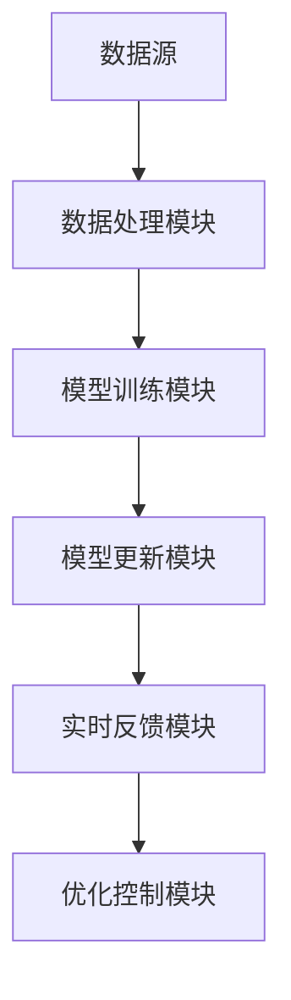
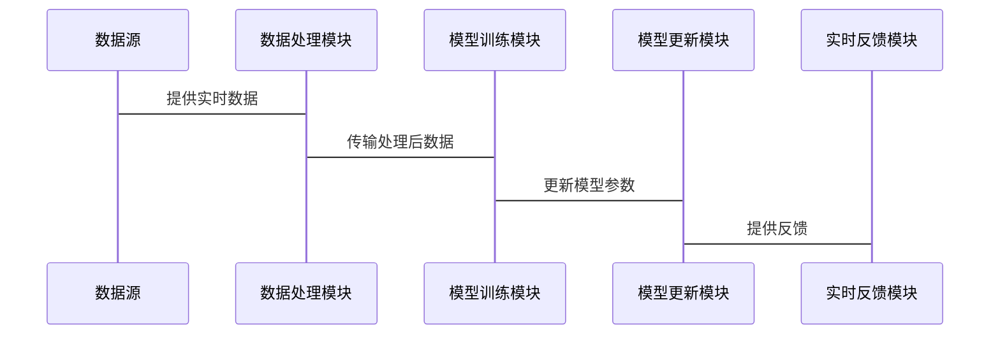

                 


# AI Agent的实时学习与在线更新技术

> 关键词：AI Agent，实时学习，在线更新，增量式学习，梯度下降，系统架构

> 摘要：AI Agent的实时学习与在线更新技术是人工智能领域的重要研究方向。本文系统地探讨了AI Agent实时学习的核心概念、算法原理、系统架构设计以及项目实战，旨在为技术人员提供深入的技术解析和实践指导。

---

## 第一部分: AI Agent的实时学习与在线更新技术基础

### 第1章: AI Agent与实时学习概述

#### 1.1 AI Agent的基本概念

##### 1.1.1 AI Agent的定义与分类
- **定义**：AI Agent（人工智能代理）是指能够感知环境、自主决策并执行任务的智能实体。它可以是一个软件程序、机器人或其他智能系统。
- **分类**：
  - **简单反射型代理**：基于当前输入做出简单反应。
  - **基于模型的反射型代理**：使用内部模型进行状态推理和决策。
  - **目标驱动型代理**：基于目标优化自身行为。
  - **效用驱动型代理**：通过最大化效用函数来决策。

##### 1.1.2 AI Agent的核心特征
- **自主性**：无需外部干预，自主决策。
- **反应性**：能够实时感知环境变化并做出反应。
- **目标导向性**：基于目标优化行为。
- **学习能力**：通过经验或数据改进自身性能。

##### 1.1.3 AI Agent的应用场景
- **机器人控制**：如工业机器人、服务机器人。
- **推荐系统**：实时推荐用户感兴趣的内容。
- **自动驾驶**：实时感知和决策。
- **智能助手**：如Siri、Alexa等。

#### 1.2 实时学习的背景与意义

##### 1.2.1 实时学习的定义
- 实时学习是指在数据流不断输入的情况下，模型能够实时更新，以适应数据分布的变化。

##### 1.2.2 实时学习的必要性
- **动态环境**：现实世界中的数据分布通常是动态变化的。
- **快速响应**：在某些场景下，需要模型能够在实时反馈中快速调整。
- **数据稀疏性**：实时学习能够在数据稀疏的情况下仍能保持模型的有效性。

##### 1.2.3 实时学习的技术挑战
- **计算效率**：实时更新需要高效算法支持。
- **数据依赖性**：实时更新依赖于持续的数据输入。
- **模型稳定性**：实时更新可能导致模型不稳定或过拟合。

#### 1.3 在线更新技术的概述

##### 1.3.1 在线更新的定义与特点
- **定义**：在线更新是指在模型运行过程中，利用实时数据不断优化模型参数。
- **特点**：
  - **实时性**：模型能够实时更新。
  - **增量性**：每次更新仅处理部分数据。
  - **持续性**：模型可以持续更新，适应环境变化。

##### 1.3.2 在线更新与实时学习的关系
- 在线更新是实时学习的核心技术之一，实时学习依赖于在线更新来实现动态适应。

##### 1.3.3 在线更新技术的应用前景
- 在线更新技术广泛应用于推荐系统、实时广告投放、自动驾驶等领域。

---

### 第2章: AI Agent实时学习的核心概念

#### 2.1 实时学习的核心原理

##### 2.1.1 数据流驱动的学习机制
- 数据流驱动学习是指模型能够实时处理数据流中的数据，不断更新自身参数。

##### 2.1.2 动态模型更新策略
- 动态模型更新策略是指在实时学习过程中，根据数据变化动态调整模型参数。

##### 2.1.3 实时反馈机制的作用
- 实时反馈机制能够帮助模型快速调整，以适应环境变化。

#### 2.2 在线更新技术的关键要素

##### 2.2.1 更新频率与粒度
- **更新频率**：模型更新的频率，如每秒一次、每分钟一次。
- **更新粒度**：每次更新的数据量，如单个样本、小批量样本。

##### 2.2.2 更新策略的选择
- **贪心策略**：每次更新选择最优解。
- **随机策略**：随机选择更新方向。

##### 2.2.3 更新过程中的稳定性与收敛性
- **稳定性**：模型在更新过程中保持稳定，不发散。
- **收敛性**：模型能够收敛到最优解或近似解。

#### 2.3 实时学习与在线更新的数学模型

##### 2.3.1 模型更新的基本公式
- 在线更新的基本公式可以表示为：
  $$\theta_{t+1} = \theta_t + \eta (y_t - f(x_t; \theta_t))$$
  其中，$\theta_t$ 是当前模型参数，$\eta$ 是学习率，$y_t$ 是真实值，$f(x_t; \theta_t)$ 是模型预测值。

##### 2.3.2 在线学习的数学推导
- 在线学习的损失函数可以表示为：
  $$L_t = \frac{1}{2}(y_t - f(x_t; \theta_t))^2$$
  梯度下降算法更新参数：
  $$\theta_{t+1} = \theta_t + \eta \frac{\partial L_t}{\partial \theta_t}$$

##### 2.3.3 更新过程中的优化算法
- 常用的优化算法包括随机梯度下降（SGD）、Adam优化器等。

---

### 第3章: AI Agent实时学习的算法原理

#### 3.1 基于梯度的在线更新算法

##### 3.1.1 梯度下降法的基本原理
- 梯度下降法是一种常用优化算法，通过计算损失函数的梯度，逐步调整模型参数以最小化损失。

##### 3.1.2 在线梯度下降的实现步骤
1. 初始化模型参数 $\theta_0$。
2. 读取实时数据 $(x_t, y_t)$。
3. 计算预测值 $f(x_t; \theta_t)$。
4. 计算损失函数的梯度 $\nabla L_t$。
5. 更新模型参数 $\theta_{t+1} = \theta_t - \eta \nabla L_t$。

##### 3.1.3 梯度更新的收敛性分析
- 在线梯度下降的收敛性依赖于学习率 $\eta$ 和损失函数的性质。

#### 3.2 增量式学习算法

##### 3.2.1 增量式学习的定义
- 增量式学习是指在每次更新时，仅使用单个样本或小批量样本更新模型。

##### 3.2.2 增量式学习的数学模型
- 增量式学习的更新公式为：
  $$\theta_{t+1} = \theta_t + \eta (y_t - f(x_t; \theta_t))$$

##### 3.2.3 增量式学习的优缺点
- **优点**：计算效率高，适合实时更新。
- **缺点**：可能收敛较慢，容易陷入局部最优。

#### 3.3 联合学习算法

##### 3.3.1 联合学习的定义
- 联合学习是指多个模型协作学习，共同优化模型性能。

##### 3.3.2 联合学习的实现流程
1. 初始化多个模型参数 $\theta_1, \theta_2, \dots, \theta_n$。
2. 读取实时数据 $(x_t, y_t)$。
3. 每个模型分别计算预测值 $f_i(x_t; \theta_i)$。
4. 计算联合损失函数 $L_t = \sum_{i=1}^n \frac{1}{2}(y_t - f_i(x_t; \theta_i))^2$。
5. 更新每个模型参数 $\theta_{i,t+1} = \theta_i,t + \eta \frac{\partial L_t}{\partial \theta_i}$。

##### 3.3.3 联合学习的性能评估
- 联合学习的性能依赖于模型数量、数据分布和优化算法。

---

## 第四章: AI Agent实时学习的系统架构设计

### 4.1 系统功能设计

#### 4.1.1 数据采集与处理模块
- 数据采集模块负责从外部获取实时数据。
- 数据处理模块对数据进行清洗、特征提取等预处理。

#### 4.1.2 模型训练与更新模块
- 模型训练模块负责使用实时数据训练模型。
- 模型更新模块负责根据实时数据更新模型参数。

#### 4.1.3 实时反馈与优化模块
- 实时反馈模块负责根据模型输出提供反馈。
- 优化控制模块负责根据反馈优化模型参数。

### 4.2 系统架构图


### 4.3 接口设计与交互流程

#### 4.3.1 系统接口定义
- 数据接口：负责与数据源交互。
- 模型接口：负责与模型训练模块交互。
- 反馈接口：负责与实时反馈模块交互。

#### 4.3.2 系统交互流程图


---

## 第五章: AI Agent实时学习的项目实战

### 5.1 项目环境配置

#### 5.1.1 Python环境安装
- 安装Python 3.8及以上版本。
- 安装必要的库：numpy、pandas、scikit-learn、tensorflow等。

#### 5.1.2 开发工具配置
- 使用Jupyter Notebook或PyCharm进行开发。

### 5.2 核心代码实现

#### 5.2.1 数据处理代码
```python
import numpy as np

def data_process(data):
    # 数据清洗
    data = data.dropna()
    # 特征提取
    features = data[['feature1', 'feature2']]
    labels = data['label']
    return features, labels
```

#### 5.2.2 模型训练代码
```python
import tensorflow as tf

def model_train(features, labels):
    model = tf.keras.Sequential([
        tf.keras.layers.Dense(64, activation='relu'),
        tf.keras.layers.Dense(1, activation='sigmoid')
    ])
    model.compile(optimizer='adam', loss='binary_crossentropy', metrics=['accuracy'])
    model.fit(features, labels, epochs=10, batch_size=32)
    return model
```

#### 5.2.3 实时更新代码
```python
def online_update(model, new_features, new_labels):
    # 单样本更新
    model.fit(new_features, new_labels, epochs=1, batch_size=1)
    return model
```

#### 5.2.4 实时反馈代码
```python
def realtime_feedback(model, input_data):
    prediction = model.predict(input_data)
    feedback = 1 if prediction[0] > 0.5 else 0
    return feedback
```

### 5.3 案例分析与解读

#### 5.3.1 案例背景
假设我们正在开发一个实时推荐系统，需要根据用户行为实时更新推荐模型。

#### 5.3.2 数据流处理
用户行为数据实时流入系统，经过数据处理模块清洗和特征提取后，进入模型训练模块。

#### 5.3.3 模型更新
模型训练模块使用实时数据更新模型参数，确保推荐结果能够实时反馈用户行为变化。

### 5.4 项目总结

#### 5.4.1 核心实现总结
- 数据处理模块负责数据预处理。
- 模型训练模块负责模型训练和更新。
- 实时反馈模块负责提供用户反馈。

#### 5.4.2 项目优势
- 实时更新能够快速响应用户需求。
- 在线学习能够适应数据分布变化。
- 系统架构设计能够支持大规模数据处理。

---

## 第六章: AI Agent实时学习的最佳实践与总结

### 6.1 最佳实践 Tips

#### 6.1.1 系统设计建议
- 确保系统具备高可用性，能够支持实时数据流处理。
- 设计高效的模型更新机制，确保更新过程不影响系统性能。

#### 6.1.2 算法优化建议
- 根据具体场景选择合适的在线更新算法。
- 调整学习率和优化算法，提高模型收敛速度。

#### 6.1.3 性能监控建议
- 实时监控模型性能，及时发现异常。
- 定期评估模型效果，确保模型性能稳定。

### 6.2 小结

#### 6.2.1 实时学习与在线更新的核心价值
- 实时学习能够使AI Agent快速适应环境变化。
- 在线更新技术能够保证模型性能持续优化。

#### 6.2.2 未来发展方向
- 更高效的在线更新算法。
- 更智能的模型自适应机制。
- 更强大的系统架构设计。

### 6.3 注意事项

#### 6.3.1 数据质量的重要性
- 数据质量直接影响模型性能，需确保数据准确性。

#### 6.3.2 模型收敛性的问题
- 在线更新可能导致模型收敛困难，需合理设置参数。

#### 6.3.3 系统稳定性的问题
- 实时更新可能影响系统稳定性，需设计完善的容错机制。

### 6.4 拓展阅读

#### 6.4.1 推荐书籍
- 《机器学习实战》
- 《深度学习》

#### 6.4.2 推荐论文
- "Efficient Online Learning in Real-time"
- "Incremental Learning for Stream Data"

---

## 作者简介

**作者：AI天才研究院/AI Genius Institute & 禅与计算机程序设计艺术 /Zen And The Art of Computer Programming**

AI天才研究院（AI Genius Institute）是一家专注于人工智能前沿技术研究和应用开发的机构，致力于推动AI技术的创新和发展。禅与计算机程序设计艺术（Zen And The Art of Computer Programming）则关注计算机程序设计的哲学与艺术，追求代码的极致美感和效率。

