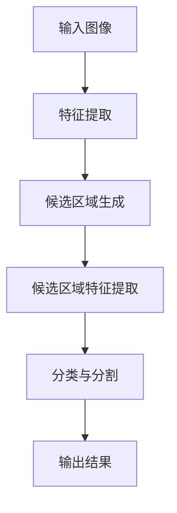
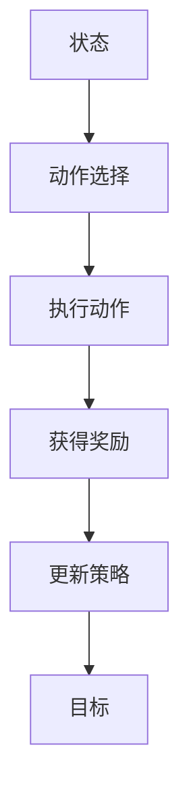
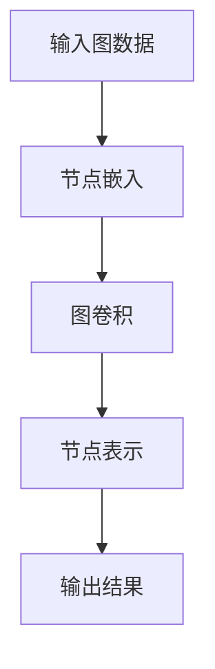
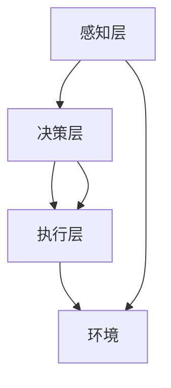
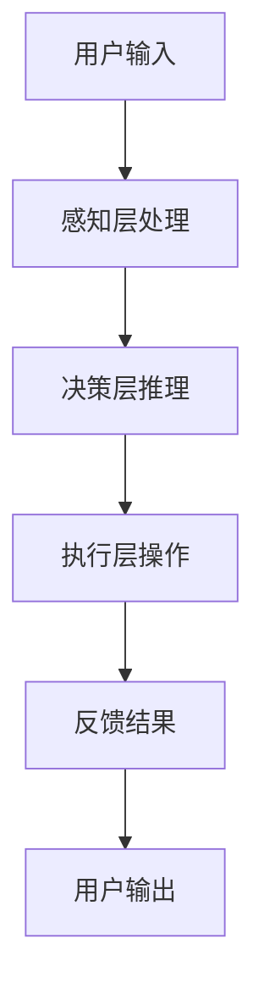

                 


# AI Agent的实时环境感知与适应能力

> **关键词**：AI Agent, 环境感知, 适应能力, 实时感知, 强化学习, 图神经网络, 系统架构

> **摘要**：  
AI Agent的实时环境感知与适应能力是人工智能领域的核心研究方向之一。本文从AI Agent的基本概念出发，深入探讨其环境感知与适应能力的核心算法、系统架构设计、项目实战以及最佳实践。通过分析环境感知的关键技术，如计算机视觉和自然语言处理，结合决策与推理算法，如强化学习和图神经网络，详细阐述AI Agent在复杂动态环境中的实时感知与适应能力。同时，本文通过实际案例展示AI Agent的实现过程，并总结其在实际应用中的优势与挑战。

---

## 第一部分：AI Agent的背景与概念

### 第1章：AI Agent的基本概念

#### 1.1 AI Agent的定义与特点

AI Agent（智能体）是指在环境中能够感知并自主行动以实现目标的实体。AI Agent的核心特点包括：

1. **自主性**：能够在没有外部干预的情况下独立决策。
2. **反应性**：能够实时感知环境变化并做出反应。
3. **目标导向性**：所有行为均以实现特定目标为导向。
4. **社交能力**：能够与其他Agent或人类进行交互协作。

#### 1.2 AI Agent的应用场景

AI Agent广泛应用于多个领域，包括：

1. **智能助手**：如Siri、Alexa等，帮助用户完成日常任务。
2. **智能机器人**：在制造业和物流领域，机器人能够自主完成复杂任务。
3. **自动驾驶**：通过实时感知环境进行决策和导航。

#### 1.3 AI Agent的环境感知与适应能力

环境感知是AI Agent理解环境的关键能力，而适应能力则是其根据环境变化调整行为的能力。两者共同确保AI Agent在动态环境中能够高效运作。

---

## 第二部分：环境感知与适应能力的核心算法

### 第2章：环境感知算法

#### 2.1 计算机视觉算法

计算机视觉是AI Agent视觉感知的核心技术。

##### 2.1.1 目标检测

目标检测是识别图像中物体的位置和类别。常用算法包括：

- **Faster R-CNN**：通过区域建议网络生成候选框，再通过RoIAlign提取特征进行分类和回归。
- **YOLO**：通过单个网络直接预测边界框和类别概率，速度快且精度高。

##### 2.1.2 图像分割

图像分割是对图像中每个像素进行分类。常用算法包括：

- **U-Net**：用于医学图像分割，通过跳跃连接实现特征的多级融合。
- **Mask R-CNN**：在目标检测的基础上，进一步分割出目标的实例。

##### 2.1.3 实例分割

实例分割是对图像中的每个目标进行分割并标记类别。Faster R-CNN和Mask R-CNN是常用的实例分割算法。

##### 2.1.4 图像分割流程图（mermaid）



#### 2.2 自然语言处理算法

自然语言处理用于AI Agent的语言理解。

##### 2.2.1 词法分析

词法分析将文本分割成单词或符号，并赋予其词性。

##### 2.2.2 句法分析

句法分析研究文本的语法结构，常用工具包括依存句法分析和短语结构分析。

##### 2.2.3 语义理解

语义理解通过上下文理解文本含义，常用技术包括词嵌入（Word2Vec）和 transformers（如BERT）。

#### 2.3 传感器数据融合算法

传感器数据融合将多种传感器的数据进行融合，提高感知精度。

##### 2.3.1 数据预处理

对传感器数据进行降噪和标准化处理。

##### 2.3.2 特征提取

通过提取关键特征，降低数据维度。

##### 2.3.3 融合方法

常用的方法包括加权融合、多传感器数据融合等。

---

## 第三部分：决策与推理算法

### 第3章：决策与推理算法

#### 3.1 强化学习算法

强化学习是AI Agent决策的核心算法。

##### 3.1.1 Q-Learning

通过Q值表记录状态-动作对的奖励值，通过贪心策略选择最优动作。

##### 3.1.2 DQN（深度强化学习）

使用深度神经网络近似Q值函数，通过经验回放和目标网络提高学习效率。

##### 3.1.3 策略梯度方法

通过优化策略直接优化动作选择的概率分布。

##### 3.1.4 强化学习流程图（mermaid）



#### 3.2 图神经网络算法

图神经网络用于处理复杂的关联关系。

##### 3.2.1 图结构数据

图数据由节点和边组成，节点表示实体，边表示关系。

##### 3.2.2 图卷积网络（GCN）

通过聚合邻居节点的信息，更新节点表示。

##### 3.2.3 图注意力网络（GAT）

通过注意力机制，关注重要的邻居节点。

##### 3.2.4 图神经网络流程图（mermaid）



---

## 第四部分：系统架构设计

### 第4章：系统架构设计

#### 4.1 系统架构图（mermaid）



#### 4.2 系统功能设计

系统功能包括环境感知、决策推理和执行控制三个模块。

#### 4.3 系统交互流程图（mermaid）



---

## 第五部分：项目实战

### 第5章：AI Agent项目实战

#### 5.1 项目介绍

实现一个基于强化学习的自动驾驶AI Agent，能够在模拟环境中自主导航。

#### 5.2 环境安装

需要安装Python、TensorFlow、OpenCV和ROS（Robot Operating System）。

#### 5.3 核心实现代码

##### 5.3.1 强化学习代码

```python
import numpy as np
import gym

class DQNAgent:
    def __init__(self, state_space, action_space):
        self.state_space = state_space
        self.action_space = action_space
        # 初始化神经网络模型
        self.model = self.build_model()

    def build_model(self):
        # 构建一个简单的DQN网络
        model = tf.keras.Sequential([
            tf.keras.layers.Dense(32, activation='relu', input_shape=(state_space,)),
            tf.keras.layers.Dense(32, activation='relu'),
            tf.keras.layers.Dense(action_space, activation='linear')
        ])
        return model

    def act(self, state):
        # 根据当前状态选择动作
        prediction = self.model.predict(state[np.newaxis])
        return np.argmax(prediction[0])

    def remember(self, state, action, reward, next_state):
        # 存储记忆
        pass

    def replay(self):
        # 回放记忆并更新网络
        pass

# 初始化环境
env = gym.make('CartPole-v0')
state_space = env.observation_space.shape[0]
action_space = env.action_space.n

# 初始化Agent
agent = DQNAgent(state_space, action_space)

# 训练过程
for episode in range(1000):
    state = env.reset()
    total_reward = 0
    while True:
        action = agent.act(state)
        next_state, reward, done, info = env.step(action)
        agent.remember(state, action, reward, next_state)
        agent.replay()
        total_reward += reward
        state = next_state
        if done:
            break
    print(f'Episode {episode}, Total Reward: {total_reward}')
```

#### 5.4 实际案例分析

通过训练，AI Agent能够在模拟环境中自主导航，实现目标。

---

## 第六部分：总结与展望

### 第6章：总结与展望

#### 6.1 技术总结

AI Agent的实时环境感知与适应能力是人工智能领域的核心技术，通过计算机视觉、自然语言处理、强化学习和图神经网络等技术的结合，能够实现高效的环境感知和决策推理。

#### 6.2 未来展望

未来，AI Agent将在更多领域得到广泛应用，如智能交通、医疗助手和工业自动化等。同时，算法的优化和硬件的提升将进一步增强AI Agent的能力。

---

## 附录

### 附录A：参考文献

1. LeCun, Y., Bengio, Y., & Hinton, G. (2015). Deep learning. Nature, 521(7552), 436-444.
2. Mnih, V., et al. (2016). DeepMind: playing Atari games with deep reinforcement learning. arXiv preprint arXiv:1312.5602.
3. Szegedy, C., et al. (2015). Going deeper with convolutions. In Proceedings of the IEEE conference on computer vision and pattern recognition (pp. 1-9).

### 附录B：工具与库

- **TensorFlow**：深度学习框架
- **OpenCV**：计算机视觉库
- **ROS**：机器人操作系统

---

## 作者信息

作者：AI天才研究院 & 禅与计算机程序设计艺术

---

以上是《AI Agent的实时环境感知与适应能力》的完整目录大纲和文章内容。希望这篇文章能够为读者提供清晰的技术解析和实践指导！

