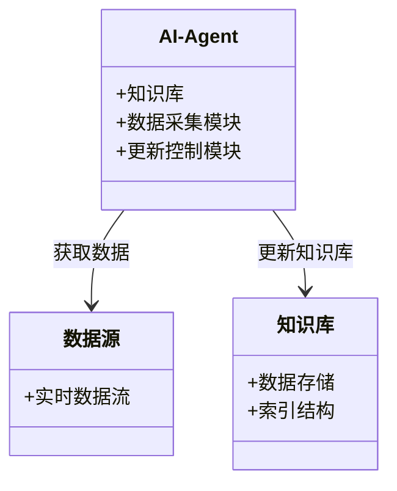
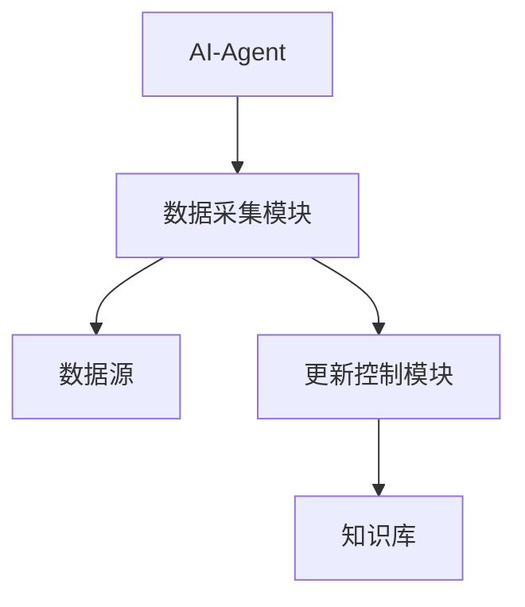
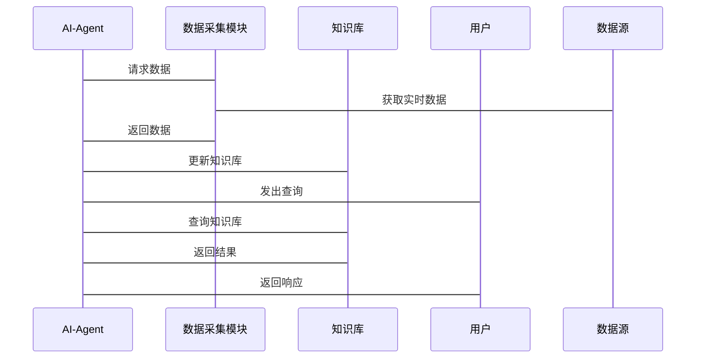

                 


# AI Agent的实时知识更新：保持LLM信息的时效性

> **关键词**: AI Agent, LLM, 知识更新, 实时性, 持续学习  
> **摘要**: 本文探讨了AI Agent在实时知识更新中的作用，重点分析了如何保持大语言模型（LLM）信息的时效性。通过介绍背景、核心概念、算法原理、系统架构设计以及项目实战，详细阐述了实现AI Agent实时知识更新的关键技术和方法。

---

# 第一部分: AI Agent的实时知识更新背景与核心概念

## 第1章: AI Agent与实时知识更新概述

### 1.1 问题背景与挑战

#### 1.1.1 AI Agent的基本概念
AI Agent（人工智能代理）是指能够感知环境并采取行动以实现目标的智能实体。它可以是一个软件程序，也可以是一个物理设备，通过传感器和执行器与环境交互。AI Agent的核心目标是通过不断学习和适应，提高其在复杂环境中的决策能力和问题解决能力。

#### 1.1.2 知识时效性问题的提出
随着技术的发展，AI Agent的应用场景越来越广泛，但其知识库的时效性问题日益凸显。例如，当AI Agent依赖于静态训练数据时，它无法及时获取新信息，导致在处理实时任务时可能出现错误或过时的决策。

#### 1.1.3 实时知识更新的必要性
为了应对动态变化的环境，AI Agent需要实时更新其知识库，以保持对当前信息的准确理解。这不仅提高了决策的准确性，还增强了系统的适应性和用户体验。

### 1.2 问题描述与解决思路

#### 1.2.1 LLM的信息时效性问题
大语言模型（LLM）虽然在许多任务中表现出色，但其训练数据通常是静态的，无法反映实时动态的信息。例如，当新的法律法规出台或市场变化时，LLM可能无法及时更新其知识库，导致输出的内容不符合当前实际情况。

#### 1.2.2 实时知识更新的目标
实时知识更新的目标是让AI Agent能够持续获取新的信息，并将其整合到现有的知识库中，从而保持LLM输出的时效性和准确性。

#### 1.2.3 解决方案的初步构想
通过设计一种高效的知识更新机制，结合持续学习算法和实时数据源，AI Agent可以在不中断现有任务的情况下，动态更新其知识库。

### 1.3 边界与外延

#### 1.3.1 知识更新的边界条件
知识更新的边界条件包括数据来源的可靠性、更新频率的要求以及知识覆盖的范围。AI Agent需要在有限的资源和时间约束下，高效地完成知识更新。

#### 1.3.2 相关概念的对比与区分
在实时知识更新中，需要区分持续学习、在线学习和离线学习。持续学习强调模型在不断接收新数据时的自适应能力，而在线学习和离线学习则关注数据处理的方式和时机。

#### 1.3.3 技术实现的可行性分析
通过分析现有技术，发现基于对比学习和强化学习的方法在实时知识更新中具有较高的可行性。然而，这些方法在实际应用中仍面临计算资源和数据处理效率的挑战。

### 1.4 核心要素与概念结构

#### 1.4.1 核心要素的构成
实时知识更新的核心要素包括数据源、知识表示、更新策略和评估机制。数据源是知识更新的基础，知识表示决定了信息的组织方式，更新策略影响知识更新的效率，而评估机制则是确保更新效果的关键。

#### 1.4.2 概念之间的关系
通过绘制Mermaid图，可以清晰地展示AI Agent、知识库、数据源和更新策略之间的关系。AI Agent作为主体，通过数据源获取新信息，并利用知识库进行存储和管理。更新策略则指导AI Agent如何高效地进行知识更新。

#### 1.4.3 系统架构的初步设想
初步设想的系统架构包括数据采集模块、知识处理模块和更新控制模块。数据采集模块负责获取实时数据，知识处理模块负责对数据进行解析和存储，更新控制模块则负责制定和执行更新策略。

---

## 第2章: AI Agent的知识更新机制

### 2.1 知识更新的核心原理

#### 2.1.1 持续学习的基本概念
持续学习是一种机器学习范式，允许模型在不断接收新数据时，逐步更新其知识库。与传统的批量学习不同，持续学习强调模型的在线适应能力。

#### 2.1.2 知识表示的多样性
知识可以以多种方式表示，包括符号表示、向量表示和图结构表示。不同的表示方式适用于不同的应用场景，选择合适的表示方法是实现高效知识更新的关键。

#### 2.1.3 更新策略的选择
更新策略决定了AI Agent如何选择和处理新信息。常用的策略包括贪心策略、随机策略和基于相似度的策略。每种策略都有其优缺点，需要根据具体场景进行选择。

### 2.2 知识更新的驱动因素

#### 2.2.1 数据驱动的更新
数据驱动的更新依赖于实时数据流的输入。通过不断接收新数据，AI Agent可以快速更新其知识库，确保信息的时效性。

#### 2.2.2 模型驱动的更新
模型驱动的更新强调通过改进模型的结构和参数来实现知识更新。这种方法通常需要重新训练模型，计算成本较高，但可以显著提高模型的性能。

#### 2.2.3 用户反馈的作用
用户反馈是知识更新的重要驱动因素。通过分析用户的反馈，AI Agent可以识别其知识库中的不足，并针对性地进行优化。

### 2.3 知识更新的实现方式

#### 2.3.1 对比学习方法
对比学习是一种通过比较不同数据点的相似性来提升模型性能的方法。在知识更新中，对比学习可以用于识别和消除过时信息的影响。

#### 2.3.2 强化学习方法
强化学习通过奖励机制指导模型的行为。在知识更新中，强化学习可以用于优化更新策略，提高知识更新的效率。

#### 2.3.3 迁移学习方法
迁移学习是一种通过将已有的知识迁移到新任务中来提高学习效率的方法。在知识更新中，迁移学习可以用于快速适应新数据和新任务。

---

## 第3章: AI Agent与LLM的结合

### 3.1 LLM的基本原理

#### 3.1.1 大语言模型的工作机制
大语言模型通过大量的训练数据学习语言的规律，并利用这些规律生成人类可读的文本。其核心是通过神经网络结构捕捉数据中的模式和关系。

#### 3.1.2 模型的训练过程
训练过程包括数据预处理、模型构建、损失函数优化和模型评估。训练目标是使模型在给定输入下生成正确的输出。

#### 3.1.3 模型的输出特性
大语言模型的输出具有高度的相关性和连贯性，但其知识通常是静态的，无法反映实时信息。

### 3.2 LLM的知识时效性问题

#### 3.2.1 知识的局限性
由于训练数据的静态特性，大语言模型的知识可能过时或不准确。例如，当新的法律法规出台时，模型可能无法提供最新的信息。

#### 3.2.2 信息的滞后性
模型的知识更新通常滞后于现实世界的动态变化，导致输出的内容可能不符合当前实际情况。

#### 3.2.3 用户需求的变化
用户的查询需求可能随时间变化，模型需要能够动态调整其输出内容以满足这些变化。

### 3.3 AI Agent在LLM更新中的作用

#### 3.3.1 知识的实时获取
AI Agent可以通过实时数据源获取新信息，并将其传递给大语言模型，以补充其知识库。

#### 3.3.2 知识的组织与管理
AI Agent负责对新获取的信息进行分类、存储和管理，确保知识库的结构化和高效访问。

#### 3.3.3 知识的动态更新
通过设计高效的更新策略，AI Agent可以动态调整知识库的内容，确保模型输出的时效性和准确性。

---

## 第4章: 知识更新的算法原理

### 4.1 持续学习算法概述

#### 4.1.1 持续学习的基本概念
持续学习是一种机器学习范式，允许模型在不断接收新数据时，逐步更新其知识库。与传统的批量学习不同，持续学习强调模型的在线适应能力。

#### 4.1.2 持续学习的核心算法
常用的持续学习算法包括经验重放、渐近遗忘和参数锁定。每种算法都有其独特的优缺点，适用于不同的应用场景。

#### 4.1.3 算法的优缺点对比
通过对比不同算法的性能和计算成本，可以选择最适合特定场景的算法。

### 4.2 对比学习算法

#### 4.2.1 对比学习的基本原理
对比学习通过比较不同数据点的相似性来提升模型的性能。在知识更新中，对比学习可以用于识别和消除过时信息的影响。

#### 4.2.2 对比学习的实现步骤
对比学习通常包括数据配对、相似性计算和损失函数优化三个步骤。通过优化对比损失函数，可以提高模型的区分能力。

#### 4.2.3 对比学习的优缺点
对比学习的优点包括高效性和灵活性，但其计算成本较高，且需要设计有效的数据配对策略。

### 4.3 强化学习算法

#### 4.3.1 强化学习的基本原理
强化学习通过奖励机制指导模型的行为。在知识更新中，强化学习可以用于优化更新策略，提高知识更新的效率。

#### 4.3.2 强化学习的实现步骤
强化学习通常包括状态定义、动作选择和奖励函数设计三个步骤。通过与环境的交互，模型可以学习到最优策略。

#### 4.3.3 强化学习的优缺点
强化学习的优点包括适应性和灵活性，但其训练过程复杂，且需要设计有效的奖励机制。

### 4.4 迁移学习算法

#### 4.4.1 迁移学习的基本原理
迁移学习通过将已有的知识迁移到新任务中来提高学习效率。在知识更新中，迁移学习可以用于快速适应新数据和新任务。

#### 4.4.2 迁移学习的实现步骤
迁移学习通常包括特征提取、领域适配和模型优化三个步骤。通过利用已有的特征表示，可以快速适应新任务。

#### 4.4.3 迁移学习的优缺点
迁移学习的优点包括高效性和通用性，但其依赖于源任务和目标任务之间的相似性，可能影响其性能。

---

## 第5章: 系统分析与架构设计

### 5.1 问题场景介绍

#### 5.1.1 系统需求
系统需要支持实时数据的接入、知识的动态更新和高效的查询响应。

#### 5.1.2 业务场景
业务场景包括实时问答、动态信息检索和自适应对话生成。

#### 5.1.3 使用场景
使用场景包括在线客服、智能助手和实时新闻分析。

### 5.2 项目介绍

#### 5.2.1 项目目标
项目旨在设计和实现一个高效的AI Agent实时知识更新系统，确保大语言模型的输出时效性。

#### 5.2.2 项目范围
项目范围包括数据采集、知识处理和系统集成三个部分。

#### 5.2.3 项目约束
项目约束包括计算资源限制、数据隐私保护和系统稳定性要求。

### 5.3 系统功能设计

#### 5.3.1 领域模型类图
通过Mermaid类图展示系统的主要组件和它们之间的关系。



#### 5.3.2 系统架构图
通过Mermaid架构图展示系统的整体架构和各模块的交互关系。



#### 5.3.3 接口设计
系统接口包括数据采集接口、知识更新接口和查询接口。每个接口都需要定义明确的输入输出格式和调用方式。

#### 5.3.4 交互流程
通过Mermaid序列图展示系统的交互流程，包括数据采集、知识更新和查询响应三个主要步骤。



---

## 第6章: 项目实战

### 6.1 环境安装

#### 6.1.1 系统要求
需要安装Python 3.8及以上版本，以及相关的深度学习框架（如TensorFlow或PyTorch）。

#### 6.1.2 依赖安装
安装必要的依赖库，包括numpy、pandas、scikit-learn和transformers。

#### 6.1.3 数据准备
准备实时数据源，例如通过API获取新闻数据或社交媒体信息。

### 6.2 系统核心实现

#### 6.2.1 数据采集模块实现
使用Python编写数据采集模块，通过API获取实时数据并存储到本地数据库。

#### 6.2.2 知识库实现
使用数据库技术（如MongoDB）存储知识库内容，并设计高效的查询接口。

#### 6.2.3 更新控制模块实现
编写更新控制模块，实现基于时间或事件驱动的自动更新策略。

#### 6.2.4 AI Agent实现
基于预训练的大语言模型，通过调用API实现与知识库的交互，生成实时响应。

### 6.3 代码实现与解读

#### 6.3.1 数据采集模块代码
```python
import requests
import json

def get_realtime_data(api_url):
    response = requests.get(api_url)
    if response.status_code == 200:
        return json.loads(response.text)
    else:
        return None
```

#### 6.3.2 知识库更新代码
```python
from pymongo import MongoClient

client = MongoClient('mongodb://localhost:27017/')
db = client['knowledge_base']
collection = db['updates']

def update_knowledge_base(data):
    collection.insert_one(data)
```

#### 6.3.3 更新控制模块代码
```python
import time

def schedule_updates(interval):
    while True:
        # 获取实时数据
        data = get_realtime_data('http://api.example.com/data')
        # 更新知识库
        update_knowledge_base(data)
        time.sleep(interval)
```

#### 6.3.4 AI Agent实现代码
```python
from transformers import AutoModelForCausalLM, AutoTokenizer

model = AutoModelForCausalLM.from_pretrained('gpt2')
tokenizer = AutoTokenizer.from_pretrained('gpt2')

def generate_response(prompt):
    inputs = tokenizer(prompt, return_tensors='np')
    outputs = model.generate(inputs.input_ids, max_length=100)
    response = tokenizer.decode(outputs[0].tolist()[0])
    return response
```

### 6.4 实际案例分析

#### 6.4.1 案例背景
假设我们正在开发一个实时新闻分析系统，需要AI Agent能够快速更新新闻数据，并生成实时的新闻摘要。

#### 6.4.2 数据采集与处理
通过API获取实时新闻数据，并将其存储到知识库中。

#### 6.4.3 系统运行与测试
运行系统，测试其响应时间和准确性，确保知识更新的及时性和正确性。

#### 6.4.4 性能优化
通过优化数据处理和模型调用效率，进一步提高系统的性能。

### 6.5 项目小结

#### 6.5.1 项目总结
通过本项目的实施，我们成功实现了AI Agent的实时知识更新系统，确保了大语言模型输出的时效性。

#### 6.5.2 项目成果
项目成果包括实时数据采集模块、高效的知识库管理系统和优化的知识更新策略。

#### 6.5.3 项目经验
项目经验包括对技术选型的深入分析、对系统架构的合理设计以及对实际问题的快速响应。

---

## 第7章: 最佳实践、小结与展望

### 7.1 最佳实践 tips

#### 7.1.1 技术选型
在选择数据采集和知识库技术时，需要充分考虑系统的扩展性和性能要求。

#### 7.1.2 系统优化
通过缓存技术和并行计算，可以显著提高系统的处理效率。

#### 7.1.3 模型调优
通过模型微调和参数优化，可以提高AI Agent的输出质量。

### 7.2 小结

#### 7.2.1 核心知识点总结
本文详细介绍了AI Agent的实时知识更新方法，包括背景、核心概念、算法原理和系统设计。

#### 7.2.2 实践经验总结
通过实际项目的实施，我们积累了许多宝贵的经验，为后续工作奠定了坚实的基础。

### 7.3 注意事项

#### 7.3.1 数据质量
数据质量直接影响知识更新的效果，需要对数据进行严格的清洗和预处理。

#### 7.3.2 系统安全性
系统的安全性是至关重要的，需要采取有效的防护措施，防止数据泄露和系统攻击。

#### 7.3.3 用户隐私
在处理用户数据时，必须严格遵守隐私保护法规，确保用户信息的安全。

### 7.4 拓展阅读

#### 7.4.1 相关技术
推荐阅读关于持续学习、对比学习和强化学习的最新研究成果。

#### 7.4.2 应用场景
进一步研究AI Agent在实时知识更新中的其他应用场景，如实时翻译和智能客服。

#### 7.4.3 技术趋势
关注大语言模型和AI Agent技术的最新发展趋势，保持对前沿技术的敏感性。

---

# 结语

通过本文的详细阐述，我们全面探讨了AI Agent的实时知识更新方法，从理论到实践，为实现高效的知识更新提供了系统的解决方案。未来，随着技术的不断发展，AI Agent将在更多领域发挥重要作用，实时知识更新技术也将更加成熟和多样化。

---

# 作者：AI天才研究院 & 禅与计算机程序设计艺术

