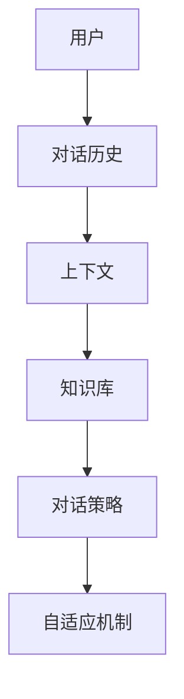
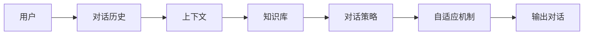

                 


# AI Agent的实时自适应对话管理系统

> **关键词**：AI Agent，实时自适应对话管理，自然语言处理，机器学习，对话系统  
>
> **摘要**：本文深入探讨了AI Agent在实时自适应对话管理中的应用，分析了对话系统的核心概念、算法原理和系统架构，结合实际案例，详细讲解了如何设计和实现一个高效的实时自适应对话管理系统。文章从背景介绍、核心概念、算法实现、系统设计到项目实战，层层展开，帮助读者全面理解AI Agent的实时自适应对话管理技术。

---

## 第一部分: AI Agent的背景与问题背景

### 第1章: AI Agent的背景与问题背景

#### 1.1 AI Agent的基本概念

**1.1.1 AI Agent的定义**  
AI Agent（人工智能代理）是指能够感知环境并采取行动以实现特定目标的智能实体。在对话系统中，AI Agent通常表现为能够与用户进行自然语言交流，并根据对话内容实时调整自己的行为。

**1.1.2 AI Agent的核心要素**  
- **知识库**：存储对话相关的背景知识、常识和用户信息。
- **对话策略**：定义对话的逻辑和规则，指导AI Agent如何生成和理解对话内容。
- **自适应机制**：根据对话上下文和用户反馈动态调整对话策略。

**1.1.3 AI Agent的应用场景**  
- 智能客服
- 联网智能音箱
- 联网智能助手（如Siri、Alexa）

---

#### 1.2 实时自适应对话管理的背景

**1.2.1 对话管理的基本概念**  
对话管理是AI Agent的核心功能，负责规划和控制对话流程，确保对话目标的实现。

**1.2.2 实时自适应对话管理的必要性**  
- 对话过程中的不确定性：用户可能随时改变话题或提出新问题。
- 对话环境的动态变化：需要实时调整对话策略以应对用户需求的变化。

**1.2.3 当前对话管理技术的局限性**  
- 基于规则的对话系统缺乏灵活性。
- 基于模板的对话系统难以处理复杂场景。
- 基于预训练模型的对话系统难以实时调整策略。

---

#### 1.3 问题背景与问题描述

**1.3.1 对话系统中的常见问题**  
- 对话逻辑混乱。
- 对话内容与用户意图不符。
- 对话过程中无法实时调整策略。

**1.3.2 实时自适应对话管理的核心问题**  
- 如何实时感知对话上下文并调整对话策略。
- 如何处理对话过程中的不确定性。
- 如何实现高效的实时计算。

**1.3.3 问题解决的目标与边界**  
目标：设计一个能够实时自适应调整对话策略的AI Agent系统。  
边界：仅关注对话过程中的实时调整，不涉及对话内容的理解和生成。

---

#### 1.4 本章小结  
本章介绍了AI Agent的基本概念和实时自适应对话管理的背景，分析了当前对话管理技术的局限性和核心问题。接下来将深入探讨AI Agent的核心概念与联系。

---

## 第二部分: AI Agent的核心概念与联系

### 第2章: AI Agent的核心概念与联系

#### 2.1 AI Agent的核心要素

**2.1.1 知识库**  
知识库是AI Agent理解对话内容的基础，存储了与对话相关的背景知识、常识和用户信息。

**2.1.2 对话策略**  
对话策略定义了AI Agent如何规划和控制对话流程，包括对话目标的设定和实现路径的选择。

**2.1.3 自适应机制**  
自适应机制是AI Agent的核心，负责根据对话上下文和用户反馈动态调整对话策略。

---

#### 2.2 核心概念的属性特征对比

| **核心概念** | **属性特征** |
|--------------|--------------|
| 知识库       | 静态性、结构化、可扩展性 |
| 对话策略     | 动态性、灵活性、可调整性 |
| 自适应机制   | 实时性、智能性、反馈驱动性 |

---

#### 2.3 ER实体关系图架构



---

#### 2.4 本章小结  
本章详细分析了AI Agent的核心要素，包括知识库、对话策略和自适应机制，并通过对比和ER图展示了它们之间的关系。接下来将深入探讨AI Agent的算法原理。

---

## 第三部分: AI Agent的算法原理

### 第3章: AI Agent的算法原理

#### 3.1 实时自适应对话管理的算法概述

**3.1.1 基于强化学习的对话策略**  
通过强化学习训练AI Agent在对话中的决策能力，目标是最大化对话目标的实现概率。

**3.1.2 基于监督学习的对话生成**  
通过监督学习训练AI Agent生成符合对话策略的回复。

**3.1.3 自适应机制的实现方法**  
通过实时反馈调整对话策略，确保对话过程中的灵活性和适应性。

---

#### 3.2 算法原理的数学模型

对话策略的优化目标函数可以表示为：

$$
\max_{\theta} \sum_{i=1}^{n} \log p_\theta(a_i | s_i)
$$

其中，$\theta$ 是模型参数，$s_i$ 是对话状态，$a_i$ 是动作。

---

#### 3.3 算法实现的Python代码示例

```python
import numpy as np

def adaptive_dialogue_policy(theta, state):
    # 输入：theta（模型参数），state（对话状态）
    # 输出：action（选择的动作）
    pass

# 示例代码：
theta = np.random.randn(100, 1)
state = "用户询问天气"
action = adaptive_dialogue_policy(theta, state)
print(action)
```

---

#### 3.4 本章小结  
本章介绍了实时自适应对话管理的算法原理，包括基于强化学习的对话策略和基于监督学习的对话生成，并通过数学公式和代码示例详细讲解了算法实现。接下来将探讨AI Agent的系统分析与架构设计。

---

## 第四部分: AI Agent的系统分析与架构设计

### 第4章: AI Agent的系统分析与架构设计

#### 4.1 系统功能设计

**4.1.1 知识库构建**  
通过爬虫、API等方式获取对话相关知识，并进行结构化存储。

**4.1.2 对话生成**  
根据当前对话状态生成回复内容，支持多种对话风格。

**4.1.3 自适应调整**  
根据用户反馈实时调整对话策略，确保对话目标的实现。

---

#### 4.2 系统架构设计



---

#### 4.3 系统接口设计

**4.3.1 输入接口**  
- 用户输入：文本或语音输入。
- 对话状态：当前对话的上下文信息。

**4.3.2 输出接口**  
- 对话回复：生成的回复文本。
- 反馈接口：用户对对话的反馈。

---

#### 4.4 本章小结  
本章分析了AI Agent系统的功能设计和架构设计，并通过图表展示了系统的整体结构。接下来将通过实际案例深入探讨AI Agent的项目实战。

---

## 第五部分: AI Agent的项目实战

### 第5章: AI Agent的项目实战

#### 5.1 环境安装

```bash
pip install numpy
pip install pandas
pip install scikit-learn
```

---

#### 5.2 核心代码实现

```python
import numpy as np
import pandas as pd

def adaptive_dialogue_manager(theta, state):
    # theta：模型参数
    # state：对话状态
    # 返回：生成的回复
    pass

# 示例代码：
theta = np.random.randn(100, 1)
state = "用户询问天气"
response = adaptive_dialogue_manager(theta, state)
print(response)
```

---

#### 5.3 项目小结  
本章通过实际案例详细讲解了AI Agent项目的实现过程，包括环境安装和核心代码实现。读者可以参考代码示例，结合具体需求进行二次开发。

---

## 第六部分: 最佳实践、小结与拓展阅读

### 第6章: 最佳实践、小结与拓展阅读

#### 6.1 最佳实践

- **模型训练**：使用高质量的对话数据进行训练，确保模型的泛化能力。
- **实时调整**：根据用户反馈不断优化对话策略。
- **性能优化**：通过缓存和并行计算提升系统的响应速度。

---

#### 6.2 小结  
本文从背景介绍、核心概念、算法原理到系统设计和项目实战，全面探讨了AI Agent的实时自适应对话管理系统。通过详细讲解和实际案例，帮助读者掌握了AI Agent的核心技术。

---

#### 6.3 拓展阅读  
- 《Deep Learning for Dialog Generation》
- 《Reinforcement Learning for NLP Tasks》
- 《Real-Time Adaptive Systems》

---

## 作者信息

**作者：AI天才研究院/AI Genius Institute & 禅与计算机程序设计艺术 /Zen And The Art of Computer Programming**

---

**全文完**

