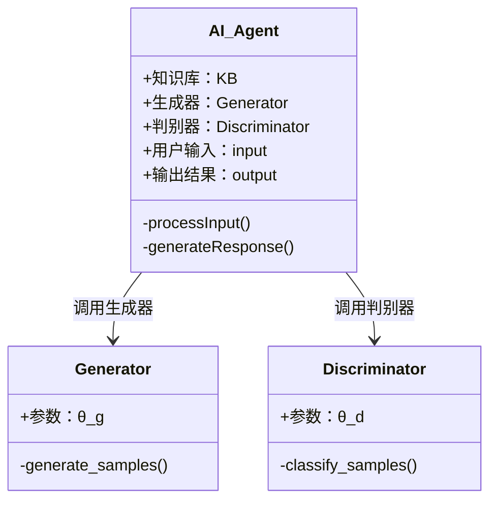
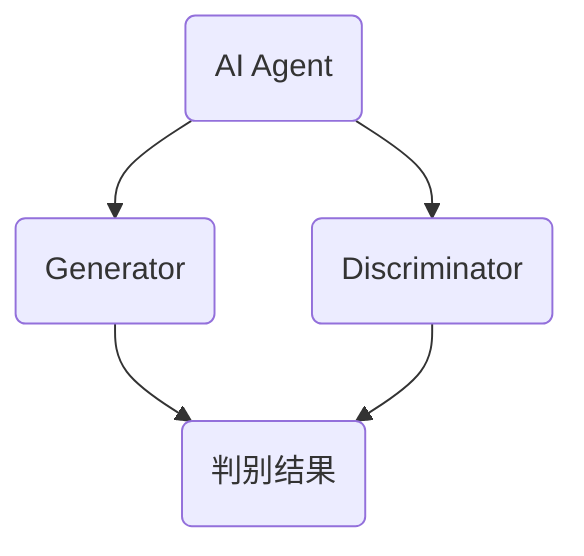

                 


# AI Agent的对抗性学习：提高LLM的鲁棒性

> 关键词：AI Agent，对抗性学习，大语言模型，鲁棒性，机器学习

> 摘要：本文探讨了如何通过对抗性学习来提高大语言模型（LLM）的鲁棒性。文章从对抗性学习的基本概念出发，分析其在AI Agent中的应用，并通过详细讲解算法原理、系统架构设计和项目实战，展示了如何利用对抗性学习增强LLM的稳定性和准确性。通过理论与实践相结合的方式，为读者提供深入的技术指导。

---

## 第一部分：AI Agent与对抗性学习的背景介绍

### 第1章：对抗性学习的背景与重要性

#### 1.1 对抗性学习的基本概念

- **1.1.1 对抗性学习的定义**  
  对抗性学习是一种机器学习方法，通过两个或多个模型（通常为生成器和判别器）的对抗训练来提高模型的泛化能力和鲁棒性。生成器尝试生成逼真的样本，判别器则试图区分真实样本和生成样本，两者交替优化以提升性能。

- **1.1.2 对抗性学习的背景与现状**  
  对抗性学习起源于生成对抗网络（GAN）的提出，已在图像生成、语音合成等领域取得显著成果。近年来，对抗性学习逐渐扩展到自然语言处理领域，为提高模型的鲁棒性提供了新的思路。

- **1.1.3 对抗性学习的核心目标**  
  提高模型在面对干扰或对抗性输入时的稳定性和准确性，增强模型的泛化能力。

#### 1.2 AI Agent的定义与作用

- **1.2.1 AI Agent的基本概念**  
  AI Agent是一种智能体，能够感知环境、执行任务并做出决策。它可以与用户交互，理解需求，并通过内部算法生成响应。

- **1.2.2 AI Agent的分类与应用场景**  
  - **基于任务的AI Agent**：专注于完成特定任务，如问答系统、对话生成。  
  - **通用AI Agent**：具备广泛的知识和能力，能够处理多种任务。  
  应用场景包括智能助手、客服系统、教育辅助工具等。

- **1.2.3 AI Agent与传统算法的区别**  
  AI Agent具备自主性、反应性、目标导向性和社交能力，能够动态适应环境变化，而传统算法通常针对特定任务，缺乏灵活性和自适应性。

#### 1.3 提高LLM鲁棒性的必要性

- **1.3.1 LLM的局限性与挑战**  
  大语言模型在面对对抗性输入时，容易受到攻击，导致输出错误或不可靠。此外，模型可能对训练数据中的偏差敏感，影响其公平性和可靠性。

- **1.3.2 对抗性学习在LLM中的作用**  
  通过对抗性训练，模型能够更好地识别和抵抗对抗性输入，提升其在复杂环境下的稳定性和准确性。

- **1.3.3 提高鲁棒性**  
  对抗性学习通过生成多样化的输入样本，增强模型的泛化能力，从而在面对未知数据时表现更佳。

---

## 第二部分：对抗性学习的核心概念与联系

### 第2章：对抗性学习的核心原理

#### 2.1 对抗性学习的原理与模型

- **2.1.1 对抗性学习的基本机制**  
  生成器和判别器通过对抗训练，生成器试图欺骗判别器，使其无法区分真实数据和生成数据，而判别器则试图准确区分两者。这种博弈过程促使生成器生成更逼真的数据，同时提升判别器的辨别能力。

- **2.1.2 生成对抗网络（GAN）**  
  GAN由生成器和判别器组成，分别优化生成损失和判别损失。训练过程中，生成器和判别器交替更新参数，最终达到纳什均衡。

- **2.1.3 对抗性学习与传统监督学习的对比**  
  | 对比维度 | 监督学习 | 对抗性学习 |
  |----------|----------|------------|
  | 数据来源 | 标签数据 | 真假样本对 |
  | 目标函数 | 分类准确 | 竞争优化 |
  | 应用场景 | 分类、回归 | 生成、对抗 |

#### 2.2 对抗性学习的数学模型

- **生成器的损失函数**  
  $$ \mathcal{L}_G = -\mathbb{E}_{z}[\log D(G(z))] $$
  其中，$G$为生成器，$D$为判别器，$z$为噪声输入。

- **判别器的损失函数**  
  $$ \mathcal{L}_D = -\mathbb{E}_{x}[ \log D(x) ] - \mathbb{E}_{z}[ \log (1 - D(G(z)))] $$

- **联合优化目标**  
  $$ \mathcal{L}_{total} = \mathcal{L}_G + \mathcal{L}_D $$

#### 2.3 对抗性学习与生成模型的联系

- **生成模型的分类**  
  - **基于判别器的生成模型**：如GAN、LGAN等，依赖判别器提供梯度反馈。  
  - **基于评分规则的生成模型**：如VAE、Flow-based models，通过评分函数优化生成样本。

- **对抗性学习在生成模型中的作用**  
  提供强大的对抗训练框架，推动生成模型生成更高质量的样本，提升模型的泛化能力。

---

## 第三部分：算法原理与实现细节

### 第3章：对抗性学习的算法实现

#### 3.1 GAN的实现原理

- **生成器网络**  
  通常使用深度神经网络，如多层感知机（MLP）或卷积神经网络（CNN），将随机噪声映射到数据空间。

- **判别器网络**  
  同样使用深度神经网络，对输入样本进行分类，判断其为真实样本或生成样本。

- **训练过程**  
  通过交替优化生成器和判别器的参数，逐步提高生成样本的质量。

#### 3.2 对抗性学习的数学推导

- **生成器的优化**  
  $$ \arg \min_G \mathbb{E}_{z}[\log D(G(z))] $$
  生成器通过最大化判别器的误判概率，生成更逼真的样本。

- **判别器的优化**  
  $$ \arg \min_D \mathbb{E}_{x}[ \log D(x) ] + \mathbb{E}_{z}[ \log (1 - D(G(z)))] $$
  判别器通过区分真实样本和生成样本，提升分类能力。

#### 3.3 对抗性学习的代码实现

```python
import torch
import torch.nn as nn

# 定义生成器
class Generator(nn.Module):
    def __init__(self, latent_dim, hidden_dim):
        super(Generator, self).__init__()
        self.fc1 = nn.Linear(latent_dim, hidden_dim)
        self.fc2 = nn.Linear(hidden_dim, hidden_dim)
        self.fc3 = nn.Linear(hidden_dim, output_dim)

    def forward(self, x):
        x = F.relu(self.fc1(x))
        x = F.relu(self.fc2(x))
        x = self.fc3(x)
        return x

# 定义判别器
class Discriminator(nn.Module):
    def __init__(self, input_dim, hidden_dim):
        super(Discriminator, self).__init__()
        self.fc1 = nn.Linear(input_dim, hidden_dim)
        self.fc2 = nn.Linear(hidden_dim, hidden_dim)
        self.fc3 = nn.Linear(hidden_dim, 1)

    def forward(self, x):
        x = F.leakyReLU(self.fc1(x))
        x = F.leakyReLU(self.fc2(x))
        x = self.fc3(x)
        return F.sigmoid(x)

# 初始化模型
latent_dim = 100
hidden_dim = 128
output_dim = 784  # 以MNIST为例

generator = Generator(latent_dim, hidden_dim)
discriminator = Discriminator(output_dim, hidden_dim)

# 定义损失函数和优化器
criterion = nn.BCELoss()
optimizer_G = torch.optim.Adam(generator.parameters(), lr=0.001)
optimizer_D = torch.optim.Adam(discriminator.parameters(), lr=0.001)

# 训练过程
for epoch in range(num_epochs):
    for _ in range(iterations):
        # 生成假样本
        z = torch.randn(batch_size, latent_dim)
        gen_output = generator(z)
        # 判别器优化
        optimizer_D.zero_grad()
        real_output = discriminator(real_data)
        fake_output = discriminator(gen_output)
        d_loss = criterion(real_output, real_labels) + criterion(fake_output, fake_labels)
        d_loss.backward()
        optimizer_D.step()
        # 生成器优化
        optimizer_G.zero_grad()
        g_loss = criterion(fake_output, torch.ones_like(fake_output))
        g_loss.backward()
        optimizer_G.step()
```

---

## 第四部分：系统架构与设计

### 第4章：系统架构设计方案

#### 4.1 系统功能设计

- **领域模型设计**  
  使用Mermaid绘制类图，展示AI Agent、生成器和判别器之间的关系。



- **系统架构设计**  
  使用Mermaid绘制架构图，展示各组件之间的交互。



---

## 第五部分：项目实战

### 第5章：对抗性学习在LLM中的实战应用

#### 5.1 项目环境与安装

- **环境配置**  
  安装必要的库，如PyTorch、Transformers、Mermaid图生成工具等。

- **数据准备**  
  使用公开数据集（如MNIST、CIFAR-10）进行训练，或针对特定任务定制数据集。

#### 5.2 实战代码实现

```python
import torch
import torch.nn as nn
import torch.optim as optim
from torch.utils.data import DataLoader
import torchvision.datasets as datasets
import torchvision.transforms as transforms

# 数据准备
transform = transforms.Compose([
    transforms.ToTensor(),
    transforms.Normalize((0.5, 0.5, 0.5), (0.5, 0.5, 0.5)),
])

train_loader = DataLoader(
    datasets.MNIST('data', train=True, download=True, transform=transform),
    batch_size=128,
    shuffle=True,
)

# 模型定义
class Generator(nn.Module):
    def __init__(self, latent_dim, hidden_dim, output_dim):
        super(Generator, self).__init__()
        self.fc1 = nn.Linear(latent_dim, hidden_dim)
        self.fc2 = nn.Linear(hidden_dim, hidden_dim)
        self.fc3 = nn.Linear(hidden_dim, output_dim)

    def forward(self, x):
        x = F.relu(self.fc1(x))
        x = F.relu(self.fc2(x))
        x = torch.tanh(self.fc3(x))
        return x

class Discriminator(nn.Module):
    def __init__(self, input_dim, hidden_dim):
        super(Discriminator, self).__init__()
        self.fc1 = nn.Linear(input_dim, hidden_dim)
        self.fc2 = nn.Linear(hidden_dim, hidden_dim)
        self.fc3 = nn.Linear(hidden_dim, 1)

    def forward(self, x):
        x = F.leakyReLU(self.fc1(x))
        x = F.leakyReLU(self.fc2(x))
        x = F.sigmoid(self.fc3(x))
        return x

# 初始化模型
latent_dim = 100
hidden_dim = 128
output_dim = 784

generator = Generator(latent_dim, hidden_dim, output_dim)
discriminator = Discriminator(output_dim, hidden_dim)

# 定义损失函数和优化器
criterion = nn.BCELoss()
optimizer_G = optim.Adam(generator.parameters(), lr=0.001)
optimizer_D = optim.Adam(discriminator.parameters(), lr=0.001)

# 训练过程
num_epochs = 100
iterations = 100

for epoch in range(num_epochs):
    for _ in range(iterations):
        # 生成假样本
        z = torch.randn(128, latent_dim)
        gen_output = generator(z)
        # 判别器优化
        optimizer_D.zero_grad()
        real_data = next(iter(train_loader))[0]
        real_labels = torch.ones((128, 1))
        fake_labels = torch.zeros((128, 1))
        real_output = discriminator(real_data.view(-1, 784))
        fake_output = discriminator(gen_output)
        d_loss = criterion(real_output, real_labels) + criterion(fake_output, fake_labels)
        d_loss.backward()
        optimizer_D.step()
        # 生成器优化
        optimizer_G.zero_grad()
        g_output = generator(z)
        g_output_logits = discriminator(g_output.view(-1, 784))
        g_loss = criterion(g_output_logits, torch.ones_like(g_output_logits))
        g_loss.backward()
        optimizer_G.step()
```

#### 5.3 代码实现解读

- **生成器的输入**  
  随机噪声向量，经过多层感知机映射到数据空间。

- **判别器的输入**  
  真实数据和生成数据，输出概率值，判断样本的真实性。

- **损失函数的计算**  
  判别器损失和生成器损失分别计算，交替优化。

---

## 第六部分：总结与展望

### 第6章：总结与最佳实践

#### 6.1 小结

- 对抗性学习通过生成器和判别器的对抗训练，显著提高了大语言模型的鲁棒性。  
- 算法实现部分详细展示了GAN的基本结构和训练过程，帮助读者理解其数学模型和代码实现。  
- 系统架构设计和项目实战部分提供了具体的实现方案和代码示例，为读者提供了实践指导。

#### 6.2 最佳实践

- **数据预处理**  
  对输入数据进行清洗和增强，确保数据质量。  
- **模型调参**  
  合理选择学习率、批量大小等超参数，优化训练效果。  
- **防止模式坍塌**  
  使用改进的GAN变体（如WGAN、WGAN-GP）避免生成样本的多样性不足。

#### 6.3 注意事项

- **梯度消失问题**  
  在深度网络中，梯度消失可能导致生成器或判别器训练困难。  
- **训练稳定性**  
  对抗性学习的训练过程可能不稳定，需合理设计损失函数和优化策略。  
- **模型评估**  
  使用多种评估指标（如FID、IS）全面评估生成模型的性能。

#### 6.4 拓展阅读

- **改进的GAN变体**  
  WGAN、WGAN-GP、StyleGAN等。  
- **对抗性学习的应用**  
  图像生成、语音合成、文本生成等领域。

---

## 作者：AI天才研究院/AI Genius Institute & 禅与计算机程序设计艺术/Zen And The Art of Computer Programming

---

通过以上详细的内容，文章系统地介绍了对抗性学习在AI Agent中的应用，从理论到实践，全面分析了如何提高大语言模型的鲁棒性。希望本文能为读者提供有价值的指导和启示，帮助他们在实际应用中更好地利用对抗性学习技术。

