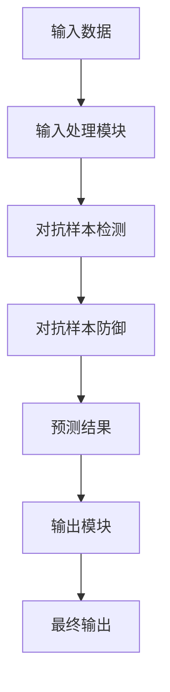
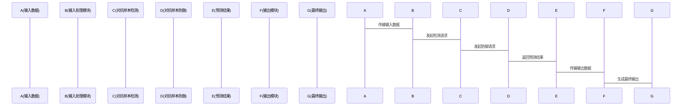

                 


# AI Agent的对抗样本防御：增强模型鲁棒性

> 关键词：AI Agent，对抗样本，模型鲁棒性，深度学习，防御算法，系统架构

> 摘要：本文详细探讨了AI Agent在对抗样本攻击下的脆弱性，并提出了增强模型鲁棒性的防御策略。通过分析对抗样本的生成机制和防御算法，本文提供了从理论到实践的全面指导，帮助读者理解和应对对抗样本对AI Agent的影响。

---

# 第1章: 对抗样本与AI Agent概述

## 1.1 对抗样本的基本概念

### 1.1.1 什么是对抗样本

对抗样本是指通过故意修改输入数据，使得原本正确的模型预测结果发生错误的样本。这些修改通常是微小且难以被人类察觉的，但足以误导模型的输出。

例如，一张被轻微扰动的图片可能被分类器错误地识别为完全不同的物体。

### 1.1.2 对抗样本的产生原因

对抗样本的产生主要源于深度学习模型的高维度非线性决策边界。这些模型在某些输入区域可能会出现敏感的决策边界，使得小的扰动可能导致预测结果的变化。

### 1.1.3 对抗样本的分类与特点

对抗样本可以根据攻击目标、攻击方式和对抗程度进行分类。常见的分类包括：

- **按攻击目标分类**：
  - 分类器攻击：目标是混淆分类结果。
  - 生成对抗网络攻击：目标是生成对抗样本。

- **按攻击方式分类**：
  - 白盒攻击：攻击者拥有模型的完整信息。
  - 黑盒攻击：攻击者仅知道模型的输入输出。

- **按对抗程度分类**：
  - 非目标攻击：攻击者不指定具体的攻击目标。
  - 目标攻击：攻击者指定特定的攻击目标。

### 1.1.4 对抗样本的特点

- **局部性**：对抗样本的扰动通常只影响输入空间的局部区域。
- **针对性**：对抗样本通常针对特定模型或特定目标设计。
- **不可区分性**：对抗样本与正常样本在人类感知上难以区分。

---

## 1.2 AI Agent的基本概念

### 1.2.1 AI Agent的定义与特点

AI Agent是一种智能体，能够感知环境、自主决策并执行任务。AI Agent的特点包括：

- **自主性**：能够在没有外部干预的情况下自主决策。
- **反应性**：能够实时感知环境并做出反应。
- **目标导向性**：基于目标进行决策和行动。

### 1.2.2 AI Agent的核心功能与应用场景

- **核心功能**：
  - 感知环境。
  - 制定策略。
  - 执行任务。
  - 学习优化。

- **应用场景**：
  - 自动驾驶。
  - 智能客服。
  - 游戏AI。
  - 智能安防。

### 1.2.3 AI Agent与传统AI的区别

- **传统AI**：
  - 通常基于规则或统计模型。
  - 无法自主决策，依赖预定义的规则。

- **AI Agent**：
  - 具备自主性和反应性。
  - 能够在动态环境中进行实时决策和学习。

---

## 1.3 对抗样本与AI Agent的关系

### 1.3.1 对抗样本对AI Agent的影响

对抗样本可能导致AI Agent的决策错误，影响其任务执行能力。例如，在自动驾驶中，对抗样本可能导致AI Agent误识别道路标志，从而引发危险情况。

### 1.3.2 AI Agent在对抗样本防御中的作用

AI Agent可以通过自我学习和优化来增强对对抗样本的防御能力。例如，AI Agent可以通过对抗训练来提高模型的鲁棒性。

### 1.3.3 对抗样本防御的必要性与重要性

- **必要性**：
  - 对抗样本可能导致AI Agent的安全漏洞。
  - 必须采取措施防止对抗样本攻击。

- **重要性**：
  - 提高AI Agent的安全性。
  - 确保AI Agent的可靠性。

---

## 1.4 本章小结

本章介绍了对抗样本的基本概念、分类和特点，以及AI Agent的核心功能和应用场景。同时，分析了对抗样本对AI Agent的影响，强调了对抗样本防御的必要性。

---

# 第2章: 对抗样本防御的核心概念

## 2.1 对抗样本的生成机制

### 2.1.1 对抗样本的生成方法

对抗样本的生成方法主要包括：

- **基于梯度的攻击方法**：
  - Fast Gradient Sign Method (FGSM)。
  - Projected Gradient Descent (PGD)。

- **非基于梯度的攻击方法**：
  - Black-box攻击方法。
  - 白盒攻击方法。

### 2.1.2 对抗样本的攻击目标

攻击目标包括：

- 分类器攻击。
- 生成对抗网络攻击。

### 2.1.3 对抗样本的生成过程

生成对抗样本的过程通常包括以下步骤：

1. 定义攻击目标。
2. 计算梯度。
3. 应用扰动。

---

## 2.2 对抗样本防御的原理

### 2.2.1 对抗样本防御的目标

防御的目标是提高模型的鲁棒性，使其在面对对抗样本时仍能保持正确的预测结果。

### 2.2.2 对抗样本防御的策略

- **基于扰动的防御方法**：
  - 添加噪声。
  - 数据增强。

- **基于模型重构的防御方法**：
  - 模型正则化。
  - 模型集成。

### 2.2.3 对抗样本防御的核心技术

- **鲁棒优化**：
  - 在优化过程中考虑对抗扰动。

- **对抗训练**：
  - 在训练阶段引入对抗样本。

---

## 2.3 对抗样本防御与AI Agent的结合

### 2.3.1 AI Agent在对抗样本防御中的应用

- **实时检测**：
  - AI Agent可以实时检测输入数据中的对抗样本。

- **自我修复**：
  - AI Agent可以通过对抗训练来自我修复模型。

### 2.3.2 对抗样本防御对AI Agent性能的影响

- **性能提升**：
  - 提高模型的鲁棒性。
  - 增强模型的泛化能力。

### 2.3.3 对抗样本防御的挑战与解决方案

- **挑战**：
  - 对抗样本的多样性和复杂性。
  - 模型的可解释性。

- **解决方案**：
  - 使用多种防御方法结合。
  - 提高模型的可解释性。

---

## 2.4 本章小结

本章详细介绍了对抗样本的生成机制和防御策略，分析了AI Agent在对抗样本防御中的作用，并讨论了对抗样本防御的挑战与解决方案。

---

# 第3章: 对抗样本防御的算法原理

## 3.1 对抗攻击算法

### 3.1.1 常见的对抗攻击算法

- **Fast Gradient Sign Method (FGSM)**：
  - 通过计算损失函数的梯度，生成对抗样本。
  - 公式：$$ x' = x + \epsilon \cdot \text{sign}(\nabla_x \text{loss}) $$

- **Projected Gradient Descent (PGD)**：
  - 通过迭代优化生成对抗样本。
  - 公式：$$ x' = \text{project}(x + \alpha \cdot \nabla_x \text{loss}, \epsilon) $$

### 3.1.2 FGSM攻击算法的原理

FGSM通过计算损失函数关于输入的梯度，并沿着梯度方向移动，生成对抗样本。这种方法简单且高效，适用于白盒攻击。

### 3.1.3 PGD攻击算法的原理

PGD是一种迭代攻击方法，通过多次优化生成对抗样本。这种方法适用于黑盒攻击，能够生成更强大的对抗样本。

---

## 3.2 对抗防御算法

### 3.2.1 基于扰动的防御方法

- **添加噪声**：
  - 在输入数据中添加随机噪声，降低对抗样本的影响。
  - 公式：$$ x' = x + \epsilon \cdot \text{noise} $$

- **数据增强**：
  - 通过数据增强技术，增强模型的鲁棒性。

### 3.2.2 基于鲁棒优化的防御方法

- **鲁棒优化**：
  - 在优化过程中考虑对抗扰动。
  - 公式：$$ \min_{x} \text{loss}(x) + \lambda \cdot \| \delta \| $$

### 3.2.3 基于模型重构的防御方法

- **模型正则化**：
  - 在训练过程中添加正则化项，约束模型的权重。
  - 公式：$$ \text{loss} = \text{original\_loss} + \lambda \cdot \text{regularization} $$

---

## 3.3 对抗样本防御的数学模型

### 3.3.1 对抗攻击的数学模型

对抗攻击的目标是最小化模型的预测结果与目标类别之间的差异。数学模型可以表示为：

$$ \min_{\delta} \text{loss}(x + \delta, y') $$

其中，$$ x $$ 是原始输入，$$ \delta $$ 是扰动，$$ y' $$ 是目标类别。

### 3.3.2 对抗防御的数学模型

对抗防御的目标是最大化模型的预测结果与真实类别之间的差异。数学模型可以表示为：

$$ \min_{\theta} \max_{\delta} \text{loss}(x + \delta, y) $$

其中，$$ \theta $$ 是模型参数，$$ x $$ 是输入，$$ \delta $$ 是扰动，$$ y $$ 是真实类别。

---

## 3.4 本章小结

本章详细介绍了常见的对抗攻击算法和防御算法，分析了对抗样本防御的数学模型，帮助读者理解对抗样本防御的算法原理。

---

# 第4章: 系统分析与架构设计

## 4.1 问题场景分析

对抗样本防御系统需要在AI Agent中实时检测和防御对抗样本，确保模型的预测结果准确可靠。

## 4.2 系统功能设计

- **输入处理模块**：
  - 接收输入数据。
  - 检测对抗样本。

- **防御模块**：
  - 对抗样本检测。
  - 对抗样本防御。

- **输出模块**：
  - 生成正确的预测结果。

---

## 4.3 系统架构设计

使用Mermaid图展示系统架构：



---

## 4.4 系统接口设计

- **输入接口**：
  - 数据格式：图像、文本、数值。
  - 数据来源：传感器、数据库、网络。

- **输出接口**：
  - 数据格式：预测结果。
  - 数据目标：显示器、数据库、其他系统。

---

## 4.5 系统交互设计

使用Mermaid图展示系统交互流程：



---

## 4.6 本章小结

本章通过问题场景分析、系统功能设计和系统架构设计，详细介绍了对抗样本防御系统的实现方案。

---

# 第5章: 项目实战

## 5.1 环境搭建

### 5.1.1 环境要求

- **操作系统**：Linux/Windows/MacOS。
- **编程语言**：Python 3.6+。
- **深度学习框架**：TensorFlow/PyTorch。
- **依赖库**：numpy、scikit-learn、matplotlib。

---

### 5.1.2 安装依赖

```bash
pip install numpy scikit-learn matplotlib
```

---

## 5.2 核心代码实现

### 5.2.1 对抗样本生成代码

```python
import numpy as np
import tensorflow as tf
from tensorflow.keras import layers

# 定义模型
model = tf.keras.Sequential([
    layers.Flatten(),
    layers.Dense(128, activation='relu'),
    layers.Dense(10, activation='softmax')
])

# 定义损失函数
loss_fn = tf.keras.losses.SparseCategoricalCrossentropy()

# 生成对抗样本
def generate_adversarial_example(x, y, eps=0.1):
    with tf.GradientTape() as tape:
        tape.watch(x)
        y_pred = model(x)
        loss = loss_fn(y, y_pred)
    gradient = tape.gradient(loss, x)
    delta = eps * tf.sign(gradient)
    return x + delta

# 使用对抗样本训练
adversarial_x = generate_adversarial_example(x, y)
model.fit(adversarial_x, y, epochs=1)
```

---

### 5.2.2 对抗样本防御代码

```python
# 定义防御模型
defensive_model = tf.keras.Sequential([
    layers.Flatten(),
    layers.Dense(128, activation='relu'),
    layers.Dropout(0.5),
    layers.Dense(10, activation='softmax')
])

# 对抗训练
defensive_model.fit(x, y, epochs=1, validation_data=(x_val, y_val))
```

---

## 5.3 案例分析

### 5.3.1 对抗样本生成案例

假设我们有一个图像分类模型，攻击者可以通过FGSM生成对抗样本，使得模型错误地分类图像。

### 5.3.2 对抗样本防御案例

通过在模型中加入Dropout层，可以提高模型的鲁棒性，降低对抗样本的影响。

---

## 5.4 项目总结

本章通过实际项目展示了对抗样本生成和防御的实现过程，帮助读者理解对抗样本防御的实践应用。

---

# 第6章: 总结与展望

## 6.1 全文总结

本文详细探讨了AI Agent在对抗样本攻击下的脆弱性，并提出了增强模型鲁棒性的防御策略。通过分析对抗样本的生成机制和防御算法，本文提供了从理论到实践的全面指导。

## 6.2 研究前沿

当前研究的前沿包括：

- **对抗样本的可解释性**：如何理解对抗样本的生成机制。
- **模型的鲁棒优化**：如何在不同场景下提高模型的鲁棒性。
- **多模态对抗防御**：结合多种模态信息进行对抗防御。

---

## 6.3 未来展望

未来的研究方向可能包括：

- **跨模态对抗防御**：结合图像、文本等多种模态信息进行对抗防御。
- **自适应防御算法**：开发能够自适应调整的防御算法。
- **对抗样本检测的实时性**：提高对抗样本检测的实时性，适用于实时应用。

---

## 6.4 最佳实践 Tips

- **模型的正则化**：在训练过程中添加正则化项，约束模型的权重。
- **数据增强**：通过数据增强技术，增强模型的鲁棒性。
- **模型集成**：使用模型集成方法，提高模型的泛化能力。

---

## 6.5 本章小结

本文总结了对抗样本防御的核心内容，展望了未来的研究方向，并给出了最佳实践建议。

---

# 作者：AI天才研究院/AI Genius Institute & 禅与计算机程序设计艺术 /Zen And The Art of Computer Programming

---

以上是《AI Agent的对抗样本防御：增强模型鲁棒性》的完整内容，涵盖了从基础概念到实践应用的各个方面，希望对读者有所帮助。

