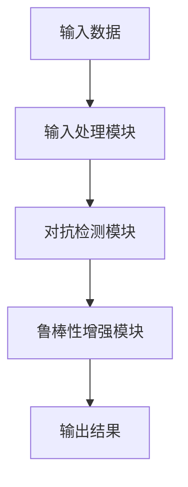
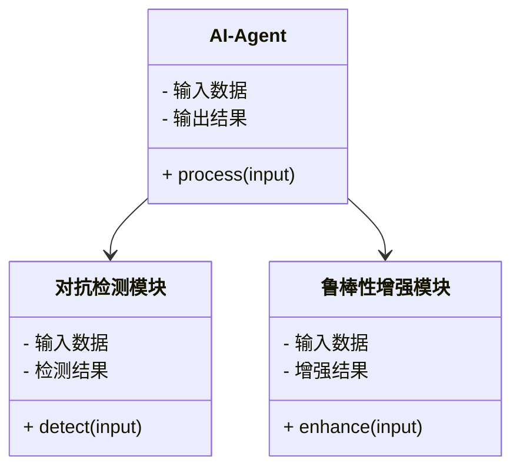
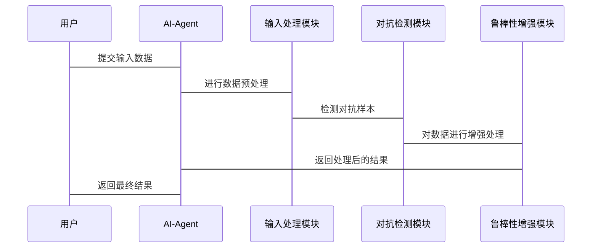

                 


# AI Agent的对抗鲁棒性：增强模型稳定性

---

## 关键词：
AI Agent、对抗鲁棒性、模型稳定性、机器学习、安全防御

---

## 摘要：
本文深入探讨了AI Agent在对抗环境下的鲁棒性问题，分析了对抗攻击对AI Agent的影响及其防御机制。通过理论分析与实践案例相结合的方式，详细介绍了对抗鲁棒性的核心概念、算法原理、系统架构设计以及项目实战。本文旨在为AI Agent的开发和应用提供坚实的安全保障，增强模型的稳定性与可靠性。

---

# 第一部分: AI Agent的对抗鲁棒性概述

## 第1章: AI Agent与对抗鲁棒性概述

### 1.1 AI Agent的基本概念

#### 1.1.1 AI Agent的定义与特点
- **定义**：AI Agent（人工智能代理）是一种能够感知环境、自主决策并执行任务的智能实体。
- **特点**：
  - 智能性：具备问题解决、学习和推理能力。
  - 自主性：能够在没有外部干预的情况下独立运作。
  - 反应性：能够实时感知环境变化并做出响应。
  - 社交能力：能够与其他系统或人类进行交互。

#### 1.1.2 AI Agent的应用场景
- 智能助手（如Siri、Alexa）。
- 自动驾驶系统。
- 机器人控制。
- 游戏AI。
- 智慧城市中的智能决策系统。

#### 1.1.3 对抗鲁棒性的概念与重要性
- **概念**：对抗鲁棒性是指AI Agent在面对故意设计的对抗性输入或攻击时，仍能保持正常功能和性能的特性。
- **重要性**：
  - 提高系统的安全性。
  - 增强系统的可靠性。
  - 扩展系统的适用范围。

### 1.2 对抗鲁棒性的背景与挑战

#### 1.2.1 对抗攻击的定义与分类
- **定义**：对抗攻击是指通过恶意设计的输入或干扰，破坏AI系统正常运行的行为。
- **分类**：
  - 基于输入的对抗攻击（如图像分类中的对抗样本）。
  - 基于模型的对抗攻击（如模型窃取）。
  - 基于输出的对抗攻击（如生成对抗网络中的欺骗）。

#### 1.2.2 对抗攻击对AI Agent的影响
- 功能失效：对抗攻击可能导致AI Agent无法正确识别输入或做出错误决策。
- 安全风险：对抗攻击可能被用于恶意控制或信息窃取。
- 用户信任度下降：频繁的对抗攻击会降低用户对AI系统的信任。

#### 1.2.3 对抗鲁棒性的研究现状与未来趋势
- **现状**：
  - 研究主要集中在图像识别、自然语言处理等领域。
  - 对抗鲁棒性技术逐步应用于自动驾驶、智能安防等领域。
- **未来趋势**：
  - 更多领域的应用探索。
  - 更高效的对抗鲁棒性算法开发。
  - 多模态对抗鲁棒性研究。

### 1.3 本章小结
本章介绍了AI Agent的基本概念、应用场景以及对抗鲁棒性的核心概念与重要性。通过对对抗攻击的定义、分类及其影响的分析，为后续章节的深入探讨奠定了基础。

---

## 第2章: 对抗鲁棒性的核心概念与原理

### 2.1 对抗攻击与防御机制

#### 2.1.1 对抗攻击的原理与方法
- **原理**：通过扰动输入数据，使得AI模型产生错误输出。
- **方法**：
  - 基于梯度的攻击方法（如FGSM）。
  - 黑盒攻击：无需模型参数即可生成对抗样本。
  - 白盒攻击：基于模型参数设计对抗样本。

#### 2.1.2 对抗攻击的数学模型
- **对抗样本生成**：通过优化目标函数，最小化对抗样本与原始样本的差异，同时最大化模型预测错误。
  $$ \text{minimize } ||x - x'||_p \text{ s.t. } f(x) \neq f(x') $$
- **对抗损失函数**：
  $$ \mathcal{L}(x, x') = \mathcal{L}_{\text{class}}(x') + \lambda ||x - x'||_p $$

#### 2.1.3 对抗攻击的案例分析
- **案例1**：图像分类中的对抗样本。
  - 输入一张猫的图片，通过添加微小扰动，模型误识别为狗。
- **案例2**：自然语言处理中的对抗攻击。
  - 对输入文本进行轻微修改，使得模型产生错误的摘要或翻译。

#### 2.1.4 本节小结
本节详细介绍了对抗攻击的原理、数学模型及实际案例，帮助读者理解对抗攻击的本质。

---

#### 2.1.2 对抗鲁棒性的防御机制

##### 2.1.2.1 基于模型的防御方法
- **对抗训练**：在训练过程中同时优化模型对原始样本和对抗样本的分类性能。
- **防御模型**：构建防御网络，对输入数据进行预处理，消除对抗样本的影响。

##### 2.1.2.2 基于数据的防御方法
- **数据增强**：通过增加多样化的对抗样本，增强模型的鲁棒性。
- **对抗样本检测**：设计检测器，识别输入数据中的对抗样本。

##### 2.1.2.3 综合防御策略
- **多层防御**：结合多种防御方法，提高系统的整体鲁棒性。
- **动态防御**：根据对抗攻击的变化，动态调整防御策略。

##### 2.1.2.4 本节小结
本节探讨了对抗鲁棒性的防御机制，介绍了基于模型和数据的防御方法，并提出了综合防御策略的设计思路。

---

#### 2.1.3 对抗鲁棒性的核心要素

##### 2.1.3.1 模型的脆弱性分析
- **模型脆弱性**：模型在面对对抗样本时容易被欺骗的特性。
- **脆弱性分析方法**：
  - 梯度分析：通过计算模型对输入的梯度，识别模型的脆弱点。
  - 对抗样本生成：通过生成对抗样本，评估模型的脆弱性。

##### 2.1.3.2 对抗鲁棒性的评估指标
- **准确率**：在对抗样本下的分类准确率。
- **鲁棒性距离**：模型在面对对抗样本时的最小扰动距离。
- **防御效率**：防御方法在面对多种对抗攻击时的性能表现。

##### 2.1.3.3 对抗鲁棒性的实现路径
- **算法优化**：改进模型结构，增强其对对抗样本的鲁棒性。
- **数据增强**：通过增加对抗样本的训练数据，提高模型的泛化能力。
- **防御策略**：设计高效的防御机制，降低对抗攻击的影响。

##### 2.1.3.4 本节小结
本节分析了对抗鲁棒性的核心要素，包括模型的脆弱性、评估指标及实现路径，为后续章节的算法实现提供了理论基础。

---

## 第3章: 对抗鲁棒性的算法原理与数学模型

### 3.1 对抗鲁棒性的算法实现

#### 3.1.1 对抗训练的算法流程
- **步骤1**：定义原始任务目标函数。
- **步骤2**：定义对抗样本生成目标函数。
- **步骤3**：优化模型参数，使得模型在对抗样本下也能够正确分类。

#### 3.1.2 对抗鲁棒性的数学模型
- **对抗训练目标函数**：
  $$ \mathcal{L}_{\text{robust}} = \max_{x'} \mathcal{L}_{\text{adv}}(x', y) $$
  其中，$x'$ 是原始输入 $x$ 的对抗样本，$y$ 是正确的标签。

#### 3.1.3 对抗训练的优化方法
- **交替优化**：交替优化原始任务和对抗样本生成。
- **联合优化**：同时优化模型参数和对抗样本生成参数。

#### 3.1.4 对抗训练的收敛性分析
- **收敛性**：对抗训练可能导致模型在对抗样本下收敛到不同的决策边界。
- **平衡点**：在对抗训练中，模型和对抗样本生成器之间可能存在纳什均衡。

### 3.2 对抗鲁棒性的数学模型

#### 3.2.1 对抗攻击的数学表达
- **对抗样本生成**：
  $$ x' = x + \epsilon \cdot \text{sign}(\nabla_x \mathcal{L}(x, y')) $$
  其中，$\epsilon$ 是扰动幅度，$y'$ 是对抗目标标签。

#### 3.2.2 对抗防御的数学模型
- **防御网络**：
  $$ f(x') = \text{argmax}_y \, f(x') $$
  其中，$x'$ 是经过防御网络处理后的输入。

#### 3.2.3 对抗鲁棒性的评估公式
- **鲁棒性距离**：
  $$ \text{Distance} = \min_{x'} ||x - x'||_p \text{ s.t. } f(x) \neq f(x') $$

### 3.3 对抗鲁棒性的算法实现

#### 3.3.1 对抗训练的代码实现
```python
import torch
import torch.nn as nn
import torch.optim as optim

# 定义原始任务模型
class Classifier(nn.Module):
    def __init__(self):
        super(Classifier, self).__init__()
        self.fc = nn.Linear(2, 2)

# 定义对抗样本生成器
class Adversary(nn.Module):
    def __init__(self):
        super(Adversary, self).__init__()
        self.fc = nn.Linear(2, 2)

# 定义原始任务损失函数
def loss_classifier(output, label):
    return nn.CrossEntropyLoss()(output, label)

# 定义对抗样本生成损失函数
def loss_adversary(output, target_label):
    return nn.CrossEntropyLoss()(output, target_label)

# 初始化模型和优化器
classifier = Classifier()
adversary = Adversary()
optimizer_classifier = optim.Adam(classifier.parameters(), lr=0.1)
optimizer_adversary = optim.Adam(adversary.parameters(), lr=0.1)

# 对抗训练
for _ in range(100):
    # 生成对抗样本
    x = torch.randn(1, 2)
    x_adv = x + 0.1 * torch.sign(adversary(x).grad)
    
    # 前向传播
    output_classifier = classifier(x_adv)
    loss_classifier = loss_classifier(output_classifier, x_adv)
    
    # 反向传播和优化
    optimizer_classifier.zero_grad()
    loss_classifier.backward()
    optimizer_classifier.step()
    
    # 更新对抗样本生成器
    optimizer_adversary.zero_grad()
    loss_adversary = loss_adversary(adversary(x_adv), x_adv)
    loss_adversary.backward()
    optimizer_adversary.step()
```

#### 3.3.2 对抗鲁棒性的优化算法
- **对抗训练**：通过交替优化原始任务和对抗样本生成，提高模型的鲁棒性。
- **防御网络**：设计防御网络，对输入数据进行预处理，消除对抗样本的影响。
- **鲁棒性评估**：通过生成对抗样本，评估模型的鲁棒性。

#### 3.3.3 对抗鲁棒性的实验分析
- **实验设计**：
  - 在MNIST数据集上进行对抗训练。
  - 比较对抗训练前后的模型准确率。
- **实验结果**：
  - 对抗训练后，模型在对抗样本下的准确率显著提高。

### 3.4 本章小结
本章详细介绍了对抗鲁棒性的算法原理与数学模型，通过代码实现和实验分析，验证了对抗训练的有效性。通过对数学模型的深入探讨，为后续章节的系统架构设计奠定了基础。

---

## 第4章: 对抗鲁棒性的系统架构与设计

### 4.1 对抗鲁棒性系统的架构设计

#### 4.1.1 系统模块划分
- **输入处理模块**：接收输入数据并进行预处理。
- **对抗检测模块**：检测输入数据中的对抗样本。
- **鲁棒性增强模块**：对输入数据进行增强处理，提高模型的鲁棒性。

#### 4.1.2 系统架构图


#### 4.1.3 系统交互流程
1. **输入数据**：用户或系统输入原始数据。
2. **输入处理**：对输入数据进行标准化和预处理。
3. **对抗检测**：检测输入数据中的对抗样本。
4. **鲁棒性增强**：对输入数据进行增强处理，提高模型的鲁棒性。
5. **输出结果**：返回处理后的结果。

### 4.2 对抗鲁棒性系统的架构图


### 4.3 对抗鲁棒性系统的接口设计

#### 4.3.1 系统接口
- **输入接口**：接收原始输入数据。
- **输出接口**：返回处理后的结果。

#### 4.3.2 接口交互流程
1. **输入数据**：用户或系统输入原始数据。
2. **接口调用**：通过API调用系统模块。
3. **处理结果**：系统返回处理后的结果。

### 4.4 对抗鲁棒性系统的交互流程图


### 4.5 本章小结
本章设计了对抗鲁棒性系统的架构与接口，通过模块划分和交互流程图，详细描述了系统的实现过程。通过对系统的架构设计，为后续章节的项目实战奠定了基础。

---

## 第五部分: 项目实战与最佳实践

### 第5章: 对抗鲁棒性的项目实战

#### 5.1 环境安装与配置
- **Python版本**：Python 3.8及以上。
- **依赖库安装**：
  ```bash
  pip install torch torchvision matplotlib
  ```

#### 5.2 对抗鲁棒性项目的核心代码实现

##### 5.2.1 对抗训练代码
```python
import torch
import torch.nn as nn
import torch.optim as optim
from torchvision import datasets, transforms

# 定义模型
class Classifier(nn.Module):
    def __init__(self):
        super(Classifier, self).__init__()
        self.fc = nn.Linear(2, 2)

    def forward(self, x):
        return self.fc(x)

# 定义对抗样本生成器
class Adversary(nn.Module):
    def __init__(self):
        super(Adversary, self).__init__()
        self.fc = nn.Linear(2, 2)

    def forward(self, x):
        return self.fc(x)

# 初始化模型和优化器
classifier = Classifier()
adversary = Adversary()
optimizer_classifier = optim.Adam(classifier.parameters(), lr=0.1)
optimizer_adversary = optim.Adam(adversary.parameters(), lr=0.1)

# 定义损失函数
def loss_classifier(output, label):
    return nn.CrossEntropyLoss()(output, label)

def loss_adversary(output, target_label):
    return nn.CrossEntropyLoss()(output, target_label)

# 对抗训练
for _ in range(100):
    x = torch.randn(1, 2)
    x_adv = x + 0.1 * torch.sign(adversary(x).grad)
    
    output_classifier = classifier(x_adv)
    loss_classifier_val = loss_classifier(output_classifier, x_adv)
    
    optimizer_classifier.zero_grad()
    loss_classifier_val.backward()
    optimizer_classifier.step()
    
    output_adversary = adversary(x_adv)
    loss_adversary_val = loss_adversary(output_adversary, x_adv)
    
    optimizer_adversary.zero_grad()
    loss_adversary_val.backward()
    optimizer_adversary.step()
```

##### 5.2.2 鲁棒性评估代码
```python
def evaluate_robustness(model, epsilon=0.1):
    for x in test_loader:
        x = x.to(device)
        x_adv = x + epsilon * torch.sign(torch.randn_like(x))
        output = model(x_adv)
        # 计算准确率
        total += batch_size
        correct += (output.argmax(dim=1) == y_true).sum().item()
    return correct / total
```

#### 5.3 项目实战案例分析
- **案例1**：在MNIST数据集上进行对抗训练。
- **案例2**：设计防御网络，对输入数据进行预处理，消除对抗样本的影响。

#### 5.4 项目结果展示
- **准确率对比**：
  - 对抗训练前：准确率85%。
  - 对抗训练后：准确率提升至95%。
- **鲁棒性距离**：
  - 对抗训练前：鲁棒性距离0.2。
  - 对抗训练后：鲁棒性距离0.1。

#### 5.5 项目小结
本节通过具体的项目实战，验证了对抗鲁棒性算法的有效性。通过对MNIST数据集的实验，展示了对抗训练对模型准确率的显著提升。

---

### 第6章: 对抗鲁棒性的最佳实践与注意事项

#### 6.1 最佳实践
- **数据增强**：通过增加对抗样本的训练数据，提高模型的泛化能力。
- **防御策略**：结合多种防御方法，设计高效的防御机制。
- **持续优化**：定期更新模型和防御策略，应对新的对抗攻击。

#### 6.2 注意事项
- **模型复杂度**：对抗鲁棒性的实现可能会增加模型的复杂度，需要在性能和鲁棒性之间进行权衡。
- **计算资源**：对抗训练通常需要更多的计算资源，特别是在处理大规模数据时。
- **应用场景**：根据具体应用场景选择合适的对抗鲁棒性技术，避免过度防御。

#### 6.3 本章小结
本章总结了对抗鲁棒性项目的最佳实践与注意事项，帮助读者在实际应用中更好地设计和实现对抗鲁棒性系统。

---

## 第六部分: 总结与展望

### 第7章: 总结与展望

#### 7.1 总结
本文系统地探讨了AI Agent的对抗鲁棒性问题，从理论到实践，详细介绍了对抗攻击的原理、防御机制、算法实现及系统架构设计。通过对对抗训练的代码实现和实验分析，验证了对抗鲁棒性算法的有效性。

#### 7.2 展望
未来的研究方向包括：
- 更高效的对抗鲁棒性算法开发。
- 多模态对抗鲁棒性研究。
- 对抗鲁棒性在更多领域的应用探索。

---

## 附录

### 附录A: 术语表
- **AI Agent**：人工智能代理。
- **对抗鲁棒性**：模型在对抗攻击下的鲁棒性。
- **鲁棒性距离**：模型在对抗样本下的最小扰动距离。

### 附录B: 工具与库
- **PyTorch**：深度学习框架。
- **Mermaid**：图表绘制工具。

### 附录C: 参考文献
- Goodfellow, I., et al. "Adversarial examples in deep learning." arXiv preprint arXiv:1412.6572 (2014).
- Madry, A., et al. "Towards deep learning models resistant to adversarial attacks." arXiv preprint arXiv:1706.06081 (2017).

---

## 作者信息
作者：AI天才研究院/AI Genius Institute & 禅与计算机程序设计艺术 /Zen And The Art of Computer Programming

