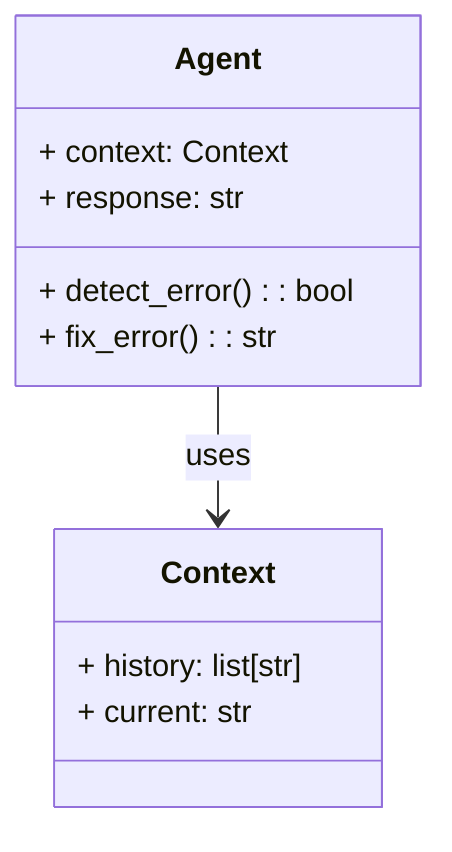
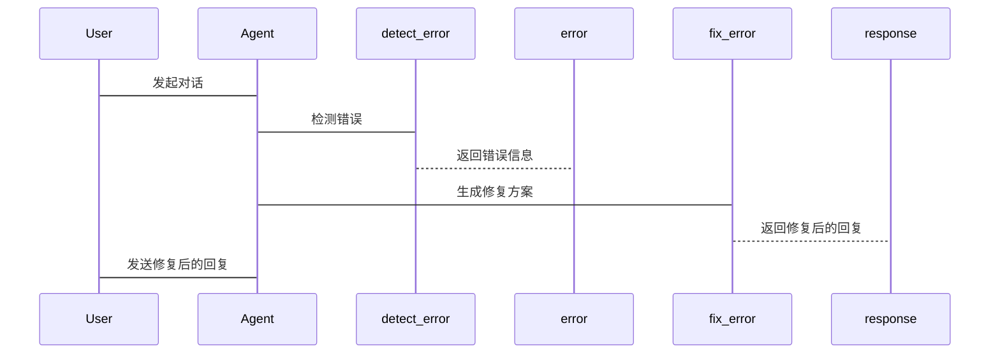

                 


**# AI Agent的对话修复：处理交互中的错误**

**关键词：AI Agent，对话修复，错误检测，自然语言处理，对话系统**

**摘要：**  
本文系统地探讨了AI Agent在对话交互中的错误检测与修复问题，从理论基础到算法实现，再到系统架构与实际案例，全面分析了对话修复的核心概念、技术原理与应用实践。通过对对话修复的背景分析、算法设计、系统架构、项目实战和最佳实践的深入探讨，本文为AI Agent的对话修复提供了全面的技术指导和实践参考。

---

**# 第一部分: AI Agent对话修复的背景与核心概念**

**# 第1章: AI Agent与对话修复概述**

## 1.1 AI Agent的基本概念  
### 1.1.1 AI Agent的定义  
AI Agent（人工智能代理）是指能够感知环境并采取行动以实现目标的智能实体。它能够通过自然语言处理、机器学习等技术与人类进行交互，完成特定任务。  

### 1.1.2 AI Agent的核心特征  
- **自主性**：能够在没有外部干预的情况下自主决策。  
- **反应性**：能够实时感知环境并做出响应。  
- **目标导向性**：所有行为都围绕特定目标展开。  
- **学习能力**：能够通过数据和反馈不断优化自身的交互能力。  

### 1.1.3 AI Agent与传统对话系统的区别  
- AI Agent具有更强的自主性和目标导向性，能够根据上下文动态调整交互策略。  
- 传统对话系统通常基于预设的规则或固定的知识库，灵活性较低。  

---

## 1.2 对话修复的背景与问题  
### 1.2.1 对话系统中的常见问题  
在实际应用中，对话系统可能会出现以下问题：  
- **语法错误**：用户输入的句子结构不完整或有语法错误。  
- **语义错误**：用户表达的意思模糊或歧义。  
- **逻辑错误**：对话内容与上下文不一致或违背逻辑。  

### 1.2.2 对话修复的必要性  
对话修复是确保AI Agent与用户有效交互的关键步骤。通过修复对话中的错误，可以提高用户体验、提升系统的可靠性，并降低误解的发生率。  

### 1.2.3 对话修复的边界与外延  
- **边界**：对话修复仅针对对话中的语言错误，不涉及用户意图的完全理解。  
- **外延**：对话修复可能需要结合上下文、领域知识和用户偏好进行。  

---

## 1.3 对话修复的核心概念  
### 1.3.1 对话修复的目标  
对话修复的目标包括：  
1. 检测对话中的错误。  
2. 生成合理的修复方案。  
3. 生成修复后的回复，确保对话的连贯性和逻辑性。  

### 1.3.2 对话修复的实现机制  
- **错误检测**：通过自然语言处理技术检测对话中的错误。  
- **错误修复**：基于错误类型生成修复方案。  
- **修复执行**：将修复方案应用于对话，生成最终回复。  

### 1.3.3 对话修复的评估指标  
- **准确率**：修复后的对话与预期结果的匹配程度。  
- **语义相似度**：修复后的对话与原始意图的相似程度。  
- **用户体验**：用户对修复后对话的满意度。  

---

## 1.4 本章小结  
本章从AI Agent的基本概念出发，分析了对话修复的背景、问题和核心概念，为后续的算法设计和系统实现奠定了基础。

---

**# 第2章: 对话修复的核心概念与联系**

## 2.1 对话修复的原理  
### 2.1.1 错误检测机制  
错误检测机制包括以下步骤：  
1. 分析对话历史和上下文。  
2. 检测当前对话中的语法、语义或逻辑错误。  
3. 确定错误类型和严重程度。  

### 2.1.2 错误修复策略  
错误修复策略包括：  
- **基于规则的修复**：根据预设规则生成修复方案。  
- **基于生成模型的修复**：利用自然语言生成模型生成合理的修复内容。  

### 2.1.3 错误修复的执行过程  
1. 检测错误。  
2. 生成修复方案。  
3. 执行修复并生成回复。  

---

## 2.2 对话修复的核心要素  
### 2.2.1 对话上下文  
对话上下文包括对话历史、当前对话内容和用户意图。  

### 2.2.2 对话历史  
对话历史是对话修复的重要依据，用于理解对话的背景和逻辑关系。  

### 2.2.3 对话目标  
对话目标是对话修复的最终目标，即确保对话的连贯性和用户意图的实现。  

---

## 2.3 对话修复与相关概念的对比  
### 2.3.1 对话修复与错误检测  
- 对话修复不仅包括错误检测，还包括修复方案的生成和执行。  

### 2.3.2 对话修复与自然语言理解  
- 自然语言理解是对话修复的基础，而对话修复是对理解结果的优化和调整。  

### 2.3.3 对话修复与对话生成  
- 对话生成是对话修复的结果，对话修复是对生成内容的优化。  

---

## 2.4 对话修复的ER实体关系图  
```mermaid
er
actor(Agent) -|> action:发起修复请求|
action --> error:检测错误|
error --> solution:生成修复方案|
solution --> response:生成修复后的回复
```

---

## 2.5 本章小结  
本章从对话修复的核心概念出发，分析了其原理、要素和与相关概念的联系，为后续的算法设计提供了理论基础。

---

**# 第3章: 对话修复的算法原理**

## 3.1 错误检测算法  
### 3.1.1 错误检测的流程  
1. 收集对话历史和当前对话内容。  
2. 分析对话内容，识别潜在的语法、语义或逻辑错误。  

### 3.1.2 错误检测的关键技术  
- **自然语言处理**：用于识别语法和语义错误。  
- **上下文分析**：用于理解对话的逻辑关系。  

### 3.1.3 错误检测的实现代码  
```python
def detect_error(context, response):
    # 实现错误检测算法
    pass
```

---

## 3.2 错误修复算法  
### 3.2.1 错误修复的流程  
1. 根据错误类型生成修复方案。  
2. 执行修复并生成回复。  

### 3.2.2 错误修复的关键技术  
- **基于规则的修复**：适用于已知的错误类型。  
- **基于生成模型的修复**：适用于复杂或模糊的错误。  

### 3.2.3 错误修复的实现代码  
```python
def fix_error(context, error):
    # 实现错误修复算法
    pass
```

---

## 3.3 对话修复的数学模型  
### 3.3.1 错误检测的数学模型  
错误检测的概率模型可以通过以下公式表示：  
$$ P(error | context) = \frac{N(error, context)}{N(context)} $$  

其中，$N(error, context)$ 表示在给定上下文中出现错误的次数，$N(context)$ 表示总对话次数。  

### 3.3.2 错误修复的数学模型  
错误修复的生成模型可以基于以下公式：  
$$ P(response | error, context) = \prod_{i=1}^{n} P(word_i | error, context) $$  

其中，$word_i$ 表示修复方案中的第 $i$ 个词，$n$ 表示修复方案的长度。  

---

## 3.4 本章小结  
本章详细介绍了对话修复的算法原理，包括错误检测和修复的流程、关键技术以及数学模型。

---

**# 第4章: 对话修复的系统分析与架构设计**

## 4.1 系统分析  
### 4.1.1 问题场景介绍  
以医疗咨询场景为例，分析对话修复的应用需求。  

### 4.1.2 项目介绍  
设计一个基于AI Agent的医疗咨询对话修复系统。  

---

## 4.2 系统功能设计  
### 4.2.1 领域模型  


### 4.2.2 系统架构设计  


---

## 4.3 系统接口设计  
- **输入接口**：接收用户的对话内容。  
- **输出接口**：返回修复后的对话内容。  

---

## 4.4 系统交互设计  


---

## 4.5 本章小结  
本章从系统分析的角度，设计了一个基于AI Agent的对话修复系统，包括功能设计、架构设计和交互设计。

---

**# 第5章: 对话修复的项目实战**

## 5.1 环境安装  
- 安装Python、自然语言处理库（如spaCy、NLTK）和深度学习框架（如TensorFlow、PyTorch）。  

## 5.2 核心实现  
### 5.2.1 错误检测模块  
```python
def detect_error(context, response):
    # 实现错误检测算法
    pass
```

### 5.2.2 错误修复模块  
```python
def fix_error(context, error):
    # 实现错误修复算法
    pass
```

## 5.3 代码解读与分析  
- 错误检测模块通过自然语言处理技术分析对话内容，识别潜在错误。  
- 错误修复模块基于检测到的错误生成修复方案，并返回修复后的回复。  

## 5.4 案例分析  
以医疗咨询场景为例，详细分析对话修复的过程。  

---

## 5.5 本章小结  
本章通过项目实战，详细讲解了对话修复系统的实现过程，包括环境安装、核心实现和案例分析。

---

**# 第6章: 对话修复的最佳实践与小结**

## 6.1 最佳实践  
- **错误检测策略**：结合规则和模型，提高检测准确率。  
- **错误修复策略**：根据错误类型选择合适的修复方法。  
- **性能优化**：通过缓存和并行计算提升系统性能。  

---

## 6.2 小结与展望  
对话修复是AI Agent技术的重要组成部分，随着自然语言处理和深度学习技术的不断发展，对话修复系统将更加智能化和个性化。未来的研究方向包括多模态对话修复和自适应修复策略。

---

**作者：AI天才研究院/AI Genius Institute & 禅与计算机程序设计艺术 /Zen And The Art of Computer Programming**

