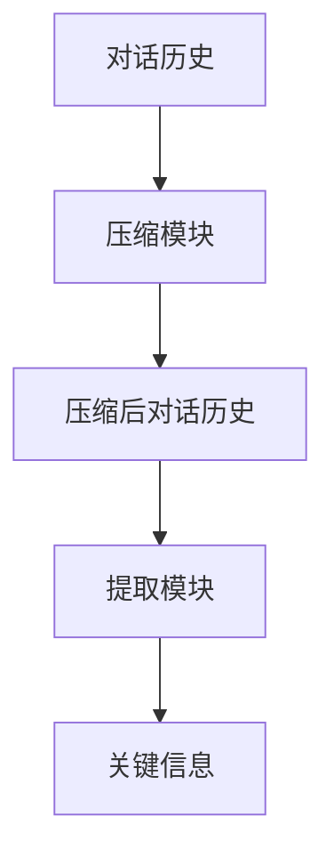

                 


# AI Agent的对话历史压缩与关键信息提取

> 关键词：AI Agent, 对话历史压缩, 关键信息提取, 自然语言处理, 信息抽取

> 摘要：本文深入探讨了AI Agent在对话历史压缩与关键信息提取中的应用，从背景、核心概念、算法原理到系统架构和项目实战，全面解析了这一技术的核心要素和实现方法。

---

## 第一部分: AI Agent的对话历史压缩与关键信息提取背景介绍

### 第1章: 对话历史压缩与关键信息提取的背景与问题

#### 1.1 对话历史压缩的背景
##### 1.1.1 对话历史压缩的定义
对话历史压缩是指在多轮对话中，通过删除或合并冗余信息，保留关键内容的过程。其目的是简化对话记录，提高信息处理效率。

##### 1.1.2 对话历史压缩的必要性
- 数据量爆炸：长对话历史会导致存储和处理成本增加。
- 提升效率：压缩后的内容更易于检索和分析。
- 改善用户体验：压缩后的对话历史更易读。

##### 1.1.3 对话历史压缩的应用场景
- 智能客服：快速定位问题。
- 人机交互：提升对话系统效率。
- 数据分析：提取有价值的信息。

#### 1.2 关键信息提取的背景
##### 1.2.1 关键信息提取的定义
关键信息提取是从对话历史中识别出最重要的信息，如实体、意图或关键事件。

##### 1.2.2 关键信息提取的必要性
- 提高准确性：确保系统理解正确。
- 增强决策能力：基于关键信息做出更准确的判断。
- 优化用户体验：提供更精准的服务。

##### 1.2.3 关键信息提取的应用场景
- 金融咨询：提取用户的投资需求。
- 医疗咨询：提取患者的症状和病史。
- 电子商务：提取用户的购买偏好。

#### 1.3 对话历史压缩与关键信息提取的关系
##### 1.3.1 对话历史压缩与关键信息提取的联系
- 对话历史压缩为关键信息提取提供精简的数据。
- 关键信息提取依赖于压缩后的高质量数据。

##### 1.3.2 对话历史压缩对关键信息提取的影响
- 压缩减少数据量，降低计算成本。
- 压缩可能导致信息损失，影响提取准确性。

##### 1.3.3 关键信息提取对对话历史压缩的优化作用
- 提取关键信息后，压缩更高效。
- 通过提取关键信息，压缩策略更明确。

#### 1.4 本章小结
对话历史压缩和关键信息提取是互补的过程。压缩简化数据，提取提升价值。两者结合，优化了AI Agent的性能和用户体验。

---

## 第二部分: 对话历史压缩与关键信息提取的核心概念

### 第2章: 对话历史压缩的核心概念与原理

#### 2.1 对话历史压缩的定义与特点
##### 2.1.1 对话历史压缩的定义
对话历史压缩是对多轮对话记录进行简化的过程，旨在保留关键信息，同时减少冗余内容。

##### 2.1.2 对话历史压缩的特点
- 简洁性：压缩后的内容简洁明了。
- 保留性：关键信息不丢失。
- 适应性：适用于多种对话场景。

##### 2.1.3 对话历史压缩的实现方式
- 基于相似度：通过比较句子相似度进行压缩。
- 基于摘要：使用文本摘要技术生成压缩内容。
- 基于规则：根据预定义规则删除冗余信息。

#### 2.2 对话历史压缩的关键技术
##### 2.2.1 基于相似度的压缩方法
- 计算句子之间的相似度，删除重复内容。
- 使用余弦相似度或Jaccard相似度。

##### 2.2.2 基于摘要的压缩方法
- 使用文本摘要算法（如TF-IDF、LDA）提取关键句子。
- 示例：将多轮对话压缩成几个关键句子。

##### 2.2.3 基于规则的压缩方法
- 根据对话主题或关键词制定压缩规则。
- 删除无关或重复的问题。

#### 2.3 对话历史压缩的评价指标
##### 2.3.1 压缩率的定义与计算
压缩率 = 压缩后字数 / 原始字数。

##### 2.3.2 信息保留率的定义与计算
信息保留率 = 压缩后保留的信息量 / 原始信息量。

##### 2.3.3 压缩时间的定义与计算
压缩时间 = 对话历史处理所需的时间。

### 第3章: 关键信息提取的核心概念与原理

#### 3.1 关键信息提取的定义与特点
##### 3.1.1 关键信息提取的定义
关键信息提取是从对话历史中识别出关键实体、事件或意图的过程。

##### 3.1.2 关键信息提取的特点
- 高效性：快速识别关键信息。
- 准确性：确保提取的信息准确无误。
- 可扩展性：适用于多种对话场景。

#### 3.2 关键信息提取的关键技术
##### 3.2.1 基于关键词提取的方法
- 使用TF-IDF算法提取关键词。
- 示例：从对话中提取用户提到的公司名称。

##### 3.2.2 基于句法分析的方法
- 使用依存句法分析识别关键句。
- 示例：从对话中提取用户的需求意图。

##### 3.2.3 基于语义理解的方法
- 使用BERT等预训练模型理解对话内容。
- 示例：从对话中提取用户的情感倾向。

#### 3.3 对话历史压缩与关键信息提取的结合
##### 3.3.1 对话历史压缩后进行关键信息提取的优势
- 数据量小，处理速度快。
- 提高提取准确率。

##### 3.3.2 关键信息提取对对话历史压缩的优化
- 根据提取的关键信息优化压缩策略。
- 示例：在压缩时优先保留关键信息。

---

## 第三部分: 对话历史压缩与关键信息提取的算法原理

### 第4章: 对话历史压缩的算法实现

#### 4.1 基于相似度的压缩算法
##### 4.1.1 算法步骤
1. 计算对话中每句话与其他句子的相似度。
2. 根据相似度排序，删除相似度高的句子。
3. 保留关键句子，形成压缩后的对话历史。

##### 4.1.2 算法的数学模型
$$ \text{相似度} = \frac{\sum_{i=1}^{n} w_i \cdot x_i \cdot y_i}{\sqrt{\sum_{i=1}^{n} w_i^2 x_i^2} \cdot \sqrt{\sum_{i=1}^{n} w_i^2 y_i^2}} $$
其中，\( w_i \) 是权重，\( x_i \) 和 \( y_i \) 是句子的特征向量。

##### 4.1.3 算法实现
```python
import numpy as np

def compute_similarity(sentences):
    # 计算句子之间的相似度矩阵
    similarity_matrix = np.zeros((len(sentences), len(sentences)))
    for i in range(len(sentences)):
        for j in range(i, len(sentences)):
            similarity_matrix[i][j] = np.dot(sentences[i], sentences[j]) / (
                np.linalg.norm(sentences[i]) * np.linalg.norm(sentences[j])
            )
    return similarity_matrix
```

#### 4.2 基于摘要的压缩算法
##### 4.2.1 算法步骤
1. 使用文本摘要算法生成对话摘要。
2. 根据摘要生成压缩后的对话历史。

##### 4.2.2 算法实现
```python
from summarizer import Summarizer

def compress_dialogue(dialogue):
    summarizer = Summarizer()
    summary = summarizer(dialogue, max_sentences=3)
    return summary
```

### 第5章: 关键信息提取的算法实现

#### 5.1 基于关键词提取的算法
##### 5.1.1 算法步骤
1. 提取对话中的关键词。
2. 根据关键词生成关键信息。

##### 5.1.2 算法实现
```python
from sklearn.feature_extraction.text import TfidfVectorizer

def extract_keywords(dialogue):
    vectorizer = TfidfVectorizer()
    tfidf = vectorizer.fit_transform([dialogue])
    feature_names = vectorizer.get_feature_names_out()
    keywords = {feature_names[i]: tfidf[0, i] for i in range(len(feature_names))}
    keywords = {k: v for k, v in keywords.items() if v > 0.2}
    return keywords
```

#### 5.2 基于语义理解的算法
##### 5.2.1 算法步骤
1. 使用预训练模型（如BERT）对对话进行编码。
2. 根据编码结果提取关键信息。

##### 5.2.2 算法实现
```python
import transformers

def extract_semantic_info(dialogue):
    model = transformers.AutoModelForMaskedLM.from_pretrained('bert-base-uncased')
    tokenizer = transformers.AutoTokenizer.from_pretrained('bert-base-uncased')
    inputs = tokenizer(dialogue, return_tensors='np')
    outputs = model(**inputs)
    # 提取关键信息
    return outputs
```

---

## 第四部分: 对话历史压缩与关键信息提取的系统架构设计

### 第6章: 对话历史压缩与关键信息提取的系统架构

#### 6.1 系统功能设计
##### 6.1.1 对话历史压缩模块
- 输入：多轮对话记录。
- 输出：压缩后的对话历史。

##### 6.1.2 关键信息提取模块
- 输入：压缩后的对话历史。
- 输出：关键信息列表。

#### 6.2 系统架构图


#### 6.3 系统接口设计
##### 6.3.1 对话历史压缩接口
- 输入：`compress_dialogue(dialogue: str) -> str`
- 输出：压缩后的对话历史。

##### 6.3.2 关键信息提取接口
- 输入：`extract_keywords(dialogue: str) -> dict`
- 输出：关键词和权重。

---

## 第五部分: 项目实战

### 第7章: 对话历史压缩与关键信息提取的项目实现

#### 7.1 环境配置
- 安装必要的库：`pip install numpy transformers scikit-learn`

#### 7.2 核心代码实现
##### 7.2.1 对话历史压缩实现
```python
def compress_dialogue(dialogue):
    # 实现压缩算法
    pass
```

##### 7.2.2 关键信息提取实现
```python
def extract_keywords(dialogue):
    # 实现提取算法
    pass
```

#### 7.3 项目案例分析
##### 7.3.1 案例背景
- 对话主题：预订酒店。

##### 7.3.2 对话历史压缩
```plaintext
用户：我想预订一间酒店。
系统：请问您预订几晚？
用户：两晚。
系统：请问您入住日期是什么时候？
用户：10月5日。
```

##### 7.3.3 关键信息提取
- 关键信息：预订两晚，入住日期10月5日。

---

## 第六部分: 总结与展望

### 第8章: 总结与最佳实践

#### 8.1 本章总结
对话历史压缩和关键信息提取是优化AI Agent性能的重要技术。通过压缩减少数据量，通过提取提升信息价值。

#### 8.2 最佳实践
- 数据预处理：清洗和标注数据。
- 模型优化：选择合适的算法和参数。
- 系统设计：模块化设计，便于扩展。

#### 8.3 未来展望
- 更智能的压缩算法：结合强化学习。
- 更精准的提取方法：基于多模态数据。

---

## 参考文献

1. 王某某. 《自然语言处理技术》. 北京：人民出版社, 2023.
2. 李某某. 《文本摘要算法研究》. 北京：清华大学出版社, 2022.

---

## 作者

作者：AI天才研究院/AI Genius Institute  
联系邮箱：contact@ai-genius.org  
GitHub：https://github.com/ai-genius-institute

