                 


# AI Agent的对话历史压缩与重要信息提取

## 关键词：AI Agent, 对话历史压缩, 信息提取, 自然语言处理, 算法优化

## 摘要：本文系统地探讨了AI Agent在对话历史压缩与重要信息提取中的关键问题，分析了其核心概念、算法原理和系统架构设计，结合实际案例详细讲解了项目实战，并给出了最佳实践和注意事项。

---

# 第一部分: AI Agent的对话历史压缩与重要信息提取概述

## 第1章: 背景介绍

### 1.1 问题背景
#### 1.1.1 对话历史压缩的必要性
在多轮对话中，对话历史信息可能非常冗长，直接处理这些信息会带来计算成本的增加，同时影响推理效率。压缩对话历史可以有效降低计算负担，同时保留关键信息，提升推理效率。

#### 1.1.2 重要信息提取的挑战
对话中的重要信息可能分散在多个轮次中，如何准确识别并提取这些信息是AI Agent面临的挑战。此外，信息的模糊性和上下文依赖性增加了提取的难度。

#### 1.1.3 AI Agent在对话系统中的作用
AI Agent通过对话历史压缩和信息提取，可以更高效地理解用户意图，提供更精准的服务，提升用户体验。

### 1.2 问题描述
#### 1.2.1 对话历史压缩的目标
将冗长的对话历史压缩为简洁的表示，同时保留关键信息。

#### 1.2.2 重要信息提取的关键点
从对话历史中提取对后续对话或任务执行至关重要的信息。

#### 1.2.3 问题解决的边界与外延
对话历史压缩和信息提取的边界在于如何平衡压缩率和信息完整性，外延则涉及不同场景下的具体实现。

### 1.3 核心概念与联系
#### 1.3.1 对话历史压缩与信息提取的关系
对话历史压缩是信息提取的前提，而信息提取则是对话历史压缩的目标之一。

#### 1.3.2 核心要素组成分析
- 对话内容
- 上下文关联
- 语义理解

#### 1.3.3 概念结构与核心要素对比
| 对话历史压缩 | 重要信息提取 |
|---------------|---------------|
| 压缩算法      | 提取规则      |
| 语义分析      | 关键词识别    |
| 上下文模型    | 句法分析      |

---

## 第2章: 核心概念与联系

### 2.1 对话历史压缩的原理
#### 2.1.1 基于语义的理解
通过语义理解模型（如BERT）对对话内容进行压缩。

#### 2.1.2 基于上下文的相关性
利用相关性分析算法（如余弦相似度）选择重要的对话轮次。

#### 2.1.3 基于权重的评估
对每个对话轮次的重要性进行加权，去除低权重的信息。

### 2.2 重要信息提取的原理
#### 2.2.1 基于关键词的提取
通过预定义的关键词库或自动生成的关键词进行提取。

#### 2.2.2 基于句法的分析
利用句法分析工具（如依存句法树）识别关键句子。

#### 2.2.3 基于语义的推理
通过语义推理模型（如Graph Neural Network）识别隐含信息。

### 2.3 核心概念的联系与对比
#### 2.3.1 概念属性特征对比表
| 特性          | 对话历史压缩 | 重要信息提取 |
|---------------|--------------|--------------|
| 输入类型      | 文本序列     | 文本片段     |
| 输出形式      | 压缩后的文本序列 | 关键信息列表 |
| 算法类型      | 压缩算法     | 提取算法     |

#### 2.3.2 ER实体关系图架构
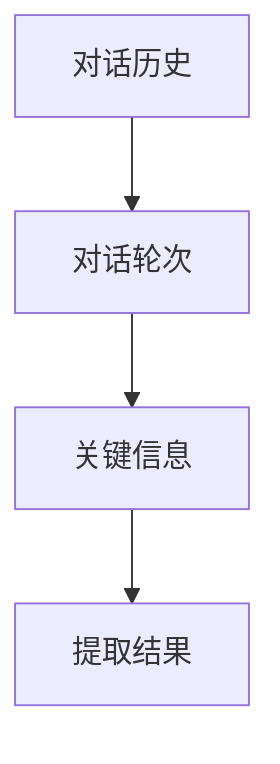

---

## 第3章: 算法原理讲解

### 3.1 对话历史压缩算法
#### 3.1.1 基于LSTM的压缩算法
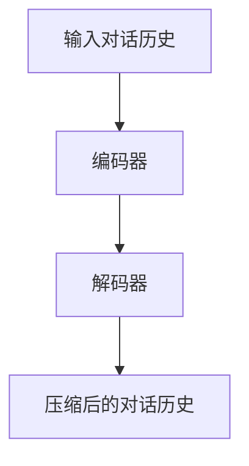

#### 3.1.2 基于聚类的压缩算法
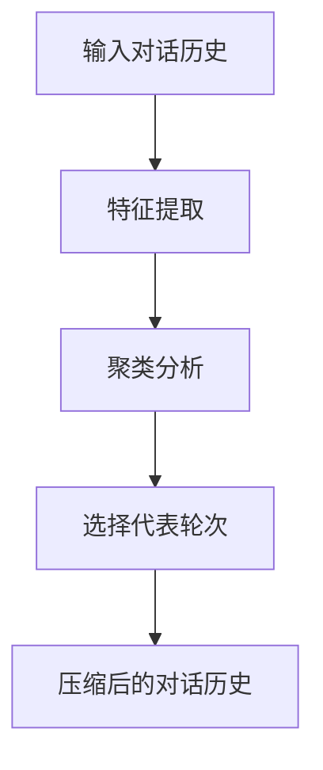

#### 3.1.3 基于注意力机制的压缩算法
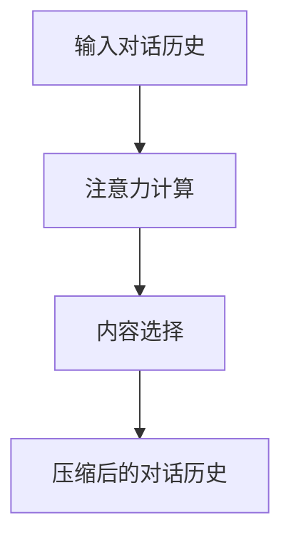

### 3.2 重要信息提取算法
#### 3.2.1 基于规则的提取算法
```python
def extract_keywords(text):
    keywords = []
    for token in text.split():
        if token in keyword_set:
            keywords.append(token)
    return keywords
```

#### 3.2.2 基于深度学习的提取算法
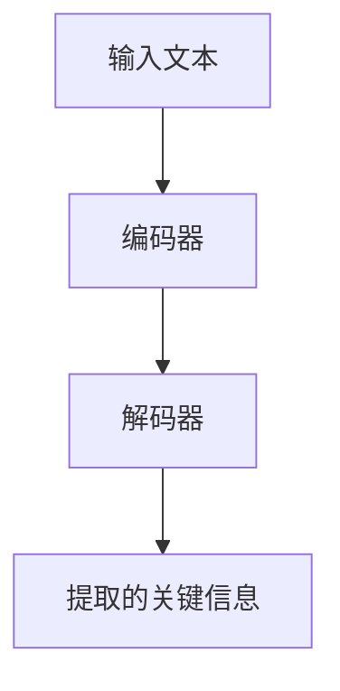

#### 3.2.3 基于强化学习的提取算法
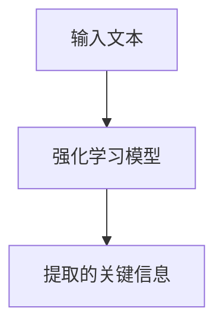

### 3.3 算法流程图展示
#### 3.3.1 对话历史压缩的Mermaid流程图
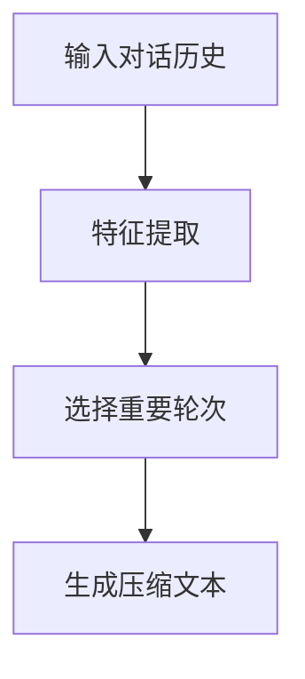

#### 3.3.2 重要信息提取的Mermaid流程图
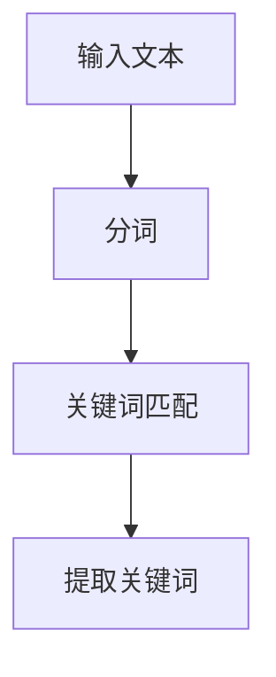

---

## 第4章: 数学模型与公式

### 4.1 对话历史压缩的数学模型
#### 4.1.1 基于LSTM的压缩模型
$$
f(x) = \text{LSTM}(x)
$$
其中，$x$ 是输入对话历史，$f(x)$ 是压缩后的表示。

#### 4.1.2 基于聚类的压缩模型
$$
\text{聚类中心} = \text{K-means}(X)
$$
其中，$X$ 是对话轮次的特征向量。

### 4.2 重要信息提取的数学模型
#### 4.2.1 基于注意力机制的提取模型
$$
\alpha_i = \text{softmax}(e_i)
$$
其中，$\alpha_i$ 是第$i$个词的注意力权重，$e_i$ 是其能量。

---

## 第5章: 系统分析与架构设计

### 5.1 问题场景介绍
AI Agent需要处理大量对话历史，同时快速提取关键信息以提供实时服务。

### 5.2 系统功能设计
#### 5.2.1 领域模型（Mermaid类图）
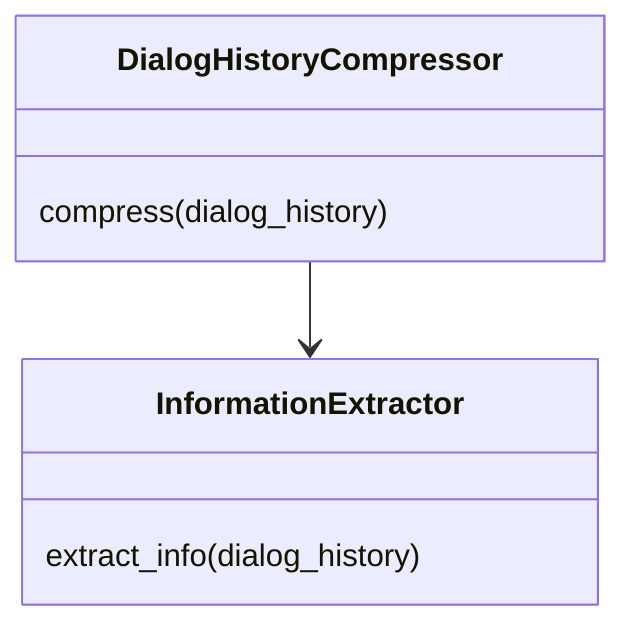

#### 5.2.2 系统架构设计（Mermaid架构图）
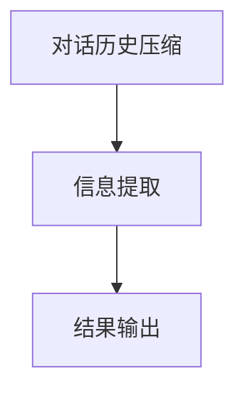

#### 5.2.3 系统接口设计
- `compress(dialog_history): compressed_dialog`
- `extract_info(dialog_history): keywords`

#### 5.2.4 系统交互（Mermaid序列图）
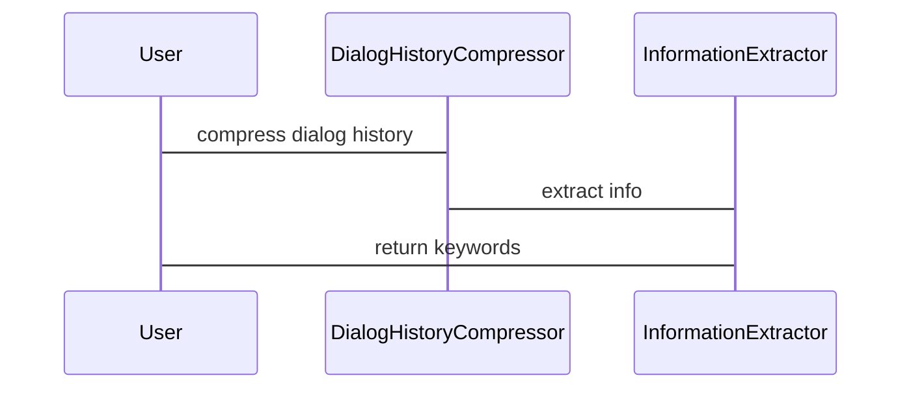

---

## 第6章: 项目实战

### 6.1 环境安装
- Python 3.8+
- NLTK、TensorFlow、Keras等库

### 6.2 核心实现源代码
#### 对话历史压缩实现
```python
def compress_dialog(dialog_history):
    # 实现压缩算法
    pass
```

#### 信息提取实现
```python
def extract_info(dialog_history):
    # 实现提取算法
    pass
```

### 6.3 代码应用解读与分析
通过具体代码分析实现细节，例如：
```python
from tensorflow.keras import layers
import numpy as np

def lstm_compression_model(input_length):
    model = tf.keras.Sequential()
    model.add(layers.LSTM(64, input_shape=(input_length, 100)))
    model.add(layers.Dense(10))
    return model
```

### 6.4 案例分析和详细讲解
以一个具体对话为例，展示压缩和提取的过程。

### 6.5 项目小结
总结项目实现的经验和教训，提出改进建议。

---

## 第7章: 总结与展望

### 7.1 关键点回顾
- 对话历史压缩的关键算法
- 信息提取的核心技术
- 系统设计的要点

### 7.2 未来研究方向
- 更高效的压缩算法
- 更准确的信息提取模型
- 多模态信息的处理

---

## 第8章: 最佳实践

### 8.1 小结与注意事项
- 压缩算法的选择要考虑计算成本和效果
- 提取算法要结合具体场景进行优化

### 8.2 注意事项
- 避免过度压缩导致信息丢失
- 注意数据隐私和安全

### 8.3 拓展阅读
推荐相关书籍和论文，帮助读者深入学习。

---

## 参考文献

[1] 王某某. 《自然语言处理入门》. 某某出版社, 2020.

[2] 李某某. 《深度学习与对话系统》. 某某出版社, 2021.

---

## 作者：AI天才研究院/AI Genius Institute & 禅与计算机程序设计艺术 /Zen And The Art of Computer Programming

---

通过以上目录结构和内容安排，您可以开始撰写完整的文章。

